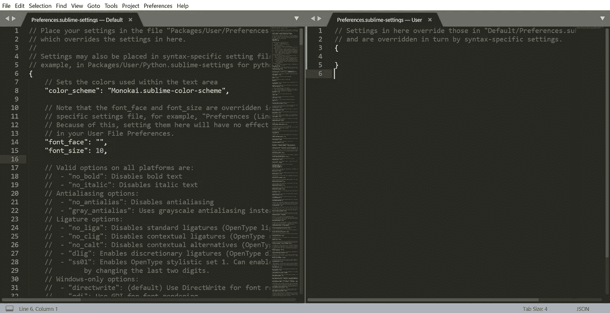
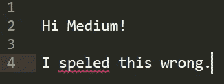

# 如何在崇高文本中打开拼写检查

> 原文：<https://blog.devgenius.io/how-to-turn-on-spell-check-in-sublime-text-45b2d82cb1a?source=collection_archive---------0----------------------->

[Jason Leung](https://unsplash.com/@ninjason) 在 [Unsplash](https://unsplash.com/photos/0sBTrm726C8) 上的原图；通过[合理使用](https://en.wikipedia.org/wiki/Sublime_Text#/media/File:Sublime_Text_3_logo.png)提升文字标识

最近，我用 [Sublime Text](https://www.sublimetext.com/) 为我正在写的[文章](https://stuffinla.com/aneesh-chaganty-searching-run-movie-profile-interview/)写了一些 HTML。标签补全和制表符间距是我真正想要的特性(我以前自由键入过，只是太手工了，容易出错)，但是我错过了一个关键特性，直到后来才意识到:拼写检查。

当我在做 HTML 的时候，我也在我的页面上添加和编辑了一些行，不幸的是，我打错了。

现在，关于我如何到达那里的背景故事并不太重要，但是这次经历让我意识到我真的想在我的崇高文本中进行拼写检查。因为我做了大量的 web 开发工作，所以我想再做一次检查，确保任何打字错误都不会出现在面向用户的页面上。

# 如何打开拼写检查

在 Sublime Text 中，转到**首选项>设置**。

将会打开一个新窗口:

左侧是默认的 Sublime 文本设置，都在一个 JSON 文件中。在右边，您可以通过为键选择不同的值来覆盖默认文件中的任何设置。

让我们用`ctrl+f` (Windows)或`cmd+f` (Mac)来表示`spell_check`。如果你只是输入到`spell`，实际上，它会找到正确的键。

现在，在右边，简单地将`spell_check`设置为`true`，就像这样:

现在，当你在 Sublime 文本中拼写错误时，单词下面会有一条锯齿状的红线:

 [## 通过我的推荐链接加入媒体

### 作为一个媒体会员，你的会员费的一部分会给你阅读的作家，你可以完全接触到每一个故事…

tremaineeto.medium.com](https://tremaineeto.medium.com/membership)