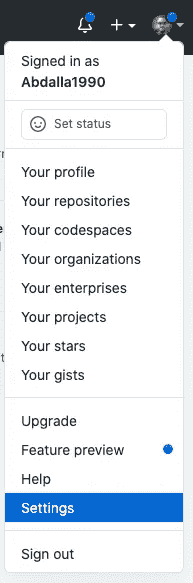
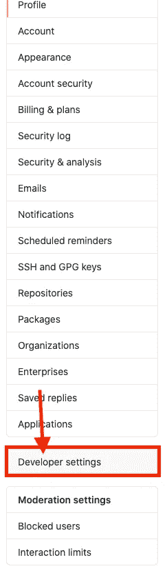
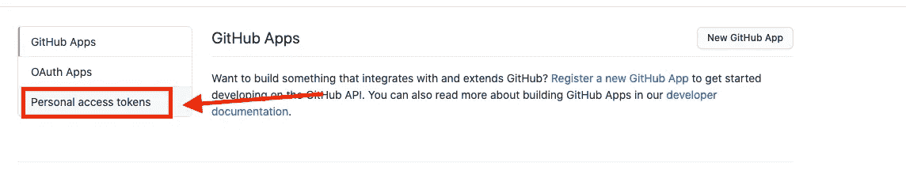
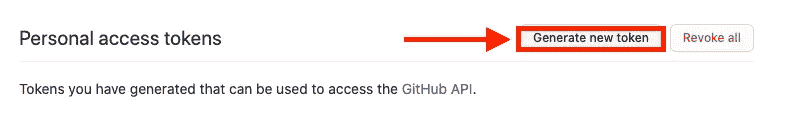
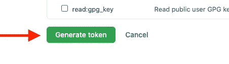
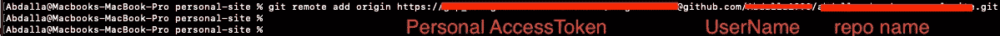

# 如何更新 git (remote)使用 Github 个人访问令牌代替密码

> 原文：<https://blog.devgenius.io/how-to-update-git-remote-to-use-github-personal-access-token-instead-of-password-c6dace4c416d?source=collection_archive---------0----------------------->

## 从使用密码到使用个人访问令牌更新 Github git remote 的最简单方法

由[罗曼·辛克维奇](https://unsplash.com/@synkevych?utm_source=medium&utm_medium=referral)在 [Unsplash](https://unsplash.com?utm_source=medium&utm_medium=referral) 拍摄的照片

Github 宣布，到 8 月 13 日，他们将不再允许用户使用他们的用户名和密码通过 HTTP 远程访问他们的 Github 帐户。相反，他们希望用户使用个人访问令牌。

老实说，官方文件并不清楚，也没有明确的例子说明需要做什么。**下面是将 Github 远程认证从密码更改为个人访问令牌的一步一步的清晰指南:**

## 1-我们需要添加个人访问令牌，如下所示:

向此令牌添加名称和权限后，单击以下内容创建新令牌

现在我们有了一个令牌，下一步就是在我们通过 git 工具与 Github 对话时使用这个令牌。

## 2-我们应该删除普遍添加到任何存储库中的原点，并添加一个包含令牌的新原点。我们可以通过以下三个简单的步骤做到这一点

a)在终端中，转到您的存储库目录
B)移除遥控器

c)按照以下结构添加新的遥控器:

## 3-现在当你这样做时，你应该会看到新创建的遥控器。

就这样，现在你可以试着提交和推送你的代码了。

别忘了在 Instagram 上关注我，获取网络开发技巧