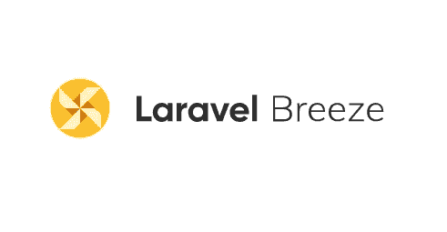
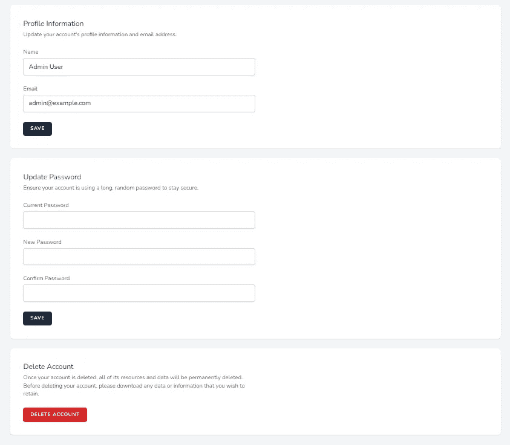

# 如何在现有应用程序上升级 Laravel Breeze

> 原文：<https://blog.devgenius.io/how-to-upgrade-the-laravel-breeze-on-the-existing-application-8f742b48b632?source=collection_archive---------3----------------------->

## Laravel 从头开始创建管理面板——第 17 部分



Laravel Breeze 新版本带有个人资料更新页面。因此，我们将在我们的[基本 Laravel 管理面板](https://github.com/balajidharma/basic-laravel-admin-panel)中升级 Laravel Breeze。

## 如何升级 Laravel Breeze？

Laravel Breeze 是 Laravel 项目的入门套件。因此没有 Breeze 升级步骤和命令。

我们将再次运行 breeze install 命令，该命令将向我们的应用程序发布最新文件。

如果您的应用程序对授权文件进行了大量更改，请避免使用 breeze 重新安装方法。如果您对 git 存储库的更改意味着，运行 install 并基于 git diff 手动应用您的更改。

## 作曲家更新

需要运行 composer 更新以获得 Laravel 和其他依赖项的最新版本。

```
./vendor/bin/sail composer update
```

## Breeze 安装

现在运行 breeze install 命令来更新所有与 breeze 相关的文件和文件夹。之后，使用 npm install 更新 npm 包，并运行 npm run dev

```
./vendor/bin/sail artisan breeze:install

./vendor/bin/sail npm install

./vendor/bin/sail npm run dev
```

## 个人资料页面

现在我们的新个人资料页面已经准备好了。访问/profile 路径上的“新建配置文件”页面。



## 航行

我们的导航更改被新的 breeze 文件覆盖。因此，我们将更新 resources/views/layouts/navigation . blade . PHP 文件中的链接

```
<nav x-data="{ open: false }" class="bg-white border-b border-gray-100">
    <!-- Primary Navigation Menu -->
    <div class="max-w-7xl mx-auto px-4 sm:px-6 lg:px-8">
        <div class="flex justify-between h-16">
            <div class="flex">
                <!-- Logo -->
                <div class="shrink-0 flex items-center">
                    <a href="{{ route('dashboard') }}">
                        <x-application-logo class="block h-9 w-auto fill-current text-gray-800" />
                    </a>
                </div>

                <!-- Navigation Links -->
                <div class="hidden space-x-8 sm:-my-px sm:ml-10 sm:flex">
                    <x-nav-link :href="route('dashboard')" :active="request()->routeIs('dashboard')">
                        {{ __('Dashboard') }}
                    </x-nav-link>
                    <x-nav-link :href="route('permission.index')" :active="request()->routeIs('permission.index')">        
                        {{ __('Permissions') }}
                    </x-nav-link>
                    <x-nav-link :href="route('role.index')" :active="request()->routeIs('role.index')">
                        {{ __('Roles') }}
                    </x-nav-link>
                    <x-nav-link :href="route('user.index')" :active="request()->routeIs('user.index')">
                        {{ __('Users') }}
                    </x-nav-link>
                </div>
            </div>

            <!-- Settings Dropdown -->
            <div class="hidden sm:flex sm:items-center sm:ml-6">
                <x-dropdown align="right" width="48">
                    <x-slot name="trigger">
                        <button class="inline-flex items-center px-3 py-2 border border-transparent text-sm leading-4 font-medium rounded-md text-gray-500 bg-white hover:text-gray-700 focus:outline-none transition ease-in-out duration-150">
                            <div>{{ Auth::user()->name }}</div>

                            <div class="ml-1">
                                <svg class="fill-current h-4 w-4"  viewBox="0 0 20 20">
                                    <path fill-rule="evenodd" d="M5.293 7.293a1 1 0 011.414 0L10 10.586l3.293-3.293a1 1 0 111.414 1.414l-4 4a1 1 0 01-1.414 0l-4-4a1 1 0 010-1.414z" clip-rule="evenodd" />
                                </svg>
                            </div>
                        </button>
                    </x-slot>

                    <x-slot name="content">
                        <x-dropdown-link :href="route('profile.edit')">
                            {{ __('Profile') }}
                        </x-dropdown-link>

                        <!-- Authentication -->
                        <form method="POST" action="{{ route('logout') }}">
                            @csrf

                            <x-dropdown-link :href="route('logout')"
                                    onclick="event.preventDefault();
                                                this.closest('form').submit();">
                                {{ __('Log Out') }}
                            </x-dropdown-link>
                        </form>
                    </x-slot>
                </x-dropdown>
            </div>

            <!-- Hamburger -->
            <div class="-mr-2 flex items-center sm:hidden">
                <button @click="open = ! open" class="inline-flex items-center justify-center p-2 rounded-md text-gray-400 hover:text-gray-500 hover:bg-gray-100 focus:outline-none focus:bg-gray-100 focus:text-gray-500 transition duration-150 ease-in-out">
                    <svg class="h-6 w-6" stroke="currentColor" fill="none" viewBox="0 0 24 24">
                        <path :class="{'hidden': open, 'inline-flex': ! open }" class="inline-flex" stroke-linecap="round" stroke-linejoin="round" stroke-width="2" d="M4 6h16M4 12h16M4 18h16" />
                        <path :class="{'hidden': ! open, 'inline-flex': open }" class="hidden" stroke-linecap="round" stroke-linejoin="round" stroke-width="2" d="M6 18L18 6M6 6l12 12" />
                    </svg>
                </button>
            </div>
        </div>
    </div>

    <!-- Responsive Navigation Menu -->
    <div :class="{'block': open, 'hidden': ! open}" class="hidden sm:hidden">
        <div class="pt-2 pb-3 space-y-1">
            <x-responsive-nav-link :href="route('dashboard')" :active="request()->routeIs('dashboard')">
                {{ __('Dashboard') }}
            </x-responsive-nav-link>
            <x-responsive-nav-link :href="route('permission.index')" :active="request()->routeIs('permission.index')">     
                {{ __('Permissions') }}
            </x-responsive-nav-link>
            <x-responsive-nav-link :href="route('role.index')" :active="request()->routeIs('role.index')">
                {{ __('Roles') }}
            </x-responsive-nav-link>
            <x-responsive-nav-link :href="route('user.index')" :active="request()->routeIs('user.index')">
                {{ __('Users') }}
            </x-responsive-nav-link>
        </div>

        <!-- Responsive Settings Options -->
        <div class="pt-4 pb-1 border-t border-gray-200">
            <div class="px-4">
                <div class="font-medium text-base text-gray-800">{{ Auth::user()->name }}</div>
                <div class="font-medium text-sm text-gray-500">{{ Auth::user()->email }}</div>
            </div>

            <div class="mt-3 space-y-1">
                <x-responsive-nav-link :href="route('profile.edit')">
                    {{ __('Profile') }}
                </x-response-nav-link>

                <!-- Authentication -->
                <form method="POST" action="{{ route('logout') }}">
                    @csrf

                    <x-responsive-nav-link :href="route('logout')"
                            onclick="event.preventDefault();
                                        this.closest('form').submit();">
                        {{ __('Log Out') }}
                    </x-responsive-nav-link>
                </form>
            </div>
        </div>
    </div>
</nav>
```

## 现有帐户更新页面

我们已经在[第 9 部分](/laravel-create-an-account-update-page-for-admin-users-e123cd88f24b)中实现了账户更新页面。此页面位于/admin/edit-account-info 路径。

如果您需要管理特定的个人资料更新页面意味着使用这个“/管理/编辑-帐户-信息”页面。

下一部分，我们将黑暗主题支持添加到我们的管理 CRUD 中。分享你有没有其他方法来更新现有应用程序的 breeze。

Laravel 管理面板可在 https://github.com/balajidharma/basic-laravel-admin-panel 的[获得。安装管理面板并分享您的反馈。](https://github.com/balajidharma/basic-laravel-admin-panel)

感谢您的阅读。

敬请关注更多内容！

*跟我来*[***balajidharma.medium.com***](https://balajidharma.medium.com/)。

上一部分—第 15 部分:[如何使用 Laravel Debugbar 调试 Laravel App](/how-to-debug-laravel-app-using-laravel-debugbar-ec51a8587786)

下一部分—第 17 部分:[如何创建自己的 Laravel 包](/how-to-create-your-own-laravel-packages-2b68da22506a)