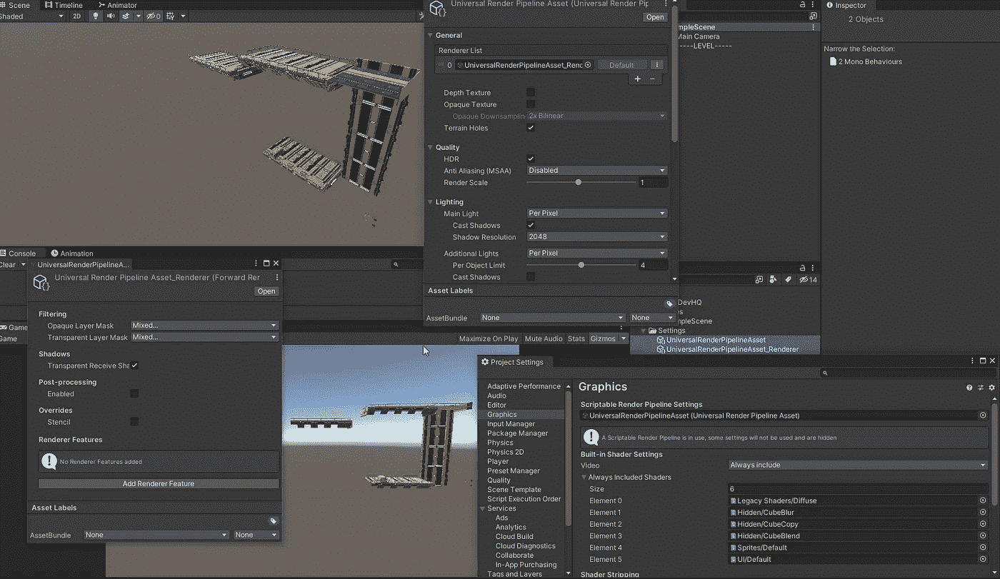

# 如何在 Unity 中将您的项目升级到 URP

> 原文：<https://blog.devgenius.io/how-to-upgrade-your-project-to-urp-in-unity-df73b26a1389?source=collection_archive---------1----------------------->

## [将 URP 安装到现有的 Unity 项目中](https://docs.unity3d.com/Packages/com.unity.render-pipelines.universal@11.0/manual/InstallURPIntoAProject.html)。

 [## 通用渲染管道概述

### 通用渲染管道(URP)是一个预建的可脚本化的渲染管道，由 Unity 开发。URP 提供…

docs.unity3d.com](https://docs.unity3d.com/Packages/com.unity.render-pipelines.universal@11.0/manual/index.html) 

有两种不同的方法可以在你的项目中获得通用渲染管道(URP)。

[https://docs . unity 3d . com/Packages/com . unity . render-pipelines . universal @ 11.0/manual/installingandconfiguringurp . html](https://docs.unity3d.com/Packages/com.unity.render-pipelines.universal@11.0/manual/InstallingAndConfiguringURP.html)

我已经有一个项目开始，我已经找到了一些资产，我想在我的项目中使用。这些资产需要使用 URP。我将手动安装和配置 URP。

 [## 将通用渲染管道安装到现有项目中

### 您可以通过下载并安装最新版本的通用渲染管道(URP)到您现有的项目中

docs.unity3d.com](https://docs.unity3d.com/Packages/com.unity.render-pipelines.universal@11.0/manual/InstallURPIntoAProject.html#before-you-begin) 

来自 Unity 文档的注释。

我的项目中目前没有后处理版本 2 包，如果有，我必须先卸载它，安装 URP，然后安装后处理。

# 安装 URP

[https://docs . unity 3d . com/Packages/com . unity . render-pipelines . universal @ 11.0/manual/installurpintoa project . html # installing-urp](https://docs.unity3d.com/Packages/com.unity.render-pipelines.universal@11.0/manual/InstallURPIntoAProject.html#installing-urp)

我已经打开了我的项目。我打开 Unity 注册表的包管理器，找到通用 RP，然后选择 install。

# 将项目配置为使用 URP。

[https://docs . unity 3d . com/Packages/com . unity . render-pipelines . universal @ 11.0/manual/installurpintoa project . html # configuring-urp](https://docs.unity3d.com/Packages/com.unity.render-pipelines.universal@11.0/manual/InstallURPIntoAProject.html#configuring-urp)

## 创建通用渲染管道资源

我需要做的第一件事是创建一个新的渲染管道资产。我可以在 [**2D 管道资产或**](https://docs.unity3d.com/Packages/com.unity.render-pipelines.universal@11.0/manual/universalrp-asset.html) 正向渲染管道资产之间进行选择，这是控制项目图形设置的东西。这也创建了一个 [**正向渲染资源**](https://docs.unity3d.com/Packages/com.unity.render-pipelines.universal@11.0/manual/urp-forward-renderer.html) ，它有一些额外的设置，即后期处理和 [**渲染特征**](https://docs.unity3d.com/Packages/com.unity.render-pipelines.universal@11.0/manual/urp-renderer-feature.html) 。

接下来我需要 [**将它添加到我的图形设置**](https://docs.unity3d.com/Packages/com.unity.render-pipelines.universal@11.0/manual/InstallURPIntoAProject.html#Adding-the-Asset-to-your-Graphics-settings) 。

编辑>项目设置…>图形

在**可脚本化渲染管道设置**字段中，我添加了我刚刚创建的通用渲染管道资产。

现在我的项目已经建立。最后要注意的是，如果我有使用 [**内置渲染管道设置的材质，我将不得不升级那些材质**](https://docs.unity3d.com/Packages/com.unity.render-pipelines.universal@11.0/manual/upgrading-your-shaders.html) 。

