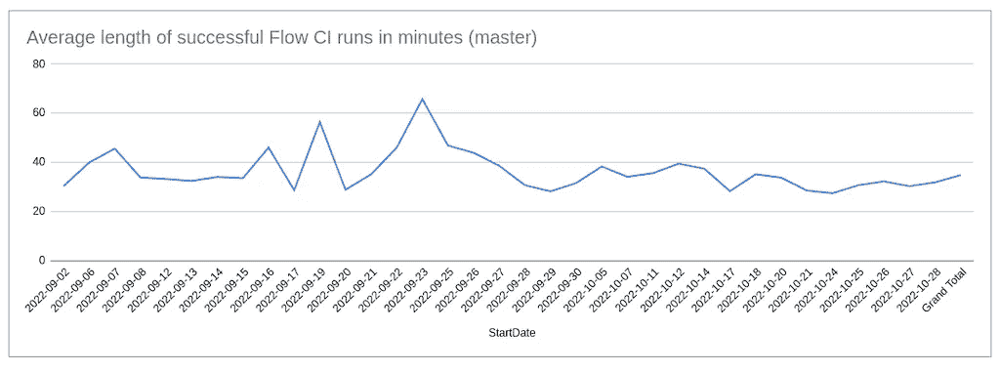

# 如何使用实时数据管道监控 GitHub 动作

> 原文：<https://blog.devgenius.io/how-to-use-a-real-time-data-pipeline-to-monitor-github-actions-502ee3c9e0e3?source=collection_archive---------4----------------------->

照片由[安吉拉·孔波妮](https://unsplash.com/@angelacompagnone?utm_source=unsplash&utm_medium=referral&utm_content=creditCopyText)在 [Unsplash](https://unsplash.com/s/photos/skyline-crane?utm_source=unsplash&utm_medium=referral&utm_content=creditCopyText) 上拍摄

# 为什么要监控 CI 构建的 GitHub 操作？

如果你从事过大型的软件项目，你可能对 GitHub 动作很熟悉。对于外行来说， [GitHub Actions](https://docs.github.com/en/actions/learn-github-actions/understanding-github-actions) 是一个内置在 GitHub 中的持续集成/持续交付(CI/CD)平台。它允许开发团队自动化**工作流:**系列的**工作**，这些工作基于某些事件测试、构建和/或部署代码。

例如，您可能有一个 CI 工作流，它构建并测试每个对存储库的新提交。

理想情况下，我们不希望工作流运行时间超过几分钟。但现实中，CI 慢是普遍存在的问题。如果不检查的话，长 CI 构建会使开发团队陷入困境。

这就是为什么关注 CI 构建时间非常重要，以便我们能够随着时间的推移努力改进它们。我们需要回答这样的问题:

*   随着时间的推移，平均 CI 构建时间如何变化？
*   在平均构建时间更长的日子里还会发生什么？

当然，你可以购买一个 dashboarding 解决方案来监控类似 GitHub 的动作，但是你也可以很容易地创建自己的解决方案，并保留更多的自主权。

**在本教程中，我们将创建自己的图表来监控平均 GitHub CI 构建时间。**

我们将使用以下方法:

*   GitHub API**。它让我们可以访问[工作流运行](https://docs.github.com/en/rest/actions/workflow-runs#list-workflow-runs-for-a-repository)(如果我们想进一步构建我们的仪表板，还可以利用许多其他有用的数据)。**
*   ****河口流。**这是一款实时数据管道工具，免责声明！—是我的公司制造的。流程[可以与 GitHub API](https://docs.estuary.dev/reference/Connectors/capture-connectors/github/) 集成。**
*   **[**云炎工人。**](https://workers.cloudflare.com/) 这为我们的数据转换提供了无服务器的执行环境**
*   ****谷歌工作表**。听着！我从没说过这会很迷人。但它将是免费的，可访问的，实时更新的。另外，数据透视表比我们通常意识到的更强大。**

**我们最终会得到这样的结果:**

****

**作者图片**

# ****基本步骤****

**[**完整教程在 GitHub 这里。你可能想查看一下更详细的步骤。但是从高层次来说，你应该这样做。**](https://github.com/estuary/flow-cf-workers-example#readme)**

## **先决条件:**

**开始之前，您需要:**

*   **可以访问使用 GitHub 操作的回购的 GitHub 帐户**
*   **一个[河口流](http://dashboard.estuary.dev)自由试验和[流控制 CLI](https://docs.estuary.dev/getting-started/installation/#get-started-with-the-flow-cli)**
*   **NodeJS 16.13.0 或更高版本**
*   **一个[云闪账户](https://dash.cloudflare.com/sign-up)**

## **步骤 1:从 GitHub 捕获数据到实时管道中**

**要启动数据管道，您需要使用 Flow web 应用程序从 GitHub 获取数据。选择名为`workflow_runs`的数据流，去掉其余的。**

## **步骤 2:使用河口流和 Cloudflare 工作人员转换数据**

**这就是事情变得有趣的地方。Flow 通过 TypeScript 代码生成和静态类型检查提供实时数据转换。Cloudflare 提供了一个运行函数的便利环境。**

**[在本节](https://dash.cloudflare.com/sign-up)中，我们一起使用河口的`flowctl`和云辉的`wrangler` CLIs 来转换数据。在这个过程中，有很多关于管理数据管道中的模式和在远程 HTTP 端点托管转换的有用的学习时刻。**

**最终，我们将实现**转换数据的目标，为回购、分支、工作流、结果和日期的每个唯一组合生成一个电子表格行。****

## **步骤 3:将转换后的数据物化到 Google Sheets 中**

**回到 Flow web 应用程序，我们将转换后的数据具体化(或加载)到 Google Sheets 中，并在那里不断更新。**

## **步骤 4:创建一个数据透视表和最终图形**

**最后，我们使用 Google Sheets 中的数据透视表来过滤数据，并将工作流时间从几秒钟转换到几分钟。**

**从那里，我们可以很容易地制作一个线图，只要我们保持管道部署，它就会不断更新。**

# **监控你关心的事情**

**此工作流程可无限定制。我知道你可能在想:“是的，很明显，”但我还是想提出来。**

**不使用 GitHub 动作？使用实时数据管道来跟踪一段时间内的贡献。或者从另一个数据源重新形成数据集。在 Google Sheets 中制作几十个图表，或者完全避开 Google Sheets。没关系，数据是你的。**

**[**点击这里查看完整的演示和教程。**](https://github.com/estuary/flow-cf-workers-example)**