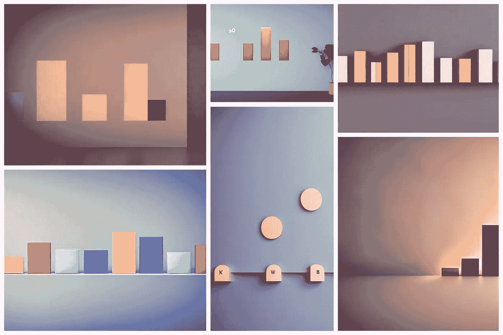
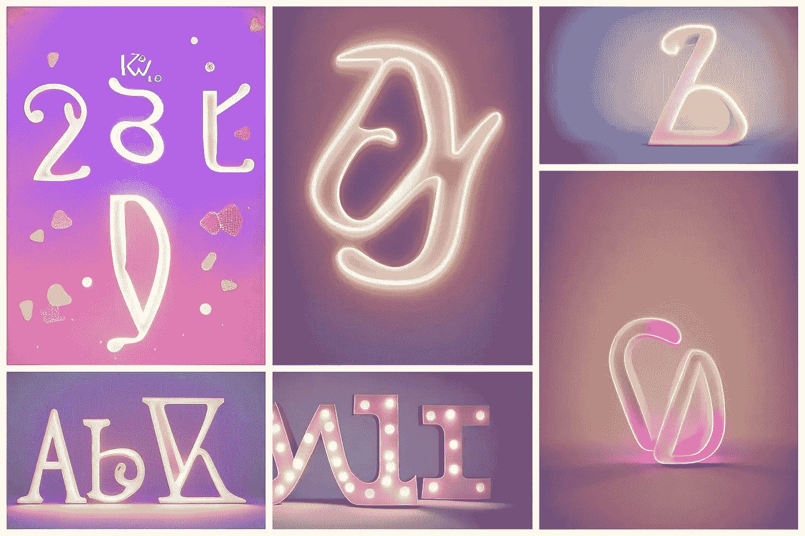
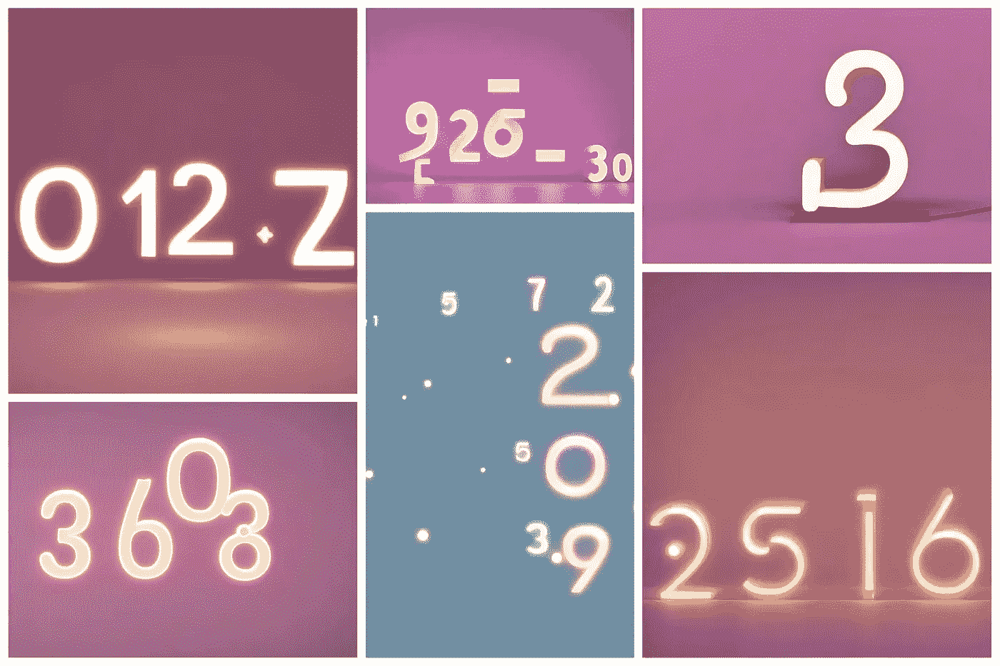
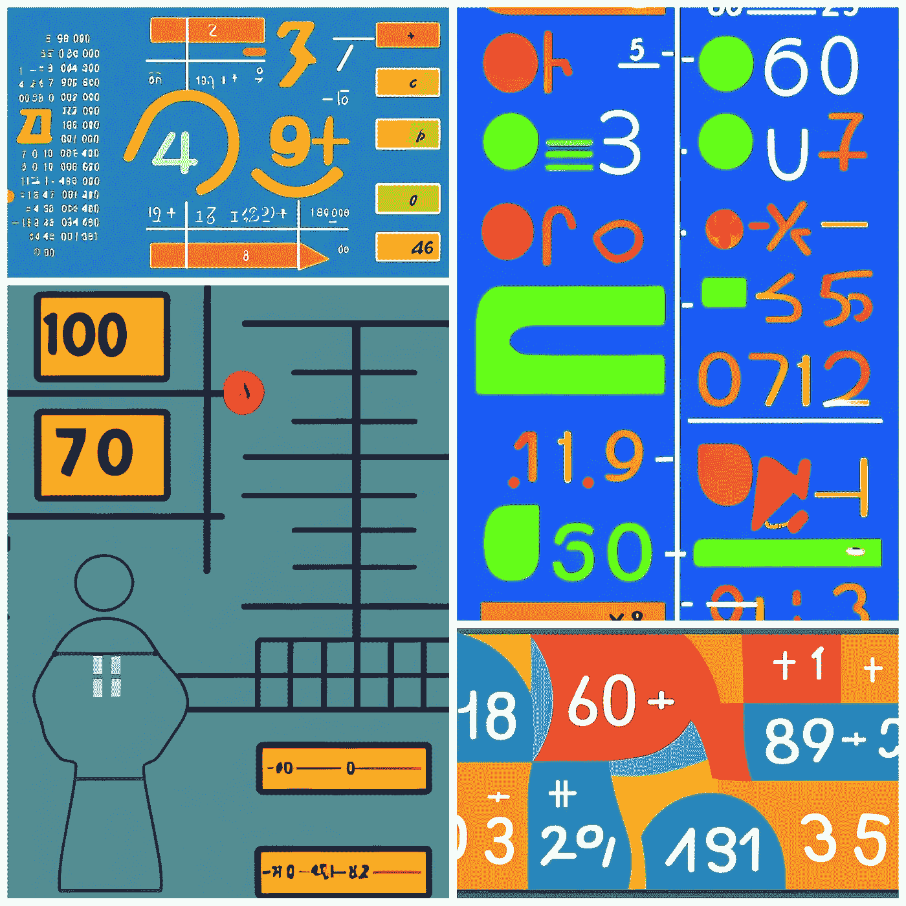
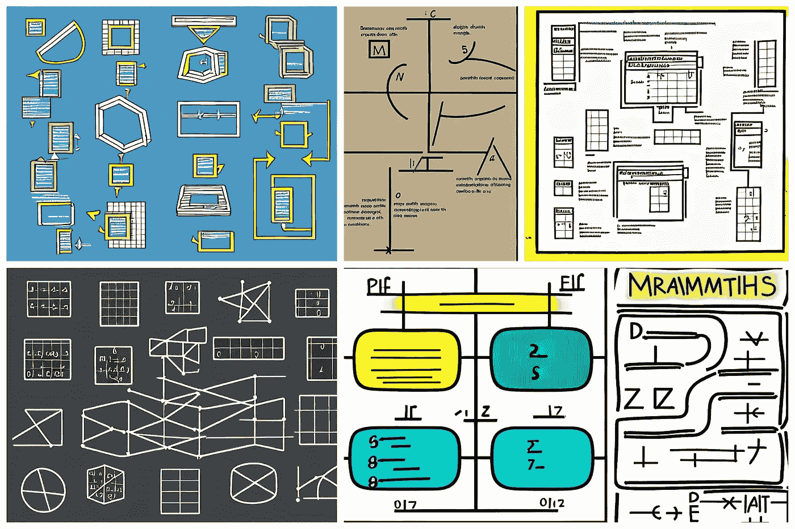
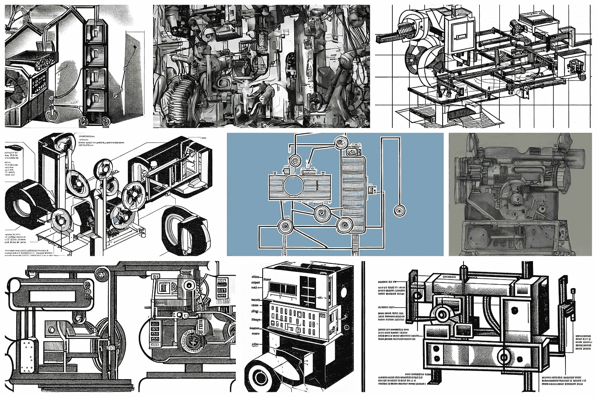
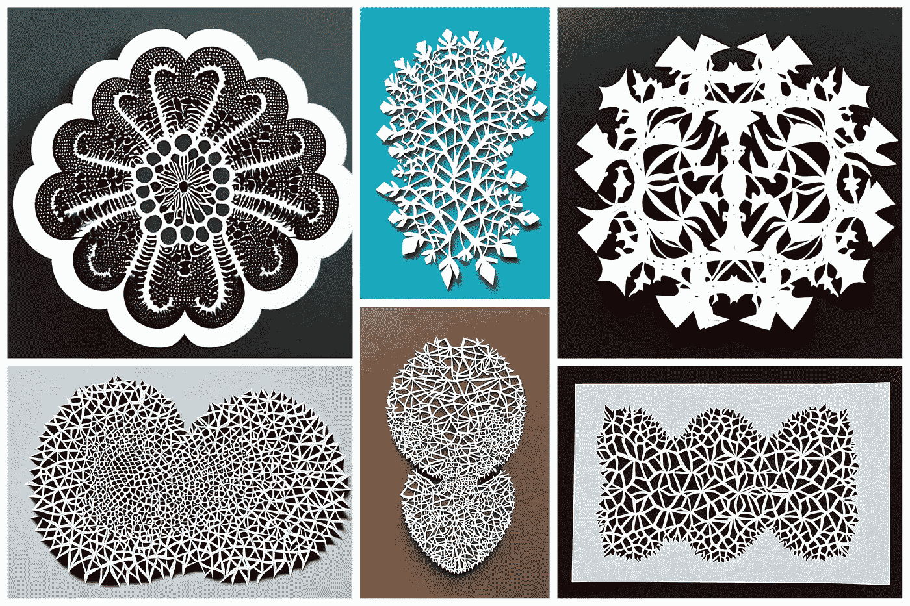
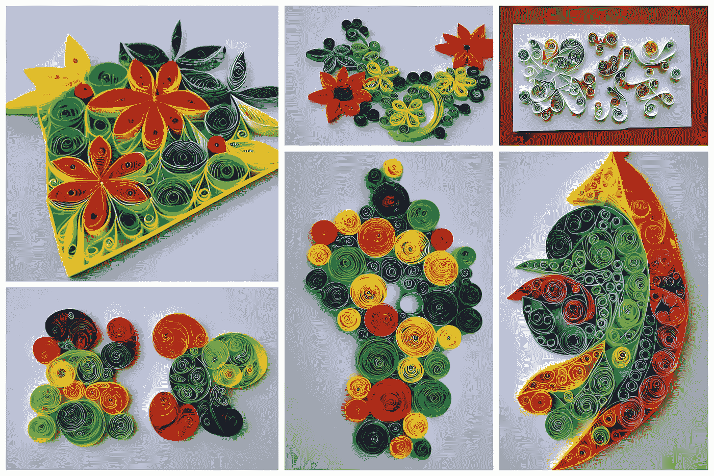

# 如何使用人工智能创建博客图像

> 原文：<https://blog.devgenius.io/how-to-use-ai-to-create-blog-images-f0adbb83fc68?source=collection_archive---------21----------------------->

## 或者，当我们可以免费创作我们的艺术时，为什么还要花钱呢？

在过去的几周里，我写了很多关于 JavaScript 的帖子。我意识到网上用来说明数学和 IT 概念的图片总是一样的。这就是为什么我决定用人工智能生成的图像来说明我的故事。

有各种可能性。我决定使用一个便宜的解决方案( [Lexica.art](https://medium.com/data-driven-fiction/lexica-art-how-to-search-and-create-images-with-artificial-intelligence-58ca51e63394) )并保持统一的风格。我不是设计师，不想在这上面花太多时间。我只是想有一个很好的形象来说明我的职位。

# 卡哇伊可爱小

在所有的变体中，我最喜欢用`kawai cute little`作为关键词。通过这种方式，我获得了精致的图像，具有圆润的笔触和温暖的色彩。这是我喜欢的效果。让我们试一些例子。

如果我想绘制一个图表，我可以使用这样的提示:

> kawai 可爱的小代表条形图在墙上，美丽的光。柔和配色方案，8 k 渲染

如果我想代表一系列字母，我可以试试:

> 卡哇伊可爱的小字母表，美丽的光。柔和配色方案，8 k 渲染

最后，如果我对有数字的图像感兴趣:

> 可爱的卡哇伊数字小代表，美丽的光。柔和配色方案，8 k 渲染

一旦你找到了一种风格，为了给人一种均匀的效果，在几篇文章中使用它是很有趣的。比如我也可以尝试这些风格(顺便推荐阅读[这个故事](https://exquisiteworkers.medium.com/32-art-styles-on-midjourney-v4-you-must-try-e1844e75daf3)[精致的工人](https://medium.com/u/14f3e18e5eff?source=post_page-----f0adbb83fc68--------------------------------)写的)。

# 信息图表说明

> 最大数量的数学概念，信息图表说明

# 草图

> 数学概念示意图

> 数字求和机器示意图

# 剪纸工艺插画

> 曼德布洛特剪纸工艺插画

# 造纸毛边

> 数学公式的纸上书写

感谢阅读！敬请关注更多内容。

***不要错过我的下一篇文章—报名参加我的*** [***中邮箱列表***](https://medium.com/subscribe/@el3um4s)

 [## 通过我的推荐链接加入 Medium—Samuele

### 阅读萨缪尔的每一个故事(以及媒体上成千上万的其他作家)。不是中等会员？在这里加入一块…

el3um4s.medium.com](https://el3um4s.medium.com/membership)