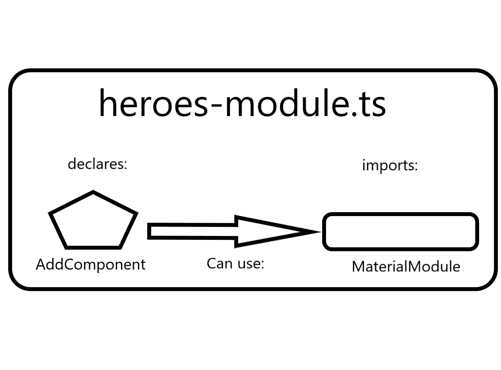

# 如何使用和定制有棱角的材料小吃——弗兰·彼尔托

> 原文：<https://blog.devgenius.io/how-to-use-and-customize-angular-material-snackbars-fran-prieto-ec678fc90348?source=collection_archive---------10----------------------->


我会写这篇文章，因为尽管它是一个很棒的组件，定制有棱角的材料小吃条很容易，但有时会有点棘手。

## 什么是小吃店？

[](https://material.angular.io/components/snack-bar/overview) [## 角状材料

### 用于移动和桌面 Angular web 应用程序的 UI 组件基础结构和材料设计组件。

材料.角度. io](https://material.angular.io/components/snack-bar/overview) 

正如他们在文档中所说， **snackbar 是一个显示小吃店通知的服务。**

要使用它，你必须安装角形材料

[](https://www.npmjs.com/package/@angular/material) [## @角度/材质

### 棱角分明的材料。最新版本:15.0.0，最后发布时间:9 天前。开始在您的项目中使用@angular/material，方法是…

www.npmjs.com](https://www.npmjs.com/package/@angular/material) 

我们希望 Angular 团队不要像他们对流行的 flex-layout 库所做的那样反对它[，这可能会给许多项目带来很大的问题，开发人员将不得不花费数周或数月来重构 CSS。希望这不是 Angular 以后要走的路。](https://github.com/angular/flex-layout/issues/1426)

[](https://betterprogramming.pub/farewell-flex-layouts-is-angular-starting-to-become-a-worry-4eea953b717b) [## 为什么 Flex-Layouts 的过时引起了 Angular 开发者的关注

### 大量的重构即将出现

better 编程. pub](https://betterprogramming.pub/farewell-flex-layouts-is-angular-starting-to-become-a-worry-4eea953b717b) 

好吧，一旦我们为 Angular 社区分享了这个令人失望的消息，我们将专注于这个有用的组件，它非常有助于以一种非常简单的方式在屏幕上向用户显示消息。

我们将以我目前正在创建的超级英雄应用程序为例(是的，据我所知，这不是最原始的东西:P)。

有了 snackbars，我可以在一个英雄成功创建时通知用户；或者当它被删除时；或者当错误发生时。


正如你所看到的，我们已经创建了一个新的英雄，没有任何问题，用户已经得到适当的通知。


如果发生了错误呢？我们也可以通知，例如，如果我们试图创造一个没有名字的新英雄。这是不允许的，所以在这种情况下 snackbar 将抛出一个错误，它将是红色的


当然，我们可以禁用“保存”按钮，直到创建一个英雄所需的条件得到满足，但这样我可以向您展示 snackbar 的用途。

我们会展示代码。如果我们再看一下文档，默认情况下所有的 snackbars 都是白色的:


但是如果我们转到元素的 API，我们会发现一个名为“panelClass”的属性，它允许我们使用一个字符串或字符串数组，对应于 CSS 类的名称，这将帮助我们定制 snackbar。

[](https://material.angular.io/components/snack-bar/api) [## 角状材料

### 用于移动和桌面 Angular web 应用程序的 UI 组件基础结构和材料设计组件。

材料.角度. io](https://material.angular.io/components/snack-bar/api) 

## 让我们编码

那么，好吧，我们将开始编写我们的 snackbar。

首先，您必须导入模块，就像文档中解释的那样:


该模块将包含您使用小吃店所需的一切。

要从哪里导入？嗯，它是一个模块，所以我们可以在应用程序的主 app.module.ts 上导入它，但是，当我们使用 material 组件时，我们最终会导入许多模块，我建议创建另一个模块来声明我们将使用的 material 组件。

例如:创建一个文件夹和一个名为 **material-module.ts** 的文件

注意，这里我们只使用了 exports[]数组，而很多时候我们也使用 imports[]数组导入模块，例如在 app-module.ts 中

我们可以在这里看到原因:

[](https://stackoverflow.com/questions/39062930/what-is-the-difference-between-declarations-providers-and-import-in-ngmodule) [## NgModule 中的声明、提供者、导入有什么区别？

### imports 使其他模块的导出声明在当前模块声明中可用…

stackoverflow.com](https://stackoverflow.com/questions/39062930/what-is-the-difference-between-declarations-providers-and-import-in-ngmodule) 

*   imports 使其他模块的导出声明在当前模块中可用
*   exports 使组件、指令和管道在将该模块添加到 imports 的模块中可用。导出还可以用于重新导出 CommonModule 和 FormsModule 等模块，这通常在共享模块中完成。

因此，我们在 material-module 中拥有的是一个将导出 Angular 材质模块的模块，因此它们可以用在另一个带有 imports[]数组的模块上。我们在这里不再需要什么了。

然后，这些导出的 Material 模块将被用于另一个名为 **heroes-module.ts** 的模块中，只需简单地导入 MaterialModule 即可。这样，我们就可以用一句话将所有导出的模块提供给我们的 heroes-module.ts. dependent 组件。那些依赖组件在“声明”数组中。

**重要提示:根据您使用的代码编辑器，您可能需要手动导入您在@NgModule，inside declarations[]，imports[]…数组中指定的组件或模块。** [**Visual Studio 代码**](https://code.visualstudio.com/) **为您打造。**

现在我们可以在组件中使用 snackbar 了。在这个例子中，我使用了 **add-component.ts** 来添加新的英雄

为什么现在可以在这个组件内部使用 Snackbar？因为请记住:在 heroes-module.ts 中，我们声明了 AddComponent，并且我们还在 heroes-module.ts 中导入了我们的 MaterialModule。

因此，AppComponent“依赖于”heroes-module.ts，它可以与其依赖组件“共享”在 heroes-module-ts 上导入的所有模块，例如我们的 MaterialModule

如果这听起来有点混乱，也许这个方案可以帮助你:



检查 gists，我会强调前面提到的堆栈溢出链接，在那里他们谈到了导入、导出、声明…

[](https://stackoverflow.com/questions/39062930/what-is-the-difference-between-declarations-providers-and-import-in-ngmodule) [## NgModule 中的声明、提供者、导入有什么区别？

### imports 使其他模块的导出声明在当前模块声明中可用…

stackoverflow.com](https://stackoverflow.com/questions/39062930/what-is-the-difference-between-declarations-providers-and-import-in-ngmodule) 

所以，现在，在需要显示 snackbar 的组件中，我们必须将它注入到构造函数中。为什么？因为，正如我们在开始时读到的，从文件中:

*MatSnackBar 是一个* ***服务*** *，用于显示小吃店通知* ***。***

还有**什么叫它是服务？我们必须注入它**(更多关于[依赖注入](https://angular.io/guide/dependency-injection)在这里)。因此，在我们的 add-component.ts 中:


现在，在同一个组件中，我将创建一个方法，在需要时用我们希望的定制显示我们的小吃店。

**编辑:抱歉打错了，在代码中我写了“成功”而不是“成功”**


正如我们所看到的，我们的 showSnackBar()方法有两个参数:

*   messageToShow。如它所说，消息将被显示
*   snackBarClass。在我的例子中，只有一个字符串。请注意，我们已经给这个参数传递了一个默认值。它是一个字符串，带有大多数情况下使用的 CSS 类的名称。声明一个缺省值，在这种情况下，你可以简单地调用方法，传递第一个参数，默认情况下会显示“成功”的样式。我们稍后会看到。

我们的注入服务叫做“snackbar”，我们将调用它的 open()方法。

在这里，您可以找到关于该方法及其接受的参数的信息，但基本上是负责显示-打开-我们的 snackbar。

[](https://material.angular.io/components/snack-bar/api) [## 角状材料

### 用于移动和桌面 Angular web 应用程序的 UI 组件基础结构和材料设计组件。

材料.角度. io](https://material.angular.io/components/snack-bar/api) 

*   我们的第一个参数是 messageToShow，它将取自 showSnackBar()的第一个参数。正如您所看到的，这个方法就像一个包装器，使得以后调用和打开 snackbar 更加容易。
*   第二个参数“关闭！”只是将要显示的文本，您可以按下它，在设定的持续时间结束之前，snackbar 会消失
*   作为第三个参数，我们有一个使用两个属性的对象:
    –Duration。您希望 snackbar 停留在屏幕上的毫秒数。1000 毫秒=1 秒。
    –panel class。这是我们传递 css 定制的地方。在这种情况下，我们将传递 snackBarClass，如果我们记得的话，它的值为“successful”。总之，现在就像写:

```
panelClass:"successful"
```

所以现在，我们只需要在需要的地方调用 showSnackBar()，显示适当的消息，例如，当我们正确地添加了一个新的英雄时。


我们将拥有:


您是否注意到，当我们调用该方法时，我们只将值传递给了消息参数？这节省了我们的时间和工作，因为我们为第二个参数传递了一个默认值，然后我们不需要指定一个值 ***，如果它与默认值*** 没有不同的话(我们将在后面看到)。

但是诶！我们需要的 css 类在哪里？我们的“成功”阶层在哪里？

也许你会把它放在 add-component.css 上，但是如果你这样做，它就不会工作，如下所述:

[](https://stackoverflow.com/questions/47901127/angular-5-material-snackbar-panelclass-config) [## 角形 5 材料 Snackbar 面板类别配置

### 我正在尝试添加一个 panelClass 配置到 Angular Material Snackbar。我写了下面的代码，通过遵循…

stackoverflow.com](https://stackoverflow.com/questions/47901127/angular-5-material-snackbar-panelclass-config) 

公认的答案告诉我们**我们必须用我们的全球*风格去做。CSS* 文件**

因此，我们将去那里，我们将编写 2 个类:我们的老朋友“成功”和另一个显示不同的风格，如果有一个错误:


现在，如果我们想在错误发生时显示不同的样式，我们必须这样调用方法:


你能看到这次我们也把值传递给了第二个参数吗？这样，我们将传递给 panelClass 的默认值从“成功”覆盖为“失败”)。

正如我们已经看到的，这将允许我们用红色背景显示正确的错误消息:


就是这样！不是很难，但是必须在全局 styles.css 上声明 snackbar 类可能会让您有些头疼，我想为您保留它们🙂

我们还回顾了一些很酷的角度概念，可能对你有用。

当然，正如我经常说的，如果你发现某种失败，或者如果你想雇用我作为你的出版物的技术作者，请随时[联系我](http://franprietogutweb@gmail.com)。

*封面图片属于* [*劳伦斯修士*](https://pixabay.com/es/users/lmonk72-731125/?utm_source=link-attribution&utm_medium=referral&utm_campaign=image&utm_content=944499) *见于* [*Pixabay*](https://pixabay.com/es//?utm_source=link-attribution&utm_medium=referral&utm_campaign=image&utm_content=944499)

*原载于 2022 年 11 月 25 日*[*https://portfolio.avanzartewebs.com*](https://portfolio.avanzartewebs.com/javascript/angular/2022/11/25/how-to-use-and-customize-angular-material-snackbars/)*。*