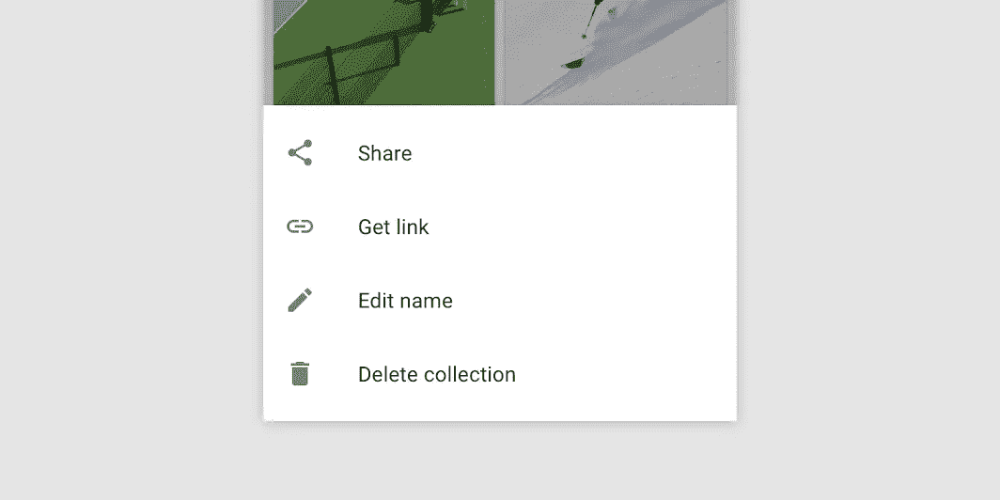

# 如何在使用 Kotlin 的 android 项目中使用 Android 底层表？举例说明。

> 原文：<https://blog.devgenius.io/how-to-use-android-bottom-sheet-in-android-project-using-kotlin-explanation-with-example-afd322db0184?source=collection_archive---------2----------------------->



来源:谷歌

要在使用 Kotlin 的 Android 项目中使用底层表单，您可以遵循以下步骤:

1.  将设计库添加到项目的 build.gradle 文件中:

```
dependencies {
    implementation 'com.google.android.material:material:1.3.0'
}
```

2.将`CoordinatorLayout`添加到活动的布局中。`CoordinatorLayout`将用于将底部薄板固定到屏幕底部。

```
<androidx.coordinatorlayout.widget.CoordinatorLayout
    xmlns:android="http://schemas.android.com/apk/res/android"
    xmlns:app="http://schemas.android.com/apk/res-auto"
    android:id="@+id/coordinator_layout"
    android:layout_width="match_parent"
    android:layout_height="match_parent">

</androidx.coordinatorlayout.widget.CoordinatorLayout>
```

3.添加一个`com.google.android.material.bottomsheet.BottomSheetBehavior`到你的底部工作表的布局。这种行为将允许底板上下滑动。

```
<LinearLayout
    android:id="@+id/bottom_sheet"
    android:layout_width="match_parent"
    android:layout_height="wrap_content"
    android:background="@color/colorAccent"
    app:layout_behavior="com.google.android.material.bottomsheet.BottomSheetBehavior">

    <!-- Add content to the Bottom Sheet -->

</LinearLayout>
```

4.在您的活动代码中，找到底部的工作表，并将其状态设置为`BottomSheetBehavior.STATE_COLLAPSED`或`BottomSheetBehavior.STATE_EXPANDED`，以分别显示或隐藏底部的工作表。

```
val bottomSheet = findViewById<LinearLayout>(R.id.bottom_sheet)
val bottomSheetBehavior = BottomSheetBehavior.from(bottomSheet)

// Show the Bottom Sheet
bottomSheetBehavior.state = BottomSheetBehavior.STATE_EXPANDED

// Hide the Bottom Sheet
bottomSheetBehavior.state = BottomSheetBehavior.STATE_COLLAPSED
```

下面是一个完整的例子，说明如何在使用 Kotlin 的 Android 项目中使用底层表单:

```
import androidx.appcompat.app.AppCompatActivity
import android.os.Bundle
import android.view.View
import androidx.coordinatorlayout.widget.CoordinatorLayout
import com.google.android.material.bottomsheet.BottomSheetBehavior
import kotlinx.android.synthetic.main.activity_main.*

class MainActivity : AppCompatActivity() {

    private lateinit var bottomSheetBehavior: BottomSheetBehavior<*>

    override fun onCreate(savedInstanceState: Bundle?) {
        super.onCreate(savedInstanceState)
        setContentView(R.layout.activity_main)

        val bottomSheet = bottom_sheet
        bottomSheetBehavior = BottomSheetBehavior.from(bottomSheet)
        bottomSheetBehavior.state = Bottom
```

下面是一些你可以用 Kotlin 在 Android 中做的事情:

1.  您可以设置一个`BottomSheetCallback`来监听底部料板的状态变化。例如，当底部工作表显示或隐藏时，您可以使用这个回调来更新 UI。

```
val bottomSheetBehavior = BottomSheetBehavior.from(bottomSheet)

bottomSheetBehavior.setBottomSheetCallback(object : BottomSheetBehavior.BottomSheetCallback() {
    override fun onStateChanged(bottomSheet: View, newState: Int) {
        // Update the UI when the state of the Bottom Sheet changes
    }

    override fun onSlide(bottomSheet: View, slideOffset: Float) {
        // Update the UI while the Bottom Sheet is being dragged
    }
})
```

2.您可以通过设置`peekHeight`和`hideable`属性自定义底部板材的外观。`peekHeight`属性决定了底层工作表折叠时的高度，`hideable`属性决定了底层工作表是否可以完全隐藏。

```
<LinearLayout
    android:id="@+id/bottom_sheet"
    android:layout_width="match_parent"
    android:layout_height="wrap_content"
    android:background="@color/colorAccent"
    app:layout_behavior="com.google.android.material.bottomsheet.BottomSheetBehavior"
    app:behavior_peekHeight="100dp"
    app:behavior_hideable="true">

    <!-- Add content to the Bottom Sheet -->

</LinearLayout>
```

3.您还可以使用`BottomSheetDialogFragment`在您的应用程序中显示模态底部表单。如果你想显示一个覆盖整个屏幕的底部表单，并阻止用户与应用程序的其余部分进行交互，直到它被关闭，这是很有用的。

要使用`BottomSheetDialogFragment`，您可以创建一个扩展`BottomSheetDialogFragment`的新类，并覆盖`onCreateView()`方法来扩展底部工作表的布局。然后，您可以通过在您的`BottomSheetDialogFragment`类的实例上调用`show()`来显示底部的工作表。

```
class MyBottomSheetDialogFragment : BottomSheetDialogFragment() {

    override fun onCreateView(
        inflater: LayoutInflater,
        container: ViewGroup?,
        savedInstanceState: Bundle?
    ): View? {
        return inflater.inflate(R.layout.fragment_bottom_sheet, container, false)
    }
}

val bottomSheetDialogFragment = MyBottomSheetDialogFragment()
bottomSheetDialogFragment.show(supportFragmentManager, "bottomSheetDialogFragment")
```

4.通过调用`BottomSheetDialogFragment`中`getView()`返回的`View`上的`setBottomSheetCallback()`，可以自定义`BottomSheetDialogFragment`的`BottomSheetBehavior`。

```
class MyBottomSheetDialogFragment : BottomSheetDialogFragment() {

    override fun onCreateView(
        inflater: LayoutInflater,
        container: ViewGroup?,
        savedInstanceState: Bundle?
    ): View? {
        val view = inflater.inflate(R.layout.fragment_bottom_sheet, container, false)

        val bottomSheetBehavior = BottomSheetBehavior.from(view.parent as View)
        bottomSheetBehavior.setBottomSheetCallback(object : BottomSheetBehavior.BottomSheetCallback() {
            override fun onStateChanged(bottomSheet: View, newState: Int) {
                // Update the UI when the state of the Bottom Sheet changes
            }

            override fun onSlide(bottomSheet: View, slideOffset: Float) {
                // Update the UI while the Bottom Sheet is being dragged
            }
        })

        return view
    }
}
```

5.您也可以通过在底部表单的布局中设置`peekHeight`和`hideable`属性来自定义`BottomSheetDialogFragment`的外观。

```
<LinearLayout
    xmlns:android="http://schemas.android.com/apk/res/android"
    xmlns:app="http://schemas.android.com/apk/res-auto"
    android:layout_width="match_parent"
    android:layout_height="wrap_content"
    android:background="@color/colorAccent"
    app:layout_behavior="com.google.android.material.bottomsheet.BottomSheetBehavior"
    app:behavior_peekHeight="100dp"
    app:behavior_hideable="true">

    <!-- Add content to the Bottom Sheet -->

</LinearLayout>
```

6.你还可以使用`BottomNavigationView`在屏幕底部显示一个导航栏，可以用来在你的应用程序的不同屏幕或部分之间切换。`BottomNavigationView`是一个专门的`ViewGroup`，它显示底部导航栏，每个项目代表你应用程序中的一个目的地。

要使用一个`BottomNavigationView`，您可以将它添加到您的布局中，并设置一个`OnNavigationItemSelectedListener`来监听项目选择。

```
<com.google.android.material.bottomnavigation.BottomNavigationView
    android:id="@+id/bottom_navigation_view"
    android:layout_width="match_parent"
    android:layout_height="wrap_content"
    app:menu="@menu/bottom_navigation_menu"/>

val bottomNavigationView = findViewById<BottomNavigationView>(R.id.bottom_navigation_view)
bottomNavigationView.setOnNavigationItemSelectedListener { menuItem ->
    when (menuItem.itemId) {
        R.id.menu_item_
```

7.您可以通过设置布局中的`app:itemIconTint`和`app:itemTextColor`属性来自定义`BottomNavigationView`中项目的外观。您还可以设置`app:itemBackground`属性来自定义项目的背景。

```
<com.google.android.material.bottomnavigation.BottomNavigationView
    android:id="@+id/bottom_navigation_view"
    android:layout_width="match_parent"
    android:layout_height="wrap_content"
    app:menu="@menu/bottom_navigation_menu"
    app:itemIconTint="@color/colorPrimary"
    app:itemTextColor="@color/colorPrimary"
    app:itemBackground="@color/colorAccent"/>
```

8.您还可以使用`BottomAppBar`在您的应用程序中显示底部应用程序栏。`BottomAppBar`是固定在屏幕底部的专用`Toolbar`，可用于显示导航和行动项目。

要使用一个`BottomAppBar`，您可以将它添加到您的布局中，并设置一个`OnMenuItemClickListener`来监听菜单项的点击。

```
<com.google.android.material.bottomappbar.BottomAppBar
    android:id="@+id/bottom_app_bar"
    android:layout_width="match_parent"
    android:layout_height="wrap_content"
    android:backgroundTint="@color/colorPrimary"
    app:menu="@menu/bottom_app_bar_menu"/>

val bottomAppBar = findViewById<BottomAppBar>(R.id.bottom_app_bar)
bottomAppBar.setOnMenuItemClickListener { menuItem ->
    when (menuItem.itemId) {
        R.id.menu_item_action -> {
            // Handle menu item action
            true
        }
        else -> false
    }
}
```

希望这有帮助！谢谢大家！