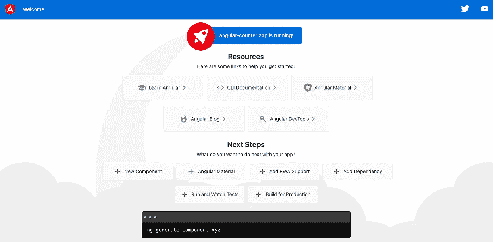
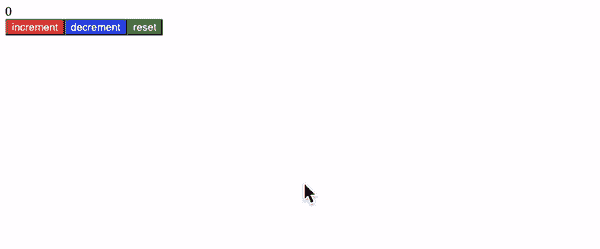

# 如何使用 Angular

> 原文：<https://blog.devgenius.io/how-to-use-angular-ccb2a1cf1900?source=collection_archive---------7----------------------->


图片来自[https://code . like agirl . io/adventures-in-angular-5f 4722 FDA 805](https://code.likeagirl.io/adventures-in-angular-5f4722fda805)

# 目的

虽然我知道 angular 是最受欢迎的 TS 框架作品之一，但是我还没有接触过(甚至到目前为止我还学过 react 和 vue。)是时候学习 angular 了，我将与您分享 Angular，以及如何使用它。

# 什么是有角？

正如我已经提到的，angular 是谷歌从 2016 年开始提供的最受欢迎的 TS 框架之一。实际上 angular 是版本 2，版本 1 被命名为 angular JS，它也是由 google 开发的，于 2012 年发布。angular JS 具有非常创新的特性，集成了 MVC 模型(模型、视图、控制器)，以及许多没有库的内置特性。然而，基本上 angular 是为设计者而不是开发人员创建的，所以如果它用于大型项目，就会出现性能和构建时间的问题。因此，Google 决定做一些破坏性的改变，包括将 MVC 模式改为基于组件的模式，以解决性能问题，名称也改为 angular(不是 JS)。AngularJS 不再支持(这个支持持续时间到 2022 年 1 月结束)，如果你是 angular 的初学者，你需要学习 angular 而不是 angular JS。那么，什么是正反有角呢？

# 利弊

## 赞成的意见

*   许多内置功能

如果要使用路由 react 或者 vue，需要安装一些像 react-router-dom 或者 vue-router 这样的库。然而，angular 已经内置了一个包来实现路由功能，所以你不需要安装它。有人可能会说这不是一个大问题，但如果你在一个大项目中，这可能是一个大问题，因为你需要与同事安装一个完全相同的包来管理版本。如果你只有几个库还可以，但是超过 20 个或者更多库，如何管理呢？

*   标准类型脚本功能。

这是与 angular JS，react，vue 不同的特性之一。尽管您可以在 react 和 vue 中选择 TypeScript 作为选项，但这不是强制性的。然而，Angular 有一个“标准”的类型脚本特性，而不是一个选项。所以，如果你想使用 Angular，你也需要学习 TypeScript。这是一个有争议的话题，但我个人同意谷歌的观点，因为这个库非常适合一个相对较大的项目，正如我已经说过的。TypeScript 也很适合大型项目，因为这种替代 JS 避免了添加类型严重错误，并促进了团队开发。

*   生产力

正如我已经提到的，Angular 有许多好的内置特性。例如，如果你想创建一个组件，你想通过使用带命令行的 angular cli 来创建(如“ng g <your-component-name><path of="" component="">”)。这是一种后端全栈框架，如 Laravel。因此，如果你熟悉 Angular 的方式，你会有很高的效率来创建一些应用程序或管理你的项目。</path></your-component-name>

## 骗局

*   学习曲线

这种棱角分明的方式给了我们很大的生产力，但你需要棱角分明的独特方式。你不需要记住整个语法，但需要记住核心概念，如数据绑定、指令等..这就是为什么这个库比 react 或 vue 等其他库有更陡峭的学习曲线。如果你已经熟悉 react 或 vue，这不会太难。但是如果你是新来的，这可能是个严重的问题。

*   标准类型脚本功能。

尽管这完全是优点或缺点，但 TypeScript 特性可能是个缺点，因为与 JavaScript 相比，它需要时间来学习。对于管理相对较大的项目来说，这是一个非常好的特性，但是对于刚刚开始学习 JavaScript 的初学者来说，它并不适合。

*   可能超标了。

正如我已经提到的，这个库有很多有用的内置包，但是对于一个小项目来说，这可能是超出规格的，因为有很多未使用的特性，这不是一个最优雅的方式。所以一般来说，Angular 非常适合大项目，即使你可以在小项目中使用这个库。

关于 Angular 就提到这一点就够了，让我们来看看样例项目。

# 示例(计数器应用程序)

## 步伐

1.  设置您的环境

```
npm install -g @angular/cli
```

如果你是 mac 用户，你可能需要在执行上述命令之前先执行 sudo 并输入密码，因为这是一个全局安装。

如果您是 windows 用户，您需要处理一个全局安装问题。如果你有问题，请参考官方文件(我把参考部分)。

苹果个人计算机

```
sudo npm install -g @angular/cli
```

Windows 操作系统

```
Set-ExecutionPolicy -Scope CurrentUser -ExecutionPolicy RemoteSigned
```

然后使用上面的命令安装 angular CLI(NPM install-g @ angular/CLI)。

2.创建工作空间和应用程序。你需要回答一些问题(这个答案取决于你)。回答以下答案后，你的应用已成功安装你的工作区。

创建新文件夹

```
ng new angular-counter(This name is up to you)
```

## 问题

第一

```
? Would you like to enable autocompletion? This will set up your terminal so pressing TAB while typing Angular CLI commands will show possible options and 
autocomplete arguments. (Enabling autocompletion will modify configuration files in your home directory.) (y/N)
```

第二

```
? Would you like to share anonymous usage data about this project with the Angular Team at
Google under Google’s Privacy Policy at [https://policies.google.com/privacy.](https://policies.google.com/privacy.) For more
details and how to change this setting, see [https://angular.io/analytics.](https://angular.io/analytics.) (y/N)
```

第三

```
Would you like to add Angular routing? (y/N)
```

第四(你需要选择)

```
Which stylesheet format would you like to use? (Use arrow keys)
❯ CSS 
  SCSS   [ [https://sass-lang.com/documentation/syntax#scss](https://sass-lang.com/documentation/syntax#scss)                ] 
  Sass   [ [https://sass-lang.com/documentation/syntax#the-indented-syntax](https://sass-lang.com/documentation/syntax#the-indented-syntax) ] 
  Less   [ [http://lesscss.org](http://lesscss.org)                                             ]
```

2.移动到您的工作区，并检查您的文件(检查文件是可选的)。

移动到你的工作空间

```
cd angular-counter(this is your app name)
```

下面是这个文件夹结构。如果你熟悉其他 JS 框架，比如 react，vue。这是相似的，但略有不同，更多的文件。例如，该文件夹有三个不同的 tsconfig 文件、环境文件和 polyfills。与 react 或 vue 相比，它似乎更复杂和详细。

```
.
├── README.md
├── angular.json
├── karma.conf.js
├── package-lock.json
├── package.json
├── src
│   ├── app
│   │   ├── app.component.css
│   │   ├── app.component.html
│   │   ├── app.component.spec.ts
│   │   ├── app.component.ts
│   │   └── app.module.ts
│   ├── assets
│   ├── environments
│   │   ├── environment.prod.ts
│   │   └── environment.ts
│   ├── favicon.ico
│   ├── index.html
│   ├── main.ts
│   ├── polyfills.ts
│   ├── styles.css
│   └── test.ts
├── tsconfig.app.json
├── tsconfig.json
└── tsconfig.spec.json
```

3.使用下面的命令运行您的应用程序，并查看下面的屏幕“localhost: 4200”

```
ng serve --open
```



好吧，让我们创建计数器应用程序。

4.如下所示更改您的“app.component.ts”。基本上，您需要在这里编写 JS 代码作为类组件。你可以在@Component 里面看到，你需要注册模板 url 和样式(这是默认的，但是如果你想创建另一个，你需要创建一个新的。)

5.如下所示更改您的“app.component.html”。请注意，您可以使用{{}}注入您的状态。并且需要包装来绑定 click by()。样式是可选的，但是你可以像纯 css 那样做。在我的例子中，我写了一些基本的样式如下。

6.搞定了。下面是我的屏幕，这完全正常。



# 结论

Angular 是最流行的 JS 框架之一，它有很多有用的内置包。如果你已经熟悉 JS 和 TS，或者你想创建一个有很多功能的相对较大的应用程序，这个库对你很有帮助。在我看来，与选择任何其他 JS 框架的公司相比，使用 angular 的公司旨在编写更加结构化、优雅、可读的代码，因为 angular 不太受欢迎，有时可能很难找到合适的解决方案，因为熟悉 TypeScript 和内置功能有困难。不过，这个库有一个很好的特性，编写简单，易于维护，所以使用它是个不错的选择。

# 参考

官方文件(棱角分明):[https://angular.io/guide/setup-local](https://angular.io/guide/setup-local)

官方文件(AngularJS):https://angularjs.org/

Angular 和 AngularJS 的区别:[https://www . geeks forgeeks . org/difference-between-Angular-and-Angular js/](https://www.geeksforgeeks.org/difference-between-angular-and-angularjs/)

Angular js vs . Angular 2 vs . Angular 4:关键区别:[https://www . simpli learn . com/Angular js-vs-Angular-2-vs-Angular-4-differences-article](https://www.simplilearn.com/angularjs-vs-angular-2-vs-angular-4-differences-article)

Angular 中的冒险:[https://code . like agirl . io/adventures-in-Angular-5f 4722 FDA 805](https://code.likeagirl.io/adventures-in-angular-5f4722fda805)

三大 Javascriptフレームワーク「Angular, React, Vuejs」について: [https://it-kyujin.jp/article/detail/1647/](https://it-kyujin.jp/article/detail/1647/)

【初心者必見】Angularとは? いまさら聞けない基礎を学ぼう: [https://www.sejuku.net/blog/9019](https://www.sejuku.net/blog/9019)

感谢您的阅读！！