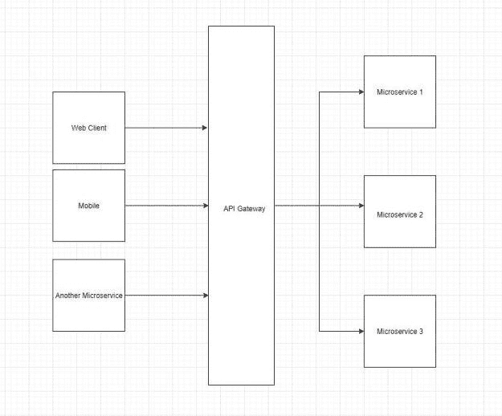
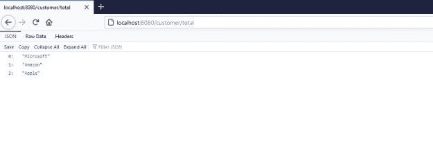

# 如何在 Spring Cloud 中使用 API Gateway

> 原文：<https://blog.devgenius.io/how-to-use-api-gateway-with-spring-cloud-7fcb3fbd97ae?source=collection_archive---------3----------------------->

在这篇文章中，我将展示如何在 Spring Cloud 中使用 API Gateway 模式。随着微服务架构变得越来越有用，如何处理对微服务的调用也变得同样复杂。

微服务的目的是将应用程序解耦为松散耦合的微服务，这些微服务可以轻松地与客户端以及彼此之间进行交互。

重要的是，开发和部署的简便性使微服务更容易根据特定需求进行设计。

# API 网关设计模式

当企业架构扩展时，微服务的数量会变得复杂。客户端可以直接调用这些微服务，但是有一些挑战

1.  每个客户端都必须向暴露的微服务 API 发出请求。在许多情况下，它可能需要多个服务器往返。因此，它增加了网络延迟。
2.  每个微服务都必须实现通用功能，如身份验证、日志记录和授权。
3.  在不影响客户端的情况下更改微服务变得更加困难。现实中，客户端不需要了解微服务及其背后的实现。

为了解决这些问题，该架构现在在客户端和微服务之间包含了另一层。这是 API 网关。

API Gateway 就像一个代理，将请求路由到适当的微服务，并向客户端返回响应。微服务之间也可以通过这个网关进行交互。



# API 网关的使用

API Gateway 提供了一些功能。

# 按指定路线发送

API 网关的主要用途是将请求从客户端路由到适当的服务器或微服务。特别是，API Gateway 对客户端隐藏了 API 的实现。

# 常见功能

API Gateway 还可以实现额外的通用功能和进程内功能，从而减少微服务的负载。这些常见的功能包括日志记录、认证、授权、负载平衡、响应缓存、重试策略、断路器、速率限制器。

# 不同的 API 网关

有许多可用的 API 网关，人们可以根据需要使用其中的任何一种。

总的来说，使用哪个 API 网关将取决于您的用例。但是大多数网关都提供了可扩展性、灵活性和支持的选项。

在这个演示中，我将展示如何为网飞 API 网关使用`spring-cloud-starter-netflix-zuul`库。

# 使用 Spring Cloud 的 API 网关示例

但是，我们会开发两个微服务。我们还将使用 Spring Cloud 构建一个 API 网关。这个 API 网关将作为一个反向代理路由到任何一个微服务。

所以让我们创建第一个微服务。这将包含如下所示的 CustomerController:

```
@RestController
@RequestMapping("/customer")
public class CustomerController
{
    @GetMapping("/total")
    public List<String> customers()
    {
        List<String> list = new ArrayList<>();
        list.add("Microsoft");
        list.add("Amazon");
        list.add("Apple");
        return list;
    }
}
```

这个微服务将在端口 8081 上运行。`server.port=8081`。

现在，让我们创建另一个微服务。这将包含如下所示的供应商控制器:

```
@RestController
@RequestMapping("/vendor")
public class VendorController
{
    @GetMapping("/total")
    public List<String> vendors()
    {
        List<String> list = new ArrayList<>();
        list.add("CJI Consultants");
        list.add("Signature Consultants");
        list.add("Deloitte");
        return list;
    }
}
```

这个微服务将在端口 8082 上运行。`server.port=8082`

# 使用 Spring Cloud 的 API 网关

毕竟，我们将使用 Spring Cloud 创建一个 API 网关。我们需要包括以下依赖项:

```
dependencies { 
   implementation 'org.springframework.boot:spring-boot-starter-thymeleaf' 
   implementation 'org.springframework.boot:spring-boot-starter-webflux' 
   implementation 'org.springframework.cloud:spring-cloud-starter-gateway' 
   testImplementation 'org.springframework.boot:spring-boot-starter-test' 
   testImplementation 'io.projectreactor:reactor-test' 
}
```

注意`spring-cloud-starter-gateway`的依赖性。然而，我们将需要一个 `RouteLocator`类型的 bean 来路由我们的请求。这是我们在 Api 网关中添加配置的地方。

```
package com.betterjavacode.apigatewaydemo.config;

import org.springframework.cloud.gateway.route.RouteLocator;
import org.springframework.cloud.gateway.route.builder.RouteLocatorBuilder;
import org.springframework.context.annotation.Bean;
import org.springframework.context.annotation.Configuration;

@Configuration
public class SpringCloudConfig
{
    @Bean
    public RouteLocator gatewayRoutes(RouteLocatorBuilder routeLocatorBuilder)
    {
        return routeLocatorBuilder.routes()
                .route("customerModule", rt -> rt.path("/customer/**")
                        .uri("http://localhost:8081/"))
                .route("vendorModule", rt -> rt.path("/vendor/**")
                        .uri("http://localhost:8082/"))
                .build();

    }
}
```

如上所示，这个配置 bean 构建了一个`RouteLocator`来路由与两个模块相关的请求。另外，请注意，我们的网关服务运行在端口 8080。如果请求是用网关地址发起的，API 网关会将其路由到适当的服务。

# 演示

让我们开始我们的微服务和 API 网关服务。两个微服务正在端口 8081 和 8082 上运行。API 网关服务正在端口 8080 上运行。

现在，如果我访问`http://localhost:8080/vendor/total`，我将得到如下供应商列表:


如果我访问`http://localhost:8080/customer/total`，我将得到如下客户列表:



# 结论

最后，我展示了如何在 Spring Cloud 中使用 API Gateway。API 网关是一个重要的设计概念。随着微服务数量的增加，拥有一个能够处理这些服务的大量常见工作负载的通用模式变得非常重要，API Gateway 在这方面有所帮助。

如果你感兴趣，我的书[简化弹簧安全](https://betterjavacode.com/programming/simplifying-spring-security)目前正在打折销售。

*原载于 2021 年 5 月 15 日 https://betterjavacode.com*[](https://betterjavacode.com/programming/how-to-use-api-gateway-with-spring-cloud)**。**