# 如何使用 AWS DynamoDB

> 原文：<https://blog.devgenius.io/how-to-use-aws-dynamodb-dc646943f6ac?source=collection_archive---------7----------------------->


# 什么是 DynamoDB？

DynamoDB 是一种快速灵活的 NoSQL 数据库服务，适用于任何规模下需要一致的单位数毫秒延迟的所有应用程序。其灵活的数据模型和可靠的性能使 DynamoDB 非常适合移动、web、游戏、广告技术、物联网和其他应用。

# 优势和特点

## 规模化性能

DynamoDB 通过在任何规模下提供一致的单位数毫秒响应时间，支持世界上一些最大规模的应用程序。您可以构建具有几乎无限吞吐量和存储的应用程序。

## 没有要管理的服务器

DynamoDB 是无服务器的。您不必供应、修补或管理服务器，也不必安装、维护或操作软件。DynamoDB 自动缩放表，以调整容量并保持性能。

## 企业就绪

DynamoDB 是为任务关键型工作负载构建的，包括对需要复杂业务逻辑的各种应用程序的 ACID 事务的支持。

字体: [AWS DynamoDB](https://docs.aws.amazon.com/amazondynamodb/latest/developerguide/Introduction.html)

# 项目

*   使用 Amazon CLI 创建一个 DynamoDB 表
*   插入数据
*   创建辅助全局索引
*   执行表格搜索


# 创建表格:音乐

```
aws dynamodb create-table \
 — table-name Music \
 — attribute-definitions \
 AttributeName=Artist,AttributeType=S \
 AttributeName=SongTitle,AttributeType=S \
 — key-schema \
 AttributeName=Artist,KeyType=HASH \
 AttributeName=SongTitle,KeyType=RANGE \
 — provisioned-throughput \
 ReadCapacityUnits=10,WriteCapacityUnits=5
```

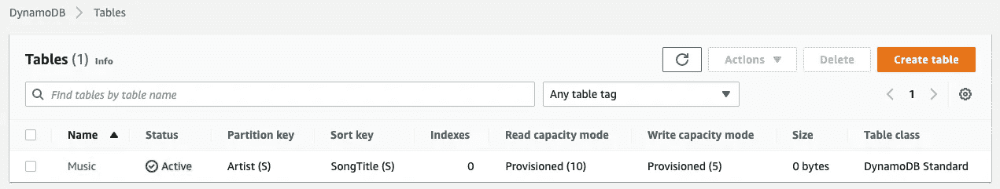

AWS 控制台中的表格视图

# 在表格中插入数据

## 仅插入一个项目进行测试

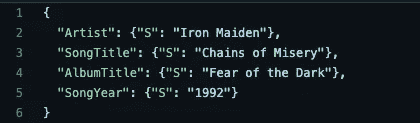

itemmusic.json 视图

## AWS CLI

```
 aws dynamodb put-item \
    --table-name Music \
    --item file://itemmusic.json \
```

## 结果

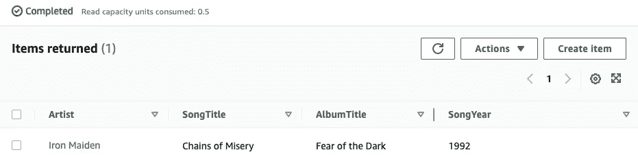

表中的项目 ad

## 插入多个项目


## AWS CLI

```
aws dynamodb batch-write-item \
    --request-items file://batchmusic.json
```

## 结果

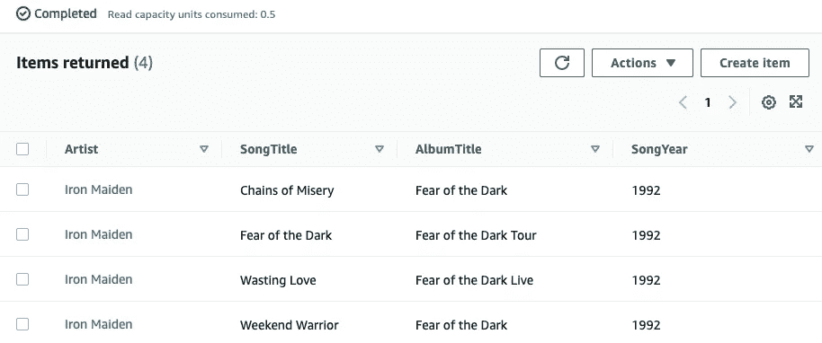

# 基于相册标题创建二级全局索引

## AWS CLI 命令

```
aws dynamodb update-table \
    --table-name Music \
    --attribute-definitions AttributeName=AlbumTitle,AttributeType=S \
    --global-secondary-index-updates \
        "[{\"Create\":{\"IndexName\": \"AlbumTitle-index\",\"KeySchema\":[{\"AttributeName\":\"AlbumTitle\",\"KeyType\":\"HASH\"}], \
        \"ProvisionedThroughput\": {\"ReadCapacityUnits\": 10, \"WriteCapacityUnits\": 5      },\"Projection\":{\"ProjectionType\":\"ALL\"}}}]"
```

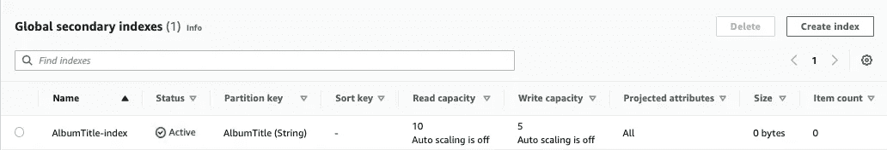

# 基于艺术家的名字和专辑标题创建一个二级全局索引

```
aws dynamodb update-table \
    --table-name Music \
    --attribute-definitions\
        AttributeName=Artist,AttributeType=S \
        AttributeName=AlbumTitle,AttributeType=S \
    --global-secondary-index-updates \
        "[{\"Create\":{\"IndexName\": \"ArtistAlbumTitle-index\",\"KeySchema\":[{\"AttributeName\":\"Artist\",\"KeyType\":\"HASH\"}, {\"AttributeName\":\"AlbumTitle\",\"KeyType\":\"RANGE\"}], \
        \"ProvisionedThroughput\": {\"ReadCapacityUnits\": 10, \"WriteCapacityUnits\": 5      },\"Projection\":{\"ProjectionType\":\"ALL\"}}}]"
```

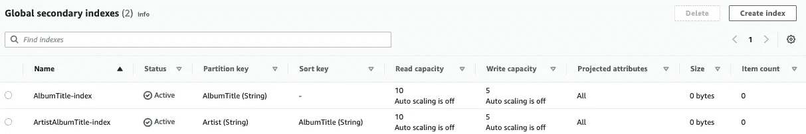

# 根据歌曲名称和年份创建二级全球索引

```
aws dynamodb update-table \
    --table-name Music \
    --attribute-definitions\
        AttributeName=SongTitle,AttributeType=S \
        AttributeName=SongYear,AttributeType=S \
    --global-secondary-index-updates \
        "[{\"Create\":{\"IndexName\": \"SongTitleYear-index\",\"KeySchema\":[{\"AttributeName\":\"SongTitle\",\"KeyType\":\"HASH\"}, {\"AttributeName\":\"SongYear\",\"KeyType\":\"RANGE\"}], \
        \"ProvisionedThroughput\": {\"ReadCapacityUnits\": 10, \"WriteCapacityUnits\": 5      },\"Projection\":{\"ProjectionType\":\"ALL\"}}}]"
```

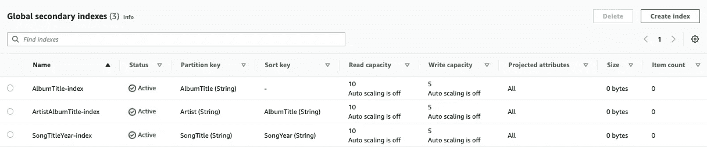

# 按艺术家搜索项目

```
aws dynamodb query \
    --table-name Music \
    --key-condition-expression "Artist = :artist" \
    --expression-attribute-values  '{":artist":{"S":"Iron Maiden"}}'
```

## 结果


# 按艺术家和歌曲名称搜索项目

```
aws dynamodb query \
    --table-name Music \
    --key-condition-expression "Artist = :artist and SongTitle = :title" \
    --expression-attribute-values file://keyconditions.json
```

## 结果

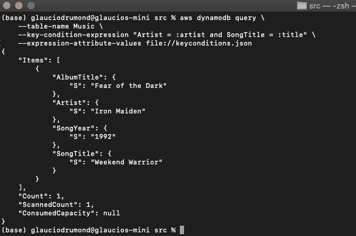

# 根据专辑标题通过二级索引进行搜索

```
aws dynamodb query \
    --table-name Music \
    --index-name AlbumTitle-index \
    --key-condition-expression "AlbumTitle = :name" \
    --expression-attribute-values  '{":name":{"S":"Fear of the Dark"}}'
```

## 结果

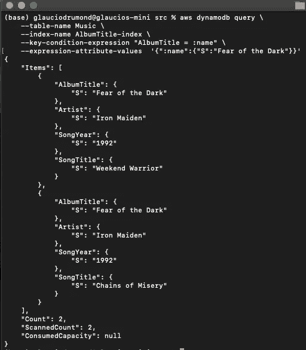

# 基于艺术家姓名和专辑名称的二级索引搜索

```
aws dynamodb query \
    --table-name Music \
    --index-name ArtistAlbumTitle-index \
    --key-condition-expression "Artist = :v_artist and AlbumTitle = :v_title" \
    --expression-attribute-values  '{":v_artist":{"S":"Iron Maiden"},":v_title":{"S":"Fear of the Dark"} }'
```

## 结果

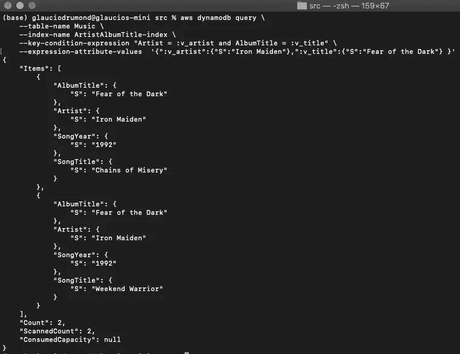

# 根据歌曲名称和年份通过二级索引进行搜索

```
aws dynamodb query \
    --table-name Music \
    --index-name SongTitleYear-index \
    --key-condition-expression "SongTitle = :v_song and SongYear = :v_year" \
    --expression-attribute-values  '{":v_song":{"S":"Wasting Love"},":v_year":{"S":"1992"} }'
```

## 结果

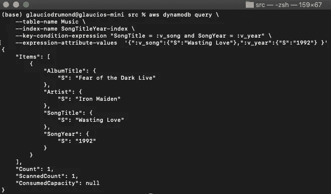

# 结论

这是一个简单的项目，展示了如何使用 DynamoDB 数据库。DynamoDB 是一个快速灵活的数据库。它提供大规模性能，无需管理服务器，并且是企业级的。


[格劳西奥·德拉蒙德](https://www.linkedin.com/in/glauciodrumond/)

【https://www.linkedin.com/in/glauciodrumond/ 