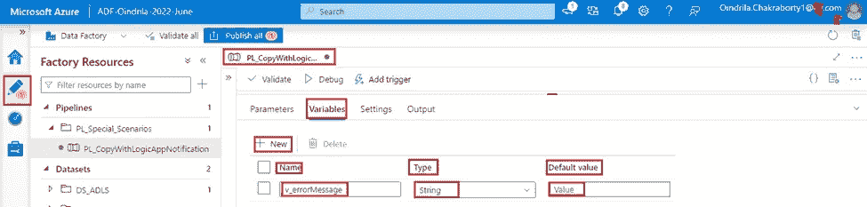

# 使用“Azure Logic App”从 Azure 数据工厂管道发送定制的电子邮件通知

> 原文：<https://blog.devgenius.io/how-to-use-azure-logic-app-to-send-email-notification-from-azure-data-factory-pipelines-c77081bf09ae?source=collection_archive---------2----------------------->

# 先决条件

继续之前，请阅读文章[如何使用 Azure Portal](https://oindrila-chakraborty88.medium.com/create-your-first-azure-logic-app-instance-using-azure-portal-b72fb40ceb77) 创建您的第一个 Azure Logic 应用程序实例。

# 目标

*   ***使用******复制数据******活动******复制*** ***所有******数据*** 从 ***表******销售 LT。产品******的 Azure SQL Server 数据库资源******sqldboindrila 2022 年 6 月*** ，到 ***目录******copy-data-folder/pl-logic-apps-folder***， *下 ***容器******阶段**蔚蓝数据湖存储 Gen2 资源******adlsoindrila 2022 June***【as】***CSV 文件****
*   ****通知****从 ***工作流*** ，在 ***中创建 Azure Logic App 实例******Logic-App-Oindrila-Successful-Mail-2022-6 月*** 。**
*   *****通知****从 ***工作流*** ，在 ***中创建 Azure Logic App 实例******Logic-App-Oindrila-Failure-Mail-2022-6 月******

# **创建两个工作流，使用 Azure Portal 在各自的 Azure Logic 应用实例中发送成功的通知邮件和不成功的通知邮件**

*****虽然******它*** 是 ***可能*** 向 ***发送通知邮件通过******提醒*** 从 ***蔚蓝数据工厂*** ，上 ***成功*** ，或者 ***不成功* 有 ***无******活动******Azure 数据工厂******通过它*** 变成 ***可能*** 向 ***发送通知邮件*** 成功 ******变通方法*** 是将**创建成一个 ***工作流*** 在***Azure Logic App***到 ***发送邮件用******定制************

*******步骤 1*** - ***创建工作流，在 Azure 数据工厂管道*** 中成功完成“复制数据”活动时发送邮件通知-****

*******步骤 1.1 -打开******逻辑 App 设计器******页面**Azure 逻辑 App 资源******逻辑-App-Oindrila-Successful-Mail-2022-6 月*** ， ***向下滚动*******

*****现在， ***点击 ***上的*** 触发 ***类型******当收到一个 HTTP 请求*** 。所以， ***事件*** “即应 ***启动******工作流*** “向*发送邮件通知 ***HTTP 请求*** ”。*********

******

******步骤 1.2***-**-*点击 ***上的【保存】******按钮生成******帖子的网址****， ***哪些*** 需要被 ***使用**Web******活动*** 从 ***管道*** 中 ***Azure 数据工厂*** 到*******

**********

********步骤 1.3***-**-******节******请求男孩 JSON 模式*** ， ***JSON 有效载荷属性*** ***提供*** ，将用于 ***配置******邮件正文 ****点击 ***上的*** 链接******使用示例负载生成模式******显示在*** 下方的 ***部分******请求男孩 JSON 模式*** 。**********

***一旦******弹出*******名称******输入或粘贴一个样本 JSON payload******打开*** ， ***提供*** 下面的 ***JSON Payload 属性**文本框中的*** 到 ***创建******逻辑 App*** 为 ***发送邮件*** 上 ***成功****

> **{
> “状态”:“成功”，
> “管道名称”:“@ {管道()。管道} "，
> " execution time ":" @ { pipeline()。触发时间}"
> }**

****JSON Payload 属性******Pipeline name******execution time******将来自******对应的* ***点击 ***上的*********搞定*** 。***

**

****It*** is ***见过*** 那个***JSON Payload******需要*** 到 ***配置******Email***on***成功完成 ***流水线*** ***点击 ***上的*** 标题****触发******当收到 HTTP 请求时****工作流******折叠********。***

***步骤 1.4***-**-*点击 ***上的******+新步骤******下方显示******触发******

**

****邮件*** 可以是从***GMAIL***【或者， ***任何其他******邮件交换服务器*** 。*****动作******本例中******提供******office 365 outlook*** ***从******显示结果******选择****Office 365 Outlook******选项*** 。*****

****

**现在， ***提供******发送邮件****在 ***文本框中搜索联系人和动作*** ， ***选择******第一个结果显示在******动作******

******

******如果******连接*** 到***Office 365 Outlook******账号*** 是 ***不是已经建立的*** ，一弹出**将 ***打开询问*** 到*****

*******如果******连接*** 到***Office 365 Outlook******account***是 ***已经建立的*** ，则 ***首先******动作*******

********

*******步骤 1.5***-**-*提供*-**以下**-*信息*-**-**-*表单*-**-**-*邮箱*-******

*   *******主题***-**-*****文本框*** 为 ***主题*** ， ***类型******管道执行成功完成*** 。****

********

*   *******到***-*中 ***文本框*** 为 ***到*** ， ***类型******邮箱 id***到 ***发送******邮件通知*** 。 ***每个邮件 ID*** 都应该用***分号******隔开；*** ”。*****

********

*   *******正文***-**-******文本框*** 为 ***正文*** ， ***类型******邮件正文*** 为 ***发送*** 。 ***如果******JSON 有效载荷属性******需要*** 待 ***添加*** 在 ***邮件正文******把*** 光标 放在 ******显示的*** 只是*下面的 ***文本框*** 为 ***正文*** 。
    ***本*** 将 ***打开******弹出*** 旁的 ***平铺*** 为当前*****动作*** 。 ***点击*** 上的 ***动态内容******选项卡*** ， ***类型****名称****必填***** ***一旦******搜索结果*** 被 ***显示在******下方，选择******中想要的一个*** 。***********

**

****邮件正文*** 为 ***显示为******必填*** 如下-*

**

****工作流****发送****邮件通知*** 关于 ***成功完成******管道*** ***看起来*** 像下面这样*

**

****步骤 2 -*** ***创建工作流发送 Azure 数据工厂管道中“复制数据”活动未成功完成的邮件通知-截至目前*** ，有 ***无选项*** 到 ***创建多个******触发器****于是，给 ***发送******邮件通知*** 关于 ***未成功完成*** 的一条 ***管道*** ，一条 ***新的******工作流*** *****其中*** 将 ***生成*** 一个 ***不同的帖子 URL******工作流*** 一个 ***不同的******Azure******逻辑 App*******

*****步骤 2.1 -打开******逻辑 App 设计者******页面******Azure 逻辑 App 资源******逻辑-App-Oindrila-Failure-Mail-2022-6 月*****

> ***{
> “状态”:“故障”，
> “管道名称”:“@ {管道()。管道} "，
> "ExecutionTime": "@{pipeline()。触发时间} "，
> "错误消息":" @ {变量(' v _ 错误消息')}"
> }***

****

*****步骤 2.2***-**-*创建*-**-**-*动作*-**-**-*发送*-**-**-**-**-*Office 365 Outlook*-**-**-*账号*-**-**

********

*******工作流******发送******邮件通知*** 关于 ***失败****管道* ***看起来*** 如下-****

********

# ****创建一个管道，从使用 Azure Portal 在 Azure Data Factory 中创建的管道发送成功的通知邮件和不成功的通知邮件****

*******步骤 1*** - ***创建“复制数据”活动***-**-*打开******Azure 数据工厂资源***"***ADF-Oindrila-2022-6 月*** "。 ***创建*** 一个 ***管道*** ***同******名称******PL _ copywithlogicapnotification***。****

*******步骤 1.1 -创建*** 下面的 ***五个管道参数*** -****

*   ****"***p _ sqldbadminiusername******字符串******类型*** ，以及， ***提供******值******管理员用户名*******
*   *******p _ SQL Password******String******Type***， ***提供******对应密码*** 为 ***提供******Admin 用户名******Azur*******
*   *******p _ SQL query******字符串******类型*** ， ***提供******SELECT * FROM sales lt。产品*** 为 ***默认值*** 。****
*   ****"***p _ adlsContainerName***" of "****Type***， ***提供****"作为 ***的默认值*** 。******
*   ****"***p _ adlsDirectoryName***" of "*"***Type***， ***提供***"***copy-data-folder/pl-logic-apps-folder***"作为 ***的默认值********

********

*******步骤 1.2***-**-*创建*** 管道变量*****v _ error message******字符串******类型*********

************

*********步骤 1.3*****-******活动浏览器*** ， ***搜索******复制数据******活动**活动浏览器*** ， ***拖动**********

************

*********步骤 1.4***-**-******来源******标签*** ， ***选择******数据集*** 到 ***连接**********

*   *********选择******管道参数******p _ sqldbadminausername******数据集参数******param _ admin username***。******
*   *********选择******管道参数******p _ SQL password******数据集参数******param _ password***。******

*********选择******单选按钮******查询*** 对于 ***属性******使用查询*** 。 ***选中******单选按钮*** ，出现 ***文本框******显示*** 为 ***属性******查询*** 。 ***选择******管道参数******p _ SQL Query***对于 ***属性******查询*** 。******

************

*********步骤 1.5***-**-******标签*** ， ***选择******数据集*** 到 ***连接**********

*   *********选择******管道参数******p _ adlsContainerName******数据集参数******param _ container***。******
*   *********选择******管道参数******p _ adlsDirectoryName******数据集参数******param _ directory***。******

************

*********提供******。CSV******文本框中的*** 为 ***属性******文件扩展名******以便******文件*** 即 ***生成了******。csv*** 为 ***的扩展名*** 。******

************

*********步骤 2***-**-*创建“Web”活动发送管道成功执行通知邮件*-**-**-***-***活动浏览器*** ， ***搜索******Web******活动 ****将*** 拖动到 ***设计器窗格中 ***管道******PL _ CopyWithLogicAppNotification****与 ***连接********************

****

*****步骤 2.1***-**-*转*-**到**-*设置*-**-**-*页签*-**-*提供*-**以下**-*信息*-******

*   *****URL -在*****中为***URL******提供******URL******中生成*** 在 ***中触发*** 中的 ***当收到一个 HTTP 请求时*******
*   *******方法***-**-*选择****HTTP 方法选项******POST***从 ***下拉*** 为 ***方法*** ， ***为*********
*   *****头文件***-**-*既然*** ， ***JSON Payload 需要*** 才能从 Azure 数据工厂 中 ***属性******头文件*** ， ***提供******内容-类型*** 在 ***文本框*** 中为 ***名称******应用程序/json*** 在 ***文本框*****
*   *****正文*** - ***选中******下拉选项******发文*** 为 ***属性******方法*** ，一个 ***文本框*** 为 ***显示*** ****文本框*** 为 ***正文*** ， ***JSON 有效载荷属性*** ，其中需要将 ***通过*** 传给 ***逻辑 App******配置*
    ***提供*** 下面的 ***JSON 属性与******对应的值***—*****

> ****{
> “状态”:“成功”，
> “管道名称”:“@ {管道()。管道} "，
> " execution time ":" @ { pipeline()。
> }****

******的 ***值***JSON 有效载荷属性******pipeline name******execution time******将来自******对应的******

******设置******标签**Web******活动*** 到 ***触发******Azure Logic App******实例******Logic-App-Oindrila-Successful *复制数据*******活动*** ***外观*** 如下-***

******

******第三步***-**-*取******错误信息******从******复制数据******活动*** ，***

********步骤 3.1***-**-******活动浏览器*** ， ***搜索******设置变量******活动*** 活动浏览器 ***活动浏览器*** ，并且， ***拖动*** 到 ***设计器窗格**管道******PL _ CopyWithLogicAppNotification***和 ***连接******输出****复制数据***********

********

*******步骤 3.2***-**-*转*-**到**-**变量--**-*标签*-**-*提供*-**-*以下*-**--********

*   *****选择********v _ error message******from******下拉列表*** 为 ***Name*** 。****
*   ******为 ***值******提供******子属性******错误*********

> *******嵌套 JSON 属性******错误。消息*** "是 ***用******检索******错误消息******从任意活动*** 中取出一个****如果******活动失败*** 。*****

**********

********步骤 4***-**-*创建“Web”活动发送管道执行失败通知邮件***-**-**-***活动浏览器*** ， ***搜索******Web******活动* ***将*** 拖动到 ***设计器窗格中**管道******PL _ CopyWithLogicAppNotification****和*连接*******【T93 ********

**********

********步骤 4.1***-**-*转*-*到**-*设置*-**-**-*页签*-**，**-**提供*-**-*信息*-*********

*   *******URL -在*****中为***URL******提供******URL******中生成*** 在 ***中触发*** 中的 ***当收到一个 HTTP 请求时*********
*   *********方法***-**-*选择****HTTP 方法选项******POST***从 ***下拉*** 为 ***方法*** ， ***为***********
*   *******头文件***-**-*既然*** ， ***JSON Payload 需要*** 才能从 Azure 数据工厂 中 ***属性******头文件*** ， ***提供******内容-类型*** 在 ***文本框*** 中为 ***名称******应用程序/json*** 在 ***文本框*******
*   *******正文*** - ***选中******下拉选项******发文*** 为 ***属性******方法*** ，一个 ***文本框*** 为 ***显示*** ****文本框*** 为 ***正文*** ， ***JSON 有效载荷属性*** ，其中需要将 ***通过*** 传给 ***逻辑 App******配置*
    ***提供*** 下面的 ***JSON 属性与******对应的值***—*******

> *****{
> "Status": "Failure "，
> "PipelineName": "@{pipeline()。管道} "，
> " execution time ":" @ { pipeline()。"，
> " error message ":" @ { variables(' v _ error message ')} "
> }*****

********的 ***值***JSON 有效载荷属性******Pipeline name******execution time******将来自******对应的********

*******设置******标签**Web******活动*** 到 ***触发******Azure Logic App******实例******Logic-App-Oindrila-Failure *复制数据*******活动*** ***外观*** 如下-****

********

****最后， ***点击*** 上的 ***发布所有******按钮*** 到 ***发布******创建管道******PL _ copywithlogicapp notification*******

*******第五步***-**-***， ***Azure 数据工厂资源******ADF-Oindrila-2022-6 月*** 难道 ***没有******Blob 存储数据贡献者******访问*** 才能 ***复制数据******活动*** 将 ***失败*** ，并且， ***逐次******设置变量******活动*** 将 ***取*** 将 ***传递******错误消息**到******Web******活动*** 到 ***触发*** 到***Azure Logic App********

**********

********收到邮件通知*** 是——*****

**********