# 如何使用 Azure Synapse Link for SQL🔄

> 原文：<https://blog.devgenius.io/how-to-use-azure-synapse-link-for-sql-2ec8850fa2cd?source=collection_archive---------10----------------------->

Azure Synapse Link 使您能够直接使用 Azure Synapse Analytics 将 Azure SQL 数据库和 SQL Server 2022 等运营数据库链接到实时数据的分析工作负载。

这是一个自动化系统，用于将数据从事务数据库复制到 Azure Synapse Analytics 中的专用 SQL 池。

## Azure Synapse Link 的主要目标是:

这里的目标是避免需要实现 ETL 管道将数据从我的数据库获取到分析空间的常见问题。

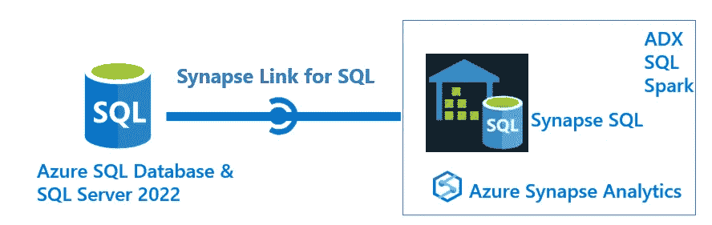

微软学习

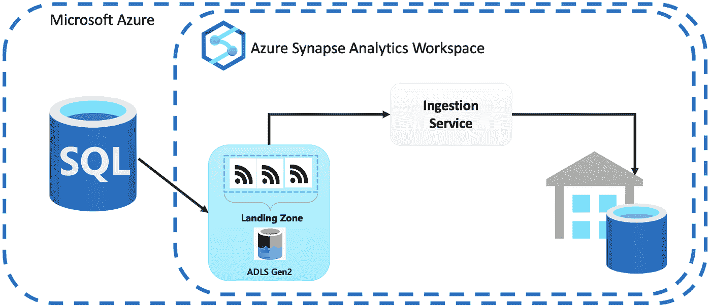

## **它能用在什么地方？**

*   **近实时分析:**初始数据刷新完成后，Azure Synapse Link 会将您的交易数据近实时复制到 Azure Synapse Analytics 中。
*   **低代码解决方案:**提供复制数据的低代码解决方案。不需要构建和管理 ETL 包，只需要复制到哪个表并启动连接。
*   **数据整合:**让您可以轻松地将来自多个运营数据库(基于云的和内部的)的数据整合到一个基于云的分析解决方案中。
*   **对源系统的影响最小:** Azure Synapse Link 使用新的变更馈送处理器，该处理器可以监视变更，并有效地将它们移动到临时着陆区，以便处理到目标专用 SQL 池中，从而最大限度地减少从源系统提取变更的影响，这与 ETL 系统相反，ETL 系统会给操作系统带来额外的负载。

## 要求:

**SQL Server 2022:**

*   Synapse 工作区。
*   将服务链接到数据库源。
*   Azure Synapse Analytics 专用 SQL 池。
*   ADLSv2。
*   连接服务到着陆区。
*   着陆区的 SAS 令牌。
*   自托管 IR。

**Azure SQL 数据库:**

*   Synapse 工作区。
*   将服务链接到数据库源。
*   Azure Synapse Analytics 专用 SQL 池。

**如何链接:**

在这个例子中，我们将链接到一个 Azure SQL 数据库。

1-进入 Synapse 工作区后，创建一个链接到您的源的服务:

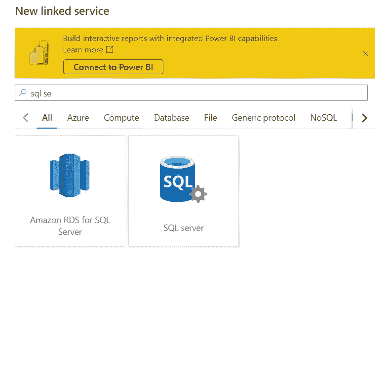

新链接服务

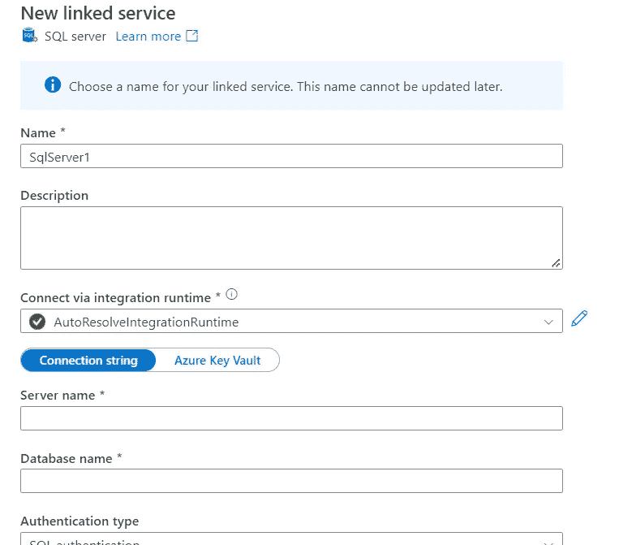

2-创建专用的 SQL 池:

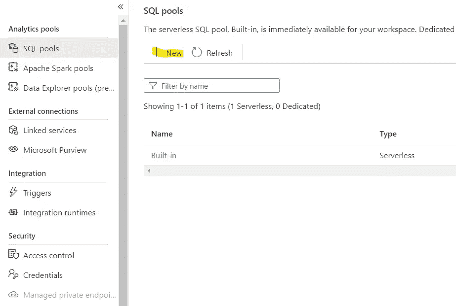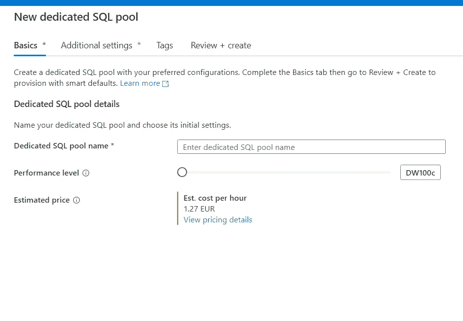

3-现在我们有了链接到 Azure SQL 数据库的所有东西:

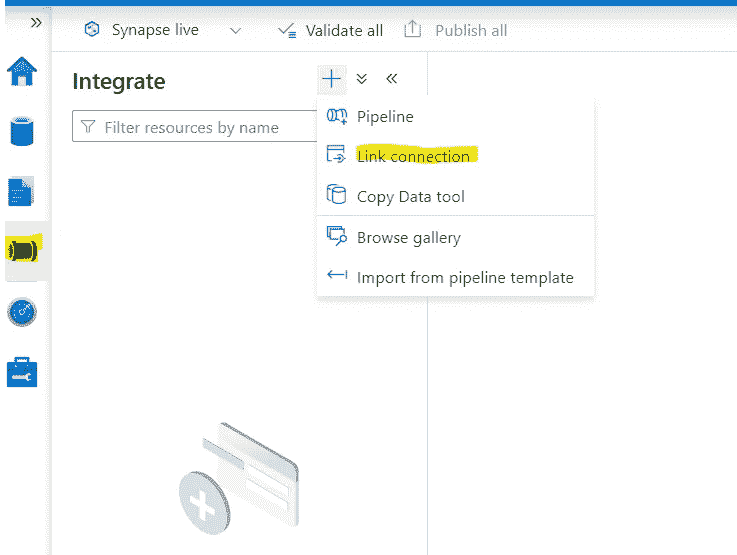

转到管道并点击链接连接

4-选择您创建的链接服务并选择您的元数据:

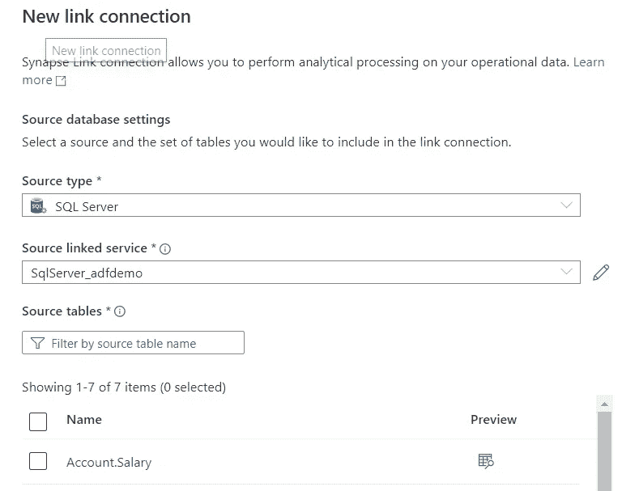

5-接下来，选择您的专用 SQL 池:

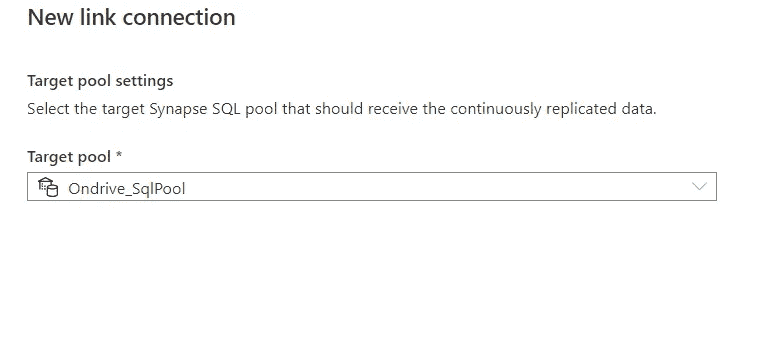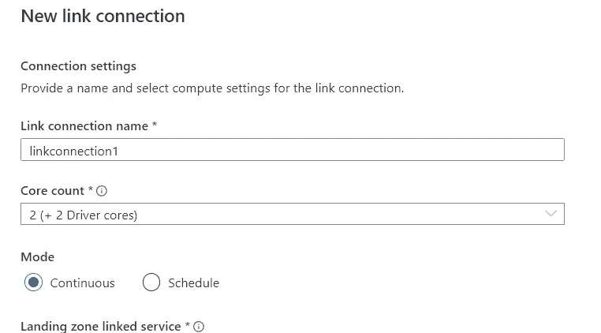

6-对于每个表，您可以定义表名、模式、分布类型和结构类型。

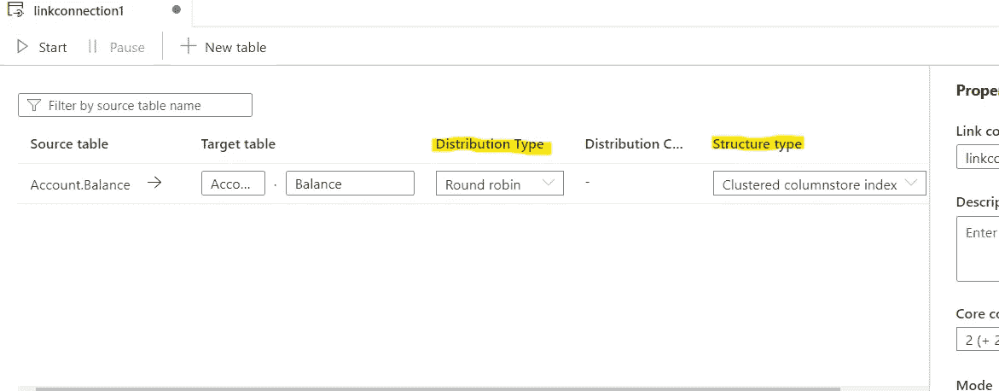

## **如果您尝试链接到本地 SQL Server 2022，您还需要:**

*   Azure 数据湖存储 V2。
*   连接服务到着陆区。
*   自承载集成运行时。

希望你喜欢这个故事，不要忘记订阅，每周通过电子邮件接收它们。

下次见。