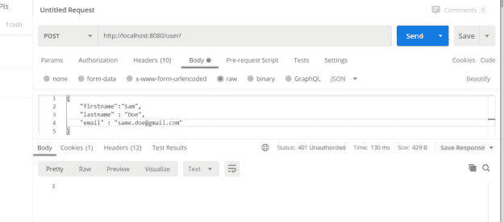
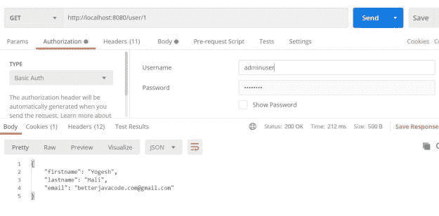
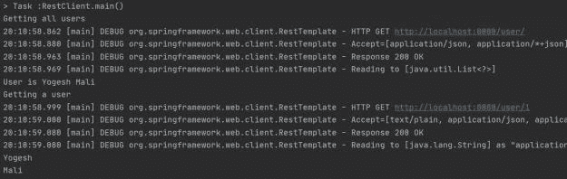

# 如何对 Rest 模板使用基本身份验证

> 原文：<https://blog.devgenius.io/how-to-use-basic-authentication-for-rest-template-8a19e82e2c24?source=collection_archive---------10----------------------->

在这篇文章中，我将展示如何使用 Rest 模板来使用受基本认证保护的 RESTful API。作为这篇文章的一部分，我将展示如何构建一个 REST API，用基本的身份验证来保护它。

# 概观

基本身份验证是可以用来保护 REST API 的机制之一。在我之前的文章中，我展示了如何用 [Json Web Token](https://betterjavacode.com/java/securing-spring-boot-rest-api) 保护 REST API。

# 使用基本身份验证保护 REST API

# 配置一个 REST API

首先，我们将展示一个简单的 REST API 来创建用户或从数据库中检索用户。然后，我们将使用基本的身份验证机制来保护这个 REST API。最后，我们将展示如何使用 Rest 模板的基本认证来调用这个 REST API。

我们为这个 API 创建或检索用户的 REST 控制器类如下所示:

```
package com.betterjavacode.restdemo.controllers;import com.betterjavacode.restdemo.dto.UserDto; 
import com.betterjavacode.restdemo.managers.UserManager; 
import org.springframework.beans.factory.annotation.Autowired; import org.springframework.http.HttpStatus; 
import org.springframework.http.MediaType; 
import org.springframework.http.ResponseEntity; 
import org.springframework.web.bind.annotation.*; 
import java.util.List; @RestController 
public class UserController 
{     @Autowired 
    private UserManager userManager;     @RequestMapping(value = "/user/", method = RequestMethod.GET)
    public ResponseEntity> listAllUsers() 
    { 
       List users = userManager.getAllUsers(); 
       if(users.isEmpty()) 
       { 
           return new ResponseEntity>(HttpStatus.NO_CONTENT); 
       }
       return new ResponseEntity<>(users, HttpStatus.OK); 
    } @RequestMapping(value = "/user/{id}", method = RequestMethod.GET, produces = MediaType.APPLICATION_JSON_VALUE) 
    public ResponseEntity getUser(@PathVariable("id") long id) 
    { 
       UserDto userDto = userManager.getUser(id); 
       if(userDto == null) 
       { 
          return new ResponseEntity<>(HttpStatus.NOT_FOUND); 
       } 
       return new ResponseEntity<>(userDto, HttpStatus.OK); 
    }    @RequestMapping(value = "/user/", method= RequestMethod.POST) 
    public ResponseEntity createUser(@RequestBody UserDto userDto)
    { 
       UserDto user = userManager.createUser(userDto); 
       return new ResponseEntity<>(user, HttpStatus.OK); 
    }     @RequestMapping(value = "/user/{id}", method=RequestMethod.DELETE) 
    public ResponseEntity deleteUser(@PathVariable("id") long id) 
    { 
       UserDto user = userManager.getUser(id); 
       if(user == null) 
       { 
          return new ResponseEntity<>(HttpStatus.NOT_FOUND); 
       } 
       userManager.deleteUser(id); return new ResponseEntity<>(HttpStatus.NO_CONTENT); 
    } 
}
```

我们的用户数据库模型类如下所示:

```
package com.betterjavacode.restdemo.models; import javax.persistence.*; 
import java.io.Serializable; @Entity(name = "User") 
@Table(name = "users") 
public class User implements Serializable 
{    private static final long serialVersionUID = 20200816121023L;
   public User() { }    @Id 
   @GeneratedValue(strategy = GenerationType.IDENTITY) 
   @Column(name="id", nullable=false) 
   private long id;    @Column(name="firstname", length=100) 
   private String firstname;    @Column(name="lastname", length=100) 
   private String lastname;    @Column(name="email", length=100) 
   private String email;    @Column(name="role", length=45) 
   private String role;    @Column(name="enabled") 
   private boolean enabled;    public long getId () { return id; }    public void setId (long id) { this.id = id; } public String getFirstname () { return firstname; }   public void setFirstname (String firstname) 
   { 
     this.firstname = firstname; 
   }    public String getLastname () 
   { 
     return lastname; 
   } 

   public void setLastname (String lastname) 
   { 
     this.lastname = lastname; 
   }    public String getEmail () 
   { 
     return email;  
   }    public void setEmail (String email) 
   { 
     this.email = email; 
   }    public String getRole () 
   { 
     return role; 
   }    public void setRole (String role) 
   { 
     this.role = role; 
   } 

   public boolean isEnabled () 
   { 
     return enabled; 
   }    public void setEnabled (boolean enabled) 
   { 
     this.enabled = enabled; 
   } 
}
```

为了确保我们理解了这一点，我们使用 DTO 对象`UserDto`来创建和检索数据库中的数据。`User`是我们的数据库模型对象。

`UserDto`的对象将如下:

```
package com.betterjavacode.restdemo.dto; import com.betterjavacode.restdemo.models.User; 
import com.fasterxml.jackson.annotation.JsonIgnoreProperties; @JsonIgnoreProperties(ignoreUnknown = true) 
public class UserDto 
{    private String firstname; 
   private String lastname; 
   private String email; 
   public UserDto(){} 
   public UserDto(User user) 
   { 
     this.setEmail(user.getEmail());    
     this.setFirstname(user.getFirstname()); 
     this.setLastname(user.getLastname()); 
   }    public String getFirstname () 
   { 
     return firstname; 
   }    public void setFirstname (String firstname) 
   { 
     this.firstname = firstname; 
   }    public String getLastname () 
   { 
     return lastname; 
   } 

   public void setLastname (String lastname) 
   { 
     this.lastname = lastname; 
   }    public String getEmail () 
   { 
     return email; 
   }    public void setEmail (String email) 
   { 
     this.email = email; 
   }}
```

一旦我们配置了应用程序属性并创建了所需的数据库表，我们将启动应用程序。

现在，如果我们通过像 Postman 这样的客户端执行 API，我们将能够检索或创建用户对象。

目标是保护这个 API。

所以在我们的项目构建中添加`Spring-Security`。

`implementation "org.springframework.boot:spring-boot-starter-security"`

现在，如果我们在主应用程序类中添加注释`@EnableWebSecurity`，如下所示:

```
package com.betterjavacode.restdemo; 
import org.springframework.boot.SpringApplication; 
import org.springframework.boot.autoconfigure.SpringBootApplication; import org.springframework.security.config.annotation.web.configuration.EnableWebSecurity; @SpringBootApplication 
@EnableWebSecurity 
public class RestdemoApplication 
{ 
  public static void main(String[] args) 
  { 
    SpringApplication.run(RestdemoApplication.class, args); 
  } 
}
```

如果我们访问 API 来创建用户，我们将得到如下所示的`401 unauthorized`错误:



# 基本认证

传统上，一旦用户使用身份验证登录，对 REST API 的访问将发生在服务器端。

基本身份验证提供了保护 REST API 的方法之一。与基于 OAuth 或 JWT 的安全性相比，这不是最安全的方式。在基本身份验证中，客户端使用 **HTTP 授权头**在每个请求中发送 **Base64 编码的凭证**。

客户端将在每个请求中发送授权头。即使这些凭据是 Base64 编码的，也总是有可能泄露它们。为了避免这种情况，我们可以使用 HTTPS。

现在从我们的实现角度来看，我们将添加一个`SecurityConfig`类来配置 REST API 的安全性。

```
package com.betterjavacode.restdemo; import org.springframework.beans.factory.annotation.Autowired; import org.springframework.context.annotation.Configuration; 
import org.springframework.security.config.annotation.authentication.builders.AuthenticationManagerBuilder; 
import org.springframework.security.config.annotation.web.builders.HttpSecurity; 
import org.springframework.security.config.annotation.web.configuration.EnableWebSecurity; 
import org.springframework.security.config.annotation.web.configuration.WebSecurityConfigurerAdapter; @Configuration 
@EnableWebSecurity 
public class SecurityConfig extends WebSecurityConfigurerAdapter 
{ 
   @Override 
   protected void configure(HttpSecurity httpSecurity) throws Exception 
   { 
      httpSecurity .csrf().disable() .authorizeRequests().anyRequest().authenticated() .and() .httpBasic(); 
   }     @Autowired 
    public void configureGlobal(AuthenticationManagerBuilder auth) throws Exception 
    { 
       auth.inMemoryAuthentication() .withUser("adminuser") .password("{noop}adminpassword") .roles("USER"); 
     } 
}
```

这个类中的方法将配置基本认证，并且每个到达我们控制器的请求都需要被授权。

`configureGlobal`方法将添加对传入请求的身份验证。来自控制器的请求将针对我们为内存中身份验证配置的这些凭证进行验证。

*警告——这不是保护您的 API 的最安全的方式。肯定不是通过内存中的身份验证。不要在生产中使用它。*

现在，如果我们通过 POSTMAN 执行 REST API，我们将看到如下成功响应:



# 带有基本认证示例的 Rest 模板

最初，我们使用 POSTMAN 作为客户端来调用我们的 REST APIs。但是在真实的场景中，我们不会使用 POSTMAN，您将必须以编程方式调用这些 API。

我们将创建一个类`RestClient`，它将在构建基本认证时调用我们的 API。

使用 Spring Boot 提供的`RestTemplate`时，你需要用一个`RequestEntity`通过`HttpHeaders`。

```
private static HttpHeaders getHeaders () 
{ 
   String adminuserCredentials = "adminuser:adminpassword"; 
   String encodedCredentials = new String(Base64.encodeBase64(adminuserCredentials.getBytes())); 
   HttpHeaders httpHeaders = new HttpHeaders();   
   httpHeaders.add("Authorization", "Basic " + encodedCredentials); 
   httpHeaders.setAccept(Arrays.asList(MediaType.APPLICATION_JSON)); 
   return httpHeaders; 
}
```

我们使用来自`RestTemplate`的`exchange`方法来调用包含基本认证的 API 和`HttpHeaders`。

整个班级`RestClient`将会如下图所示:

```
package com.betterjavacode.restdemo; import com.betterjavacode.restdemo.dto.UserDto; 
import org.apache.tomcat.util.codec.binary.Base64; 
import org.json.JSONObject; 
import org.springframework.http.*; 
import org.springframework.web.client.RestTemplate; 
import java.util.Arrays; 
import java.util.LinkedHashMap; 
import java.util.List; public class RestClient 
{ 
   public static final String REST_SERVICE_URL = "http://localhost:8080/user/"; 
   private static HttpHeaders getHeaders () 
   { 
      String adminuserCredentials = "adminuser:adminpassword"; 
     String encodedCredentials = new String(Base64.encodeBase64(adminuserCredentials.getBytes())); 
     HttpHeaders httpHeaders = new HttpHeaders(); 
     httpHeaders.add("Authorization", "Basic " + encodedCredentials); 
   httpHeaders.setAccept(Arrays.asList(MediaType.APPLICATION_JSON)); 
     return httpHeaders; 
   } 
   private static void listAllUsers() 
   { 
     System.out.println("Getting all users"); 
     RestTemplate restTemplate = new RestTemplate(); 
     HttpHeaders httpHeaders = getHeaders(); 
     HttpEntity httpEntity = new HttpEntity<>(httpHeaders);
     ResponseEntity responseEntity = restTemplate.exchange(REST_SERVICE_URL, HttpMethod.GET, httpEntity, List.class); 
     if(responseEntity.hasBody()) 
     { 
        List users = responseEntity.getBody(); 
        if(users != null) 
        { 
           for(LinkedHashMap userMap: users) 
           { 
              System.out.println("User is " + userMap.get("firstname") + " " + userMap.get( "lastname")); 
           } 
        } 
      } 
      else 
      { 
        System.out.println("User not found"); 
      } 
    } 
    public static void main (String[] args) 
    { 
      listAllUsers(); getUser(1); 
    } 
    private static void getUser(long id) 
    { 
      System.out.println("Getting a user "); 
      String restUrl = REST_SERVICE_URL + id; 
      RestTemplate restTemplate = new RestTemplate(); 
      HttpHeaders httpHeaders = getHeaders(); 
      HttpEntity httpEntity = new HttpEntity<>(httpHeaders); 
      ResponseEntity responseEntity = restTemplate.exchange(restUrl, HttpMethod.GET, httpEntity, String.class); 
      if(responseEntity.hasBody()) 
      { 
        JSONObject jsonObject = new JSONObject(responseEntity.getBody()); 
        System.out.println(jsonObject.get("firstname")); 
        System.out.println(jsonObject.get("lastname")); 
      } 
      else 
      { 
        System.out.println("User not found"); 
      } 
    } 
}
```

现在，如果我们执行该程序，我们将看到如下输出:



在这篇文章中，我们展示了如何使用基本认证来保护 REST API。如果你喜欢这篇文章，在这里订阅我的博客。

你想知道春季安全的根本吗？我将很快推出我的新书“简化 Spring 安全”。进入我的发布列表以获取更新和折扣代码。

# 参考

1.  弹簧座模板— [文档](https://docs.spring.io/spring/docs/current/javadoc-api/org/springframework/web/client/RestTemplate.html)
2.  Spring Boot 休息模板— [用途](https://www.tutorialspoint.com/spring_boot/spring_boot_rest_template.htm)

*原载于 2020 年 8 月 17 日 https://betterjavacode.com**的* [*。*](https://betterjavacode.com/programming/how-to-use-basic-authentication-for-rest-template)