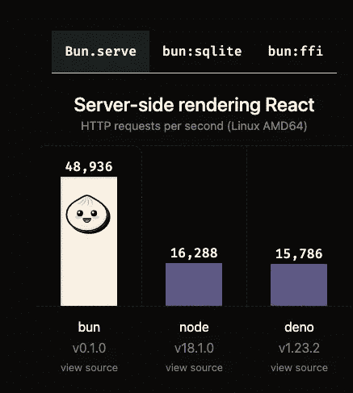
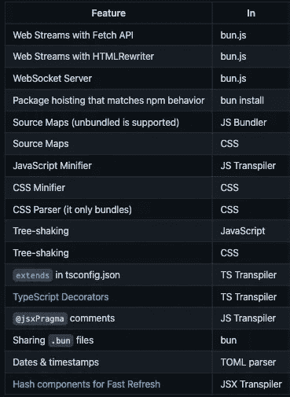
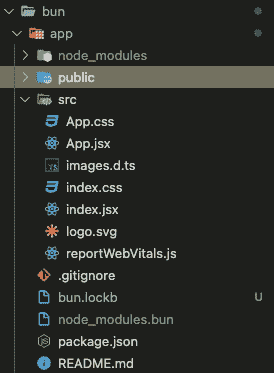
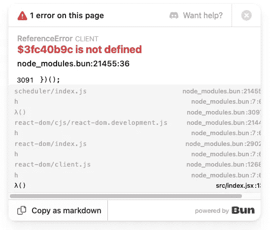

# 如何使用发髻

> 原文：<https://blog.devgenius.io/how-to-use-bun-88933cd513e?source=collection_archive---------0----------------------->


图片来自[https://bun.sh/](https://bun.sh/)

# 目的

当我与一位同事谈论某个模块捆绑器时，我们也与 Bun 进行了交谈。虽然 create-react-app 很有用，但是捆绑时间很长。最近我使用 vite 作为 vue.js 的笨拙工具，它比 create-react-app 快得多，我发现 Bun 可以开发得更快。

# Bun 是什么？

正如本文的上图所示，Bun 是 Jarred Summer 开发的快速一体化 JavaScript 运行时。这个运行时使用苹果(Safari，iOS)使用的 JavascriptCore，而不是 Javascript V8 引擎驱动谷歌 Chrome。由于 Zig 是一种带手动内存管理的低级编程语言，这个运行时比 Node 或 Deno 运行得更快。如下图所示。注意:这个结果可能取决于运行的函数，所以应该自己尝试。但是通常这个运行时间比其他的要快。



开发服务器部分的等待时间有点无聊，所以渲染速度对顺利开发相当重要。此外，正如我在目的部分提到的 Vite，Bun 比 Bun 更重要。这个运行时有 TS transpiler，用作 yarn 和 npm 之类的包管理器，用作任务运行器，默认。env 加载(不再需要 dotenv)，默认 SQlite 客户端。甚至包安装时间更快。这正是我们所需要的一切。

是的，这个运行时非常有用。但是，没有弊端？是的，它有一些。

首先，这个运行时是由一个人开发的(正如我已经提到的 Jarred Summer 先生)。这是相当聪明的，因为他能迅速创造出理想的。相反，如果他失去了开发这个运行时的热情(或者转而对不同的东西感兴趣)，这个运行时就不再维护并停止开发。这可能是缺点，如果你想切换整个项目到 Bun。

第二，这个运行时和 Deno 相比目前还不能兼容 Node.js。如果这个运行时间作为一个初学者工具包，这不是一个大问题。但是目前的情况下，有很多项目都是用 Node.js 的，所以如果要用 Bun 的话，这个就要换掉。这可能是一个问题。此外，由于这个运行时还处于早期阶段(测试版)，所以还有一些特性没有实现。我附上了一份官方网站的列表。如果你想把这个运行时和一些框架一起使用，比如 next.js，remix，你需要检查一下 [READ。我](http://READ.ME)和路线图。

## 尚未实施列表



好了，关于概念就提到这点就够了。让我们举个例子。

# 例子

## 步骤

1.  安装 Bun

```
> curl [https://bun.sh/install](https://bun.sh/install) | bash
```

2.在路径文件中添加文件路径

```
> vim ~/.zshrc  // you can use your text editor export PATH="/Users/owner/.bun/bin:$PATH"  // add this line your setting path file > source ~/.zshrc // confirm path > bun --version
0.1.4 // If you successfully installed bun and set path, the version would be here
```

3.像 npm 一样使用“bun run”来运行一些代码。下面是 http 服务器的例子。

```
// http.js export default {
  port: 3000,
  fetch(request) {
    return new Response("Welcome to Bun!");
  },
};
```

如果您访问 localhost:3000，您可以看到句子“欢迎使用 Bun！”


因为我想使用 react，所以我尝试用 React 创建一个新项目。

# react 示例

## 步骤

1.  用下面的命令创建一个项目

```
bun create react ./app   // This is your app name
```

您可以看到生成的项目如下所示。这类似于使用 create-react-app 生成项目，但这比 CRA 快得多(我感觉至少快 10 倍)。



2.运行您的应用

```
> cd app
> bun dev
```

但它对我不起作用，我得到了如下所示的错误。



要修复它，你需要在你的控制台上运行下面的命令(这是来自 discord 的信息)

```
bun bun ./src/index.jsx
```

3.再次运行你的应用程序，它现在工作。

```
bun dev
```

错误已经消失，您可以看到下面的屏幕。


# 结论

正如我已经提到的，这个运行时是一体化的，非常有用，尽管与 Node 相比没有创新的特性。换句话说，这个运行时没有陡峭的学习曲线，很容易熟悉。

# 参考

官方网站:[https://bun.sh/](https://bun.sh/)

github:【https://github.com/oven-sh/bun#Reference 

用 Bun 创建 react app:[https://dev . to/ashirbadgudu/create-a-react-app-with-Bun-125 o](https://dev.to/ashirbadgudu/create-a-react-app-with-bun-125o)

速くてAll in OneなJavaScriptランタイム「Bun」: [https://dev.classmethod.jp/articles/bun/](https://dev.classmethod.jp/articles/bun/)

感谢您的阅读！！