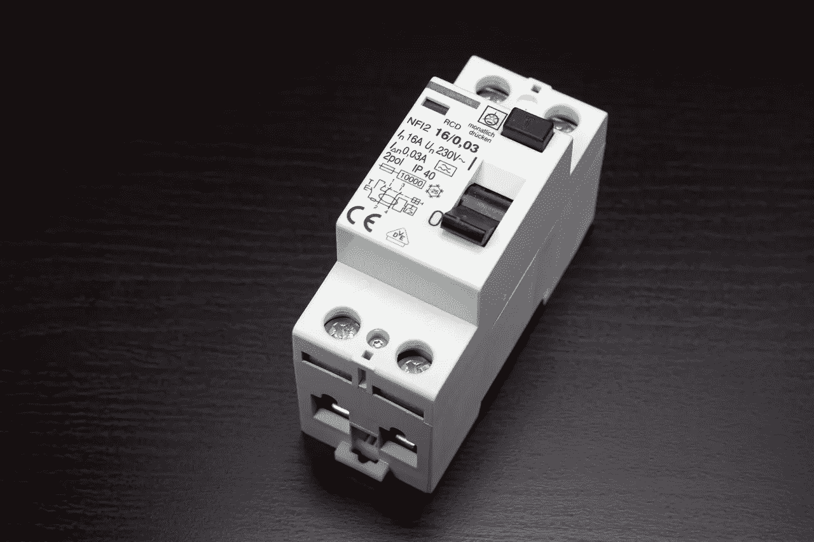
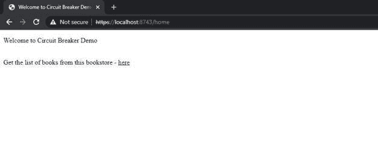
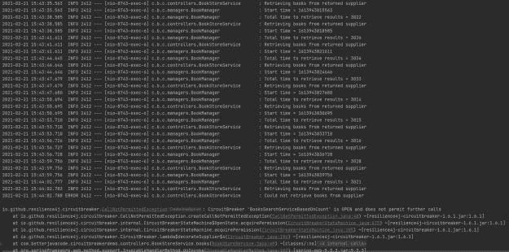
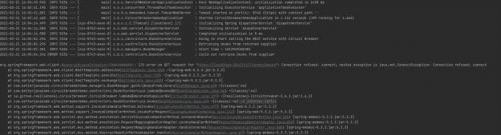
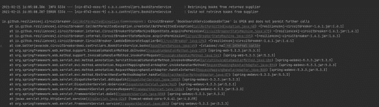

# 如何在 Spring Boot 应用中使用断路器

> 原文：<https://blog.devgenius.io/how-to-use-circuit-breaker-in-spring-boot-application-3803d31a9d60?source=collection_archive---------1----------------------->



图片来自 Pixabay，作者 Jürgen Diermaier

在这篇文章中，我将展示如何在 Spring Boot 应用程序中使用断路器模式。当我说断路器模式时，它是一个架构模式。网飞出版了一个处理断路器的 Hysterix 库。作为这篇文章的一部分，我将展示如何在 Spring Boot 应用程序中使用**resile 4j**库来使用断路器模式。

另外，我最近出版了我的书[简化春季安全](https://betterjavacode.com/programming/simplifying-spring-security)。有兴趣了解弹簧安全的，可以在这里购买[。](https://gum.co/VgSdH)

# 什么是断路器？

断路器的概念来自电气工程。在大多数电力网络中，断路器是保护网络免受电流过载或短路造成的损害的开关。

类似地，在软件中，如果我们知道对远程服务的调用将失败或超时，断路器会停止对该远程服务的调用。这样做的好处是节省资源，并且在我们对远程过程调用进行故障诊断时更加主动。

断路器基于呼叫的先前历史做出停止呼叫的决定。但是有其他的方法来处理这些电话。通常，它会跟踪以前的呼叫。假设 5 次调用中有 4 次失败或超时，那么下一次调用将失败。这有助于更主动地处理调用服务的错误，调用服务可以用不同的方式处理响应，使用户体验到与错误页面不同的应用程序。

如果在特定持续时间内对远程服务的调用失败，断路器可以采取的另一种方式。断路器将打开，并且不允许下一次呼叫，直到远程服务改善错误。

# Resilience4J 库

我们有调用远程服务的代码。来自`resilience4j`库的断路器模块将有一个用于调用远程服务的 lambda 表达式或一个用于从远程服务调用中检索值的`supplier`。我将作为示例的一部分展示这一点。断路器以这样一种方式装饰这个远程服务调用，以便它能够跟踪响应和开关状态。

# Resilience4j 库的不同配置

为了理解断路器的概念，我们将看看这个库提供的不同配置。

`slidingWindowType()` -这种配置基本上有助于决定断路器将如何操作。有两种类型`COUNT_BASED`和`TIME_BASED`。`COUNT_BASED`断路器滑动窗口将考虑远程服务的调用次数，而`TIME_BASED`断路器滑动窗口将考虑某一时间段内远程服务的调用次数。

`failureRateThreshold()` -以百分比为单位配置故障率阈值。如果 x %的呼叫失败，那么断路器将打开。

`slidingWindowSize()` -该设置有助于决定闭合断路器时要考虑的呼叫数量。

`slowCallRateThreshold()` -以百分比为单位配置慢速呼叫速率阈值。如果百分之 x 的通话很慢，那么断路器就会打开。

`slowCallDurationThreshold` -被视为慢速呼叫的持续时间阈值。

`minimumNumberOfCalls()` -断路器计算错误率之前所需的最少呼叫次数。

`ignoreException()` -该设置允许您配置一个断路器可以忽略的异常，并且不计入远程服务调用的成功或失败。

`waitDurationInOpenState()` -在转换到半开状态之前，断路器应保持打开状态的持续时间。默认值为 60 秒。

# 基于计数的断路器

使用`resilience4j`库时，用户可以始终使用断路器提供的默认配置。默认配置基于基于计数的滑动窗口类型。

那么我们如何为基于计数的滑动窗口类型创建断路器呢？

```
CircuitBreakerConfig circuitBreakerConfig = CircuitBreakerConfig.custom() .slidingWindowType(CircuitBreakerConfig.SlidingWindowType.COUNT_BASED) .slidingWindowSize(10) .slowCallRateThreshold(65.0f) .slowCallDurationThreshold(Duration.ofSeconds(3)) .build(); CircuitBreakerRegistry circuitBreakerRegistry = CircuitBreakerRegistry.of(circuitBreakerConfig); CircuitBreaker cb = circuitBreakerRegistry.circuitBreaker("BooksSearchServiceBasedOnCount");
```

在上述示例中，我们正在创建一个断路器配置，其中包括类型为`COUNT_BASED`的滑动窗口。该断路器将记录 10 次呼叫的结果，以将断路器切换到`closed`状态。如果 65%的呼叫缓慢，且持续时间超过 3 秒，断路器将断开。

`CircuitBreakerRegistry`是一家制造断路器的工厂。

# 基于时间的断路器

现在接通`Time-Based`断路器。

```
CircuitBreakerConfig circuitBreakerConfig = CircuitBreakerConfig.custom() .slidingWindowType(CircuitBreakerConfig.SlidingWindowType.TIME_BASED) .minimumNumberOfCalls(3) .slidingWindowSize(10) .failureRateThreshold(70.0f) .build(); CircuitBreakerRegistry circuitBreakerRegistry = CircuitBreakerRegistry.of(circuitBreakerConfig); CircuitBreaker cb = circuitBreakerRegistry.circuitBreaker("BookSearchServiceBasedOnTime");
```

在上面的例子中，我们正在创建一个断路器配置，它包括一个类型为`TIME_BASED`的滑动窗口。断路器将在至少 3 次呼叫后记录呼叫失败。如果 70%的呼叫失败，断路器将打开。

# Spring Boot 应用中的断路器示例

我们已经介绍了断路器的必要概念。现在，我将展示我们可以在 Spring Boot 应用中使用断路器。

一方面，我们有一个 REST 应用程序`BooksApplication`，它主要存储图书馆书籍的详细信息。另一方面，我们有一个应用程序`Circuitbreakerdemo`，它使用`RestTemplate`调用 REST 应用程序。我们将通过断路器装饰我们的休息呼叫。

`BooksApplication`在 MySQL 数据库表`librarybooks`中存储关于书籍的信息。这个应用程序的 REST 控制器有`GET`和`POST`方法。

```
package com.betterjavacode.books.controllers;

import com.betterjavacode.books.daos.BookDao;
import com.betterjavacode.books.models.Book;
import org.springframework.beans.factory.annotation.Autowired;
import org.springframework.http.HttpStatus;
import org.springframework.http.ResponseEntity;
import org.springframework.web.bind.annotation.*;

import java.util.ArrayList;
import java.util.List;
import java.util.Optional;

@CrossOrigin("https://localhost:8443")
@RestController
@RequestMapping("/v1/library")
public class BookController
{
    @Autowired
    BookDao bookDao;

    @GetMapping("/books")
    public ResponseEntity<List<Book>> getAllBooks(@RequestParam(required = false) String bookTitle)
    {
        try
        {
            List<Book> listOfBooks = new ArrayList<>();
            if(bookTitle == null || bookTitle.isEmpty())
            {
                bookDao.findAll().forEach(listOfBooks::add);
            }
            else
            {
                bookDao.findByTitleContaining(bookTitle).forEach(listOfBooks::add);
            }

            if(listOfBooks.isEmpty())
            {
                return new ResponseEntity<>(HttpStatus.*NO_CONTENT*);
            }

            return new ResponseEntity<>(listOfBooks, HttpStatus.*OK*);
        }
        catch (Exception e)
        {
            return new ResponseEntity<>(null, HttpStatus.*INTERNAL_SERVER_ERROR*);
        }
    }

    @GetMapping("/books/{id}")
    public ResponseEntity<Book> getBookById(@PathVariable("id") long id)
    {
        try
        {
            Optional<Book> bookOptional = bookDao.findById(id);

            return new ResponseEntity<>(bookOptional.get(), HttpStatus.*OK*);
        }
        catch (Exception e)
        {
            return new ResponseEntity<>(null, HttpStatus.*INTERNAL_SERVER_ERROR*);
        }
    }

    @PostMapping("/books")
    public ResponseEntity<Book> addABookToLibrary(@RequestBody Book book)
    {
        try
        {
            Book createdBook = bookDao.save(new Book(book.getTitle(), book.getAuthor(),
                    book.getIsbn()));
            return new ResponseEntity<>(createdBook, HttpStatus.*CREATED*);
        }
        catch (Exception e)
        {
            return new ResponseEntity<>(null, HttpStatus.*INTERNAL_SERVER_ERROR*);
        }
    }

    @PutMapping("/books/{id}")
    public ResponseEntity<Book> updateABook(@PathVariable("id") long id, @RequestBody Book book)
    {
        Optional<Book> bookOptional = bookDao.findById(id);

        if(bookOptional.isPresent())
        {
            Book updatedBook = bookOptional.get();
            updatedBook.setTitle(book.getTitle());
            updatedBook.setAuthor(book.getAuthor());
            updatedBook.setIsbn(book.getIsbn());
            return new ResponseEntity<>(bookDao.save(updatedBook), HttpStatus.*OK*);
        }
        else
        {
            return new ResponseEntity<>(HttpStatus.*NOT_FOUND*);
        }
    }

    @DeleteMapping("/books/{id}")
    public ResponseEntity<HttpStatus> deleteABook(@PathVariable("id") long id)
    {
        try
        {
            bookDao.deleteById(id);
            return new ResponseEntity<>(HttpStatus.*NO_CONTENT*);
        }
        catch (Exception e)
        {
            return new ResponseEntity<>(HttpStatus.*INTERNAL_SERVER_ERROR*);
        }
    }
}
```

另一方面，我们的应用程序`Circuitbreakerdemo`有一个带有百里香模板的控制器，因此用户可以在浏览器中访问应用程序。

出于演示的目的，我在一个单独的 bean 中定义了 CircuitBreaker，我将在我的服务类中使用它。

```
@Bean
public CircuitBreaker countCircuitBreaker()
{
    CircuitBreakerConfig circuitBreakerConfig = CircuitBreakerConfig.*custom*()
            .slidingWindowType(CircuitBreakerConfig.SlidingWindowType.*COUNT_BASED*)
            .slidingWindowSize(10)
            .slowCallRateThreshold(65.0f)
            .slowCallDurationThreshold(Duration.*ofSeconds*(3))
            .build();

    CircuitBreakerRegistry circuitBreakerRegistry =
            CircuitBreakerRegistry.*of*(circuitBreakerConfig);

    CircuitBreaker cb = circuitBreakerRegistry.circuitBreaker("BooksSearchServiceBasedOnCount");

    return cb;
}

@Bean
public CircuitBreaker timeCircuitBreaker()
{
    CircuitBreakerConfig circuitBreakerConfig = CircuitBreakerConfig.*custom*()
            .slidingWindowType(CircuitBreakerConfig.SlidingWindowType.*TIME_BASED*)
            .minimumNumberOfCalls(3)
            .slidingWindowSize(10)
            .failureRateThreshold(70.0f)
            .waitDurationInOpenState(Duration.*ofSeconds*(10))
            .build();

    CircuitBreakerRegistry circuitBreakerRegistry =
            CircuitBreakerRegistry.*of*(circuitBreakerConfig);

    CircuitBreaker cb = circuitBreakerRegistry.circuitBreaker("BookSearchServiceBasedOnTime");
    return cb;
}
```

我定义了两个 beans，一个用于基于计数的断路器，另一个用于基于时间的断路器。

`BookStoreService`将包含一个调用图书应用程序并显示可用的图书。该服务将如下所示:

```
@Controller
public class BookStoreService
{

    private static final Logger *LOGGER* = LoggerFactory.*getLogger*(BookStoreService.class);

    @Autowired
    public BookManager bookManager;

    @Autowired
    private CircuitBreaker timeCircuitBreaker;

    @RequestMapping(value = "/home", method= RequestMethod.*GET*)
    public String home(HttpServletRequest request, Model model)
    {
        return "home";
    }

    @RequestMapping(value = "/books", method=RequestMethod.*GET*)
    public String books(HttpServletRequest request, Model model)
    {
        Supplier<List<Book>> booksSupplier =
                timeCircuitBreaker.decorateSupplier(() -> bookManager.getAllBooksFromLibrary());

        *LOGGER*.info("Going to start calling the REST service with Circuit Breaker");
        List<Book> books = null;
        for(int i = 0; i < 15; i++)
        {
            try
            {
                *LOGGER*.info("Retrieving books from returned supplier");
                books = booksSupplier.get();
            }
            catch(Exception e)
            {
                *LOGGER*.error("Could not retrieve books from supplier", e);
            }
        }
        model.addAttribute("books", books);

        return "books";
    }
}
```

所以当用户点击图书页面时，我们从 BooksApplication REST 服务中检索图书。

我已经为`countCircuitBreaker`自动绑定了 bean。出于演示的目的——我将在一个循环中调用 REST 服务 15 次来获取所有的书。这样，我可以在我的 REST 服务端模拟中断。

我们的断路器装饰了一个对远程服务进行 REST 调用的供应商，该供应商存储了我们的远程服务调用的结果。

在这个演示中，我们以顺序方式调用 REST 服务，但是远程服务调用也可以并行发生。断路器仍将跟踪结果，不管是顺序调用还是并行调用。

# 演示

现在，我们来看看断路器在现场演示中将如何工作。我的 REST 服务在端口 8443 上运行，我的`Circuitbreakerdemo`应用程序在端口 8743 上运行。

最初，我启动这两个应用程序并访问`Circuitbreakerdemo`应用程序的主页。主页包含查看书店所有书籍的链接。



现在为了模拟一些错误，我在我的 RestTemplate 调用中添加了以下代码，该调用在返回 REST 调用的结果之前基本上会休眠 3 秒钟。

```
public List<Book> getAllBooksFromLibrary ()
{
    HttpHeaders httpHeaders = new HttpHeaders();
    httpHeaders.setContentType(MediaType.*APPLICATION_JSON*);

    ResponseEntity<List<Book>> responseEntity;
    long startTime = System.*currentTimeMillis*();
    *LOGGER*.info("Start time = {}", startTime);
    try
    {
        responseEntity= restTemplate.exchange(buildUrl(),
                HttpMethod.*GET*, null, new ParameterizedTypeReference<List<Book>>()
                {});
        if(responseEntity != null && responseEntity.hasBody())
        {
            *LOGGER*.info("Total time to retrieve results = {}",
                    System.*currentTimeMillis*() - startTime);
            return responseEntity.getBody();
        }
    }
    catch (URISyntaxException e)
    {
        *LOGGER*.error("URI has a wrong syntax", e);
    }

    *LOGGER*.info("No result found, returning an empty list");
    return new ArrayList<>();
}
```

简而言之，我的断路器循环将调用服务足够多次，超过持续时间超过 3 秒的缓慢调用的 65%的阈值。一旦我点击了`here`的链接，我将会收到结果，但是我的断路器将会打开，并且在它处于`half-open`状态或者`closed`状态之前不允许将来的呼叫。



你会注意到，当断路器处于`OPEN`状态时，我们开始得到一个异常`CallNotPermittedException`。此外，在拨打 10 个电话时，断路器是断开的。这是因为我们的滑动窗口大小是 10。

另一种方法是，我可以通过关闭 REST 服务或数据库服务来模拟错误。这样，REST 调用可能会比需要的时间长。

现在，让我们将`COUNT_BASED`断路器切换到`TIME_BASED`断路器。在`TIME_BASED`断路器中，我们将在一秒钟后关闭我们的 REST 服务，然后我们将从主页点击`here`链接。如果最后 10 秒钟内 70%的呼叫失败，我们的断路器将会打开。

由于 REST 服务已关闭，我们将在`Circuitbreakdemo`应用程序中看到以下错误



我们将看到断路器处于`OPEN`状态之前的错误数量。



一种配置是，我们可以随时添加我们希望断路器保持断开状态的时间。对于演示，我添加了断路器将处于打开状态 10 秒钟。

# 如何处理断路开关？

一个问题出现了，你如何处理断路开关？幸运的是，`resilience4j`提供了一个带有`Decorators`实用程序的后备配置。在大多数情况下，您总是可以配置它以从以前的成功结果中获取结果，这样用户仍然可以使用该应用程序。

# 结论

在这篇文章中，我介绍了如何在 Spring Boot 应用中使用断路器。此演示的代码可从[这里](https://github.com/yogsma/circuitbreakerdemo)获得。

在本演示中，我没有介绍如何监控这些断路器事件，因为`resilience4j`该库允许存储这些带有指标的事件，用户可以使用监控系统进行监控。

如果你喜欢这篇文章，可以考虑在这里订阅我的博客。

*原载于 2021 年 2 月 21 日*[*【https://betterjavacode.com】*](https://betterjavacode.com/spring-boot/how-to-use-circuit-breaker-in-spring-boot-application)*。*