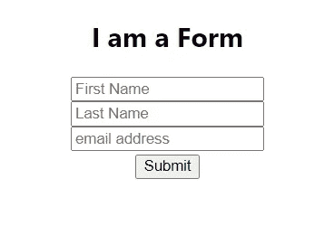
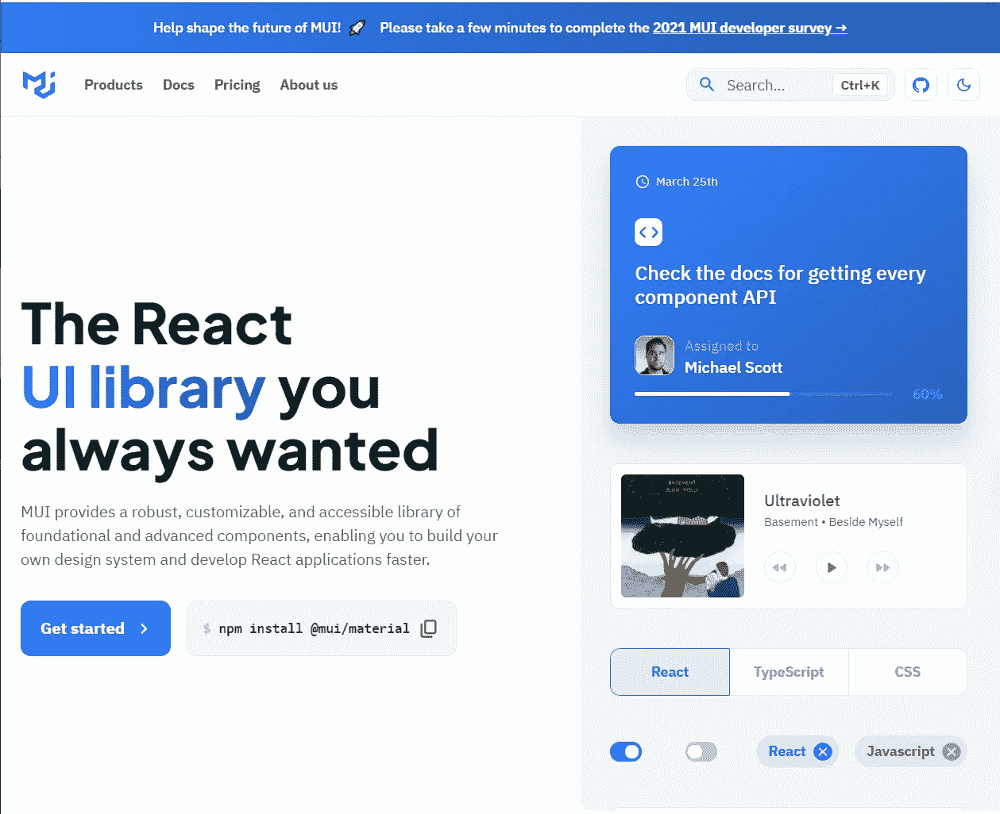
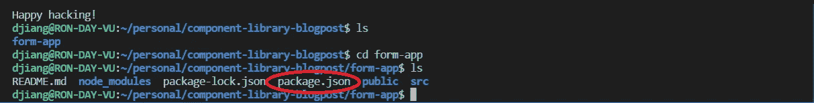
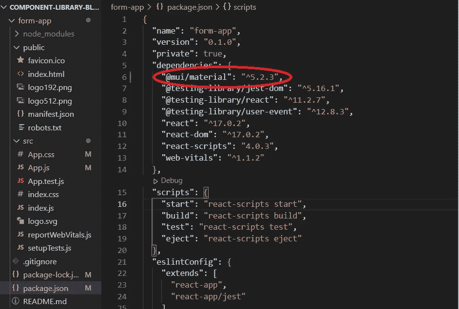
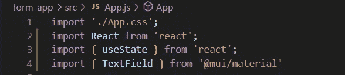
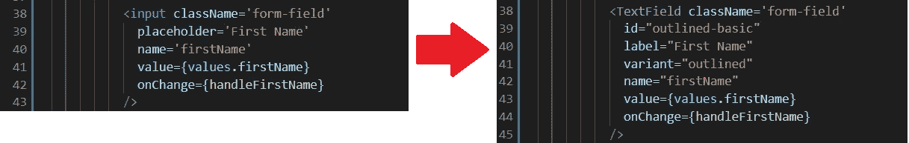
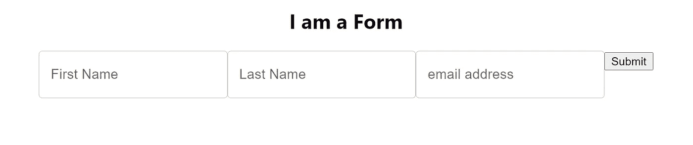
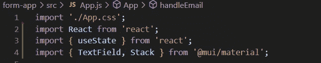
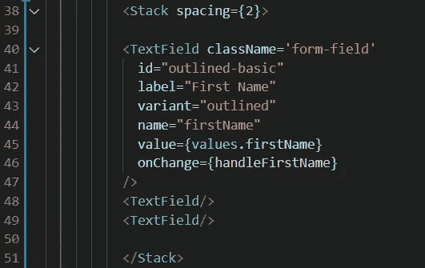
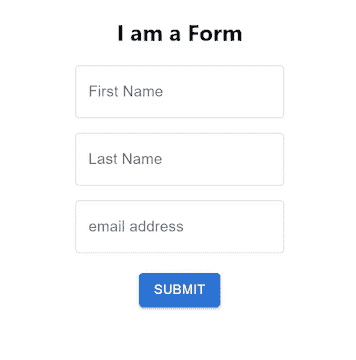

# 如何在下一个 React 项目中使用组件库

> 原文：<https://blog.devgenius.io/how-to-use-component-libraries-on-your-next-react-project-ba9cc996cfb4?source=collection_archive---------5----------------------->

如果你以前曾经尝试过前端 web 开发，你可能会对设计页面和创建网站布局感到沮丧。也许你已经开始学习 [React](https://reactjs.org/) 和一点点 [CSS](https://www.w3schools.com/w3css/default.asp) 并且意识到你已经把圆形边缘、图标和动画效果视为理所当然。谁会想到创建干净、视觉上吸引人的网页设计会如此复杂！

在这篇文章中，我将介绍如何使用*组件库*来毫不费力地创建简单而漂亮的设计，不需要 CSS 知识。

嗯…也许一点 CSS。


永远不要低估 CSS 的力量！看看这个惊人的 [AT-AT Walker](https://codepen.io/r4ms3s/pen/gajVBG) 动画，完全由 [Petr Urbánek](https://medium.com/u/4f323ad738b7?source=post_page-----ba9cc996cfb4--------------------------------) 用 CSS 创建

# 什么是组件库？

UI ( *用户界面*)组件库是一个单独的存储库或文件夹，其中包含一组可重用的组件，这些组件充当应用程序设计的构建块。UI 组件可以包括按钮、输入字段、图标、文本样式等。如果你正在设计一个应用程序，你应该担心设计的一致性，所以使用一个预先安装的设计元素库可以确保你的设计在整个应用程序中保持一致。此外，如果你在概念化布局设计方面有困难，或者对 CSS 和 Javascript 不熟悉，利用组件库是一个有效的解决方案。

现在你已经理解了什么是组件库，让我们带你使用你的第一个组件库吧！

** *请注意，本教程适用于安装了* [*节点包管理器*](https://docs.npmjs.com/downloading-and-installing-node-js-and-npm) *的计算机。请参考 MUI 的安装指南，了解针对您的特定环境的说明。*

# 使用组件库

我开发了一个 React 应用程序，并在 ReactJs 中创建了一个简单的表单，如下所示:



*一种无风格的、乏味的形式*

不是很刺激，对吧？让我们用一个组件库来美化它吧！

今天，我们将使用 [Material UI](https://mui.com/) 一个免费使用的流行库:



MUI 已经在主页上包含了使用他们库的第一步。因此，我将复制他们主页上的命令，并从表单所在的文本编辑器中将其粘贴到终端中。您需要确保您的工作目录是包含“package.json”文件的文件夹。



现在，如果我打开我的 package.json，我应该会看到 MUI 的库被添加到我的应用程序的依赖项列表中。



我还将按照相同的步骤下载 MUI 的默认样式库 **emotion** 并使用下面的命令访问它们的 CSS 样式:

```
npm install @mui/material @emotion/react @emotion/styled
```

一旦我们确认文件已经下载并显示在 package.json 中，我们就可以开始在应用程序中实现 MUI 的设计了！


还记得这个表格吗？让我们更改输入字段，使其更加动态。

MUI 对于前端初学者来说是一个很好的组件库，因为它的语法非常类似于 React 语法。记得查看 MUI 的[指南](https://mui.com/getting-started/usage/)，了解如何在你的代码中使用它们的组件。

首先，我们需要导入将要使用的 MUI 组件。在本例中，我将导入 TextField 组件:



在 MUI 的[文本字段](https://mui.com/components/text-fields/#basic-textfield)指南中，有许多不同的方式可以定制你的输入字段，或者在 MUI 中的文本字段。今天，我将选择“Outline”样式，它突出显示正在更改的文本字段，并为占位符文本添加动画。

根据文档，看起来我需要做的就是给我的文本字段添加一些道具:

```
<TextField id="outlined-basic" label="Outlined" variant="outlined"/> 
```

下面是我对单个文本字段所做更改的一个示例:



啊哦。通过实施这一更改，我丢失了文本字段的垂直对齐方式。



不要害怕！React [栈组件](https://mui.com/components/stack/)来了！但是首先，我们需要将“Stack”导入我的 App.js 文件。



通过将文本字段包装在一个组件 Stack 中，我们可以重新获得垂直对齐，还可以使用“spacing”属性在每个字段之间添加一些空间。



如何使用堆栈的可视化

既然我的文本字段已经正确定位，我想做的最后一件事就是改变“提交”按钮的外观。

我这次要用梅的“包容”风格做我的按钮。按照 MUI 的指导，我将重写我的按钮代码，如下所示:

```
<Button variant="contained" type="submit">Submit</Button>
```

就是这样！只需做一些调整，我们的表单看起来完全不同，不需要 CSS。



自己尝试一些组件库，看看可以在前端项目中实现哪些 UI 组件。快乐设计！