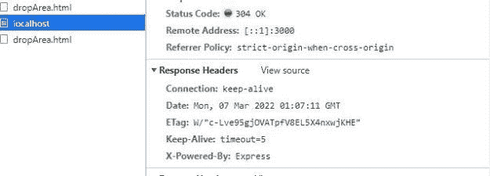
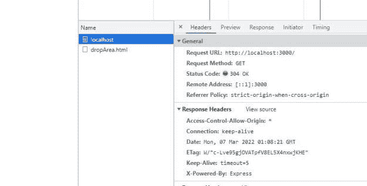

# 如何在 NestJS 应用程序中使用 CORS

> 原文：<https://blog.devgenius.io/how-to-use-cors-in-nestjs-application-1e18fddf7303?source=collection_archive---------8----------------------->

在这篇文章中，我们将讨论如何在一个 [NestJS](https://docs.nestjs.com/) 应用程序中使用 CORS(跨源资源共享)。在展示启用 CORS 有多容易之前，我们将在本帖中介绍一些基础知识。

*   什么是 CORS？
*   什么是 NestJS 框架？
*   如何使用 CORS？

# 什么是 CORS？

在一个常见的基于 REST API 的应用程序中，有一个客户端调用由服务器提供的 API。当访问这些 API 时，客户端可以请求不同的资源，这包括图像、视频、iframes 或脚本。与资源的域相比，请求资源的网站可以在不同的域中。默认情况下，获取资源的请求可能会失败。这就是 CORS 出现的原因。

如前所述，CORS 主张跨原产地资源共享。默认情况下，CORS 使从客户端到服务器的呼叫更加安全。在许多情况下，我们知道客户是谁，以及它将位于哪个域。在这种情况下，我们希望放松调用 API 的客户端的安全性。我们通过客户端发送请求头`Access-Control-Allow-Origin`来做到这一点。这些头指示哪些源可以访问 API。

*CORS 是一种基于 HTTP 报头的机制，它允许服务器指示除其自身之外的任何来源(域、方案或端口),浏览器应该允许从这些来源加载资源。—*[*Mozilla Firefox*](https://developer.mozilla.org/en-US/docs/Web/HTTP/CORS)

让我们看看下面的图表


来自`abccompany.com`的客户端向`s3.amazon.com`发送请求，以访问来自 [S3](https://aws.amazon.com/s3/) 的资源。在这种情况下，客户端和服务器有不同的来源。通常，这个请求会因为跨源而失败。这是浏览器的安全问题。与来自的请求相比，CORS 允许从不同来源的服务器访问资源。CORS 将在请求中添加`Access-Control-Allow-Origin`报头。

# 什么是 NestJS 框架？

NestJS 是一个构建可伸缩 NodeJS 服务器端应用程序的框架。在后台，NestJS 使用像 Express 这样的 HTTP 服务器框架。

为了开始，

`npm i -g @nestjs/cli` *Nest 提供了一个开箱即用的应用架构，允许开发者和团队创建高度可测试、可伸缩、松散耦合、易于维护的应用-*[*NestJS*](https://docs.nestjs.com/)

用 Nest 创建一个新项目

`nest new project-name`。

# 如何使用 CORS？

为了展示如何使用 CORS，我们将创建一个 nestjs 应用程序。

`nest new corsdemoapp` -将为`corsdemoapp`创建一个新文件夹。

现在，如果我运行`npm start`，它将在`[http://localhost:3000](http://localhost:3000.)` [启动我们默认的 nestjs 应用程序。](http://localhost:3000.)

NestJs 通过提供一个方法`enableCors()`使这变得更加容易。这将如下所示:

```
async function bootstrap() { const app = await NestFactory.create(AppModule); app.enableCors(); await app.listen(3000); } bootstrap();
```

还有另一种方法来启用 CORS。通过在`NestFactory.create()`方法中将 cors 作为对象传递。

```
async function bootstrap() {
  const app = await NestFactory.create(AppModule);
  app.enableCors();
  await app.listen(3000);
}
bootstrap();
```

如果我们想查看对`http://localhost:3000`的请求的响应头，它们将如下所示:



第二个截图显示了带有值`*`的标题`Access-Control-Allow-Origin`。这意味着来自任何来源的请求都可以访问服务器以获得来自`[http://localhost:3000](http://localhost:3000.)` [的响应。](http://localhost:3000.)

# 我们还能为 CORS 增加哪些选择？

在通过`enableCors()`启用时，我们可以用 CORS 设置一些其他选项。如果我们知道还有哪些域将访问我们的 API，我们就可以设置那个域。有时，API 可以是公共的。在这种情况下，我们可以使用通配符`*`作为`Access-Control-Allow-Origin`。

```
app.enableCors(
    { 
      origin: ['https://betterjavacode.com', 'https://www.google.com'],
    }
  );
```

此外，我们只能允许 API 调用一组方法。

```
app.enableCors(
    { 
      origin: ['https://betterjavacode.com', 'https://www.google.com'],
      methods: ['POST', 'PUT', 'DELETE', 'GET']
    }
  );
```

CORS 最常见的用例是在后端构建 RESTful APIS 并通过前端调用它们。

# 结论

当在服务器上构建和部署应用程序时，知道谁在调用您的 API 是很重要的。CORS 提供了一个安全特性。接受来自每个域的请求会带来安全风险。NestJS 提供了一种简单的方法来启用 CORS 和选项，以添加服务器可以接受请求的域。CORS 允许我们避免跨站点请求伪造攻击(CSRF)。我在我的书[简化 Spring 安全](https://betterjavacode.com/programming/simplifying-spring-security)中介绍了一些常见的漏洞。

*原载于 2022 年 3 月 7 日 https://betterjavacode.com**的* [*。*](https://betterjavacode.com/programming/how-to-use-cors-in-nestjs-application)