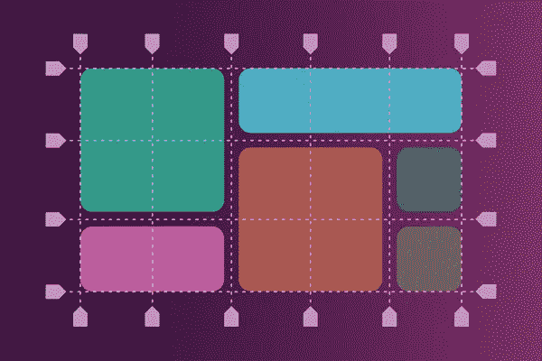
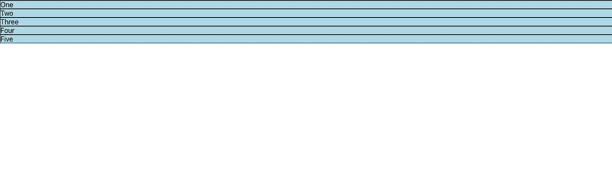
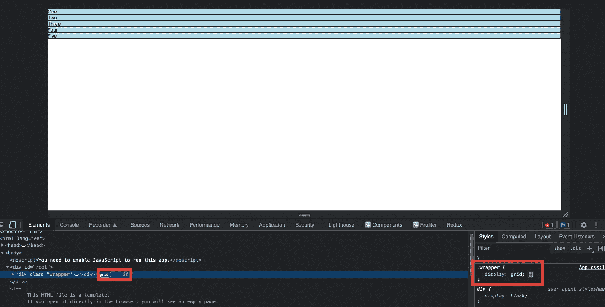
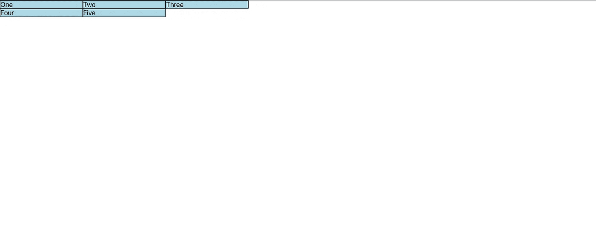
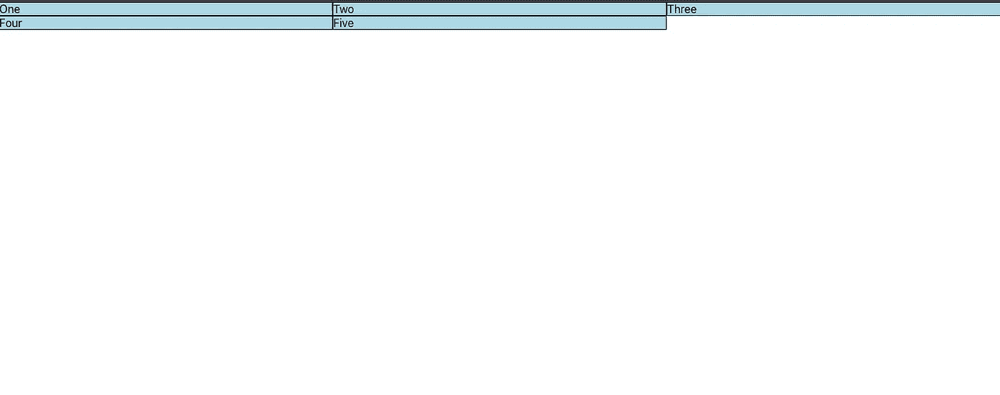
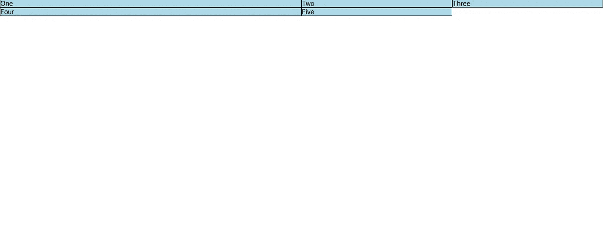
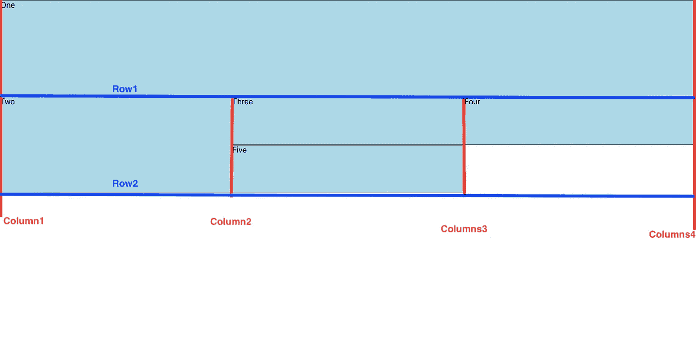
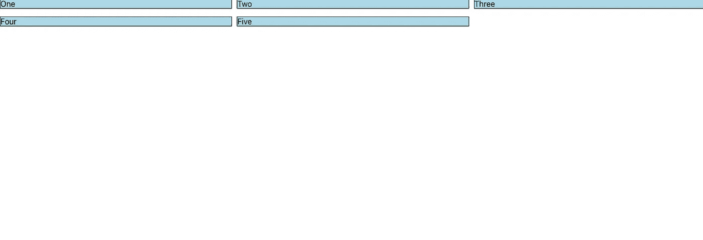
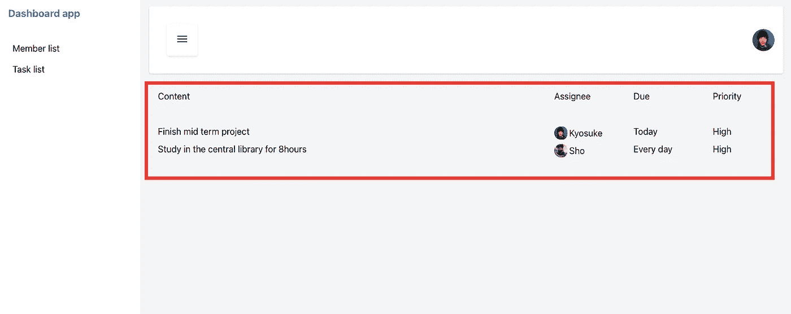

# 如何使用 CSS 网格布局，包括一个 react 示例

> 原文：<https://blog.devgenius.io/how-to-use-css-grid-layout-including-a-react-example-ea67455e902b?source=collection_archive---------0----------------------->



图片来自[https://sparkbox . com/foundry/CSS _ grid _ layout _ guide _ with _ flexbox _ fallbacks](https://sparkbox.com/foundry/css_grid_layout_guide_with_flexbox_fallbacks)

**目的**

虽然我经常使用 CSS flex box(比如“display: flex”)，但是在没有 BootStrap 的情况下，我几乎不会使用 CSS grid。我学习了 CSS grid 并集成了我的应用程序，所以我将分享这些知识

**什么是 CSS 网格布局？**

CSS 网格布局是使用网格概念的 CSS 布局方法之一。

与 flex box 相比，这种布局允许您更准确地放置每个元素。正如你可能知道的，现在 flex box 和 grid 布局在创建网站或应用程序时非常流行，因为我们需要准备用于智能手机的移动屏幕。由于手机屏幕明显是小屏幕，因此有必要具备“响应式设计”功能。

因此，让我们探索 CSS 网格的基本用法。

下面的代码是非常基本的 CSS 网格布局。实际上，启动 CSS grid 非常简单，因为我们只需要写一行代码到 CSS 中作为元素包装器。我添加了背景色和边框，以便更容易理解。

```
App.css.wrapper {
  display: grid;
}.item {
  background-color: lightblue;
  border: 1px solid black;
}
```

这是结果图像。与“显示:块”相比似乎没有改变，但我们可以在 google dev 工具中看到“网格”这个词。



如果我像下面这样添加“网格-模板-列”，结果就会改变。

grid-template-columns 的意思是“每一行的大小和列数是多少？”。换句话说，“网格-模板-列:200px 200px 200px”意味着有 3 列，每行有 200px 的宽度。在这种情况下，每行只有 3 个项目，因此项目 4 和项目 5 移动到第 2 行。

```
App.css.wrapper {
  display: grid;
  grid-template-columns: 200px 200px 200px;
}
```



但是，当屏幕尺寸改变时，固定宽度可能会导致问题。CSS 网格如何解决这个问题？这个解是“fr”单位，意思是分数。如果我设置 fr 而不是固定 px，结果会根据屏幕大小而变化。对于响应式设计来说，这是一个非常好的特性。

```
App.css.wrapper {
  display: grid;
  grid-template-columns: 1fr 1fr 1fr;
}
```



您可以使用简写来避免重复的代码，如下所示

repeat 中的第一个参数表示“有多少项？”，第二个参数表示“哪一项”？

```
App.css.wrapper {
  display: grid;
  grid-template-columns: repeat(3, 1fr)
}
```

你可以使用不同大小的分数，如下所示。

```
App.css.wrapper {
  display: grid;
  grid-template-columns: 2fr 1fr 1fr;
}
```



我将解释网格线。此图像有 4 列和 2 行，您可以使用此网格线系统指示元素的大小。这张图片是由下面的代码制作的。您可以使用“网格-自动-行”来设置行大小，并且您可以使用“网格-列-开始(结束)，网格-行-开始(结束)”来指示元素的大小，如下所示。



```
App.csswrapper {
  display: grid;
  grid-template-columns: repeat(3, 1fr);
  grid-auto-rows: 100px;
}.box1 {
  grid-column-start: 1;
  grid-column-end: 4;
  grid-row-start: 1;
  grid-row-end: 3;background-color: lightblue;
  border: 1px solid black;
}.box2 {
  grid-column-start: 1;
  grid-row-start: 3;
  grid-row-end: 5;background-color: lightblue;
  border: 1px solid black;
}.box3,
.box4,
.box5 {
  background-color: lightblue;
  border: 1px solid black;
}
```

可以用简写“网格-(列或行)-(开始或结束)”

```
.box1 {
  grid-column: 1 / 4;
  grid-row: 1 / 3;
}
```

你可以像下面这样添加缺口。

```
App.jswrapper {
  display: grid;
  grid-template-columns: repeat(3, 1fr);
  column-gap: 10px;
  row-gap: 1em;
}.item {
  background-color: lightblue;
  border: 1px solid black;
}
```



以上是基本用法，所以我会解释如何集成一个真实的代码。在这种情况下，我使用 CSS grid 来处理样式化组件列表。

这是一个应用程序图片，我用 CSS 网格来排列待办事项列表的每一部分。

基本上，我使用“fr”功能来安排部分。感谢 CSS 网格，我可以很容易地安排每个部分。



**结论**

CSS grid 看起来很难，但是如果你熟悉这个特性，你可以把你的元素放得更智能更准确。

**参考**

MDN Web docs-网格布局的基本概念-:[https://developer . Mozilla . org/en-US/docs/Web/CSS/CSS _ Grid _ Layout/Basic _ Concepts _ of _ Grid _ Layout](https://developer.mozilla.org/en-US/docs/Web/CSS/CSS_Grid_Layout/Basic_Concepts_of_Grid_Layout)

网格完全指南:[https://css-tricks.com/snippets/css/complete-guide-grid/](https://css-tricks.com/snippets/css/complete-guide-grid/)

学习 CSS 网格:[https://learncssgrid.com/](https://learncssgrid.com/)

感谢您的阅读！！