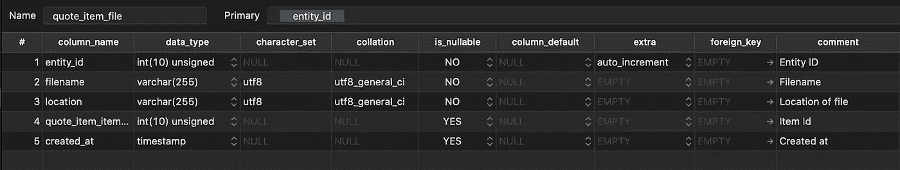

# Magento 2 中的声明式模式概述—第 1 部分

> 原文：<https://blog.devgenius.io/how-to-use-declarative-schemas-in-magento-2-part-1-d6c34e00841d?source=collection_archive---------7----------------------->


Artem Sapegin 在 [Unsplash](https://unsplash.com/) 上拍摄的照片

当我们更改数据库时，通常是通过安装或升级脚本来完成的。我们首先创建一个包含 php 类“InstallSchema”的安装脚本，并在其中编写 PHP 代码来调整数据库。然后，当我们需要更改一个表时，我们创建一个“UpgradeSchema”，查看需要升级的版本，并添加我们的更改。

**使用安装脚本的缺点**

在安装过程中，Magento 会检查模块的所有版本，直到达到最新版本。看起来像这样:

```
1.0.0 create database schema (install table X)
1.0.1 update database schema (add column A to table X)
1.0.2 update database schema (add column B to table X)
1.0.3 update database schema (remove column A from table X)
```

虽然这一切乍一看都很好，但有许多缺点。

使用这种方法，我们的升级脚本的复杂性增加了。

例如，如果不将模块添加到新版本中，就不可能删除您之前添加的列。开发人员应该在不破坏任何东西的情况下，完全理解每个安装和升级脚本包含的内容。这导致了额外的复杂性和不必要的错误。

幸运的是，Magento 以声明性方案的形式提出了一个解决方案。新方法允许开发者声明数据库的最终期望状态，并允许系统自动适应它，而不需要多余的操作。此外，不需要编写卸载脚本，因为当删除模块时，更改会自动删除。

什么是声明性模式？

Magento 2.3 中引入了声明性模式，这是对数据库进行更改的一种新方式。Magento 2.3 中还不要求使用声明性模式，但是建议使用它。除了上面已经提到的所有优点之外，它还具有以下优点:

*   安装的试运行模式。
*   性能优化:声明式调度方法通过从当前版本移动到最后一点节省了大量时间。
*   支持回滚:开发人员可以恢复到以前的版本。
*   安装前的验证。

**如何使用声明性模式**

声明性方案以 XML 文件的形式出现。您可以通过在 etc/文件夹中添加一个 db_schema.xml 文件来创建它。

例如，我们想要一个包含以下信息的表:文件名、文件位置以及与 quote_item 的关系。我们称该表为“报价 _ 项目 _ 文件”,包含以下各列:文件名、位置、报价 _ 项目 _ 项目 _id、创建时间。如果我们把它写在 etc/db_schema.xml 中，它看起来会像这样。

如果你能看到它是直截了当的。我们从一个具有以下属性的表节点开始，名称、资源和引擎。这又有一个子节点“column ”,它描述了表中的列。此外，当我们想要创建与另一个表(在我们的例子中是“quote_item”表)的关系时，它有一个主键类型为“primary”的约束子节点和一个外键类型为“foreign”的约束子节点。

然后我们运行:

```
bin/magento setup:db-declaration:generate-whitelist --module-name=Module_Name && bin/magento s:up
```

json 用于保持 Magento 中的向后兼容性。

当我们转到数据库时，您会看到我们的表已经创建好了。如果我们想改变表中的任何内容，只需修改文件并再次运行命令。


为了举例说明这有多容易，我们将 created_at 列添加到表中。

然后我们再次运行 bin/magento s:up，看到这个列已经被添加到数据库中。



如果我们想完全删除表，只需从 xml 中删除它。

**重命名表格**

可以通过创建新的表节点并删除旧的表节点来重命名表。然后，我们将“onCreate”属性添加到包含方法和当前表名作为参数的新表节点中。" migrateDataFromAnotherTable(quote _ item _ file)"见下文。


> 重命名一个表时，记得重新生成 db_schema_whitelist.json 文件，这样除了旧名称之外，它还包含新名称。

**结论**

到目前为止，第一部分是关于 Magento 2 中的声明性模式。在第二部分中，我将讨论如何将安装/升级脚本转换为声明式方案、试运行以及如何执行回滚。

来源:[声明性模式概述](https://devdocs.magento.com/guides/v2.4/extension-dev-guide/declarative-schema/)

# 觉得这个帖子有用吗？请点击👏下面的按钮！:)