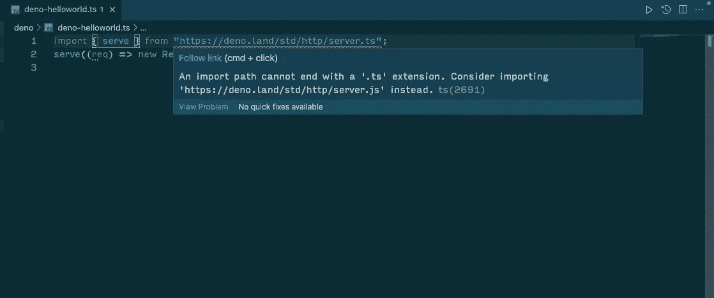

# 如何使用 Deno

> 原文：<https://blog.devgenius.io/how-to-use-deno-ab15cdc3257?source=collection_archive---------8----------------------->


图片来自[https://deno.land/x](https://deno.land/x)

# 目的

据我所知，Deno 技术是由 Ryan Dahl 发明的，他也开发了 Node.js。这是一个非常有趣的话题，所以我将与你分享关于 Deno。

# 什么是德诺？

Deno 是一个用于 v8 引擎的 JavaScript/TypeScript 运行时。正如我已经提到的，这个运行时是由 Node.js 的创建者 Ryan Dahl 创建的。虽然他在 2009 年创建了 Node.js，但他并不完全满意这个运行时，所以他创建了另一个而不是 Node.js，这就是为什么 Deno 的名字是 Node 的变位词。而核心是 Rust 写的。

这个运行时是由 Ryan Dahl 提出的，它“关于 Node.js 的 10 件事|遗憾”。如果你对细节感兴趣，请参考下面的 Youtube 视频。

# Node.js 和 Deno 有什么区别？

*   承诺

基本上，Node.js 没有 promise 特性，因为当这个运行时在 2009 年创建时，Promise 还不太流行，一般来说，大多数开发人员认为回调比 Promise 更有用。然而，正如你可能知道的，现在几乎所有的开发者都相信 Promise 对于防止回调地狱是非常有用的。所以 Deno 有一个为所有异步函数返回承诺的特性。

*   安全性

Node.js 使用 Lint 或构建工具时不需要任何网络访问权限，而 Deno 需要任何网络访问权限，并编写一些文件。在我看来，这个特性有时对于一个简单的应用程序或一个小项目来说太多了，但即使现在一些 npm 也有严重的漏洞和不安全，所以这个特性有助于 Deno 比 Node.js 更安全。

*   package.json 和节点模块

你可能知道，Node.js 有 package.json 和 node_modules。这是一个非常有用的特性，因为如果我们安装任何库(到目前为止超过一百万个！！)，我们可以使用它，这个库会自动添加到 package.json 中，但是，运行时使用 node_modules 来解决依赖关系。这并不可怕，但是由于复杂性，node_module 是项目中最大的文件夹之一。下面的图片是非常讽刺和有趣的，但这个图片有一部分的真实性。如果你在一个大项目中，你应该有一个大的 node_module。


图片来自 https://fettblog.eu/impact-of-large-node-modules/

德诺怎么样？其实 Deno 没有 package.json 和 node_module。而不是这两个，Deno 只允许通过 url 或文件导入。他们不允许使用“要求”来导入，只允许使用“导入”，这是 ES 模块的一项功能。而且，不能省略 index.ts(无索引)之类的扩展名。你应该喜欢相对或绝对路径。

*   类型脚本支持

如果要在 Node.js 中使用 TypeScript，需要安装一些依赖项，比如 ts-node 或者 tsc。不过 Deno 有一个 defalut 特性支持 TypeScript，不需要安装任何依赖就可以使用 TypeScript。

*   WebAPI 支持

您可能在 JavaScript 部分使用了 webAPI，如“alert”、“fetch”，但 Node.js 不支持默认行为。因此，如果您想在 Node.js 环境中使用“fetch”API，您需要安装 node-fetch，而 Deno 默认支持这些 WebAPI，如 fetch。换句话说，你不需要安装额外的依赖。

注意:现在，deno 有了实验性的 npm 支持(谢谢你告诉我， [Calvin Nguyen](https://calvinqc.medium.com/?source=responses-----ab15cdc3257----0----------------------------) )。这种支持让我们可以更灵活地使用 Deno，但是这个特性现在还在开发中。如果您对细节感兴趣，请查看此发行说明。

https://deno.com/blog/v1.25#experimental-npm-support

好了，这就足够解释关于德诺的事了。让我们用例子开始使用 Deno。

# 示例(Hello world)

1.  安装 deno(对于 mac，可以使用家酿。我会附上安装截图，所以如果你想使用任何其他方法，请参考)


2.版本检查(可选)。如果你看到如下信息，你可以成功安装 Deno。您可以检查 TypeScript 的默认支持。

```
deno --version

// result
deno 1.22.0 (release, x86_64-apple-darwin)
v8 10.0.139.17
typescript 4.6.
```

3.使用 deno.land 中的 welcome.ts 检查是否成功运行 deno。如果您可以看到“欢迎来到 Deno”，则此运行时工作正常(有人说我们可以在“欢迎来到 Deno”后看到恐龙标记，但我无法 lol)

```
deno run https://deno.land/std/examples/welcome.ts

//result
Download https://deno.land/std/examples/welcome.ts
Warning Implicitly using latest version (0.141.0) for https://deno.land/std/examples/welcome.ts
Download https://deno.land/std@0.141.0/examples/welcome.ts
Check https://deno.land/std/examples/welcome.ts
Welcome to Deno!
```

4.尝试做“Hello world”。我创建了 deno 文件夹和 deno-helloworld.ts(名字由你决定。).你可以写一些代码，如下所示。

```
mkdir deno
cd deno
touch deno-helloworld.ts// deno-helloworld.ts

import { serve } from "https://deno.land/std/http/server.ts";
serve((req) => new Response("Hello World\n"))
```

5.当您在控制台上运行此命令“deno run deno-helloworld.ts”时，您会看到以下错误。您可以使用 y .来允许这个控制台，因为 Deno 的默认态度不允许请求访问网络。如果您允许访问互联网，您可以看到如下的“Hello World”消息。

```
deno run deno-helloworld.ts

//result
Check file:///Users/owner/Desktop/webDevelopment/Playground/deno/deno-helloworld.ts
⚠️  ️Deno requests net access to "0.0.0.0:8000". Run again with --allow-net to bypass this prompt.
   Allow? [y/n (y = yes allow, n = no deny)]  y  //allow
Listening on http://localhost:8000
```


6.但是如果你拒绝访问，你会得到一个如下的错误，因为“PermissionDenied”。这个特性让 deno 比 Node.js 更安全。在这个错误消息中，Deno 告诉你如何允许访问。您需要在我们的控制台上添加— allow-net 标志。

```
deno run deno-helloworld.ts

// result
Check file:///Users/owner/Desktop/webDevelopment/Playground/deno/deno-helloworld.ts
⚠️  ️Deno requests net access to "0.0.0.0:8000". Run again with --allow-net to bypass this prompt.
   Allow? [y/n (y = yes allow, n = no deny)]  n  //deny
Listening on http://localhost:8000/
error: Uncaught (in promise) PermissionDenied: Requires net access to "0.0.0.0:8000", run again with the --allow-net flag
    at Object.opSync (deno:core/01_core.js:172:12)
    at opListen (deno:ext/net/01_net.js:45:17)
    at Object.listen (deno:ext/net/01_net.js:318:17)
    at Server.listenAndServe (https://deno.land/std@0.141.0/http/server.ts:181:27)
    at serve (https://deno.land/std@0.141.0/http/server.ts:589:20)
    at file:///Users/owner/Desktop/webDevelopment/Playground/deno/deno-helloworld.ts:2:
```

7.如果您添加— allow-net 标志，错误将会消失。但是请注意，这个-allow-net 标志应该放在 file 之前。

```
deno run --allow-net deno-helloworld.ts

//result
Listening on http://localhost:8000
```

8.所以，如果你把你的-allow-net 标志放在“deno-helloworld.ts”后面，这个标志就不能正常工作。你不能避免看到下面的警告是否旗帜的地方。就这个例子而言，我做到了。

```
deno run deno-helloworld.ts --allow-net
⚠️  ️Deno requests net access to "0.0.0.0:8000". Run again with --allow-net to bypass this prompt.
   Allow? [y/n (y = yes allow, n = no deny)]
```

## 额外费用(针对 VSCode 用户)

针对 VSCode 用户的额外信息(如果您不使用 VSCode，请跳过这一部分)。如果你在 VSCode 中得到低于警告，你需要做额外的设置。这完全可以工作(至少我可以在屏幕上显示 hello world)，但这是一个可以避免的警告。



基本上，你有两种不同的解决方案。您可以在全球或本地解决这个问题。或多或少你需要安装下面的扩展“deno”。


1.  如果要全局求解，需要在设置中为 Deno 勾选“启用”。


2.要想就地解决，就需要创造”。vscode”文件夹，并在您的 settings.json 中写入“deno . enable”:true(您还需要创建一个 settings.json)。


第一个错误消失了。然而，我得到了另一个类似下面的警告。


于是我将导入路径从“[https://deno.land/std/http/server.ts](https://deno.land/std/http/server.ts)”改为“[https://deno.land/std@0.141.0/http/server.ts](https://deno.land/std@0.141.0/http/server.ts)”，警告完全消失了。


# 结论

Deno 是一个类似于 Node 的运行时，用来解决 Node 的问题。有人说 Deno 取代 Node.js，但我觉得目前为止没有。因为 npm 模块有 1 亿个库，这也很有用。我猜 Deno 和 Node.js 在某种程度上是兼容的，共存可以帮助彼此解决开发问题，因为两种运行时都有优点和缺点。

注意:我猜 Deno 和 Node.js 会通过某种方法兼容，这个特性是通过“npm 说明符”实现的。因此，deno 用户可以在不安装 npm 的情况下使用大量的 npm 库。然而，正如我在上面的文章中提到的，这个功能现在正在开发中。我希望在所有节点项目中使用 deno，我们的项目将得到优化。

# 参考

官方文件:【https://deno.land/ 

关于 Node.js 的 10 件事|遗憾(youtube 视频):[https://www.youtube.com/watch?v=M3BM9TB-8yA&t = 1300s](https://www.youtube.com/watch?v=M3BM9TB-8yA&t=1300s)

Deno 是什么，和 Node.js 有什么不同:[https://blog . log rocket . com/what-is-Deno/https://blog . log rocket . com/what-is-Deno/](https://blog.logrocket.com/what-is-deno/)

大型节点模块依赖性是一个问题吗？:[https://fettblog.eu/impact-of-large-node-modules/](https://fettblog.eu/impact-of-large-node-modules/)

如何避免“导入路径不能以结尾。VSCode 中的 ts 扩展”错误？(堆栈溢出):[https://stack overflow . com/questions/65115527/how-can-I-avoid-the-an-import-path-can-end-with-ts-extension-error-in-vsco](https://stackoverflow.com/questions/65115527/how-can-i-avoid-the-an-import-path-cannot-end-with-ts-extension-error-in-vsco)

Node.jsにおける設計ミス By Ryan Dahl: [https://yosuke-furukawa.hatenablog.com/entry/2018/06/07/080335](https://yosuke-furukawa.hatenablog.com/entry/2018/06/07/080335)

Deno 入門~Nodeから次の時代へ~

https://qiita.com/yoshii0110/items/8f13012e9f732b1cfd4c

Denoとはなにか — 実際につかってみる

【https://qiita.com/azukiazusa/items/8238c0c68ed525377883 

感谢您的阅读！！