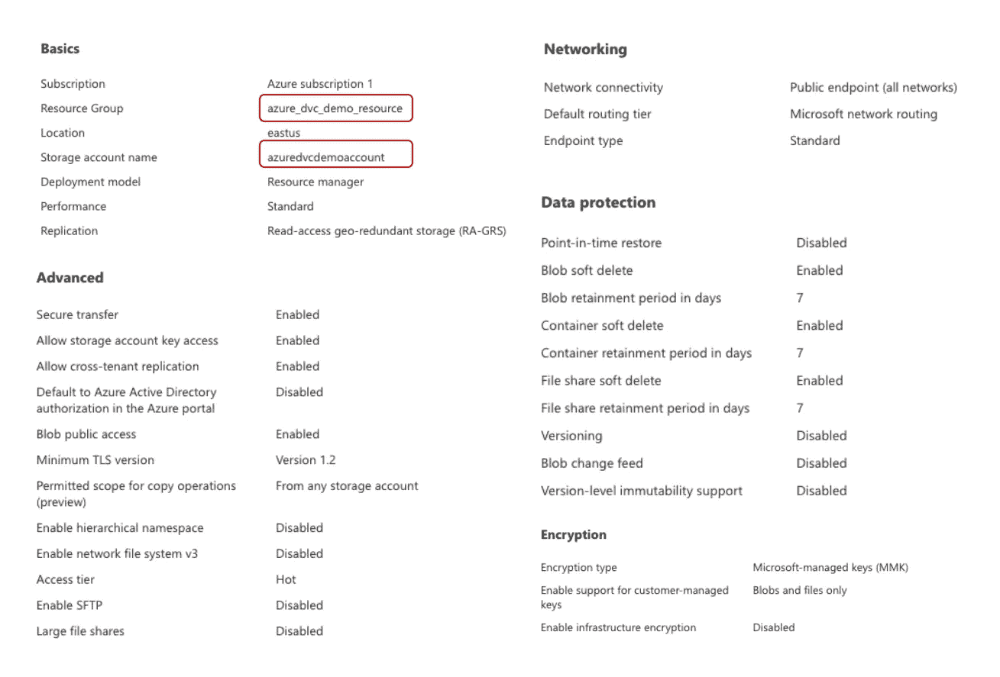
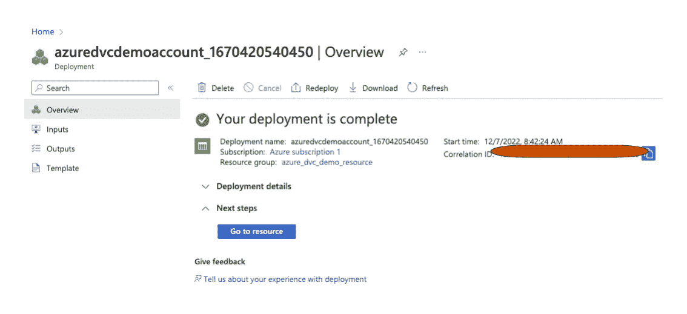
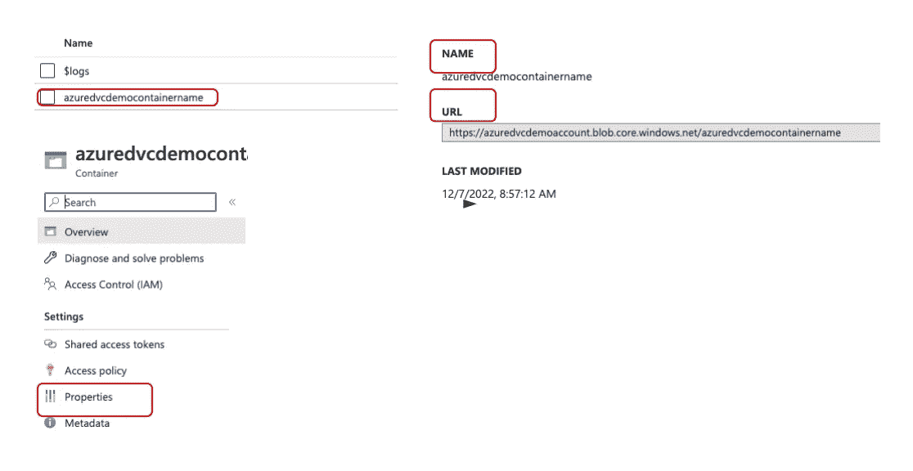
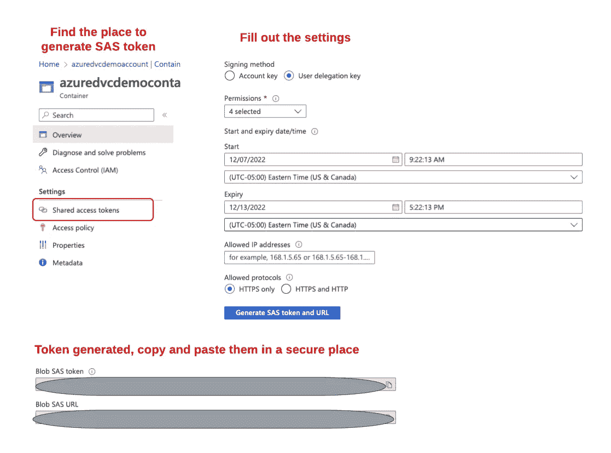
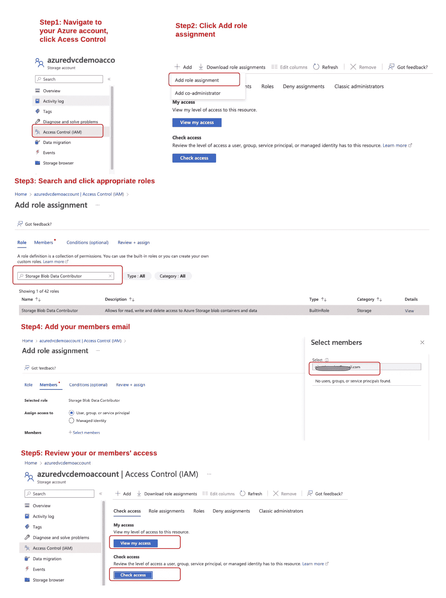
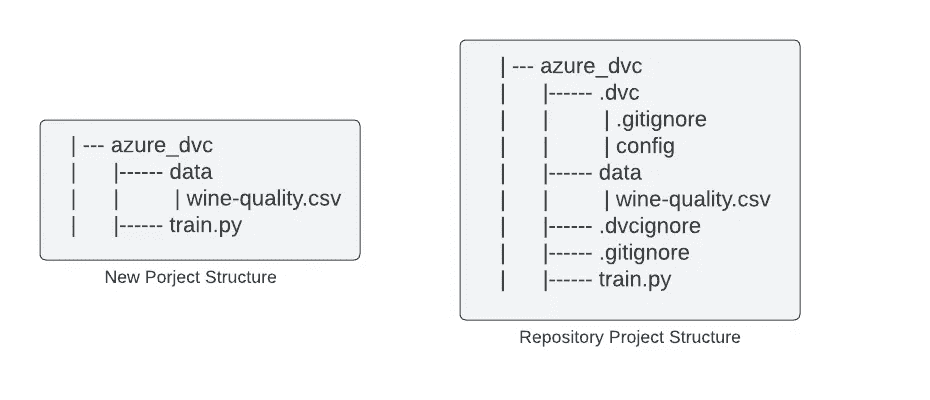

# 如何在 Azure Blob 存储中使用 DVC

> 原文：<https://blog.devgenius.io/how-to-use-dvc-in-azure-blob-storage-acdf130bab38?source=collection_archive---------5----------------------->

> ***内容:***
> 
> **—一、简介**
> 
> **—二。使用 DVC 和 Azure Blob 存储进行数据版本控制**
> 
> **— — — 1。设置 Azure Blob 存储**
> 
> **————( 1)建立 Azure Blob 存储**
> 
> **————( 2)创建一个 Azure 存储容器**
> 
> **————( 3)创建一个 SAS 令牌**
> 
> **———( 4)设置账户和容器的访问控制**
> 
> **— — — 2。设置项目**
> 
> **— — — 3。DVC 与蓝色集装箱的互动**

# 一.导言

数据版本控制(DVC)是一个数据版本控制工具。DVC 的想法是为数据创建一个类似 Git 的版本控制系统。

DVC 对数据大小没有限制，因为它不在服务器上存储数据。相反，使用 DVC，您可以将数据存储在首选的存储单元中，如亚马逊 S3、Azure Blob 存储等。DVC 会自动保存一个很轻的文件，这样你就知道你的数据保存在哪里了。

这篇博客旨在介绍使用 DVC 在 Microsoft Azure Blob 存储上对大型数据集进行版本化的完整过程。

# 二。使用 DVC 和 Azure Blob 存储进行数据版本控制

## 1.设置 Azure Blob 存储

**(1)创建一个 Azure 存储帐户**

我们假设您已经有一个 Azure 帐户。像我，我创建一个免费账户一个月。

登录 Azure 账号，选择**创建资源** - >搜索**存储账号** - >点击**创建**按钮。

用户界面会要求你在几个部分填写一些信息。在我的例子中，我将**资源组**设置为*azure _ DVC _ demo _ Resource*，将**存储帐户名**设置为 *azuredvcdemoaccount* ，并将所有其他设置保留为默认设置。请查看下图，以供参考。



Azure 将检查所有设置并部署帐户。完成后，您将看到下面的消息，显示**您的部署已完成**。接下来，单击**转到资源**按钮创建一个容器。



**(2)创建一个 Azure 存储容器**

按照下图中的步骤 1–3 创建容器。


Azure 将检查设置并部署容器。然后，点击容器->点击**属性** - >复制**名称**和 **URL** 以备后用。



**(3)创建一个 SAS 令牌**

a.进入 Azure 门户，导航**你的存储帐户** - > **容器** - > **你的容器**。

b.在**签名方法**部分选择**共享访问令牌** - >，**选择用户委托密钥**。

c.在**权限部分** - >选择**读取**，**写入**，**删除**，**列出**权限。

d.根据您的喜好指定签名密钥**开始**和**到期**的时间。

e.将**允许的 IP 地址**留空，因为这是可选的。

f.**允许的协议**也是可选的，我将其保留为默认设置。

g.点击**生成 SAS 令牌和 URL**

h.将 **Blob SAS 令牌**和 **Blob SAS URL** 值复制并粘贴到安全位置。



请阅读[官方文档](https://learn.microsoft.com/en-us/azure/applied-ai-services/form-recognizer/create-sas-tokens?view=form-recog-3.0.0)以供参考。

**(4)设置访问控制**

**===为 Azure 帐户设置正确的角色**

a.导航到您的帐户主页

b.点击**访问控制(IAM)**

c.点击**添加**->-**添加分配角色**

d.搜索 **Azure Blob 数据贡献者**，点击下一个>

e.选择**用户、组或服务主体**，点击**选择成员**

f.添加**会员邮箱**，记得点击**选择**。将向该成员发送一封邀请电子邮件，需要该成员接受。

g.您可以通过点击**查看我的权限**或**查看您成员的权限**来查看权限。

查看以下流程:



**===为 Azure 容器设置正确的角色**

导航到您的容器主页，按照上述相同的步骤为您和您的成员选择合适的角色。

## 2.设置项目

我**推荐**你从头开始走一遍这些步骤，为此，你需要创建一个项目，其结构如下图所示。

也可以克隆[项目](https://github.com/purplebear-cai/azure_dvc)；结构如下图所示。



## 3.DVC 与 Azure 容器的互动

然后按照下面的命令将数据上传到 Azure Blob 容器，并将项目提交到 GitHub。

您可以定义环境变量以备将来使用。所需的环境包括:

*   导出帐户名称=您的 AZURE 帐户名称
*   导出容器名称=您的 AZURE 容器名称
*   导出容器 URL =您的 AZURE 容器 URL
*   导出 BLOB_SAS_TOKEN =您的 BLOB _ SAS _ TOKEN

如果您使用 Mac，请在~/中定义环境变量。bash_profile，并且记得运行 *source ~/。bash_profile* 。出口

a.初始化项目和数据版本

```
#=======================================
# Navigate to the project folder
cd azure_dvc

# Initialize git and dvc
git init
dvc init
git commit -m "initialize repo"

# Set up the DVC remote
dvc remote add -d dvc-remote $CONTAINER_URL
dvc remote modify dvc-remote url azure://$CONTAINER_NAME/
dvc remote modify dvc-remote account_name $ACCOUNT_NAME
dvc remote modify dvc-remote connection_string "AccountName=$ACCOUNT_NAME;SharedAccessSignature=$BLOB_SAS_TOKEN"

# Data versioning with DVC
dvc add data/wine-quality.csv
git add data/.gitignore data/wine-quality.csv.dvc
git commit -m "Track data"
git tag -a "v1" -m "V1: raw data"
git commit .dvc/config -m "configure remote storage"

# Push and remove unnecessary files
dvc push
rm -rf data/wine-quality.csv
rm -rf .dvc/cahce

# Upload local project to github
git remote add origin QUICK_SETUP_URL # if this is the first time you commit changes to the repository
git push -u origin main
```

b.更改数据并跟踪不同的版本

```
# Pull the original data
dvc pull

# Delete the first 1000 lines data from original CSV file
sed '2,1001d' data/wine-quality.csv > data/wine-quality-tmp.csv && mv data/wine-quality-tmp.csv data/wine-quality.csv

# Track the new data
dvc add data/wine-quality.csv
git add data/wine-quality.csv.dvc
git commit -m "data: remove 1000 lines"
git tag -a "v2" -m "remove 1000 lines"
dvc push
rm -rf data/wine-quality.csv
rm -rf .dvc/cache
```

c.使用不同版本的数据训练模型，并使用 MLflow 进行实验跟踪

```
# Train a model with version v5 (you can specify the version with your preference)
python train.py --path data/wine-quality.csv --repo YOUR_PROJECT_PATH --rev v5 --remote YOUR_CONTAINER_URL

# Train a model with a different version v6
python train.py --path data/wine-quality.csv --repo YOUR_PROJECT_PATH --rev v6 --remote YOUR_CONTAINER_URL

# Run MLflow UI
mlflow ui
```

如果你能毫无差错的完成整个过程，恭喜你！如果有什么问题或者改进建议，欢迎给我留言。感谢您的阅读！如果您对未来的更新感兴趣，请订阅。😄