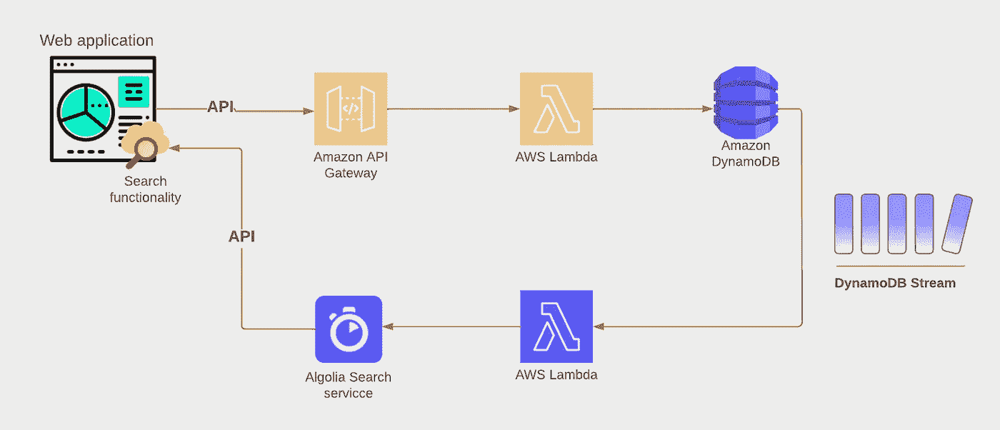

# 如何使用 DynamoDB 流来支持 Algolia 搜索

> 原文：<https://blog.devgenius.io/how-to-use-dynamodb-streams-to-feed-algolia-search-2f1de8eba64d?source=collection_archive---------4----------------------->

使用 AWS Lambda 和 DynamoDB 流来提供辅助服务


来自[皮克斯拜](https://pixabay.com/vectors/newton-s-cradle-pendulum-physics-6076266/)的照片[古斯塔沃·雷森德](https://pixabay.com/users/gustavorezende-1488336/)

每种工具都有特定的用途。你不用锯子钉钉子。同样，如果您使用 DynamoDB 作为数据存储，最好使用另一个工具来提供搜索功能。要做到这一点，你需要让你的数据搜索工具。最简单的方法是在 DynamoDB 表上启用 DynamoDB 流。

> 一个 *DynamoDB 流*是关于 DynamoDB 表中项目变化的有序信息流。当您在表上启用一个流时，DynamoDB 会捕获关于表中数据项的每次修改的信息。

在本例中，我们将从 DynamoDB 流捕获的数据存储中的更改中为 [Algolia search](https://www.algolia.com/products/search-and-discovery/hosted-search-api/) 服务提供信息，并由 AWS Lambda 函数进行处理。您可以使用此搜索服务在您的网站上启用搜索功能，如下图所示。



具有搜索功能的网络应用

> 这是两篇文章的第 1 部分，介绍如何使用无服务器的 DynamoDB 流。本文详细介绍了如何使用 AWS Lambda 和 DynamoDB 流来提供辅助服务。
> 
> ★本系列的第 1 部分是关于如何使用 AWS Lambda 和 DynamoDB 流来提供辅助服务。
> 
> ★ [本系列的第 2 部分着眼于如何将特定事件从 DynamoDB 流定向到 Lambda 函数。](/how-to-filter-serverless-events-from-dynamodb-streams-c5f7c7250674)

**先决条件:**

1.  无服务器 CLI [已安装](https://serverlesscorner.com/your-first-serverless-project-cbf1deee29f7)。
2.  打字稿的基础知识。
3.  AWS 帐户。
4.  阿尔戈利亚[账户](https://tinyurl.com/2p93nrsj)

## 搜索书籍📚

我们将在前面的故事[的基础上进行扩展，我们将构建一个 REST API 来为在线图书馆服务从 DynamoDB 表中检索图书。请参考前面关于如何通过 AWS 控制台设置 DynamoDB 表的故事。我们将使用以下代表书籍的数据:](https://serverlesscorner.com/how-to-build-a-serverless-rest-api-with-nestjs-and-dynamodb-7b58b5b59bf6)


DynamoDB 表数据

在这个故事中，我们为这个表启用了 DynamoDB 流，并使用 AWS Lambda 函数来监听这个流，以便将书籍的更改转发给 Algolia 搜索服务，从而能够搜索书籍。


使用 DynamoDB 流提供搜索服务

# 让我们开始建造吧👷‍♂️

现在我们知道我们的目标是什么，让我们开始建设。第一步是在 DynamoDB 表上启用流。在 AWS 控制台中导航到 DynamoDB 表，选择“导出和流”选项卡并启用 DynamoDB 流。在下一个屏幕上选择“新图像”以获取最新数据并确认。

> *本文的完整项目可以在 Github*[*【https://github.com/cyberworkz/examples】*](https://github.com/cyberworkz/examples)*的 online-library-stream 文件夹中找到。*


导出和流 DynamoDB 表

确认后，将创建一个 DynamoDB 流，该流捕获对 DynamoDB 表中记录的更改。


DynamoDB 流

流的标识符包含创建流的日期和时间。

## 设置 Algolia🔍

Algolia 是一个 SaaS 产品，你可以使用 API 来搜索你提供的数据。他们每月提供 10，000 条记录和 10，000 次搜索请求的免费账户。可以在这里报名[。](https://www.algolia.com/users/sign_up)

注册后，您将被引导创建一个*索引，*让我们填写' *dev_online_library'* 。在第二步中，您可以导入记录或手动添加记录。让我们选择后者。使用下面的 JSON 添加记录。

```
[
 {
  "PK": "BOOK#23456",
  "Title": "Harry Potter and the Chamber of Secrets",
  "Author": "JK Rowling",
  "objectID": "BOOK#23456"
 }
]
```

添加记录后，您应该会看到带有记录的索引。


搜索索引

通过添加记录，我们现在能够配置可搜索的属性。导航到“配置”选项卡，添加标题和作者作为可搜索属性。有更多的选项，但为了简洁，我们保持这些设置。


可搜索属性

查看并保存设置。

接下来，我们将查找要使用的 API 键。导航回概览页面。欢迎消息下面是一个指向 API 密钥的链接。


API 键

有一个使用搜索 API 的键和一个使用管理 API 的键。最后一个可用于向索引添加记录。记下它以便在 AWS Lambda 函数中使用。

## 创建拉姆达函数🪄

下一步是创建 AWS Lambda 函数来读取流。我们将使用一个预定义的[模板](https://github.com/cyberworkz/serverless-templates)来抢占先机。使用以下命令，通过无服务器 CLI 创建一个新项目:

```
sls create --template-url https://github.com/cyberworkz/serverless-templates/tree/main/aws-nodejs-typescript-dynamodb-streams --path online-library-stream
```

这将创建一个框架无服务器 typescript 项目来处理 DynamoDB 流事件。

无服务器. yml

Lambda 函数被配置为侦听 DynamoDB 流。项目中的主类是已经设置用来处理 DynamoDB 流事件的 *processor.ts* 文件。

处理器. ts

我们将扩展项目以处理流事件，并将其复制到搜索索引中。

首先，我们需要安装一些额外的依赖项来完成繁重的工作。安装以下软件包:

*   算法搜索
*   [typedi](https://www.npmjs.com/package/typedi)

```
npm i algoliasearch --save
npm i typedi --save
```

Algoliasearch 用于连接到 Algolia 服务。TypeDI 允许在没有紧密耦合的情况下将依赖项注入到类中。

接下来，我们将构建一个模型来捕获 DynamoDB 表中已更改的图书。添加以下文件， *book.ts* 。

book.ts

' *objectID* '属性是 Algolia 使用的标识符。添加具有相同' *objectID* '的对象时，先前的对象将被覆盖。这意味着更新也包括在内。

现在，我们需要把数据送到阿尔戈利亚。我们将处理 DynamoDB 记录，并使用 Algolia API 将数据推送到索引中。为此，添加以下文件，*export-search . service . ts*。

“searchClient”是用您之前记下的 Algolia 应用程序 id 和 Admin API 键构建的。该类通过将一个 *DynamoDBRecord* 转换为一个 *Book* 并将其添加到索引中来处理它。

剩下唯一要做的就是修改 *processor.ts* 文件来调用 *ExportService* 类。您可以在 Github 项目中查找如何做到这一点的示例。

# 部署🚀

现在我们已经准备好部署 Lambda 函数了。使用以下命令将其部署到您的 AWS 帐户。

```
serverless deploy
```

部署后，将创建 AWS Lambda 函数。创建之后，您可以设置环境变量来存放 Algolia 的应用程序 ID 和管理 API 键值。


AWS 环境变量。

要测试该功能，您可以在 DynamoDB 表中编辑一条“*图书*”记录。更改将被发送到流中，并通过 Lambda 函数添加到 Algolia 索引中。您应该在 Algolia 索引中看到以下内容:


阿尔戈利亚记录索引。

# 完成的🙏

所以，这就结束了。我希望这对你的无服务器之旅有所帮助。同样，这个项目的代码可以在 Github 上找到👇[https://github.com/cyberworkz/examples](https://github.com/cyberworkz/examples)在`online-library-stream` 文件夹中。

# 海科·范德沙夫

*   ***如果你喜欢这个，请*** [***跟随 Serverlesscorner.com 上媒***](https://serverlesscorner.com/about) ***。***
*   ***爱情*** ❤️ ***阅读*** ***我的故事及其他关于媒介？*** [***成为会员***](https://serverlesscorner.com/membership) ***如果你还不是会员的话。***
*   ***想阅读更多无服务器？报名参加我的*** [***月报***](https://serverlessconsulting.org/newsletter) ***📬关于无服务器技术和使用案例的启发性和深刻的故事。***