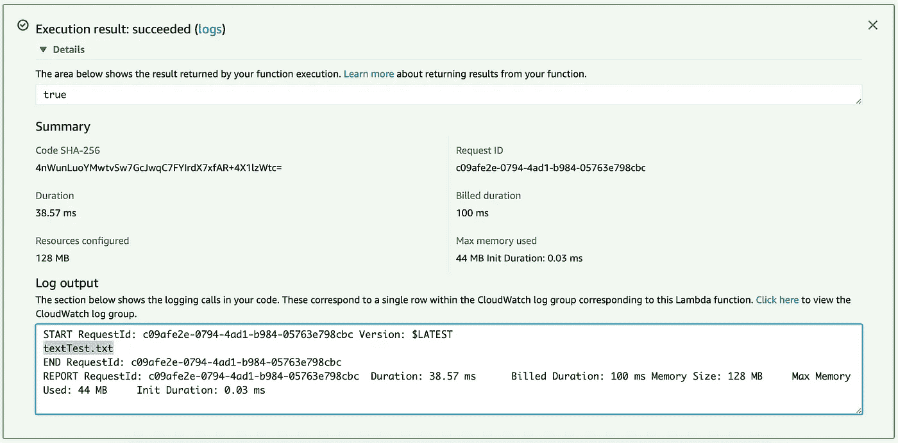

# 如何将 EFS 与 AWS Lambda 配合使用？

> 原文：<https://blog.devgenius.io/how-to-use-efs-with-aws-lambda-a06e85882c4?source=collection_archive---------8----------------------->

AWS 最近推出了一个新功能，让客户制作一个与 Lambda 兼容的 EFS(弹性文件系统)。这真的很酷！但是，为什么是 EFS？

EFS 是一个独立存在于机器内部的存储单元。这个文件可以附加到 EC2 等其他服务上，并且可以从多个实例中同时访问。可以从任何连接的实例或 Lambda 访问该存储单元内的文件。

为什么我们需要这样的东西来使用 Lambda？额外复杂的步骤？

实际上，如果你从不同的角度来看，这个特性是很神奇的，让我们从其中的一些开始:

*1-一致性:*

如果你需要多个 Lambdas 来使用(读和写)大文件，你会需要它们在一个不延迟函数获取资源的地方，这样导致计算能力和时间更少->钱更少。

*2-更多空间:*

当您处理来自 S3 的文件时，您的最大存储容量为 512 MiB。这在某些情况下是不够的。另外，您可能需要在不同的过程阶段处理这个文件，比如清理、分段、处理和导出这个文件的可读报告/格式。想象一下这个场景中包含的代码量。

*3-更多空间 2:*

使用层将在函数之间共享资源，但是层有时不能处理您调用来运行这个函数的资源和二进制文件的大小。使用 EFS 会给你更多的空间来存储这些资源，并在需要时调用。

我可以列出更多的要点。但是，你明白了。让我们深入了解如何在 lambda 中使用它。

# 创造 EFS:

1-打开 AWS 控制台，搜索“EFS”。

2-单击“创建文件系统”。

3-在步骤 1 中，选择您的 VPC。如果你的 lambda 是在 VPC 内配置的，选择它，如果不是，记住当你选择 VPC 时。

第 4 步，为您的文件系统添加描述性名称。然后单击下一步。

5-在步骤 3 中，向下点击“添加接入点”。然后用图像里的东西填充。

6-检查配置，然后单击“创建文件系统”。

7-搞定！等待几秒钟，您的 EFS 将被激活。

# 用 Lambda 连接它:

1-点击服务并搜索“Lambda”。

2-创建一个新函数，并选择您喜欢的运行时语言。在本文中，我将使用 Python。

向下一点，你会看到一个叫做“VPC”的部分，点击“编辑”。

4-选择您的 VPC，并选择子网和安全组。然后保存。

5-在“VPC”部分，从“文件系统”部分单击“添加文件系统”。

6-选择我们创建的 EFS 文件系统，记住我们给了它一个描述性的名称。然后选择与接入点相关联的接入点，最后给它一个路径。

> 注意:该路径需要以“/mnt/”开头。你可以保持原样，或者如果你想有一个自定义文件夹，你可以挑战。

7-测试文件系统是否附加到函数的一小段代码。

8-答对了！！我们成功了！

# 结论:

将 EFS 加入 Lambda 是无服务器架构中一个巨大的新里程碑。你可以有新的用例，这些用例是可行的，而以前完成起来是一场噩梦。简单的步骤和低廉的价格使 Lambda 成为一种选择，可以在一些新的现代用例中与 EC2 竞争。