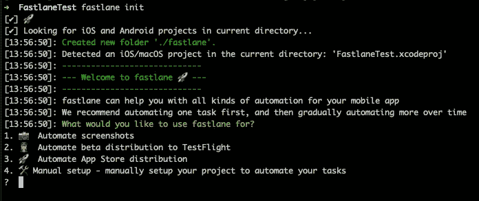
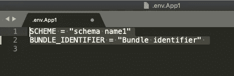

# 如何使用浪子部署多个目标到 TestFlight，Xcode iOS🚀🚀

> 原文：<https://blog.devgenius.io/how-to-use-fastlane-to-deploy-multiple-targets-to-testflight-xcode-ios-41e1b932ef3?source=collection_archive---------2----------------------->


一个关于如何在 8 个简单的步骤中部署多个目标 iOS 应用程序到 TestFlight 的紧凑教程。

让我们开始吧。

> 1.[首先，安装浪子](https://docs.fastlane.tools/getting-started/ios/setup/)
> 
> 2.建立浪子

打开控制台->导航您的项目目录并运行:

```
fastlane init
```



> 这个命令会问你—“*你想用浪子做什么？”*

选择第二个选项:

```
👩‍✈️️ *Automate beta distribution to TestFlight*.
```

该选项将设置基本设置，我们将扩展该设置以处理多个目标。

> 3.为每个目标创建环境变量

例如，我们有两个目标 App1 和 App2。为它们中的每一个创建一个环境文件，该文件将保存一个**环境变量**方案名和捆绑包。文件名应采用. env . your target name . Create . env . app 1 和. env.App2 文件的格式。

例如，fou 可以在控制台中创建这两个文件:

```
touch .env.App1
touch .env.App2open -a Xcode .env.App1
```



相应地填充两个文件，每个文件都有您唯一的方案名称和每个应用程序目标的捆绑包:

```
SCHEME = “schema name App1”
BUNDLE_IDENTIFIER = “Bundle identifier App1”
```

> 4.修改应用程序文件

打开应用程序文件并更改行:

```
app_identifier(“your bundle identifier”)
```

要使用定义的变量:

```
app_identifier(ENV[‘BUNDLE_IDENTIFIER’])
```

> 5.生成特定于应用程序的密码

[要将构建上传到 TestFlight，您需要生成一个*特定于应用程序的密码。*](https://docs.fastlane.tools/best-practices/continuous-integration/#application-specific-passwords)

> 6.快速文件和 Gymfile

其余两个文件 Fastfile 和 Gymfile 的上下文对于所有项目来说都是完全通用的。他们知道从我们的文件中获取一个方案和包标识符。

浪子文件——是一个主要的浪子文件，为所有目标建立并上传到试飞。

Gymfile —指定了创建*的位置和方式。ipa 文件。

[从我的 GitHub repo 下载 Fastfile 和 Gymfile，放入 fastlane 目录。](https://github.com/tanyaberezovsky/fastlane_upload_multiply_targets_iOS)

> 7.在浪子目录中创建一个名为“builds”的目录

我们的 Gimfile 配置为创建所有*。此目录中的 ipa 文件。

> 8.运行和测试

运行特定目标:

```
fastlane do_everything — env TargetName
```

运行所有目标:

```
fastlane do_everything
```

# 🤩 🤩 🤩 🤩 🤩 🤩 🤩 🤩 🤩 🤩 🤩 🤩 🤩 🤩 🤩 🤩 🤩

> 最后，激动人心的部分！

浪子在我的真实环境(包括四个目标)中运行完毕后，我在控制台中收到以下消息:

```
fastlane.tools just saved you 92 minutes! 🎉
```

老实说，它更节省了我，因为我不能立即执行一个又一个动作。

总之，毫无疑问，浪子是 100%值得使用。

[从 GitHub 下载所有文件](https://github.com/tanyaberezovsky/fastlane_upload_multiply_targets_iOS)

感谢您阅读本文。

祝你好运！

附:本教程部分基于 SANDEEP MUKHERJEE 的[将浪子与多个目标集成为一个 iOS 项目](https://medium.com/@vizllx/integrating-fastlane-with-multiple-target-for-a-single-ios-project-7920b32e1cb4)和 [fastlane 教程:raywenderlich.com 琳赛·斯科特入门](https://www.raywenderlich.com/233168-fastlane-tutorial-getting-started)在那里你可以阅读更多关于用 Fastfile 编写的 Gymfile 和 do_everything 循环的内容。