# 初学者如何使用 Javascript 中的 fetch()

> 原文：<https://blog.devgenius.io/how-to-use-fetch-in-javascript-for-beginners-6937dd094e4a?source=collection_archive---------2----------------------->

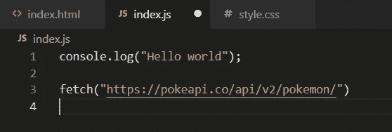

fetch("insertUrlHere ")

# 什么是 fetch()

**fetch()** 函数抓取数据。这是一个全局的**方法**，可以用在**窗口**对象上。这意味着我们可以通过调用 fetch()并传入一个资源的 URL 作为参数来使用它。为了使用 fetch()返回的数据，我们需要链接 then()方法。

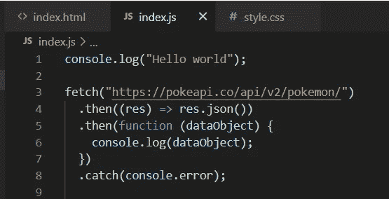

用 then()和 catch()承诺链接的 Fetch。

# 通过 fetch()函数使用 PokeApi

如上所示，fetch 需要一个链接或路径，这样它就可以*从某处获取*资源，比如应用程序编程接口(API)。对于我们的例子，我们使用 PokeAPI。默认情况下，fetch()函数使用 GET 方法，但是我们也可以用其他方法来使用 fetch。

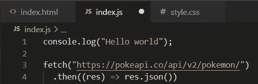

# 第一个。然后()我们代码的一部分

在这个例子中，在第一个 **then()** 中，我们使用 ***箭头*** 符号创建了一个 ***匿名*** 函数，并且我们将“res”作为参数传入。这可以被命名为我们喜欢的任何名称，但基本上我们从 fetch 中获得我们的响应，然后在我们的 ***回调*** 函数中将其作为参数传递。

# res.json()

**json()** 方法返回一个 ***promise*** ，解析*解析*主体文本的结果为 **JSON** 。结果不是 JSON，而是将 JSON 作为输入并解析它以创建 JavaScript 对象的结果。

# **第二个。然后()我们代码的一部分**

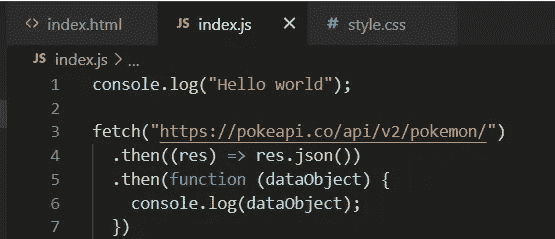

在我们的第二个 **then()** 中，我们正在将*数据*传递到我们的匿名函数中，该函数是从我们的第一个 **then()** 中获得的，我们现在可以将它用作 ***对象*** ，因为这是由于 **json()** 的缘故。同样，我们不必使用 *dataObject* 作为参数，它可以被命名为任何名称。我们将它命名为 *dataObject* ,只是为了让我们的例子能够跟踪我们的函数中发生了什么。

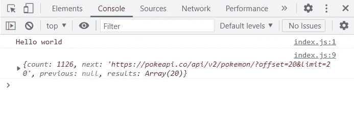

我们现在应该可以成功地获得一个 ***对象*** 的 console.log，它是由我们的 **fetch()** 和我们的两个 **then()** 使用 PokeApi 返回的。

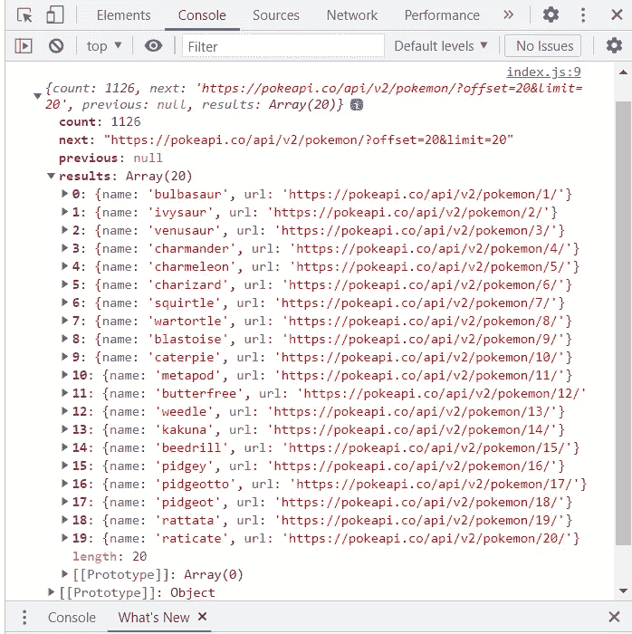

进一步观察，我们可以看到我们现在有一个由 20 个口袋妖怪 ***对象*** 组成的 ***数组*** ，由于我们的 **fetch()** 和 **then()** 的

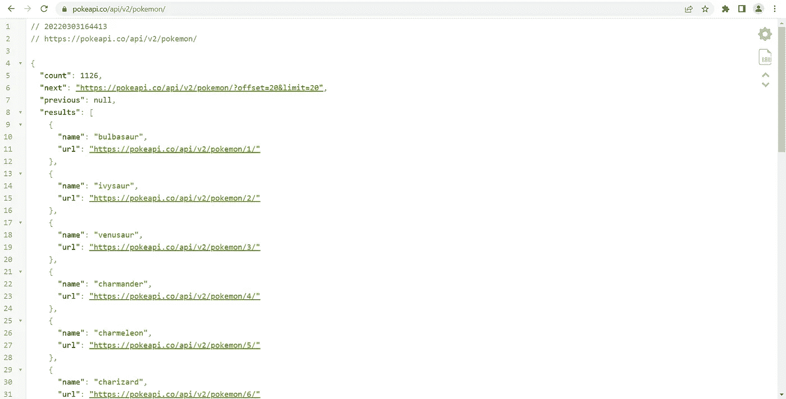

在浏览器中输入我们的获取链接

如果您键入我们在示例中使用的链接，*"*[*【https://pokeapi.co/api/v2/pokemon/】*](https://pokeapi.co/api/v2/pokemon/)*"*我们会看到从网页上的 **JSON** 中获取的数据。在本例中，当我们使用 **fetch()** 时，这就是我们获取数据的地方。它看起来非常类似于 **Javascript** 中的**对象**，基本上只是用引号将*字符串化为*。

# 。catch()

**catch()** 只有在我们遇到 **fetch()** 或者我们的 **then()** 的 ***承诺*** 出错的情况下才会运行。为了使用 **fetch()** ，我们甚至不需要使用它。然而，如果我们的代码没有成功执行，为了知道发生了什么，这是有用的。

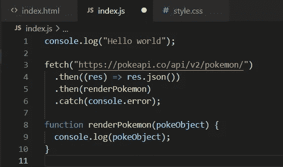

使用回调函数

*恭喜！*你现在知道如何使用 **fetch()** 。尽管使用 **fetch()** 还有更多方法，但这应该会给你一个坚实的起点。

# 带有 Fetch()的基本 Pokedex 1–20 示例

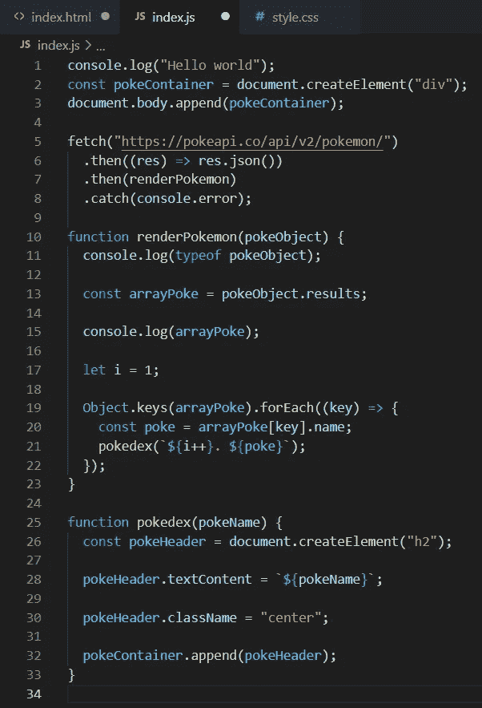

使用从 fetch()中获得的数据

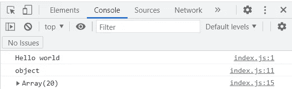

控制台.日志

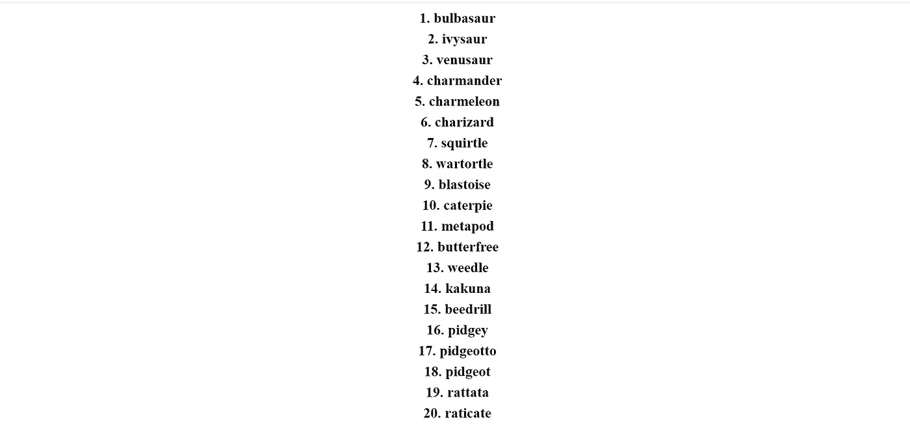

pokedex 1–20