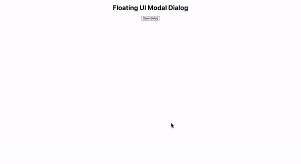

# 如何在 react 中使用浮动用户界面

> 原文：<https://blog.devgenius.io/how-to-use-floating-ui-with-react-cd605a1410b9?source=collection_archive---------2----------------------->


# 目的

因为我需要在 React 项目中使用浮动用户界面，但是没有太多的资源。所以，我应该做了很多研究。为了帮助你的研究，我将分享我的知识。

# 什么是浮动 ui？

```
Floating UI is a low-level toolkit to create floating elements. Tooltips, popovers, dropdowns, menus, and more.
```

我从官方指南中摘录了以上句子。浮动 ui 最重要的一点是。这个工具包是用来创建浮动元素的，而不是一个包含浮动元素的动画库。换句话说，你可以通过 css 或任何其他库来添加你的动画，但浮动 ui 本身没有。例如，如果你想创建动画淡入模式，你需要自己的动画，没有浮动用户界面。实际上，在官方指南中有一些包含动画的例子，但是这些例子使用的是动画库 framer motion。

另一方面，就浮动元素而言，这个库非常有用，因为浮动 ui 可以检测元素的移动，并通过点击、滚动、鼠标移动等方式轻松地改变动作。官方指南的首页有几个例子，你可以查看一下。也许你可以自己创建这些浮动项目，但这需要花费很多时间，需要写很多代码，尤其是 css 部分。

是的，这是创建一些浮动元素的惊人功能。然而，在我看来，没有足够的信息作出反应。有一些教程、例子..但是与普通的 JavaScript 部分相比还不够。你需要用 react 阅读官方文档来创建你的浮动项目。react part 有 ReactDOM 交集，可以用来通过使用 floating-ui 的一些内置自定义钩子(如 useHover、useDismiss)来管理浮动元素的“何时”和“如何”。这比基本浮动更复杂。与交互部分相比，浮动部分通过使用自定义手册“使用浮动”来管理“在哪里”放置元素。

好吧，让我们来看一个例子。在这种情况下，我将把重点放在模态部分，因为我很难通过使用这个库来实现这个特性。

# 示例(带反应的模态)

## 步伐

1.  通过创建-反应-应用程序创建一个基本的反应应用程序

```
npx create-react-app floating-ui // This name is up tp you
```

2.创建一个“Dialog.js”文件，并编写下面的代码。这段代码显然是必不可少的，因为几乎所有重要的代码都在这段代码中(这段代码主要来自官方指南的例子)。我将解释重要的部分。您可能注意到了，这段代码有两部分。使用浮动部分和使用交互部分。正如我上面提到的，useFloating 是使用“在哪里”放置你的元素，useIntersection 是使用“如何和何时”发生关于你的元素的事件。重要的是，useFloating 基本上是在开放模态的“之前”使用，相反，useIntersection 是在开放模态的“之后”使用。这就是为什么在 useFloating 内部，手动设置 useState open 在带有子元素和 props 的 clone 元素内部使用 useInteraction 的 getReferenceProps 打开 modal。开放模态部分显然“先于”开放部分，所以这是一个 useFloating 的角色，而不是 useInteraction。useInteraction 部分比 useFloating 部分简单，因为 useIntersections 有更有意义的名称(useClick、useRole、useDismiss、FloatingPortal、FloatingOverlay、FloatingFocusManager)，它们只是管理关于模态的“如何和何时”。

```
// Dialog.jsimport "./Dialog.css"; import React, { cloneElement, useState } from "react"; import {
  useFloating,
  useInteractions,
  useClick,
  useRole,
  useDismiss,
  useId,
  FloatingPortal,
  FloatingOverlay,
  FloatingFocusManager,
} from "@floating-ui/react-dom-interactions"; const Dialog = ({ render, open: passedOpen = false, children }) => {
  const [open, setOpen] = useState(passedOpen);
 const { reference, floating, context } = useFloating({
    open,
    onOpenChange: setOpen,
  }); const id = useId();
  const labelId = `${id}-label`;
  const descriptionId = `${id}-description`; const { getReferenceProps, getFloatingProps } = useInteractions([
    useClick(context),
    useRole(context),
    useDismiss(context),
  ]); return (
    <>
      {cloneElement(
        children,
        getReferenceProps({ ref: reference, ...children.props })
      )}
      <FloatingPortal>
        {open && (
          <FloatingOverlay
            lockScroll
            style={{
              display: "grid",
              placeItems: "center",
              background: "rgba(25, 25, 25, 0.8)",
            }}
          >
            <FloatingFocusManager context={context}>
              <div
                {...getFloatingProps({
                  ref: floating,
                  className: "Dialog",
                  "aria-labelledby": labelId,
                  "aria-describedby": descriptionId,
                })}
              >
                {render({
                  close: () => setOpen(false),
                  labelId,
                  descriptionId,
                })}
              </div>
            </FloatingFocusManager>
          </FloatingOverlay>
        )}
      </FloatingPortal>
    </>
  );
}; export default Dialog
```

3.创建 Dialog.css 文件并对其进行自定义。

```
// Dialog.css.Dialog {
  background: white;
  color: black;
  padding: 15px;
  border-radius: 6px;
  margin: 0 15px;
}
```

4.导入 Dialog.js 文件，如下所示使用它。请注意，当您在步骤 2 中编写代码 cloneElement 和带有道具的子元素时。因此，您可以使用触发器(如按钮)作为对话框的子对话框，而无需 onClick。

```
// App.jsimport "./App.css";
import Dialog from "./Dialog"; function App() {
  return (
    <div className="App">
      <h1>Floating UI Modal Dialog</h1>
      <Dialog
        render={({ close, labelId, descriptionId }) => (
          <>
            <h1 id={labelId}>This is a dialog!</h1>
            <p id={descriptionId}>
              Now that we've got your attention, you can close this.
            </p>
            <button onClick={close}>Close</button>
          </>
        )}
      >
        <button>Open dialog</button>
      </Dialog>
    </div>
  );
}
```

5.下面是屏幕。这是预期的工作


好了，你完成了基础部分。所以，我会用 Q 和 a 解释更多关于模态的其他需求。

# 问和一部分

当我们想用这个模态滚动时，我们应该怎么做？

A.如果你移除了 FloatingOverlay 里面的锁屏属性，你可以用模态来滚动你的应用。正如你可能知道的，叠加的背景是通过浮动叠加来管理的，所以如果你调整背景样式或删除它，你可以清楚地看到滚动的背景。

拆下锁头

```
<FloatingOverlay
            // lockScroll
            style={{
              display: "grid",
              placeItems: "center",
              background: "rgba(25, 25, 25, 0.8)",
            }}
          >
```

屏幕


问:我们如何放置这个情态动词的具体位置(右，左，左下…)？

A.目前我在 FloatingOverlay 设置了“placeItem: center”，所以如果你想设置“左上”，可以用“placeItem: start”，如果你想设置“右下”，可以用“placeItem: end”(这只是一个 css)。但是如果你想把这个模态放在一个特定的位置，你需要在你的 Dialog.css 中使用 place 比如“bottom: 3%”和“position: absolute”来设置一个精确的位置

移除显示网格并放置项目

```
<FloatingOverlay
            lockScroll
            style={{
              // display: "grid",
              // placeItems: "center",
              background: "rgba(25, 25, 25, 0.8)",
            }}
          >
```

并添加 DIsplay.css

```
.Dialog {
  position: absolute; // Add
  bottom: 3%; // Add
  right: 3%; // Add
  background: white;
  color: black;
  padding: 15px;
  border-radius: 6px;
  margin: 0 15px;
}
```

屏幕



问:我们如何在这个对话框中使用“useRef ”?它不起作用。

A.您需要在您的外部触发器上添加“div”或任何其他标签，因为浮动 ui 在您的最外部标签中添加了 aria-expand 和 aria-haspopup 属性。这就是为什么你需要添加它。

像下面这样添加 useRef 和 handler。不要忘记添加外部 div 和内部 ref，否则您的代码将无法运行。

```
// App.jsimport { useRef } from "react";
import "./App.css";
import Dialog from "./Dialog"; function App() {
  const dialogRef = useRef(null);
  const handleDialogRef = () => {
    dialogRef.current.click();
  };
  return (
    <div className="App">
      <h1>Floating UI Modal Dialog</h1>
      <Dialog
        render={({ close, labelId, descriptionId }) => (
          <>
            <h1 id={labelId}>This is a dialog!</h1>
            <p id={descriptionId}>
              Now that we've got your attention, you can close this.
            </p>
            <button onClick={close}>Close</button>
          </>
        )}
      >
        <div> // most important part to add
          <button ref={dialogRef}>Open dialog</button> // add ref here
        </div>
      </Dialog>
      <button onClick={handleDialogRef}>Open dialog by Ref</button>
    </div>
  );
} export default App
```

屏幕。Ref 工作正常。厉害！


# 结论

浮动 ui 对于管理你的浮动元素非常有用，所以如果你想灵活的使用你的浮动元素，你可以选择浮动 UI！！

# 参考

*   官方文件:[https://floating-ui.com/](https://floating-ui.com/)

感谢您的阅读！！