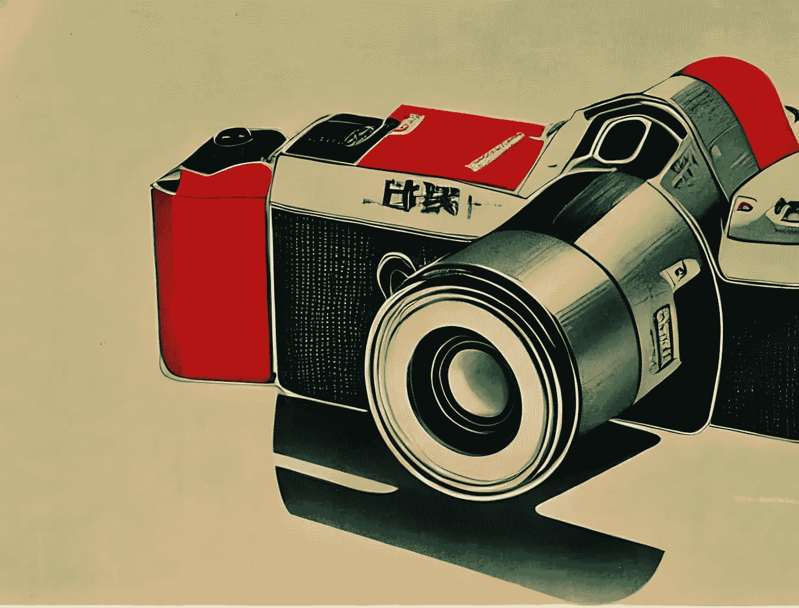
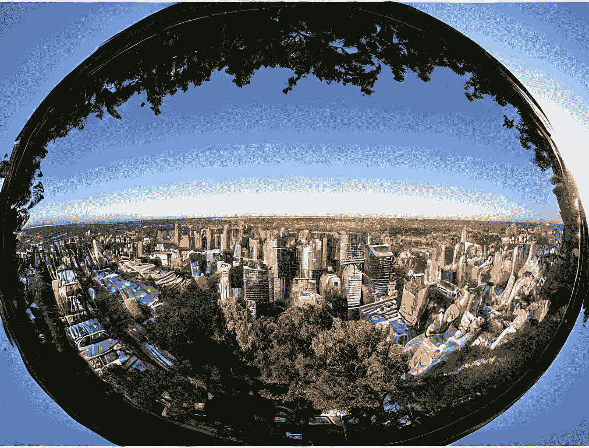

# 如何利用焦距用 AI 创造更好的图像

> 原文：<https://blog.devgenius.io/how-to-use-focal-length-to-create-better-images-with-ai-1fe5be70732b?source=collection_archive---------3----------------------->



图片由[塞缪尔](https://medium.com/@el3um4s)

今天，我想知道给人工智能提示增加焦距是否会极大地改变结果。剧透警报:是的。此外，我有兴趣了解如何使用这个功能来改善人工智能生成的图像。如果你愿意，请跟随我踏上这段旅程。

首先，一些理论概念。推荐阅读[摄影中什么是焦距？](https://photographylife.com/what-is-focal-length-in-photography)。总之，焦距是一个代表所用镜头视角的数字。它越低，现实中可以永生的部分就越大。越高，我们能拍摄的越远。这张图(摘自我刚刚推荐的文章)很好地解释了这一点:


由[撰写的另一篇有趣的文章《暗室](https://thedarkroom.com/focal-length/)》公布了这个方案:


# 鱼眼

我可以从鱼眼镜头开始。这个镜头的焦距是 8 毫米。在这种情况下，镜头比我们的视线要宽得多。这是结果:



图片由[塞缪尔](https://medium.com/@el3um4s)


图片来自[塞缪尔](https://medium.com/@el3um4s)

# 风景镜头:14 毫米和 28 毫米

现在我要求人工智能使用 14 毫米镜头。我用它作为提示:

```
high quality night photograph of docklands in london,
dimly lit cirrus clouds, octane render, colorful,
architecture photography, 14mm 114°
```


图片由[塞缪尔](https://medium.com/@el3um4s)


图片由[塞缪尔](https://medium.com/@el3um4s)拍摄

如果我把镜头换成 28 毫米的，我会得到类似的结果:


图片由[塞缪尔](https://medium.com/@el3um4s)拍摄


图片由[塞缪尔](https://medium.com/@el3um4s)

# 人像镜头:35 毫米、50 毫米和 85 毫米

35、50 和 85 mm 镜头可用于生成人像。我已经贴了[一些人像的例子](https://medium.com/mlearning-ai/10-ai-prompts-for-realistic-photography-portraits-da5edeacb031)。例如，对于 35mm，我得到的结果如下:


图片由[塞缪尔](https://medium.com/@el3um4s)

如果我使用 50 毫米镜头，我会得到这个:


图片由[塞缪尔](https://medium.com/@el3um4s)拍摄

用 85 毫米镜头，我得到了这个:


图片由[塞缪尔](https://medium.com/@el3um4s)

# 体育摄影镜头:135 毫米、200 毫米和 300 毫米

生成体育赛事图像需要更多的工作。或者这不是我最喜欢的领域。不过焦距 135mm，200mm，300mm 的镜头都可以。这是结果:

```
Basketball Photography with the Sony 135mm f/1.8 GM
```


图片由[塞缪尔](https://medium.com/@el3um4s)

```
motocross race on dirt jump, canon 200mm, realistic, detailed, 4k
```


图片由[塞缪尔](https://medium.com/@el3um4s)

```
a man climbing up a rocky mountain, no ropes,
highly cinematic, dramatic, beautiful lighting, god rays,
award winning photograph, national geographic,
highly detailed, 4k, canon 300mm, f/4
```


图片由[塞缪尔](https://medium.com/@el3um4s)拍摄

# 野生动物和鸟类:400 毫米 e 800mm 毫米

最后，我尝试生成动物和鸟类的图像。在这种情况下，我使用 400 毫米和 800 毫米镜头。

```
a highly detailed cinematic photograph of a lonely penguin on the north pole,
in the morning mist, ultra realistic, beautiful lighting,
by annie leibovitz, hasselblad, 400mm,
bokeh, photorealistic, hyperrealistic, octane, masterpiece
```


图片由[塞缪尔](https://medium.com/@el3um4s)拍摄

```
photograph of a flying eagle, ultra realistic,
beautiful lighting, hasselblad, 800mm, bokeh,
photorealistic, hyperrealistic, octane render, unreal engine
```


图片由[塞缪尔](https://medium.com/@el3um4s)

显然，输入镜头名称是不够的，还必须使用合适的提示。我怀疑 AI 图像生成遵循与摄影相似的规则。所以，除了镜头的类型，曝光时间，景深和光线也很重要。我要说，仍然有实验要做。

感谢阅读！敬请关注更多内容。

***不要错过我的下一篇文章—报名参加我的*** [***中邮件列表***](https://medium.com/subscribe/@el3um4s)

[](https://el3um4s.medium.com/membership) [## 用我的推荐链接- Samuele 加入媒体

### 阅读萨缪尔的每一个故事(以及媒体上成千上万的其他作家)。不是中等会员？在这里加入一块…

el3um4s.medium.com](https://el3um4s.medium.com/membership)