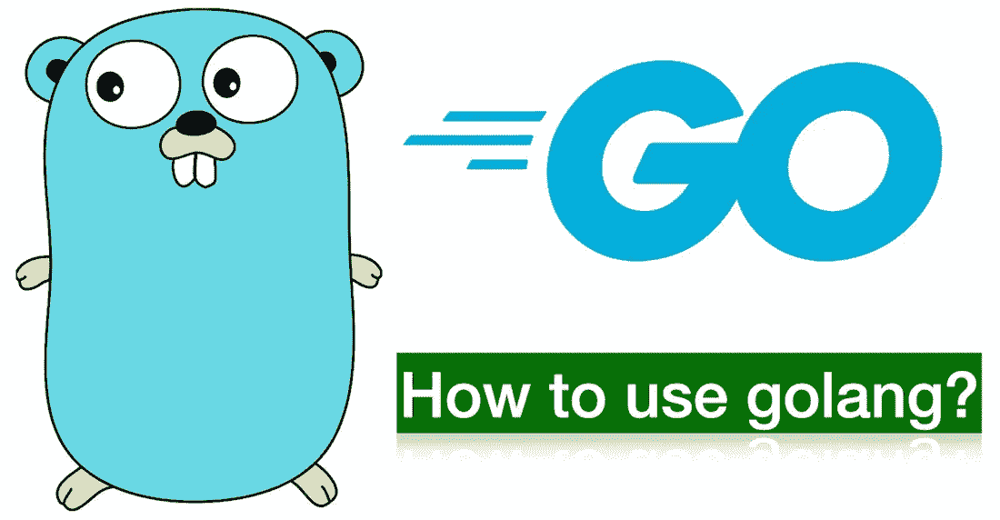
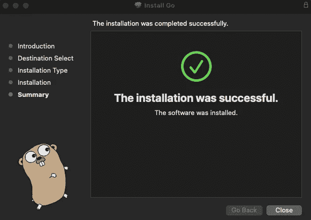
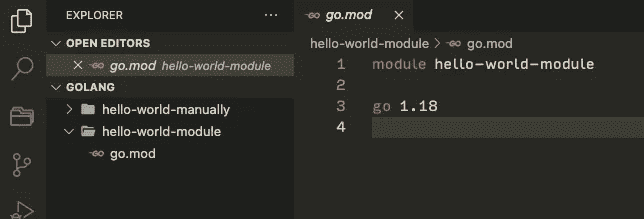

# 如何使用 golang

> 原文：<https://blog.devgenius.io/how-to-use-golang-8981a952c7f3?source=collection_archive---------6----------------------->



# 目的

我知道 golang 现在越来越受欢迎，我想学习和分享我关于 golang 的知识。

# golang 是什么？

golang 是 Google 在 2009 年开发的开源编程语言。golang 最重要的两个特性是简单性和并发性。这些功能源自谷歌想要解决的问题，因为谷歌是拥有大量开发人员的最大公司之一。

一般来说，开发人员有自己的偏好，这是关于语法和方法…几乎所有的编程语言都允许他们写“灵活的”代码，因为他们的偏好。然而，这些偏好有时会导致一个问题，因为如果每个人都编写一些不同语法代码，那么这些项目代码就完全是不可读的代码。因此，如果你的项目团队想要使用“灵活的”编程语言，你的团队需要创建编码规则来整合代码库。这还不算太坏，但是项目中有很多人的情况怎么样呢？有人可能会严格遵循编码规则，但有人不会。

因此，golang 省略了一些主要功能，如 OOP、继承和 try-catch 错误处理，以及 map、filter 方法来编写简单的代码(过去没有泛型，但最近增加了这个功能，因为我在官方找到了一些关于泛型的文档)。我知道有人抱怨这个决定，我部分同意这个意见。我熟悉 JavaScript，我知道 try-catch 错误处理和映射、过滤功能非常有用。尤其是映射和过滤功能。老实说，我几乎整天都在使用这两种方法，因为这两种方法对于减少代码量非常有用。由以下语法编写的三元运算符(？:而不是 if else)也是如此。即使这些功能非常有用，但不同的解决方案增加了代码的复杂性，这就是 golang 省略这些功能的原因(未来的版本可能会有这些功能，但这是经过大量讨论后的结果，因为如果一个功能被添加到编程语言中，就很难省略)。这个想法意味着 golang 更专注于重要的事情(如果这个想法有争议的话)。

并发性也是 golang 的重要特性，因为有些程序并不擅长处理并发性(比如 PHP)。在 golang 中，他们有像 go routine 和 channel 这样的包来处理并发请求。正如我已经提到的，有人抱怨 go 是因为这种语言的简单，但是我没有发现任何关于并发性的抱怨，仅仅是因为这个特性太棒了。

我重点提到了 golang 的两个主要特性，但是还有很多好的特性，比如垃圾收集，因为本地语言而编译非常快，go 模块有很多模块，如果你需要就导入，诸如此类。我想再一次强调 golang 语言的重要性。

好了，关于 golang 是什么，已经说得够多了。我们来举个例子。

# 示例(Hello world)

## 步伐

1.  在官方网站下载 go 安装程序。您可以看到如下所示的窗口，并按照说明进行操作。



2.您需要将您的路径设置为环境变量(这类似于我之前关于 rust 的文章)。

```
On your termimal
> cd // Go to your home directory
> vim ~/.zshrc  
// If you don't have this file, you need to create it(touch .zshrc).You can check if this file exists "ls -a" command. Of couse you can use open or something instead of vim. Set below lines of code inside .zshrc file, and save it.
export PATH="/usr/local/go/bin" Confirm above lines on your terminal
> source ~/.zshrc Notice: If it's doesn't work inside your working directory,you need to run "source ~/.zshrc" on your console inside your working directory(For example, if you want to use golang inside "golang/hello-world" you need to run "source ~/.zshrc" on your console inside this directory. I don't know if this procedure is needed for everyone, but at least that's necessary for me.) This is all you needed to set golang's path on your local(probably...lol)
```

3.检查您的 go 版本以确认安装。如果您在控制台上键入“go version”时看到下面的消息，这表明在您的本地上成功安装了 golang(如果您看到消息“zsh: command not found: go”，请再次检查您的路径)。

```
> go version
go version go1.18.3 darwin/amd64
```

4.创建你的工作目录(如果你的路径在这里不存在，你需要运行“source ~/。zshrc "在您的控制台上的这个目录中)

```
> mkdir golang // the directory name is up to you
cd golang
```

5.您可以手动创建文件，也可以使用 go 模块。我建议你使用 go 模块，因为它更容易，但以防万一，我会与你分享两种方式。

## 版本 1:手动创建目录和文件

5–1–1.创建目录和文件

```
> mkdir hello-world-manually
> cd hello-world-manually > touch hello-world-manually.go
```

5–1–2.像下面这样写“hello world code”。go 有最小的包，所以即使你想使用基本的功能比如在控制台上输出一些字符串(比如“print: python”，“console.log: JavaScript”，“printf: C”)，你也需要导入“fmt”包。

```
// hello-world-manually.go package main import "fmt" func main() {
    fmt.Println("Hello, World!")
```

5–1–3.在控制台上运行您的代码

```
> go run hello-world-manually.go  // This command compiles your go file automatically.
Hello, World! If you want to convert to binary and run, you can do like below
> go build hello-world-manually.go // This command compiles your go file manually
> ls
hello-world-manually  hello-world-manually.go > ./hello-world // you can run your binary file directly
Hello, World
```

## 版本 2:使用 go 模块创建目录和文件

5–2–1.使用下面的命令创建文件夹和文件

```
> mkdir hello-world-module
> cd hello-world-module
```

5–2–2.运行下面的命令来创建 go mod 文件，该文件跟踪你想要的依赖关系。

```
> go mod init hello-world-module  // This name is up to you
```

5–2–3.你可以看到生成的文件“go.mod”和关于模块的代码如下



5–2–3.运行如下所示的命令(因为模块已经被跟踪，所以命令要简单得多)

```
> go run .
Hello, World!
```

# 结论

Golang 是一种非常简单而强大的语言，Google 开发了更多关于 golang 的特性，所以这种语言在未来会越来越流行。如果你想学习一门新的后端语言，golang 是值得学习的。

# 参考

官方文件:[https://go.dev/](https://go.dev/)

围棋教程:【https://www.tutorialspoint.com/go/index.htm 

围棋是什么？Golang 编程语言含义解释:[https://www . freecodecamp . org/news/what-is-go-Programming-Language/](https://www.freecodecamp.org/news/what-is-go-programming-language/)

围棋是什么？谷歌围棋编程语言简介:[https://acloudguru . com/blog/engineering/what-is-Go-an-intro-to-Google-Go-programming-lang-aka-golang](https://acloudguru.com/blog/engineering/what-is-go-an-intro-to-googles-go-programming-language-aka-golang)

Go 言語(golang)とは？ 人気が高まっている理由を言語の特徴を踏まえて解説！: [https://udemy.benesse.co.jp/development/system/golang.html](https://udemy.benesse.co.jp/development/system/golang.html)

並行処理と並列処理: [https://zenn.dev/hsaki/books/golang-concurrency/viewer/term](https://zenn.dev/hsaki/books/golang-concurrency/viewer/term)

感谢您的阅读！！