# 如何使用 Google cloud vision API 安全搜索检测来检测 Laravel 中图片上传上的露骨内容

> 原文：<https://blog.devgenius.io/how-to-use-google-cloud-vision-api-safe-search-detection-to-detect-explicit-content-on-image-ad2f3fb49122?source=collection_archive---------20----------------------->

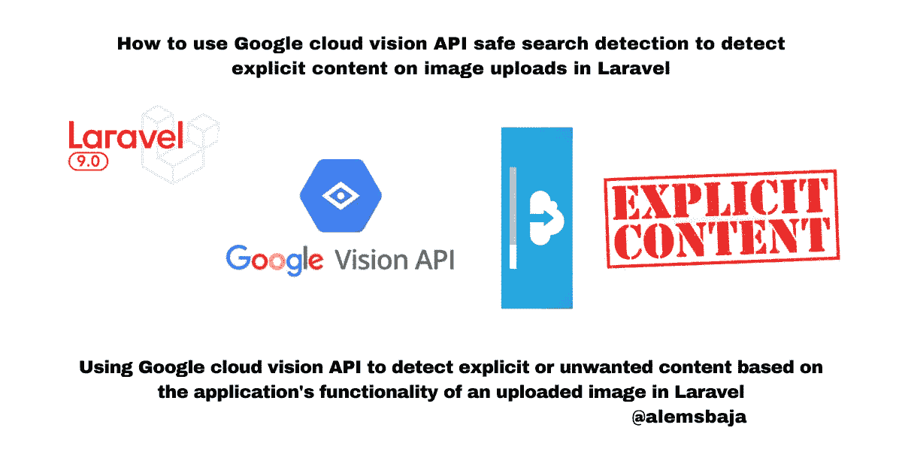

拉勒维尔的谷歌云愿景

在本文中，我们将了解如何使用 [Google cloud vision API](https://cloud.google.com/vision) 来检测明确的内容，并避免 Laravel 应用程序中不必要的图片上传。

**视觉 AI**

利用 AutoML 视觉从图像中获得洞察力。通过预先训练的视觉 API 模型检测情绪和理解文本。

新客户可以获得 300 美元的免费积分，用于购买 Vision AI。所有客户每月免费获得 1000 单位的图像分析费，不从您的点数中扣除。

*   使用机器学习来理解您的图像，具有行业领先的预测准确性
*   使用 AutoML Vision 训练机器学习模型，根据您的自定义标签对图像进行分类
*   使用 Vision AP 检测物体和人脸、读取笔迹并构建有价值的图像元数据

Vision API 通过 REST 和 RPC APIs 提供强大的预训练机器学习模型。为图像分配标签，并快速将它们分类到数百万个预定义的类别中。检测物体和人脸，阅读印刷和手写文本，并将有价值的元数据构建到您的图像目录中。

更多信息请访问 [**视觉 API 文档**](https://cloud.google.com/vision/docs)

注意:这可能适用于任何编程语言或框架。

这个 laravel 项目被命名为**Google _ Cloud _ Vision _ features _ in _ laravel**，以便对将要演示的 Google Cloud Vision API 的不同特性进行渐进式文档化。

为了保持这篇文章的简短，我们将使用这篇[文章](https://alemsbaja.hashnode.dev/how-to-upload-files-to-google-cloud-storage-from-a-laravel-application)中的这个[项目](https://github.com/RaphAlemoh/laravel_upload_using_google_cloud_storage)来对图像应用安全搜索检测。

我们将在这篇文章中使用 Laravel Fortify 和 Bootstrap 4[完成 Laravel 8 认证，以设置应用认证。](https://alemsbaja.hashnode.dev/complete-laravel-8-authentication-using-laravel-fortify-and-bootstrap-4-part-1)

对于本教程，我们将停留在文章的登录和注册部分。

如果你使用的是 Laravel 9.19，默认的搭建是 Vite 自带的。下面是如何[迁移](https://github.com/laravel/vite-plugin/blob/main/UPGRADE.md#migrating-from-vite-to-laravel-mix)

注意:我们将在后续教程中使用这个项目

> *接下来，在谷歌控制台中创建一个新项目*

**点击新建项目按钮**

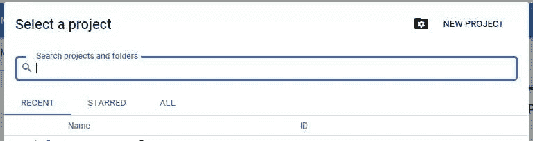

> *接下来输入项目的首选细节*

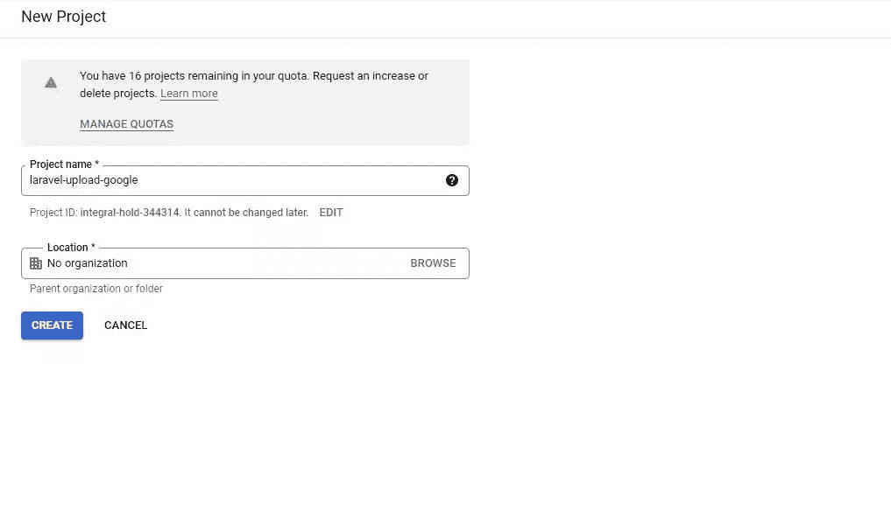

> *创建项目后，详细信息显示在仪表板上*

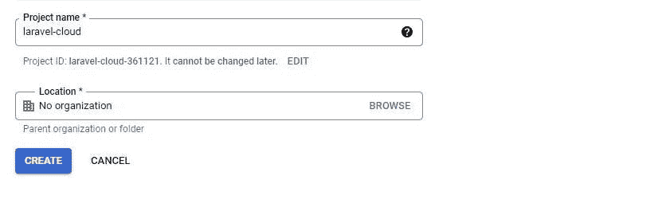

```
Project name
laravel-cloud-xxxxProject number
15331649xxxProject ID
laravel-cloud-xxxx
```

> *接下来，为这个项目创建一个服务帐户，以获取凭证的 json 文件*

单击导航并将鼠标悬停在 IAM $ Admin 上，然后单击服务帐户

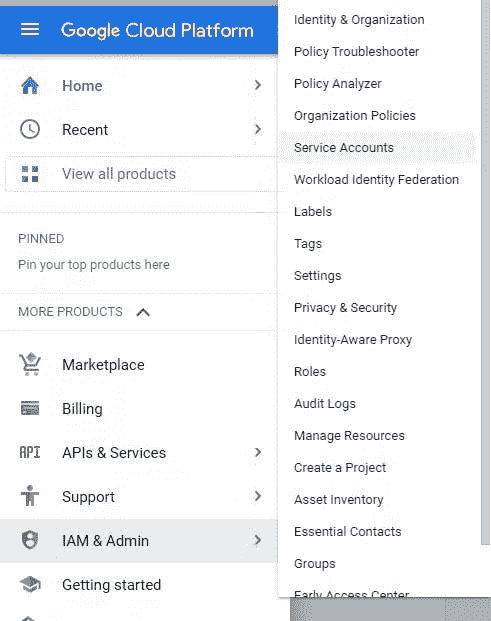

> *点击创建服务帐户，为创建的项目添加一个服务帐户*

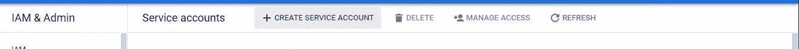

> *填写服务账户详情*

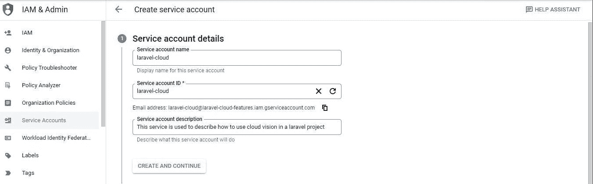

点击**创建并继续**

> ***授予此服务帐户对项目*** *的访问权限是可选的，我们可以稍后更新。*

单击继续

> *点击完成*

你会在这里下来的..

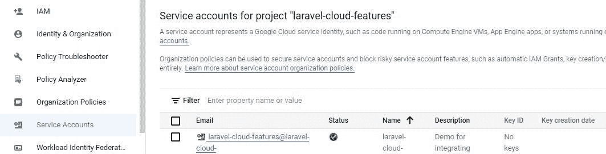

> *接下来，单击创建的服务，并转到 keys 选项卡部分，访问包含该项目的配置的 json 文件。*

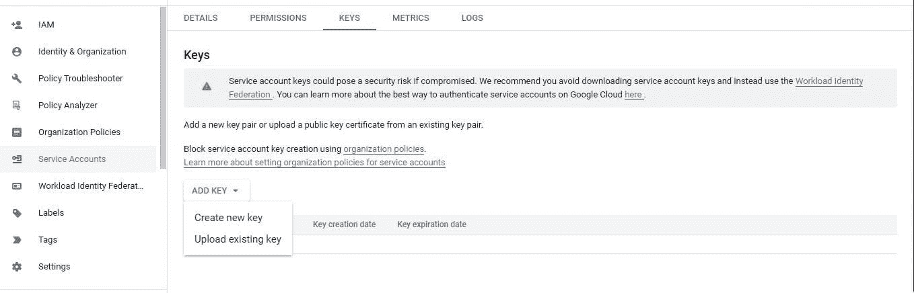

**点击新建**

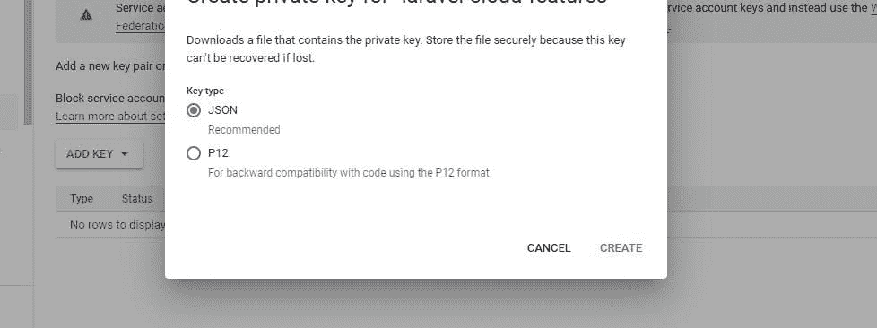

> 然后点击创建，它会自动将 JSON 文件下载到你的电脑上。

NB；有一个不要暴露 json 文件的警告。

请对这个 JSON 文件或凭证保密，否则 git 会忽略该文件，不让它进入版本控制系统

将 JSON 文件保存在 Laravel 的 config 文件夹中。

**我们还可以使用 env 变量来创建 JSON 文件的内容，并将其传递到数组中。**

> *接下来，让我们转到谷歌云视觉 API 集成*

**转到控制台**

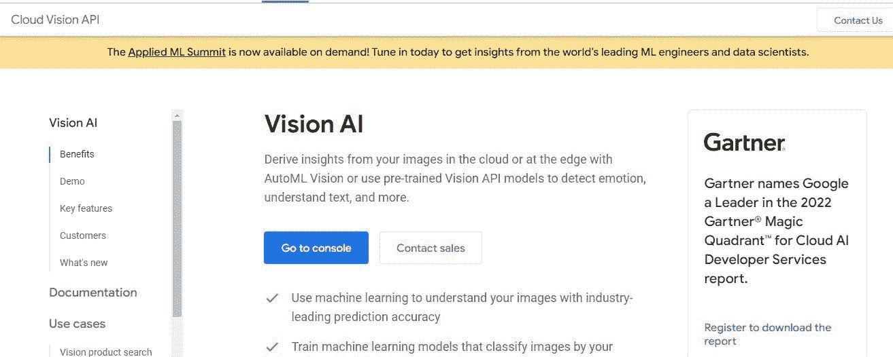

**控制台视图**

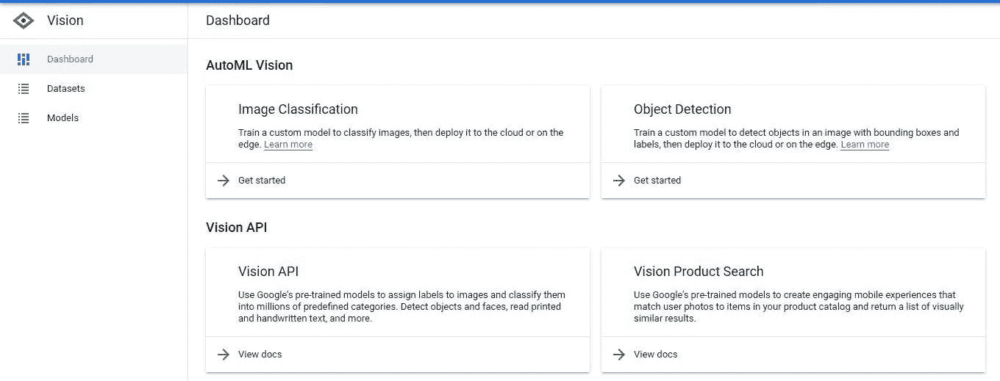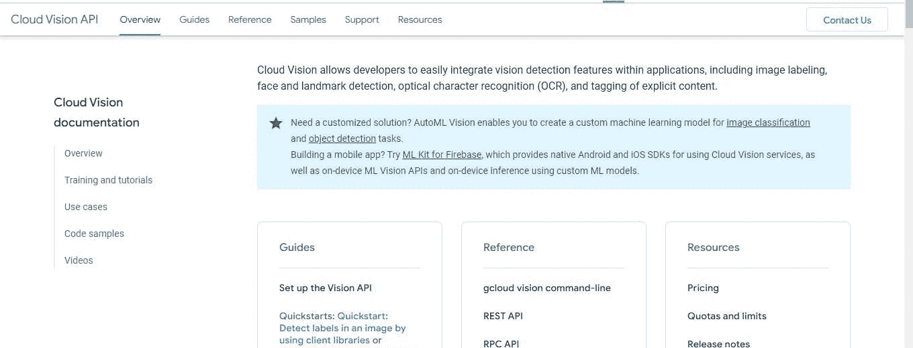

注意**如果你已经用完了免费试用**，你需要启用计费来使用这个 API

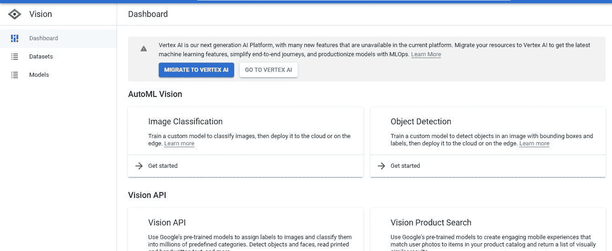

> *在控制台中搜索云视觉以启用它*

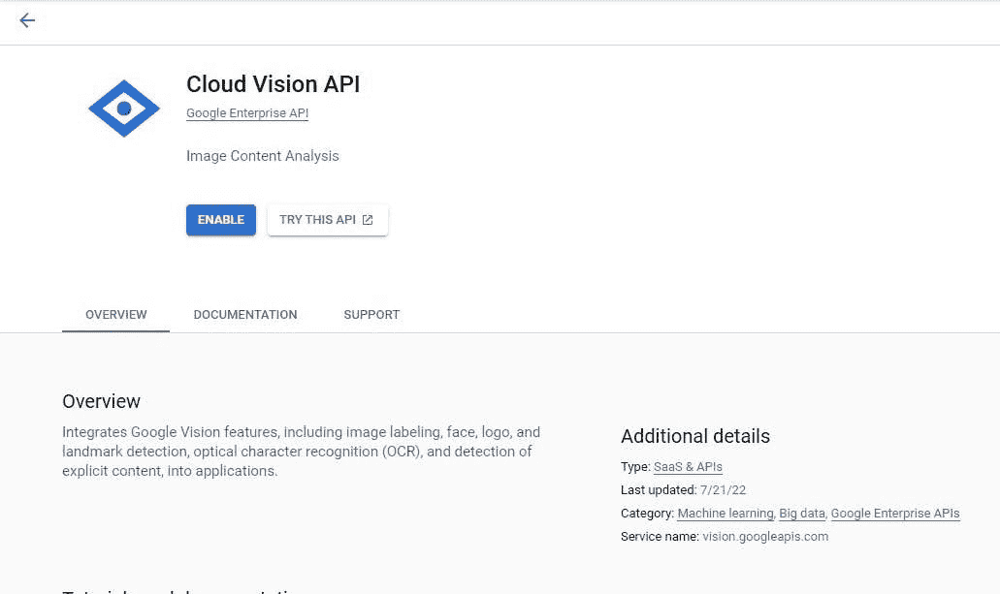

> *启用后，下面的屏幕显示了 API* 的用法

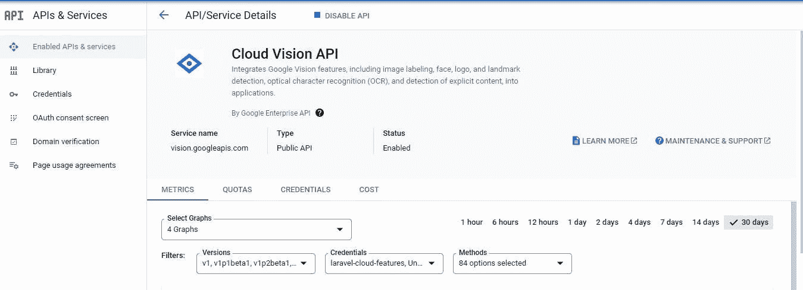

cloud vision API 的完整文档可从[这里](https://cloud.google.com/vision/docs/)获得

> *让我们将云视觉软件包集成到我们的 laravel 应用程序中，开始演示云视觉的功能。* [*云视觉 PHP 客户端*](https://packagist.org/packages/google/cloud-vision)

注意 **Google cloud vision 现在使用 v1/Annotator，建议继续使用它，因为旧版本很快就会过时**

```
composer require google/cloud-vision
```

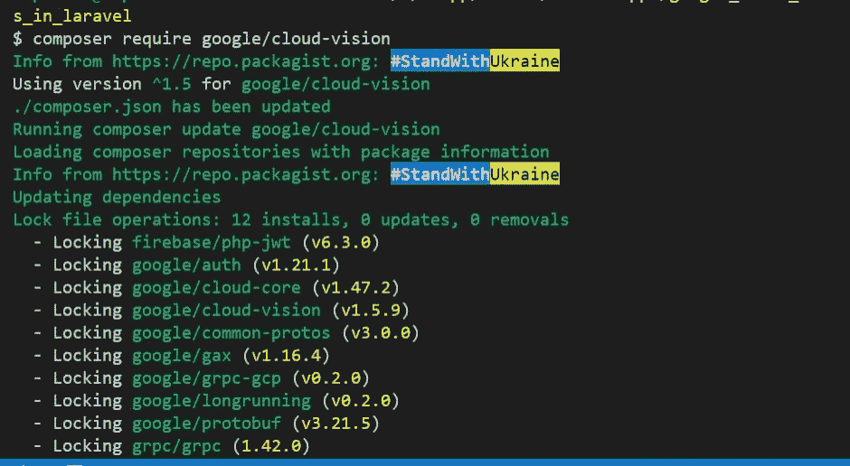

或者一次性安装整套组件:

```
composer require google/cloud
```

**随后要介绍的功能将从这一点开始，因为上面的细节都是一样的。**

> *在本教程中，我们将介绍* [*检测安全搜索*](https://cloud.google.com/vision/docs/reference/rpc/google.cloud.vision.v1#safesearchannotation)
> 
> ***安全搜索注释***

与图像相关的一组特征，由计算机视觉方法通过安全搜索垂直领域(例如，成人、欺骗、医疗、暴力)计算得出。

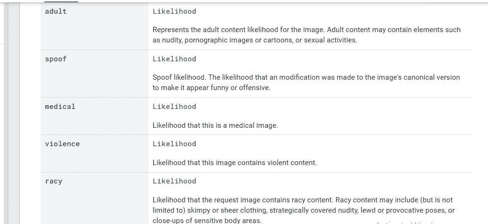

这里有一个[存储库](https://github.com/GoogleCloudPlatform/php-docs-samples/blob/master/vision/src/detect_safe_search.php)及其集成的例子

每个批注方法的响应可以是下面数组中的任何一个值。

```
$likelihoodNames = [
            'UNKNOWN', 'VERY_UNLIKELY', 'UNLIKELY',
            'POSSIBLE', 'LIKELY', 'VERY_LIKELY'
        ];
```

> *让我们回到我们的 Laravel 代码库…*

*   创建一个上传图像的基本表单

```
<form class="mx-1 mx-md-4" method="POST" action="{{ route('uploads.store') }}" enctype="multipart/form-data">[@csrf](http://twitter.com/csrf)<div class="d-flex flex-row align-items-center mb-4">
                                        <i class="fas fa-camera fa-lg me-3 fa-fw"></i>
                                        <div class="form-outline flex-fill mb-0">
                                            <label class="form-label" for="form3Example3c">Profile picture</label>
                                            <input type="file" id="form3Example3c" class="form-control [@error](http://twitter.com/error)('avatar') is-invalid [@enderror](http://twitter.com/enderror)" name="avatar" value="{{ old('avatar') }}" accept="image/*" required />[@error](http://twitter.com/error)('avatar')
                                            <span class="invalid-feedback" role="alert">
                                                <strong>{{ $message }}</strong>
                                            </span>
                                            [@enderror](http://twitter.com/enderror)
                                        </div>
                                    </div><div class="d-flex justify-content-center mx-4 mb-3 mb-lg-4">
                                        <button type="submit" class="btn btn-primary btn-lg">Update Profile Pic</button>
                                    </div></form>
```

> *导入 V1 图像注释器客户端*

```
use Google\Cloud\Vision\V1\ImageAnnotatorClient;
```

> *upload controller 类有两个方法用于显示表单和处理上传的图像*

```
public function store(Request $request)
    {
        $request->validate([
            'avatar' => 'required|image|max:10240',
        ]);try {// we can make the code neater by using a global helper function or a trait$imageAnnotatorClient = new ImageAnnotatorClient([
                //we can also keep the details of the google cloud json file in an env and read it as an object here
                'credentials' => config_path('laravel-cloud-features.json')
            ]);$image_path = $request->file("avatar");
            //get the content of the image
            $imageContent = file_get_contents($image_path);//run the safe search detection on the image
            $response = $imageAnnotatorClient->safeSearchDetection($imageContent);if ($error = $response->getError()) {
                // returns error from annotator client
                return redirect()->back()
                ->with('danger', $error->getMessage());
            }//get the annotation of the response
            $safe = $response->getSafeSearchAnnotation();$likelihood_status =  0;//the values in the array of the response are indexed from 0-5$likelihood_status = ($safe->getAdult() >= 3) ? 1 : 0;
            $likelihood_status = ($safe->getSpoof() >= 3) ? 1 : 0;
            $likelihood_status = ($safe->getViolence() >= 3) ? 1 : 0;
            $likelihood_status = ($safe->getRacy() >= 3) ? 1 : 0;if ($likelihood_status === 1) {
                //the image has some unwanted content there in
                return redirect()->back()
                ->with('danger', 'This image is not allowed on this platform!!!');
            }//close the annotation client
            $imageAnnotatorClient->close();//return home with a success message
            return redirect()->route('home')
                ->with('success', 'Uploaded successfully!!!');} catch (Exception $e) {
            return $e->getMessage();
        }
    }
```

> *有一个部分用于查看向云视觉 API 端点发出的请求*

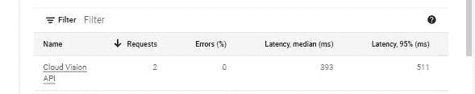

下面是教程[资源库](https://github.com/RaphAlemoh/google_cloud_vision_features)

感谢您阅读本文！！！。

如果你觉得这篇文章有帮助，请分享给你的网络，并随时使用评论区的问题，答案和贡献。

*原载于*[*https://alemsbaja . hashnode . dev*](https://alemsbaja.hashnode.dev/how-to-use-google-cloud-vision-api-safe-search-detection-to-detect-explicit-content-on-image-uploads-in-laravel)*。*