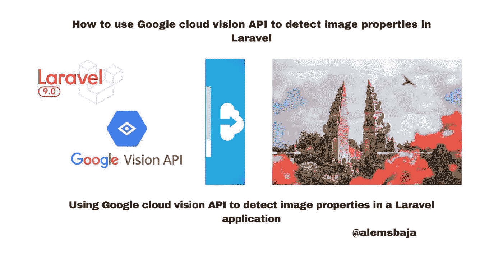
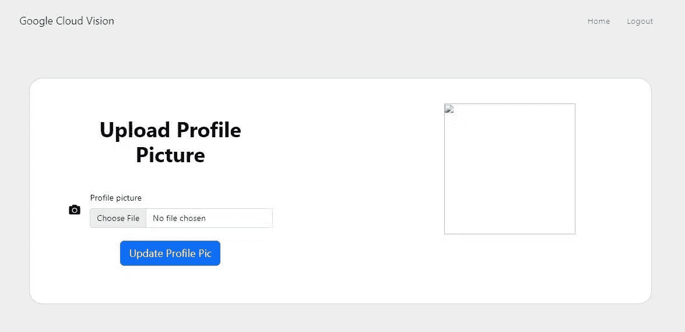
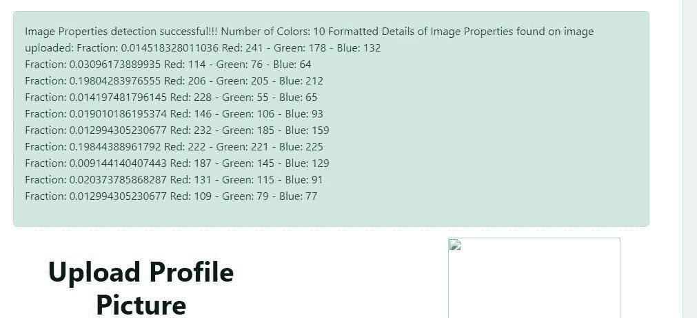

# 如何在 Laravel 中使用 Google cloud vision API 检测图像属性

> 原文：<https://blog.devgenius.io/how-to-use-google-cloud-vision-api-to-detect-image-properties-in-laravel-f165fb0fa528?source=collection_archive---------13----------------------->



Google cloud vision API 检测 Laravel 中的图像属性

在本文中，我们将了解如何使用 Google cloud vision API 光学字符识别(OCR)来检测 Laravel 应用程序中的图像属性。

[检测图像属性](https://cloud.google.com/vision/docs/detecting-properties)

图像属性功能检测图像的一般属性，如主色。

在本教程[如何使用 Google cloud vision API 安全搜索检测来检测 Laravel](https://alemsbaja.hashnode.dev/how-to-use-google-cloud-vision-api-safe-search-detection-to-detect-explicit-content-on-image-uploads-in-laravel) 中图片上传的露骨内容中，我们详细介绍了如何创建 Google Cloud Platform (GCP)项目、服务帐户凭证以及将 cloud vision 软件包集成到 Laravel 中。

为了保持这篇文章的简短，我们将直接探讨图像属性检测如何在文件上传上工作，因为我们已经有了一个用于上传文件的[表单。](https://github.com/RaphAlemoh/google_cloud_vision_features/blob/main/resources/views/uploads/create.blade.php)



**注意:为了清楚起见，每个特征在 web.php 文件中都有自己的路线。**

您也可以检查 github 上的一个特定分支，查看它的实现

*   **检测局部图像中的图像属性**

Vision API 可以对本地图像文件执行功能检测，方法是在请求正文中以 base64 编码字符串的形式发送图像文件的内容。

ColorInfo 字段不携带用于解释 RGB 值的绝对色彩空间的信息(例如，sRGB、Adobe RGB、DCI-P3、BT.2020 等)。).默认情况下，应用程序应该采用 sRGB 色彩空间。

这里有一个[存储库](https://github.com/GoogleCloudPlatform/php-docs-samples/blob/master/vision/src/detect_image_property.php)及其集成的例子。

我们可以在上传文件时在 post 方法中运行检测。

*   导入类

```
use Google\Cloud\Vision\V1\ImageAnnotatorClient;
// this HtmlStringclass is used to format the text detected on the image
use Illuminate\Support\HtmlString;
```

*   对上传的图像运行 propertyDetection

```
public function detectImageProperties(Request $request)
    {$request->validate([
            'avatar' => 'required|image|max:10240',
        ]);try {$imageAnnotator = new ImageAnnotatorClient([
                //we can also keep the details of the google cloud json file in an env and read it as an object here
                'credentials' => config_path('laravel-cloud.json')
            ]);# annotate the image
            $image = file_get_contents($request->file("avatar"));
            $response = $imageAnnotator->imagePropertiesDetection($image);
            $props = $response->getImagePropertiesAnnotation();print('Properties:' . PHP_EOL);$number_of_colors = count($props->getDominantColors()->getColors());$img_prop_content = '';foreach ($props->getDominantColors()->getColors() as $colorInfo) {printf('Fraction: %s' . PHP_EOL, $colorInfo->getPixelFraction());
                $color = $colorInfo->getColor();
                $img_prop_content .= "Fraction: {$colorInfo->getPixelFraction()} Red: {$color->getRed()} - Green: {$color->getGreen()} - Blue: {$color->getBlue()} <br>";
            }$formatted_image_props = new HtmlString("Image Properties detection successful!!! Number of Colors:  $number_of_colors Formatted Details of Image Properties found on image uploaded: $img_prop_content");return redirect()->route('home')
                ->with('success', $formatted_image_props);
        } catch (Exception $e) {
            return $e->getMessage();
        }
        $imageAnnotator->close();
    }
```

*   我们将上传此图像，并查看检测图像属性如何返回内容


图片来源:[杰里米·毕晓普](https://unsplash.com/photos/QUwLZNchflk)在 Unsplash 上。

*   图像属性详细信息响应



*   检测远程图像中的文本(谷歌云存储，Cloudinary，S3 桶等)

为了方便起见，Vision API 可以直接对位于 Google 云存储或 Web 上的图像文件执行特征检测，而无需在请求正文中发送图像文件的内容。

ColorInfo 字段不携带用于解释 RGB 值的绝对色彩空间的信息(例如，sRGB、Adobe RGB、DCI-P3、BT.2020 等)。).默认情况下，应用程序应该采用 sRGB 色彩空间。

**注意:当从 HTTP/HTTPS URL 获取图像时，Google 不能保证请求会被完成。如果指定的主机拒绝了请求(例如，由于请求限制或 DOS 阻止)，或者如果 Google 为了防止滥用而限制了对站点的请求，您的请求可能会失败。生产应用程序不应依赖外部托管的映像。**

只需将上传文件名替换为互联网或远程存储上的图像 URL

```
$image = 'file_path...[https://googleapis.com.......png'](https://googleapis.com.......png');//run the image details detection feature on the image
            $response = $imageAnnotatorClient->imagePropertiesDetection($image);
```

如果你是 Google cloud vision 的新手，或者想探索其他功能集成，这里有一些我以前发表的文章。

*   [如何使用谷歌云视觉光学字符识别(OCR)检测 Laravel 中的文件内容](https://alemsbaja.hashnode.dev/how-to-use-google-cloud-vision-optical-character-recognitionocr-to-detect-file-content-in-laravel)
*   [如何使用 Google cloud vision API 安全搜索检测来检测 Laravel 中图片上传的露骨内容](https://alemsbaja.hashnode.dev/how-to-use-google-cloud-vision-api-safe-search-detection-to-detect-explicit-content-on-image-uploads-in-laravel)
*   [如何使用 Google cloud vision API 在 Laravel 中检测上传图像中的人脸](https://alemsbaja.hashnode.dev/how-to-use-google-cloud-vision-api-to-detect-the-faces-on-image-uploads-in-laravel)
*   [如何在 Laravel 中使用 Google cloud vision API 检测图片上传中的多个物体](https://alemsbaja.hashnode.dev/how-to-use-google-cloud-vision-api-to-detect-multiple-objects-in-image-upload-in-laravel)

下面是教程[资源库](https://github.com/RaphAlemoh/google_cloud_vision_features)

感谢您阅读本文！！！。

如果你觉得这篇文章有帮助，请分享给你的网络，并随时使用评论区的问题，答案和贡献。

*最初发布于*[*https://alemsbaja . hashnode . dev*](https://alemsbaja.hashnode.dev/how-to-use-google-cloud-vision-api-to-detect-image-properties-in-laravel)*。*