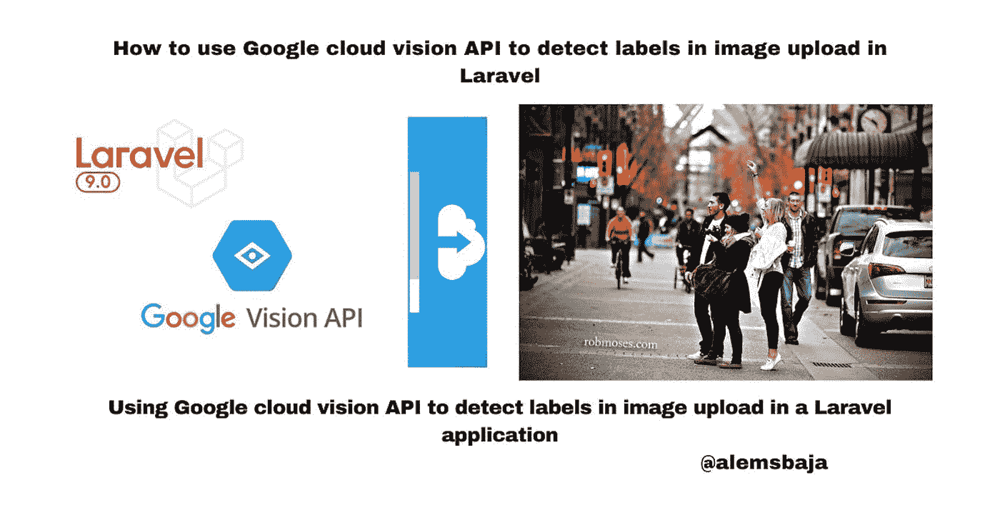
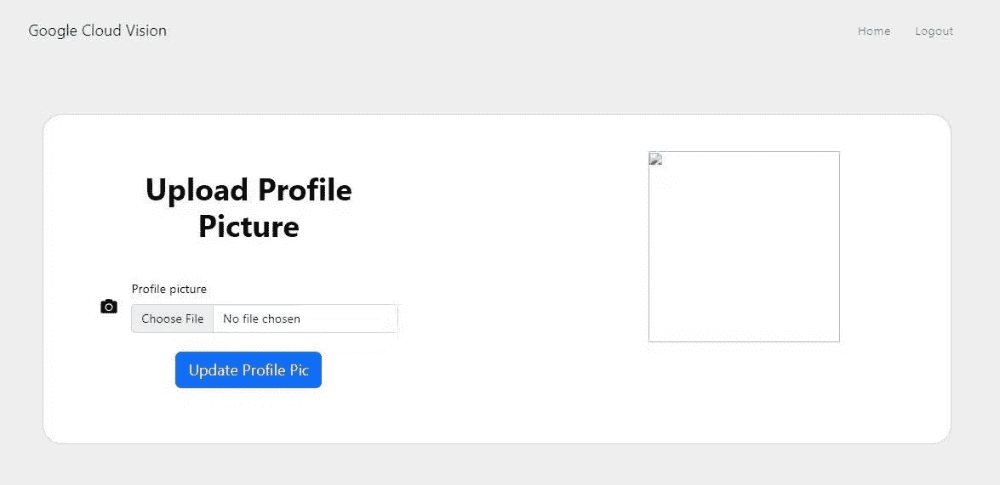
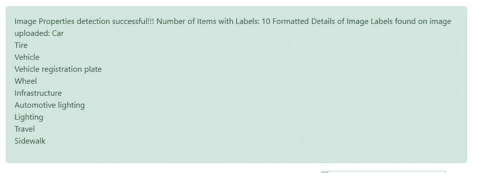

# 如何在 Laravel 中使用 Google cloud vision API 检测图片上传中的标签

> 原文：<https://blog.devgenius.io/how-to-use-google-cloud-vision-api-to-detect-labels-in-image-upload-in-laravel-ca0bcd6a0412?source=collection_archive---------8----------------------->



在本文中，我们将了解如何使用 Google cloud vision API 来检测 Laravel 应用程序中图像上传的标签。

*   [检测标签](https://cloud.google.com/vision/docs/labels)

为了能够检测和检索图像中各种类别的实体信息，Google vision API 就派上了用场。

标签可以识别一般对象、位置、活动、动物种类、产品等等。如果你需要有针对性的定制标签，Cloud AutoML Vision 可以让你训练一个定制的机器学习模型来对图像进行分类。

标签仅以英文返回。云翻译 API 可以将英语标签翻译成许多其他语言。

在本教程[如何使用 Google cloud vision API 安全搜索检测来检测 Laravel](https://alemsbaja.hashnode.dev/how-to-use-google-cloud-vision-api-safe-search-detection-to-detect-explicit-content-on-image-uploads-in-laravel) 中图片上传的露骨内容中，我们详细介绍了如何创建 Google Cloud Platform (GCP)项目、服务帐户凭证以及将 cloud vision 软件包集成到 Laravel 中。

为了保持这篇文章的简短，我们将直接探讨图像属性检测如何在文件上传上工作，因为我们已经有了一个用于上传文件的[表单。](https://github.com/RaphAlemoh/google_cloud_vision_features/blob/main/resources/views/uploads/create.blade.phpt)



注意:为了清楚起见，每个特征在 web.php 文件中都有自己的路径。

您也可以检查 Github 上的一个特定分支，查看它的实现

Vision API 可以对本地图像文件执行功能检测，方法是在请求正文中以 base64 编码字符串的形式发送图像文件的内容。

这里有一个[存储库](https://github.com/GoogleCloudPlatform/php-docs-samples/blob/master/vision/src/detect_label.php)及其集成的例子。

*   导入类

```
use Google\Cloud\Vision\V1\ImageAnnotatorClient;
// this HtmlStringclass is used to format the text detected on the image
use Illuminate\Support\HtmlString;
```

*   对上传的图像运行标签检测

```
public function detectLabels(Request $request)
    {$request->validate([
            'avatar' => 'required|image|max:10240',
        ]);try {$imageAnnotator = new ImageAnnotatorClient([
                //we can also keep the details of the google cloud json file in an env and read it as an object here
                'credentials' => config_path('laravel-cloud-features.json')
            ]);# annotate the image
            $image = file_get_contents($request->file("avatar"));
            $response = $imageAnnotator->labelDetection($image);
            $labels = $response->getLabelAnnotations();$number_of_labels  = 0;$img_label_content = '';
            if ($labels) {
                $number_of_labels = count($labels);
                print('Labels:' . PHP_EOL);
                foreach ($labels as $label) {
                    $img_label_content .= "{$label->getDescription()} <br>";
                }
            } else {$img_label_content .= 'No label found';
            }$formatted_label_details = new HtmlString("Image Properties detection successful!!! Number of Items with Labels:  $number_of_labels Formatted Details of Image Labels found on image uploaded: $img_label_content");return redirect()->route('home')
                ->with('success', $formatted_label_details);
        } catch (Exception $e) {
            return $e->getMessage();
        }
        $imageAnnotator->close();
    }
```

*   我们将上传该图像，并查看检测标签功能如何返回内容

**上传的图像**


*   在上传的图像中检测到标签



*   检测远程图像中的文本(谷歌云存储，Cloudinary，S3 桶等)

标签检测可以直接在 Google 云存储上存储的图像上执行，而不必将内容作为正文请求的一部分进行传递。

**注意:当从 HTTP/HTTPS URL 获取图像时，Google 不能保证请求会被完成。如果指定的主机拒绝了请求(例如，由于请求限制或 DOS 阻止)，或者如果 Google 为了防止滥用而限制了对站点的请求，您的请求可能会失败。生产应用程序不应依赖外部托管的映像。**

只需将上传文件名替换为互联网或远程存储上的图像 URL

```
$image = 'file_path...[https://googleapis.com.......png'](https://googleapis.com.......png');//run the image details detection feature on the image
            $response = $imageAnnotatorClient->labelDetection($image);
```

下面是教程[资源库](https://github.com/RaphAlemoh/google_cloud_vision_features)

感谢您阅读本文！！！。

如果你觉得这篇文章有帮助，请分享给你的网络，并随时使用评论区的问题，答案和贡献。

*原发布于*[*https://alemsbaja . hashnode . dev*](https://alemsbaja.hashnode.dev/how-to-use-google-cloud-vision-api-to-detect-labels-in-image-upload-in-laravel)*。*