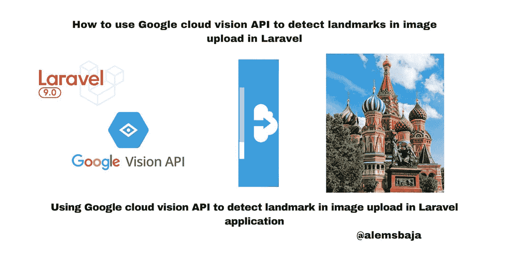
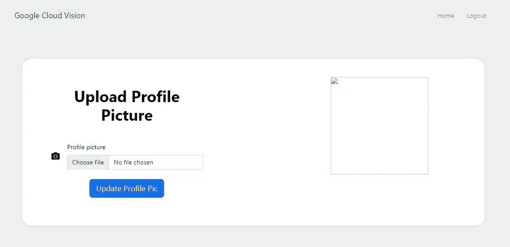
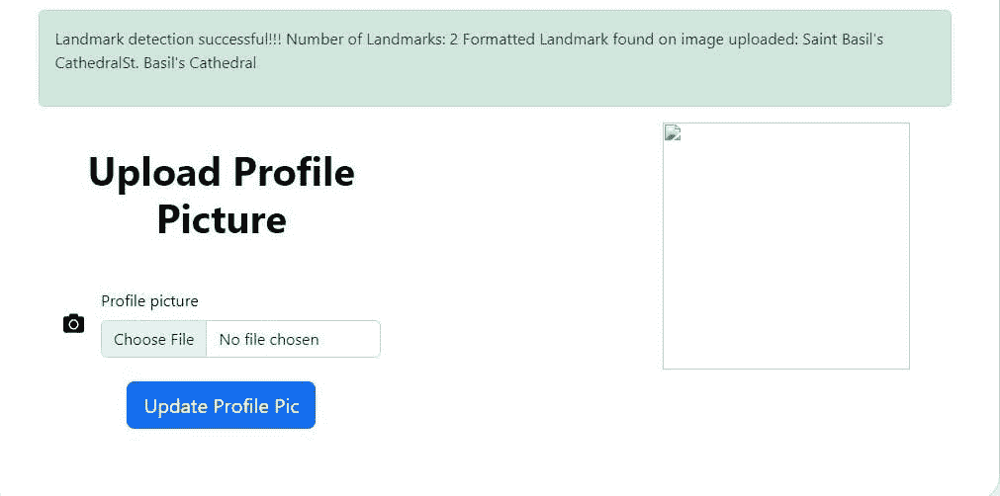

# 如何在 Laravel 中使用 Google cloud vision API 检测图片上传中的地标

> 原文：<https://blog.devgenius.io/how-to-use-google-cloud-vision-api-to-detect-landmarks-in-image-upload-in-laravel-4e8976982dc8?source=collection_archive---------13----------------------->



在本文中，我们将了解如何使用 Google cloud vision API 在 Laravel 应用程序中检测图像上传中的地标。

[检测地标](https://cloud.google.com/vision/docs/detecting-landmarks)

地标检测对于检测图像中常见的自然和人造结构是有用的。

为了检测和检索图像中的产品地标信息，Google vision API 就派上了用场。

在本教程[如何使用 Google cloud vision API 安全搜索检测来检测 Laravel](https://alemsbaja.hashnode.dev/how-to-use-google-cloud-vision-api-safe-search-detection-to-detect-explicit-content-on-image-uploads-in-laravel) 中图片上传的露骨内容中，我们详细介绍了如何创建 Google Cloud Platform (GCP)项目、服务帐户凭证以及将 cloud vision 软件包集成到 Laravel 中。

为了保持这篇文章的简短，我们将直接探讨徽标检测如何在图像文件上传上工作，因为我们已经有了一个用于上传文件的[表单。](https://github.com/RaphAlemoh/google_cloud_vision_features/blob/main/resources/views/uploads/create.blade.phpt)



注意:为了清楚起见，每个特征在 web.php 文件中都有自己的路径。

您也可以检查 Github 上的一个特定分支，查看它的实现。

*   检测局部图像中的界标

这里有一个[存储库](https://github.com/GoogleCloudPlatform/php-docs-samples/blob/master/vision/src/detect_landmark.php)及其集成的例子。

*   导入类

```
use Google\Cloud\Vision\V1\ImageAnnotatorClient;
// this HtmlStringclass is used to format the text detected on the image
use Illuminate\Support\HtmlString;
```

*   对上传的图像运行 landmarkDetection

```
 public function detectLandmarks(Request $request)
    {

        $request->validate([
            'avatar' => 'required|image|max:10240',
        ]);

        try {

            $imageAnnotator = new ImageAnnotatorClient([
                //we can also keep the details of the google cloud json file in an env and read it as an object here
                'credentials' => config_path('laravel-cloud.json')
            ]);

            # annotate the image
            $image = file_get_contents($request->file("avatar"));
            $response = $imageAnnotator->landmarkDetection($image);
            $landmarks = $response->getLandmarkAnnotations();

            $number_landmarks = count($landmarks);
            $landmark_content = '';

            printf('%d landmark found:' . PHP_EOL, count($landmarks));
            foreach ($landmarks as $landmark) {
                $landmark_content .= "{$landmark->getDescription()}";
                print($landmark->getDescription() . PHP_EOL);
            }

            $formatted_landmark = new HtmlString($landmark_content);

            return redirect()->route('home')
                ->with('success', "Landmark detection successful!!! Number of Landmarks:  $number_landmarks Formatted Landmark found on image uploaded: $formatted_landmark");
        } catch (Exception $e) {
            return $e->getMessage();
        }
        $imageAnnotator->close();
    } 
```

*   我们将上传此图像，并查看如何检测上传图像中的徽标


*   在上传的图像中检测到地标



**检测到的地标是圣瓦西里大教堂**

*   检测远程图像中的文本(谷歌云存储，Cloudinary，S3 桶等)

为了在远程图像(云或网络)上执行 Vision API 地标检测，只需在请求中指定文件 URL。

**注意:当从 HTTP/HTTPS URL 获取图像时，Google 不能保证请求会被完成。如果指定的主机拒绝请求(例如，由于请求限制或 DoS 阻止)，或者如果 Google 为了防止滥用而限制对站点的请求，您的请求可能会失败。作为最佳实践，不要依赖生产应用程序的外部托管映像。**

只需将上传文件名替换为互联网或远程存储上的图像 URL

```
 $image = 'file_path...https://googleapis.com.......png';

            //run the image details detection feature on the image
            $response = $imageAnnotatorClient->landmarkDetection($image);
```

下面是教程[资源库](https://github.com/RaphAlemoh/google_cloud_vision_features)

感谢您阅读本文！！！。

如果你觉得这篇文章有帮助，请分享给你的网络，并随时使用评论区的问题，答案和贡献。

*原发布于*[*https://alemsbaja . hashnode . dev*](https://alemsbaja.hashnode.dev/how-to-use-google-cloud-vision-api-to-detect-landmarks-in-image-upload-in-laravel)*。*