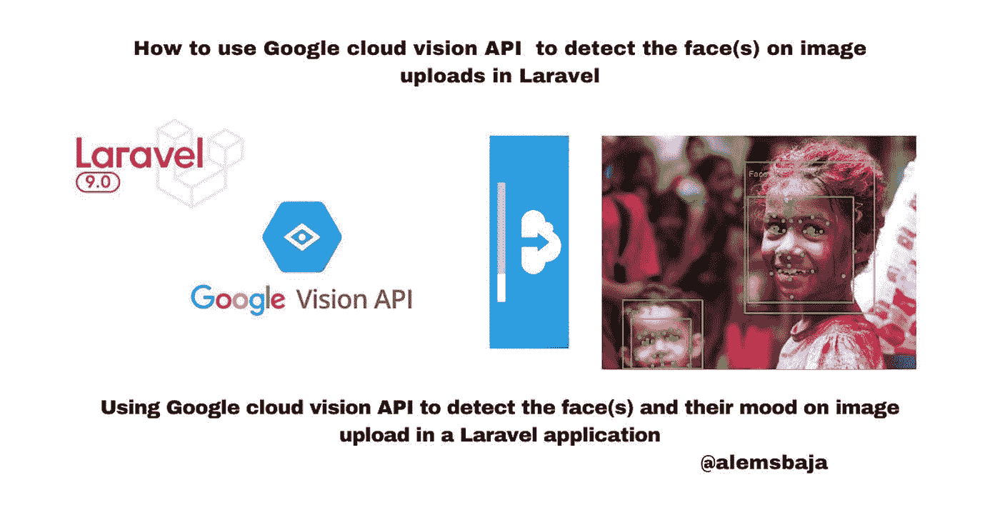
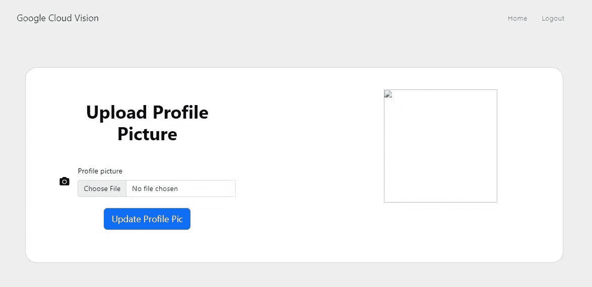
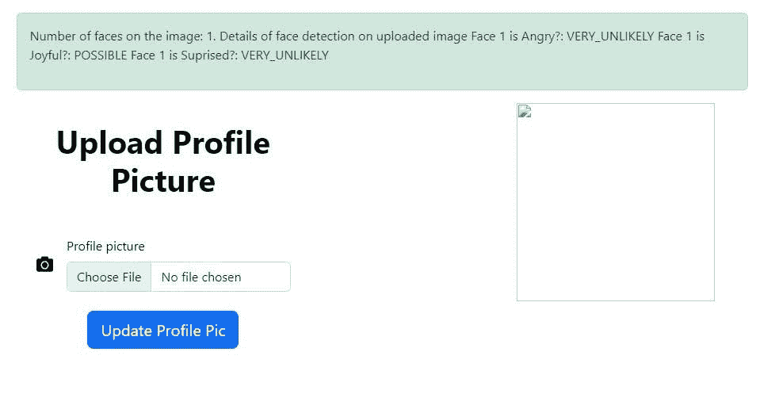

# 如何使用 Google cloud vision API 在 Laravel 中检测图片上传中的人脸

> 原文：<https://blog.devgenius.io/how-to-use-google-cloud-vision-api-to-detect-the-face-s-on-image-uploads-in-laravel-f1d107f324a1?source=collection_archive---------11----------------------->



Laravel 的谷歌云视觉人脸检测

在本文中，我们将了解如何使用 Google cloud vision API 在 Laravel 应用程序中检测图像上传中的人脸。

[人脸检测](https://cloud.google.com/vision/docs/detecting-faces)检测图像中的多张人脸以及相关的关键面部属性，如情绪状态或佩戴头饰。不支持特定的个人面部识别。

*   检测局部图像中的人脸

Vision API 可以对本地图像文件执行功能检测，方法是在请求正文中以 base64 编码字符串的形式发送图像文件的内容。

在这篇关于[如何使用 Google cloud vision API 安全搜索检测来检测 Laravel](https://alemsbaja.hashnode.dev/how-to-use-google-cloud-vision-api-safe-search-detection-to-detect-explicit-content-on-image-uploads-in-laravel) 中图片上传的露骨内容的教程中，我们详细介绍了如何创建 Google Cloud Platform (GCP)项目、服务帐户凭证以及将 cloud vision 软件包集成到 Laravel 中。

为了简单起见，我们将直接探讨如何在图像上传中检测人脸，因为我们已经有了一个[表单](https://github.com/RaphAlemoh/google_cloud_vision_features/blob/main/resources/views/uploads/create.blade.php)，用于上传之前功能集成的文件。



注意:为了清楚起见，每个特征在 web.php 文件中都有自己的路径。

**你也可以检查 GitHub 上的一个特定分支，查看它的实现**

这里有一个存储库，其中有一个集成的[示例](https://github.com/GoogleCloudPlatform/php-docs-samples/blob/master/vision/src/detect_face.php)。

当文件上传后，我们可以在 post 方法中运行检测。

就像在[安全搜索检测功能](https://alemsbaja.hashnode.dev/how-to-use-google-cloud-vision-api-safe-search-detection-to-detect-explicit-content-on-image-uploads-in-laravel)中一样，每个人脸检测方法的响应可以是下面数组中的任何值。

有了这些值，我们就可以检测出面部表情是愤怒、喜悦还是惊喜的情绪。

*   导入类

```
use Google\Cloud\Vision\V1\ImageAnnotatorClient;
// this HtmlStringclass is used to format the text detected on the image
use Illuminate\Support\HtmlString;
```

*   对上传的图像运行面部检测

就像在[安全搜索检测功能](https://alemsbaja.hashnode.dev/how-to-use-google-cloud-vision-api-safe-search-detection-to-detect-explicit-content-on-image-uploads-in-laravel)中一样，每个人脸检测方法的响应可以是下面数组中的任何值。

```
$likelihoodName = [
                'UNKNOWN', 'VERY_UNLIKELY', 'UNLIKELY',
                'POSSIBLE', 'LIKELY', 'VERY_LIKELY'
            ];
```

有了这些值，我们就可以检测出面部表情是愤怒、喜悦还是惊喜的情绪。

*   代码片段

```
public function detectFaces(Request $request)
    {
        $request->validate([
            'avatar' => 'required|image|max:10240',
        ]);try {
            $imageAnnotator = new ImageAnnotatorClient([
                //we can also keep the details of the google cloud JSON file in an env and read it as an object here
                'credentials' => config_path('laravel-cloud.json')
            ]);
            # annotate the image$path = $request->file("avatar");
            $image = file_get_contents($path);$outFile = null;$response = $imageAnnotator->faceDetection($image);
            $faces = $response->getFaceAnnotations();# names of likelihood from google.cloud.vision.enums
            $likelihoodName = [
                'UNKNOWN', 'VERY_UNLIKELY', 'UNLIKELY',
                'POSSIBLE', 'LIKELY', 'VERY_LIKELY'
            ];$number_of_faces = count($faces);// the number of faces found on the image
            // printf('%d faces found:' . PHP_EOL, count($faces));$image_face_content = '';$count = 0;foreach ($faces as $face) {
                $count = +1;
                $anger = $face->getAngerLikelihood();
                //the likelihood of anger
                // printf('Anger: %s' . PHP_EOL, $likelihoodName[$anger]);
                $image_face_content .= "Face $count is Angry?: $likelihoodName[$anger] \n";$joy = $face->getJoyLikelihood();
                //the likelihood of joy
                // printf('Joy: %s' . PHP_EOL, $likelihoodName[$joy]);
                $image_face_content .= "Face $count is Joyful?: $likelihoodName[$joy] \n";$surprise = $face->getSurpriseLikelihood();
                //suprise status
                // printf('Surprise: %s' . PHP_EOL, $likelihoodName[$surprise]);
                $image_face_content .= "Face $count is Suprised?: $likelihoodName[$surprise] \n";# get bounds
                $vertices = $face->getBoundingPoly()->getVertices();
                $bounds = [];
                foreach ($vertices as $vertex) {
                    $bounds[] = sprintf('(%d,%d)', $vertex->getX(), $vertex->getY());
                }//returns the bounds in for the faces result
                print('Bounds: ' . join(', ', $bounds) . PHP_EOL);
                print(PHP_EOL);
            }
            // [END vision_face_detection]# [START vision_face_detection_tutorial_process_response]
            # draw box around faces
            if ($faces && $outFile) {
                $imageCreateFunc = [
                    'png' => 'imagecreatefrompng',
                    'gd' => 'imagecreatefromgd',
                    'gif' => 'imagecreatefromgif',
                    'jpg' => 'imagecreatefromjpeg',
                    'jpeg' => 'imagecreatefromjpeg',
                ];
                $imageWriteFunc = [
                    'png' => 'imagepng',
                    'gd' => 'imagegd',
                    'gif' => 'imagegif',
                    'jpg' => 'imagejpeg',
                    'jpeg' => 'imagejpeg',
                ];copy($path, $outFile);
                $ext = strtolower(pathinfo($path, PATHINFO_EXTENSION));
                if (!array_key_exists($ext, $imageCreateFunc)) {
                    throw new \Exception('Unsupported image extension');
                }$outputImage = call_user_func($imageCreateFunc[$ext], $outFile);foreach ($faces as $face) {
                    $vertices = $face->getBoundingPoly()->getVertices();
                    if ($vertices) {
                        $x1 = $vertices[0]->getX();
                        $y1 = $vertices[0]->getY();
                        $x2 = $vertices[2]->getX();
                        $y2 = $vertices[2]->getY();
                        imagerectangle($outputImage, $x1, $y1, $x2, $y2, 0x00ff00);
                    }
                }call_user_func($imageWriteFunc[$ext], $outputImage, $outFile);printf('Output image written to %s' . PHP_EOL, $outFile);//to display the image with boxes on surrounding the faces
                // header('Content-Type: image/jpeg');
                // imagejpeg($outputImage);
                // imagedestroy($outputImage);
            }$formatted_text = new HtmlString($image_face_content);return redirect()->route('home')
                ->with('success', "Number of faces on the image: $number_of_faces. Details of face detection on uploaded image $formatted_text");
        } catch (Exception $e) {
            return $e->getMessage();
        }$imageAnnotator->close();
    }
```

让我们上传这张图片看看结果


*   图像上人脸检测的结果



有可能那张脸是快乐的或微笑的…是的！！！

*   检测远程图像中的人脸

为了方便起见，Vision API 可以直接对位于 Google 云存储或 Web 上的图像文件执行特征检测，而无需在请求正文中发送图像文件的内容。

**注意:**当从 HTTP/HTTPS URL 获取图像时，谷歌不能保证请求会被完成。如果指定的主机拒绝了请求(例如，由于请求限制或 DOS 阻止)，或者如果 Google 为了防止滥用而限制了对站点的请求，您的请求可能会失败。生产应用程序不应依赖外部托管的映像。

```
//specify the path to the file on GCS
     $image = 'file_path...[https://googleapis.com.......png'](https://googleapis.com.......png');//run the facedection feature on the image
            $response = $imageAnnotatorClient->faceDetection($image);
```

下面是教程[资源库](https://github.com/RaphAlemoh/google_cloud_vision_features)

感谢您阅读本文！！！。

如果你觉得这篇文章有帮助，请分享给你的网络，并随时使用评论区的问题，答案和贡献。

*原发布于*[*https://alemsbaja . hashnode . dev*](https://alemsbaja.hashnode.dev/how-to-use-google-cloud-vision-api-to-detect-the-faces-on-image-uploads-in-laravel)*。*