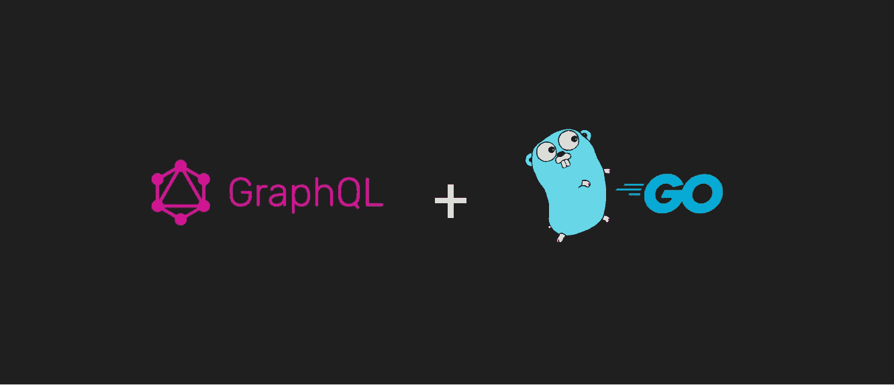
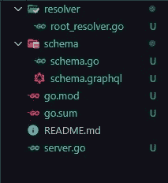
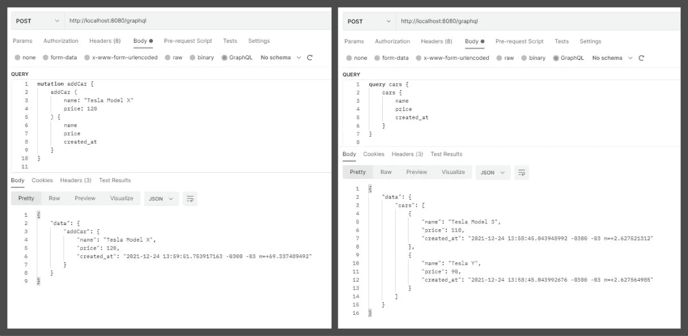
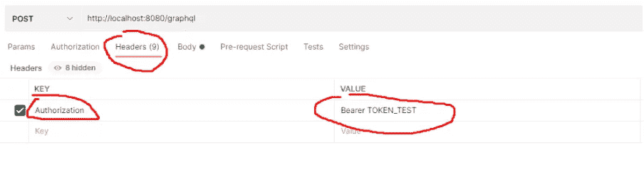
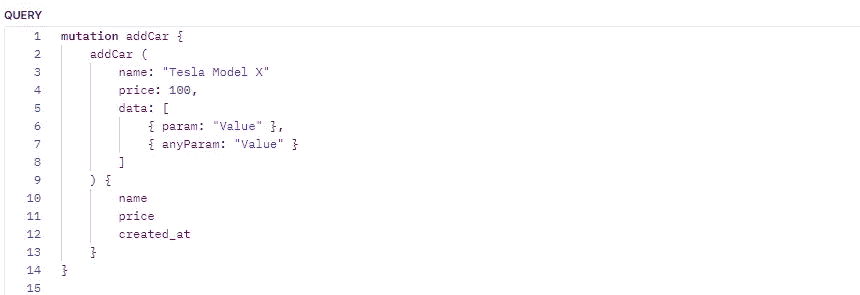

# 如何使用 Graphql + Golang

> 原文：<https://blog.devgenius.io/how-to-use-graphql-golang-c2a53fc5423b?source=collection_archive---------2----------------------->

我是如何实现 Graphql + Golang 的，以及我如何面对它的一些问题



## 欢迎

嗨，我的名字是古斯塔沃·德尔芬，我想为你的知识增加一些东西。
这篇文章的目的是分享我对 Graphql + Golang 的第一印象和一些挑战。
这里没有任何关于如何做出更好的设计模式的文章，或者你是否应该选择一种语言，目的总是解决一种问题类型。

## **要解决的问题是:**

该应用程序在秒内收到了大约 50 个请求。该应用程序已经实现了 graphql。

解决方案是将这个请求流分解成一个微服务，使用 Golang 来享受它提供的所有并行性，并继续在客户机上用 Graphql 实现。

## 重要决定

首先我会给大家展示一下使用的主包，以及为什么要选择它。
[https://github.com/graph-gophers/graphql-go](https://github.com/graph-gophers/graphql-go)

1.  Graphql 文档推荐这个包。
2.  在推荐中，在我看来，这一个对我的目的来说使用起来更简单。
3.  存储库是不断发展的
4.  解析器的并行执行
5.  支持上下文。语境

# **现在让我们编码**

你可以在 GitHub 的这个 [**链接**](https://github.com/GustavoDelfim/graphql-go-example) 获得这段代码。

**1。开始你的项目:**

```
go mod init name-project
```

在我的例子中，我称之为“GustavoDelfim/graph QL-go-example”

**2。我们需要安装用于构建 HTTP 服务的包:**
【Chi】。
“graph QL-go”做你的服务器。

```
go get github.com/graph-gophers/graphql-go
go get github.com/go-chi/chi/v5
```

**3。让我们创建我们的 HTTP 服务。**
在项目根目录下创建 *server.go* 文件。

server.go

使用这段代码，我们创建了一个运行在端口 8080 上的简单 API，带有 route /让我们在终端上测试一下

运行应用程序:`go run server.go`

打开另一个端子页签
执行:`curl http://localhost:8080/`
返回必须为*“运行”*

**4。让我们创建我们的根解析器** 在。/解析程序文件夹

resolver/root_resolver.go

**5。现在让我们创建存放 Graphql 模式的文件。** 在。/schema 文件夹

schema/schema.graphql

**6。现在我们需要创建我们的 graphql-go 配置文件来运行我们的模式和解析器** 在。/schema 文件夹

schema/schema.go

这里我们观察到一些有趣的现象:

1.  GetSchema 函数返回包 graphql-go 配置。
    graphql。MaxParallelism:并行请求的数量。
2.  SchemasString 函数负责联接 schema 文件夹中的所有类型和模式。

到目前为止，我们已经有了类似的东西。



好，我们继续。

**7。现在，在我们创建 Graphql 路径之前，让我们创建中间件。**
在。/中间件文件夹。

middle reare/auth _ middleware . go

**8。现在让我们创建一个路由来接收来自 Graphql 客户端的突变和查询请求。** 我们把路线定义为/graphql

确保在文件的顶部导入代码。

```
GustavoDelfim/graphql-go-example/middleware
GustavoDelfim/graphql-go-example/resolver
GustavoDelfim/graphql-go-example/schema
github.com/graph-gophers/graphql-go/relay
```

将此代码添加到*服务器上的 main 函数中。go* :

server.go

这时运行`go run server.go`看看是否一切正常。

**9。现在，让我们创建第一个解析器。** 让我们在*中添加一个查询和一个变异。/schema/schema.graphql* 。

schema/schema.graphql

我们不能忘记创建汽车类型。
创建 *car.graphql* 文件。/schema/types 文件夹

schema/types/car.graphql

在文件中创建 *car_resolver.go* 文件。/resolver 文件夹。

resolver/car_resolver.go

重新运行您的项目。

下一步是测试我们的变异和查询。打开邮递员。



在请求的头中定义授权，该值可以是任何值。



在请求的头中定义授权，该值可以是任何值。

## 到目前为止，一切都很棒。

但是，在我看来，下面这些东西是这个项目到目前为止最酷的东西。

1.  上下文:您使用将值传递给解析器，gaphql-go 包支持上下文，然后我们学习如何恢复我们的上下文用户。
2.  中间件:这个特性是 Chi 的，但是可以用它来进行身份验证或其他什么。它将根据上下文设置数据。

无论如何，我面临的一个问题是在 API 中接收非类型化的参数。所以 graphql-go 包很大程度上实现了自定义值参数。标量:它的存在是为了创建一个定制的请求输入。例如:假设您的 API 将接收非类型化对象的类型数组的输入。

遵循下面的解决方案。

# 让我们发展这个项目。

> 我们现在的目标是创建一个带有非类型化输入的参数。

**10。首先，我们给 addCar 突变添加一个新参数，然后转到*。/schema/schema.graphql* 并将 addCar 突变编辑为下面的代码:**

schema/schema.graphql

**11。现在我们需要创建自定义标量类型“Map”。** 创建 *map.graphql* 文件。/schema/scalar 文件夹，并添加下面的代码。

schema/scalar/map.graphql

在中创建 *map.go* 文件。/schema/scalar 文件夹，并添加下面的代码。

schema/scalar/map.go

我们可以通过在类型上实现这两个方法来创建自定义输入。实现 GraphQLType，UnmarshalGraphQL

可以在这个链接看到更多:
[https://github . com/graph-gophers/graph QL-go/issues/252 # issue comment-419330485](https://github.com/graph-gophers/graphql-go/issues/252#issuecomment-419330485)

**12。最后，我们在*中添加 AddCarArgs 类型的参数数据。/resolver/car _ resolver . go***

我们的论点必须是这样的。

resolver/car_resolver.go

并在文件顶部导入 de 包。

```
"GustavoDelfim/graphql-go-example/schema/scalar"
```

再次运行您的项目，在请求体上测试您的新参数，然后**高兴起来**。



请求体，addCar 突变。

你可以从下面的链接下载这个项目:
[https://github.com/GustavoDelfim/graphql-go-example](https://github.com/GustavoDelfim/graphql-go-example)

# 结论

如果你需要使用 Graphql + go，这里有一些你每天都需要知道的事情。我希望这篇文章对你有所帮助。

感谢阅读。
我的社交网络:

*   [Github](https://github.com/GustavoDelfim)
*   [领英](https://www.linkedin.com/in/gustavodelfim/)