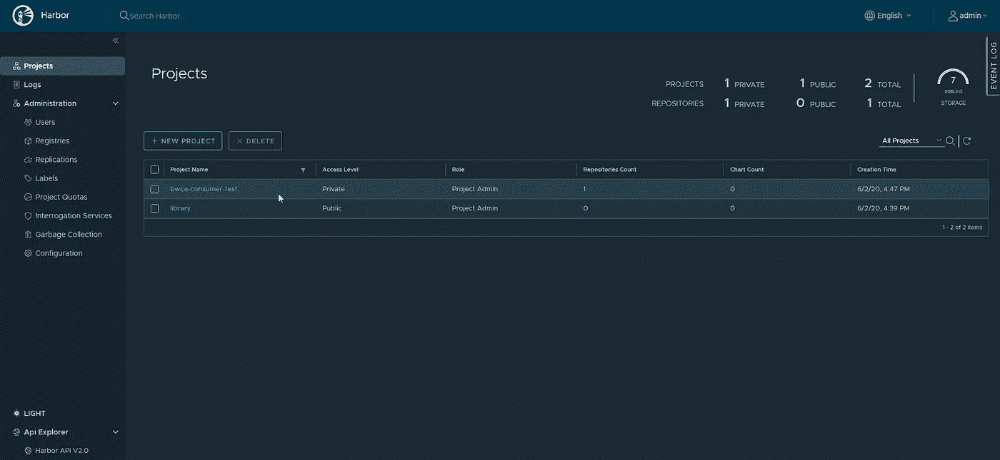
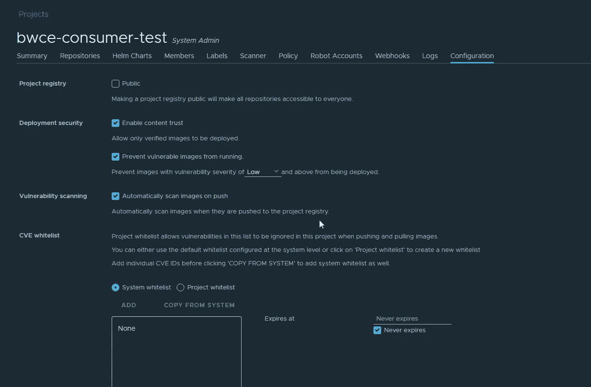
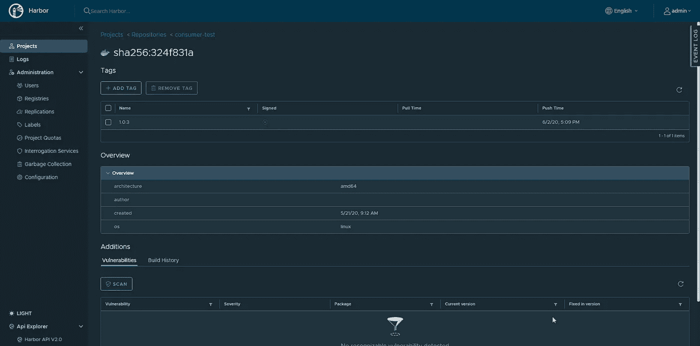

# 如何使用 Harbor 提高平台的安全性

> 原文：<https://blog.devgenius.io/how-to-use-harbor-to-increase-security-on-your-platform-a6e57b518fe2?source=collection_archive---------17----------------------->

## 了解如何将 Harbor 包含在 DevSecOps 工具集中，以增强基于容器的平台的安全性和管理

在 [Unsplash](https://unsplash.com?utm_source=medium&utm_medium=referral) 上 [Youngje Park](https://unsplash.com/@beharit?utm_source=medium&utm_medium=referral) 拍摄的照片

随着向更敏捷的开发过程的转变，部署的数量以指数方式增加。这种情况使得保持步调变得非常复杂，以确保我们不只是将代码更频繁地部署到生产中，以提供业务所需的功能。但是，与此同时，我们能够安全可靠地做到这一点。

这种需求促使 DevSecOps 将安全性作为 DevOps 文化和实践的一部分，以确保从开发开始到从开发机器到生产环境的所有标准步骤的安全性。

除此之外，由于容器范式，我们有了一种更加多语言的方法，在我们的平台上运行不同种类的组件，使用不同的基本映像、包、库等等。我们需要确保它们仍然可以安全使用，我们需要能够以自然的方式管理它们的工具。为了帮助我们履行这一职责，Harbor 等组件帮助我们做到了这一点。

在撰写本文时，Harbor 是一个处于孵化器阶段的 CNCF 项目，它提供了几个关于如何从项目角度管理容器图像的功能。它提供了一个带有 docker 注册表的项目方法，如果我们想使用 Helm Charts 作为项目开发的一部分，它还提供了一个图表博物馆。但它也包括安全特性，这也是我们将在本文中讨论的内容:

*   **漏洞扫描:**它允许你扫描所有在不同存储库中注册的 docker 镜像，检查它们是否有漏洞。它还在这一过程中提供了自动化，以确保每次我们推送新图像时，都会自动对其进行扫描。此外，它还支持定义策略，以避免拉出任何有漏洞的映像，并设置我们希望容忍的漏洞级别(低、中、高或严重)。默认情况下，Clair 是默认的扫描仪，但是您也可以引入其他扫描仪。
*   **已签名的图像:** Harbor 提供了将公证人部署为其组件的一部分的选项，以便能够在推送过程中对图像进行签名，从而确保不会对该图像进行修改
*   **标签不变性和保留规则** : Harbor 还提供了定义标签不变性和保留规则的选项，以确保我们不会试图使用相同的标签替换其他图像。

Harbor 基于 docker，因此您可以使用 docker 在本地运行它，并使用 docker-compose 使用其官方网页上提供的过程。但是它也支持安装在您的 Kubernetes 平台之上，使用舵图和可用的操作符。

一旦工具安装完毕，我们就可以访问 UI 门户网站，并且能够创建一个包含存储库的项目。

海港门户 UI 中的项目列表

作为项目配置的一部分，我们可以定义我们希望提供给每个项目的安全策略。这意味着不同的项目可以有不同的安全配置文件。

Harbor Porta UI 中项目内部的安全设置

一旦我们将新映像推送到属于该项目的存储库，我们将看到以下详细信息:

在这种情况下，我推出了一个 TIBCO business works Container Edition 应用程序，该应用程序不包含任何漏洞，只是显示了漏洞以及检查的位置。

此外，如果我们看到细节，我们可以检查附加信息，如图像是否已签名，或者能够再次检查它。

Harbor Portal UI 中的图像细节

# 摘要

这只是 Harbor 从安全角度提供的一些功能。但是 Harbor 远不止这些，所以我们可能会在以后的文章中介绍它的更多特性，我希望根据您今天读到的内容，您愿意给它一个机会，并开始在您的 DevSecOps 工具集中介绍它。