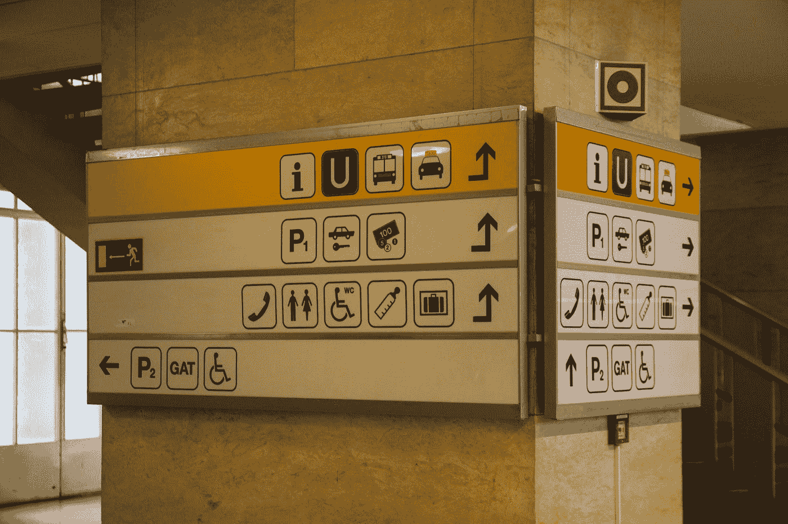
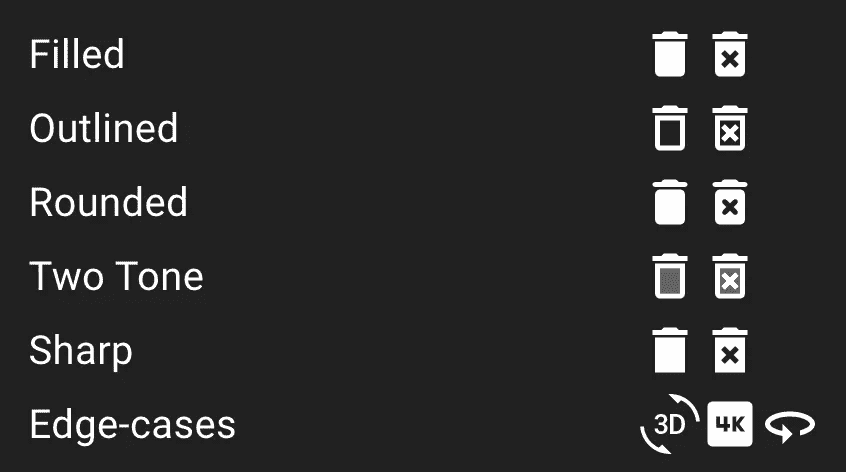
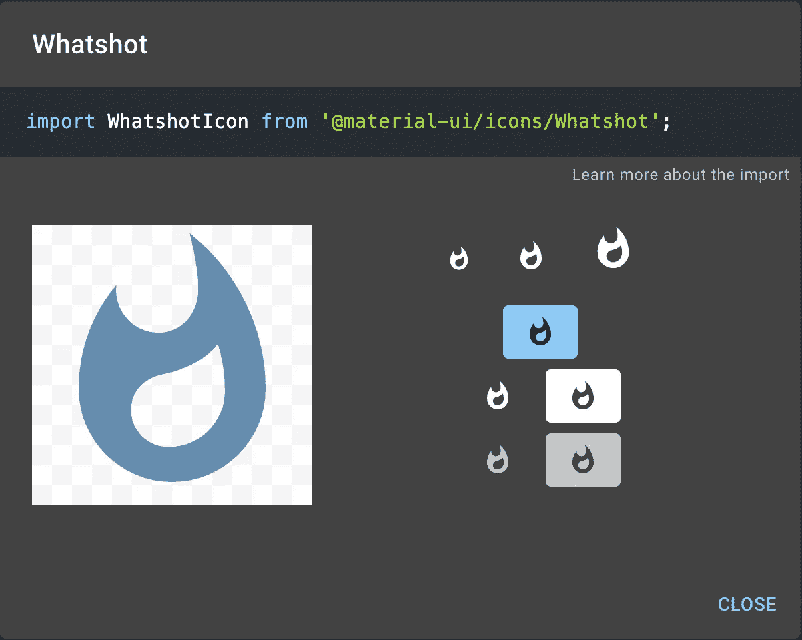
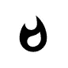

# 如何在 Material-UI 中使用图标创建按钮

> 原文：<https://blog.devgenius.io/how-to-use-icons-in-material-ui-to-create-a-button-fb12cfdf7873?source=collection_archive---------1----------------------->

## 材质用户界面图标库简介



照片由[塞巴斯蒂安·赫尔曼](https://unsplash.com/@herrherrmann?utm_source=medium&utm_medium=referral)在 [Unsplash](https://unsplash.com?utm_source=medium&utm_medium=referral) 上拍摄

图标常用于网站和应用程序中。Material-UI 有自己的图标库，有超过 1，100 个图标可供选择。这些图标都是来自谷歌官方的[材质图标](https://fonts.google.com/icons?selected=Material+Icons)。

在本文中，我们将看看 Material-UI 图标库，并学习如何使用图标来创建一个按钮组件。

# 材质用户界面图标库简介

Material-UI 图标库包括 1100 多个已经转换成 Material-UI `SvgIcon`组件的材料图标。这使得在任何 React 项目中使用这些图标变得很容易。

每个图标都有以下五个主题:

*   填充主题(默认)
*   概述主题
*   圆形主题
*   双色调主题
*   尖锐的主题



# 建立我们的项目

对于这个例子，我们将在一个`create-react-app`项目中工作。我们首先需要安装 Material-UI 核心包，以及 Material-UI 图标库。

```
*// with npm*
npm install @material-ui/core @material-ui/icons

*// with yarn*
yarn add @material-ui/core @material-ui/icons
```

# 呈现图标

安装了这些包之后，我们现在可以渲染我们的第一个图标了。查看图标库[此处](https://material-ui.com/components/material-icons/)为所有可用图标列表。

当你找到一个你想要使用的图标，点击它，下面的模式就会出现。



复制导入语句，然后将其粘贴到项目中。然后，你需要做的就是渲染组件。很简单！

```
<WhatshotIcon />
```

这将呈现以下图标。



它看起来不错，但是我们也可以通过传递几个道具来定制它。我们将使用的两个主要道具如下:

*   **颜色**——`‘inherit’ | ‘primary’ | ‘secondary’ | ‘action’ | ‘error’ | ‘disabled’`
*   **字体大小** — `‘default’ | ‘inherit’ | ‘large’ | ‘medium’ | ‘small’`

例如，如果我们向我们的组件添加以下道具，它将使用默认主题原色和大字体大小来呈现图标。

```
<*WhatshotIcon* ***color*="primary" *fontSize*="large"** />
```


如果你想学习如何用 Material-UI 定制颜色主题，可以看看下面的文章。

[](https://medium.com/swlh/create-a-customized-color-theme-in-material-ui-7205163e541f) [## 在材质界面中创建自定义的颜色主题

### 为下一个 React 项目定制颜色主题很容易

medium.com](https://medium.com/swlh/create-a-customized-color-theme-in-material-ui-7205163e541f) 

# 创建带图标的按钮

显示图标是很好的第一步。然而，图标的一个常见用例是用作按钮。

使用 Material-UI 组件，我们有两种选择。

*   创建图标按钮
*   创建带有图标和标签的按钮

## 创建图标按钮

从 Material-UI 核心包中导入`IconButton`组件。

```
import IconButton from '@material-ui/core/IconButton';
```

将图标作为子组件呈现给`IconButton`。你也可以将彩色道具移动到`IconButton`。

```
<*IconButton* *color*="primary">
  <*WhatshotIcon* *fontSize*="large" />
</*IconButton*>
```


## 创建带有图标和标签的按钮

从 Material-UI 核心包中导入`Button`组件。

```
import Button from '@material-ui/core/Button';
```

用`color`、`size`和`startIcon`道具渲染`Button`组件。作为`startIcon`属性的值，传递图标组件。然后，作为一个孩子，你可以添加任何文本，你想出现在按钮内。

```
<*Button* *color*="primary" *size*="large" *startIcon*={<*WhatshotIcon* />}>
  New and Hot
</*Button*>
```


# 结论

感谢阅读！我希望这篇文章对你开始使用 Material-UI 图标库有帮助。

当我使用 Material-UI 构建任何应用程序时，它非常容易使用，是我的首选图标库。

如果您想了解在 React 项目中使用图标的另一个选项，请查看下面的文章。

[](https://javascript.plainenglish.io/tutorial-and-beginners-guide-to-using-react-icons-77c614696301) [## 使用 React 图标的初学者指南

### 在一个地方获得您需要的所有图标

javascript.plainenglish.io](https://javascript.plainenglish.io/tutorial-and-beginners-guide-to-using-react-icons-77c614696301)