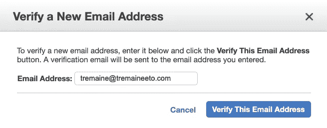
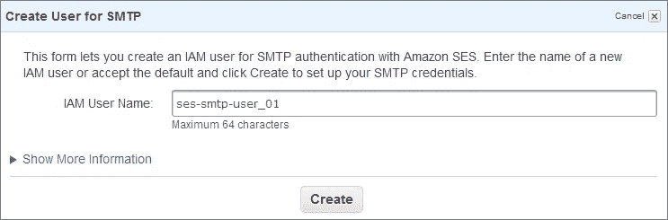

# 如何使用 Java 通过亚马逊简单邮件服务(SES)发送 SMTP 邮件

> 原文：<https://blog.devgenius.io/how-to-use-java-to-send-smtp-emails-with-amazon-simple-email-service-ses-56ab9a6eeb92?source=collection_archive---------0----------------------->

[NeONBRAND](https://unsplash.com/@neonbrand) 在 [Unsplash](https://unsplash.com/photos/IhsaTDKzdwg) 上的原始照片；AWS 的标志；Tremaine Eto 的插图

所以你想用亚马逊简单邮件服务(简称 SES)有计划地发送邮件。

本文关注的正是如何在 Java 中做到这一点。

# 什么是亚马逊简单邮件服务？

根据亚马逊的说法，“亚马逊简单电子邮件服务(SES)是一种经济高效、灵活且可扩展的电子邮件服务，使开发人员能够从任何应用程序中发送邮件。您可以快速配置 Amazon SES 来支持多种电子邮件用例，包括交易、营销或大量电子邮件通信。Amazon SES 灵活的 IP 部署和电子邮件身份验证选项有助于提高送达率和保护发件人声誉，同时发送分析可衡量每封电子邮件的影响。有了亚马逊 SES，您可以在全球范围内安全、大规模地发送电子邮件。”

用例范围从事务性的(如发送密码重置电子邮件、购买确认等)到营销电子邮件(如特价、优惠券、时事通讯等)到批量电子邮件通信(如通知、公告等)。

亚马逊 SES 的客户从 Reddit 到网飞到 Duolingo，所以你知道你使用的电子邮件解决方案对游戏中的大玩家来说已经足够好了。

# 首先，让我们做一些设置

在我们开始编码之前，您必须登录您的 AWS 管理控制台。这里有一个[链接](https://aws.amazon.com/console/)，如果你还没有把它加入书签的话，你可以去那里。

然后，在搜索栏中键入`SES`,然后点击它，以便进入 SES 控制台。

## 验证您将发送和接收的电子邮件

在左侧工具栏上，点击`Identity Management`部分下的`Email Addresses`。

会有一个按钮写着`Verify a New Email Address`。点击它，将显示一个模态。

在文本输入中填入您想要验证的电子邮件；请记住，您不仅要为您希望从发送*的电子邮件，还要为您希望从*发送到*的电子邮件执行此操作！*

然后，您需要访问您输入的电子邮件，然后按照邮件中的确认说明来验证电子邮件地址。

## 获取您的 SES SMTP 凭据

如果你还在 AWS 管理控制台，还在`SES`部门，那就呆在那里。如果没有，那么导航到那里。

一旦出现，选择`SMTP Settings`。然后，选择`Create My SMTP Credentials`。填写 IAM 用户名的字段:

礼貌 [AWS 文档](https://docs.aws.amazon.com/ses/latest/DeveloperGuide/smtp-credentials.html)。

然后，点击`Show User SMTP Credentials`。请将您的凭据复制并粘贴到安全的地方，因为一旦退出此窗口，您将无法再次查看或保存它们。

有关这一步的更多信息，请查看关于这个主题的 [AWS 文档](https://docs.aws.amazon.com/ses/latest/DeveloperGuide/smtp-credentials.html)。

# Java 代码

Michiel Leunens 在 [Unsplash](https://unsplash.com/photos/0wIHsm2_1fc) 上拍摄的照片

既然您已经验证了电子邮件地址，现在您可以开始编码了。

**记下 SMTP 端点地址。**在上面的例子中，我放了`"email-smtp.us-west-1.amazonaws.com`。这个*也可能*是您的，但是您必须根据您的 AWS 地区的特定 API 端点找到您的确切地址。这个 [AWS 文档](https://docs.aws.amazon.com/general/latest/gr/ses.html)对这一点描述的比较多。

假设您有正确的 SMTP 端点地址、经过验证的电子邮件地址，并且[没有超过任何发送配额](https://docs.aws.amazon.com/ses/latest/DeveloperGuide/manage-sending-quotas.html)(在 AWS 沙盒帐户中，从 24 小时内 200 条消息开始)，那么上面的代码应该是即插即用的。

我希望现在您已经有足够的信息，不仅可以开始使用 Amazon Simple Email Service (SES)发送电子邮件，而且还拥有这样做的代码。如果你有任何问题，请不要犹豫，在评论区联系我们。

 [## 通过我的推荐链接加入媒体

### 作为一个媒体会员，你的会员费的一部分会给你阅读的作家，你可以完全接触到每一个故事…

tremaineeto.medium.com](https://tremaineeto.medium.com/membership)