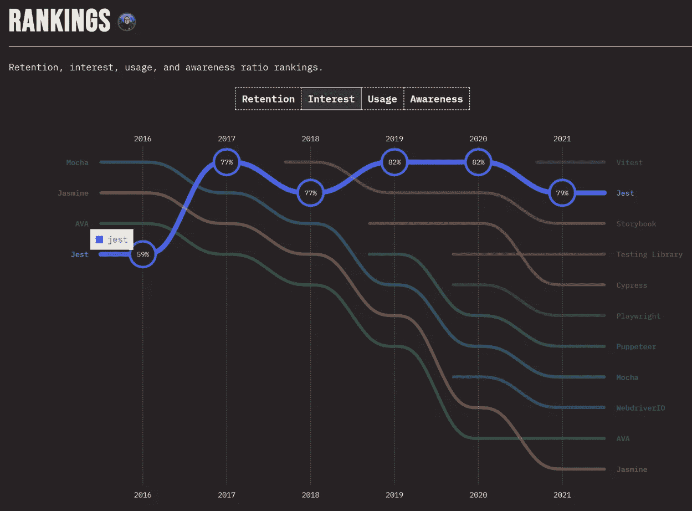

# 如何使用 Jest & Supertest 在 TypeScript 中测试 Express 服务器

> 原文：<https://blog.devgenius.io/how-to-use-jest-supertest-to-test-an-express-server-in-typescript-ab4fc73524e3?source=collection_archive---------3----------------------->

## 查看我在[我的技术文章](https://yumingchang1991.medium.com/technical-article-structure-on-medium-954850e1ef4d)中的所有其他帖子

测试是一个可怕的话题，但对于初级 web 开发人员来说，绝对是一项引人注目的技能。我决定学习测试技能，这样我就能在工作面试中讲更多的故事。

# 会发生什么

本文分享了如何使用 Jest 测试用 TypeScript 编写的 Express 服务器。

*   我们将首先获得 Jest 的一般知识，它是什么，以及 Jest 经常与其他什么库一起使用
*   然后，让我们配置我们的环境，以便测试文件以一种不会弄乱我们的生产代码的方式来组织
*   然后，我们将开始构建测试文件来测试 JWT 用户认证特性

## 在继续阅读之前，要记住什么

我只是另一个软件开发的新手。我将要分享的技术不仅会发生变化，而且会受到我的知识的限制。欢迎不同的意见，所以如果你有意见，请留下评论。

# 什么是玩笑



这张图表是由 JS 公司制作的。如果你有兴趣，可以去看看他们的调查。

Jest 是一个基于 JavaScript 的全栈测试框架，在过去的 5 年里，它越来越受到开发人员的关注。

我说的全栈是指 Jest 可以用于

1.  前端用户界面的快照测试
2.  前端和后端的单元测试

然而，如果我们想要模拟一个发送到我们的 express 服务器的 HTTP 请求，并查看它是如何被处理的，我们需要使用另一个库`supertest`和`Jest`。

`supertest`是 NodeJS 中的一个独立测试库，用于测试路由和端点。它可以模拟发送到我们的服务器端点的 HTTP 请求，看看它是如何被处理的。

Jest 目前没有模拟 HTTP 请求的内置库；因此，在本文中，`supertest`将与 Jest 一起使用。

# 在 TypeScript 中设置 Jest 测试环境

## 组织文件结构

在 Express 服务器中，大多数时候我们想要测试的是我们安装的中间件和路由控制器是否按照预期处理请求。

我把我的测试文件放在我想测试的控制器旁边，而不是创建另一个`tests`文件夹来存储所有的测试文件。好处是我可以很容易地识别哪个控制器有相关的测试文件。

```
# Example File Structure

controller
    |
    |--- xxxController.ts
    |
    |--- xxxController.test.ts
    |
    |--- aaaController.ts
    |
    |--- aaaController.test.ts
```

## 配置 TypeScript 编译器

** *注意:本部分分享的内容可能不符合您的要求***

这个项目通过持续交付部署到 AWS。当 GitHub repo 发生变化时，typescript 的构建过程会自动触发。构建过程完成后，它会自动将编译后的 JavaScript 推送到适当的 AWS EC2 实例。
(我写过一篇文章分享 [*如何分 3 步把 TypeScript 部署到 AWS*](/3-steps-to-deploy-typescript-to-aws-elastic-beanstalk-with-continuous-delivery-611bc7ecf15c))

事实是，我只需要开发中的测试文件，不需要生产中的测试文件。然而，当前的构建过程将编译**所有的**文件，包括测试文件，并将它们传递给 AWS EC2。

我需要一种方法来告诉 TypeScript **而不是**编译测试文件。

首先想到的是把`exclude`添加到我的`tsconfig`文件中。它看起来像下面这样:

```
## tsconfig.json
{
  "compilerOptions": {
    ...
  },
  "exclude": [
    "**/*.test.ts"
  ]
}
```

编译时构建过程确实排除了所有测试文件，但也带来了我没有预料到的副作用。强大的 TypeScript 静态检查器在我的 VSCode 上无法正常工作。

发生的情况是，TypeScript 编译器不再识别 IDE 中的任何`jest`函数，即使我安装了来自`jest`的所有类型定义。即使我们在`compilerOption`下添加`type`来强制 TypeScript 使用来自`jest`的类型定义，也不起作用。

在我看来，当我们在`tsconfig`中添加 exclude 时，它也会忽略我们在编译器选项中指定的任何内容。

幸运的是，`tsconfig`文件内置了从其他`tsconfig`文件继承**的能力。此外，我们可以指定编译时使用哪个`tsconfig`。命令行选项是`tsc --project YourTSConfig.json`。**

这里总结一下。

我想要实现的是

*   在构建过程中不编译所有测试文件
*   同时在开发中享受 TypeScript 静态类型检查支持

**我现在需要做的是**

1.  创建一个新文件，我们将其命名为`tsconfig.build.json`，这是我们将要在编译时在命令行中指定的文件
2.  (在`tsconfig.build.json`中)添加指向原`tsconfig.json`的`extends`选项，具有从该文件继承选项的效果
3.  将`exclude`选项从`tsconfig.json`移到`tsconfig.build.json`，这样我们的 IDE 就不会在开发中排除静态类型检查
4.  将`--project tsconfig.build.json`添加到`buildspec.yml`中的`build commands`，这样 AWS 就知道在编译我们的打字稿时使用`tsconfig.build.json`
5.  享受魔法吧

*这是这三个文件的快照*

```
# buildspec.yml
phases:
  build:
    commands:
      - tsc --project tsconfig.build.json
```

```
// tsconfig.build.json
// this file is consumed by AWS CodeBuild
"extends": "/tsconfig.json",
"exclude": [
  "**/*.test.ts"
]
```

```
// tsconfig.json
// this file is consumed by local IDE
"compilierOptions": {
  ...
}

// Do not add exlcude here, move it to tsconfig.build.json
```

# 开始测试我们的 TypeScript 控制器的身份验证

我们将创建一个测试文件，以确保身份验证过程在我们的 TypeScript 服务器中正常工作。它将测试路线`api/auth/login`以查看:

1.  缺少凭据时，它会返回预期的错误消息
2.  当凭证有效时，它向客户端返回预期的字段

这三个主题足以让您了解如何使用`jest`和`supertest`来测试 express 服务器。

## 了解基本知识

1.  `supertest`库建立在`superagent`之上。`superagent`是一个模仿 HTTP 客户端的 JavaScript 库，而`supertest`扩展了`superagent`提供的所有功能，还提供了用于测试的高级抽象。任何可以在`superagent`中使用的东西，都可以在`supertest`中使用。因此，如果你是第一次接触`superagent`，你可能需要阅读他们的 [*文档*](https://ladjs.github.io/superagent/) 来了解情况。
2.  我们可以将我们想要的 HTTP 服务器传递给`supertest`来模拟发送到该服务器的 HTTP 请求。语法看起来像这样`request(app).get(API_ENDPOINT)`。`request`来自`supertest`。它的参数`app`就是我们设置的 HTTP 服务器。那行代码意味着向我们指定的应用服务器发送一个 GET 请求。
3.  通常，我们将测试分组是为了更好的管理。分组是上面第一点中提到的高级测试抽象。`describe`将相关的`test`分组到同一个块中，以便于阅读。你可以阅读 [*Jest API 文档来进一步了解*](https://jestjs.io/docs/api#describename-fn) 的描述。

现在我们对语法有了基本的了解，我们可以开始构建我们的测试了。

## 测试场景#1 —缺少凭据时返回预期的错误消息

这个简单的场景将向我们指定的 API 端点发送一个 POST 请求。

```
import request from 'supertest'
import app from '../app'

const AUTH_ROUTE = '/api/auth/login'

describe('#1 Return ERROR when credential is missing', () => {
  test('should throw error when there is no credentials', async () => {
    const res = await request(app).post(AUTH_ROUTE).send({})
    expect(res.body.status).toBe('error')
    expect(res.body.message).toBe('missing account and password')
  })

  test('should throw error when there is no account', async () => {
    const res = await request(app).post(AUTH_ROUTE).send(CREDENTIALS_NO_ACCOUNT)
    expect(res.body.status).toBe('error')
    expect(res.body.message).toBe('missing account')
  })

  test('should throw error when there is account but no password', async () => {
    const res = await request(app).post(AUTH_ROUTE).send(CREDENTIALS_NO_PASSWORD)
    expect(res.body.status).toBe('error')
    expect(res.body.message).toBe('missing password')
  })
})
```

## 测试场景#2 —当凭证有效时，将预期字段返回给客户端

```
describe('#2 Return success, username and accessToken when credential is valid', () => {
  test('should return with username and accessToken when the credentials are valid', async () => {
    const res = await request(app).post(AUTH_ROUTE).send(CORRECT_CREDENTIALS)
    expect(res.body.status).toBe('success')
    expect(res.body).toHaveProperty('username')
    expect(res.body).toHaveProperty('accessToken')
  })
})
```

# 我们成功了！

我们刚刚成功地实现了测试，看看我们的控制器是否按预期处理了请求。现在，您知道了如何从这里开发测试场景。

玩得开心，祝你圣诞快乐！

# 参考

*   [*超级代理 API 文档*](https://ladjs.github.io/superagent/)
*   [*Jest 文档*](https://jestjs.io/docs/getting-started)