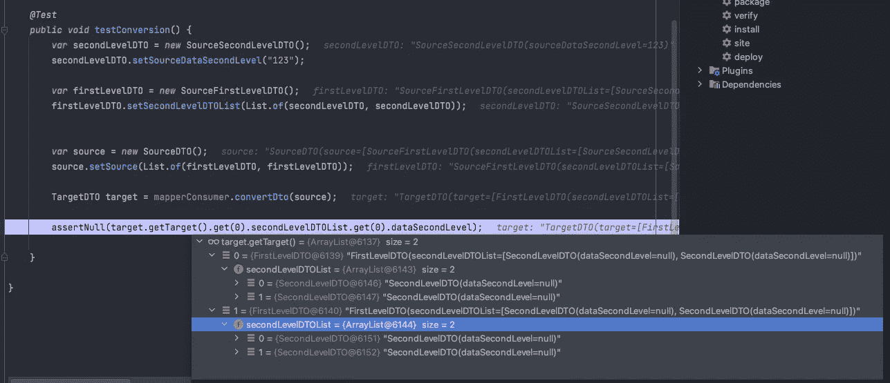
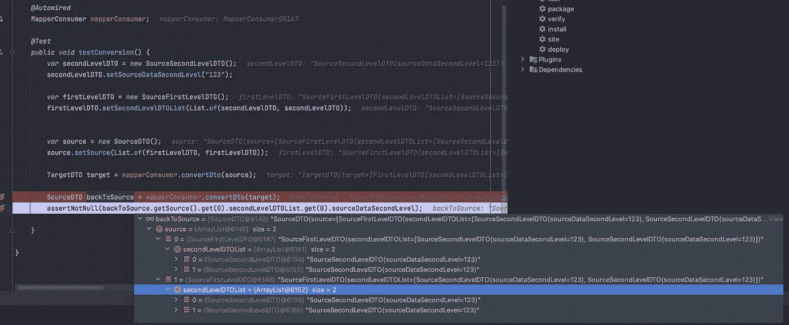
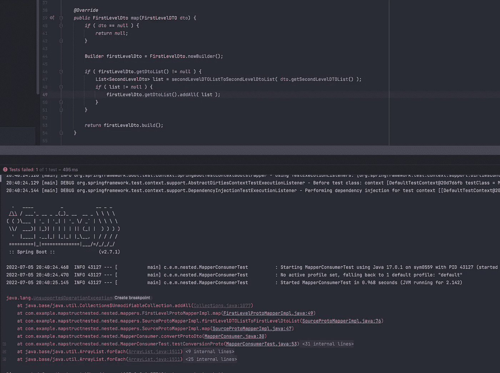

# 如何对嵌套的 Protobuf 和 POJO 使用 Mapstruct 来减少样板文件

> 原文：<https://blog.devgenius.io/how-to-use-mapstruct-for-nested-protobuf-and-pojo-to-reduce-boilerplate-d3698e28c48b?source=collection_archive---------1----------------------->

## 下面是如何在嵌套的 POJO 上使用 mapstruct，以及 POJO 到嵌套的 protobuf 消息，反之亦然


照片由[马体·米罗什尼琴科](https://www.pexels.com/@tima-miroshnichenko?utm_content=attributionCopyText&utm_medium=referral&utm_source=pexels)从[佩克斯](https://www.pexels.com/photo/woman-in-orange-long-sleeve-shirt-standing-beside-woman-in-black-long-sleeve-shirt-5439487/?utm_content=attributionCopyText&utm_medium=referral&utm_source=pexels)拍摄

让我们看看嵌套映射的问题。以及如何使用`***mapstruct***`映射嵌套的数据对象。

假设你有下面的结构。根数据对象包含一个集合，每个集合项包含一个集合。

你可以用`[***mapstruct***](https://mapstruct.org/)`来做到这一点。即便如此，[网上几乎没有关于如何做到这一点的指导。此外，在这个过程中，您会遇到一些奇怪的错误。让我们深入探讨如何实现这一点。](https://stackoverflow.com/questions/39078941/nested-mapping-in-mapstruct)

***我们先从数据结构说起。***

下面是源数据对象。第一个是`SourceDTO`，作为根级数据对象。接下来是`SourceFirstLevelDTO`，在根级对象下的第一级。最后一个是`SourceSecondLevelDTO`。

需要注意的是非根对象的集合。你不仅需要映射根对象，还需要映射它们下面的所有层次。

`[@NoArgsConstructor](http://twitter.com/NoArgsConstructor)`很重要，因为那是 [mapstruct](https://mapstruct.org/) 所需要的。这样，生成的代码可以调用构造函数并映射所需的字段。

目标数据对象在结构上是相似的。这是它们的样子。

让我们从根级别的映射器开始。

这是第一个错误。

```
java: No target bean properties found: can’t map Collection element “SourceFirstLevelDTO source” to “FirstLevelDTO target”. Consider to declare/implement a mapping method: “FirstLevelDTO map(SourceFirstLevelDTO value)”.
```

让我们尝试在源映射器中声明该方法。

您会得到下面的警告，但是构建会通过。这只是一个警告，但你不会得到预期的结果。二级列表不会被映射。

```
java: Unmapped target property: “dataSecondLevel”. Mapping from Collection element “SourceSecondLevelDTO secondLevelDTOList” to “SecondLevelDTO secondLevelDTOList”.
```

因此，如果没有第二种方法，您可以启动应用程序，但这是您在目标中得到的结果。



所以你可以添加这个方法，测试就会通过。

让我感到奇怪的是，这种行为不是错误，而是警告。或许这是有原因的。

围绕这个映射器，您还能改进什么？您可以将映射器分成单独的组件。如果您需要在映射器上有更好的粒度，这很好。

并且生成的映射器将引用所需的嵌套映射器。

当你制作粒度图时，你还能改进什么？如果需要反向转换器呢？

让我们看看如何逆转这种转换。为此，您可以使用`[@InheritInverseConfiguration](https://mapstruct.org/documentation/stable/api/org/mapstruct/InheritInverseConfiguration.html)`。

这是这些变化的结果。



# 如何映射嵌套的`protobuf`消息

*如果需要将嵌套的 proto 文件映射到 POJO 怎么办？下面是从嵌套的* `*protobuf*` *结构映射到 POJO 需要做的事情。*

下面是定义嵌套结构的原型文件。

除了`dtoList`参数之外，似乎与前面的例子相似。因此，如果消息源是 protobuf 消息，并且是一个重复的字段，就需要在字段名后面添加`List`。

让我们来看看逆向转换。再次将为反向配置添加注释。即便如此，您还是会遇到以下问题。



您不能添加到不可修改的集合，因为默认生成会添加到不可修改的`dtoList`。*如何解决这个问题？*

您需要向映射器添加不同的生成策略。需要的策略是`collectionMappingStrategy = CollectionMappingStrategy.ADDER_PREFERRED`。

然后映射器将使用加法器而不是 getters。映射器将包含类似下面的代码。

```
if ( dto.getSecondLevelDTOList() != null ) { 
 for ( SecondLevelDTO secondLevelDTOList : dto.getSecondLevelDTOList() ) { 
 firstLevelDto.addDto( secondLevelProtoMapper.map( secondLevelDTOList ) ); 
 } 
}
```

***这就是关于映射嵌套结构的全部内容。本指南展示了如何从源 POJO 映射到目标 POJO。还包括如何在`protobuf`和 POJO 结构之间进行映射。***

***Protobuf 映射有不同的配置，所以不要浏览细节。*** 本指南为您节省了一些使用`mapstruct`映射嵌套结构的时间。