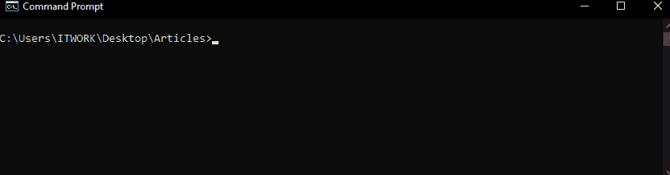
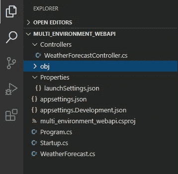
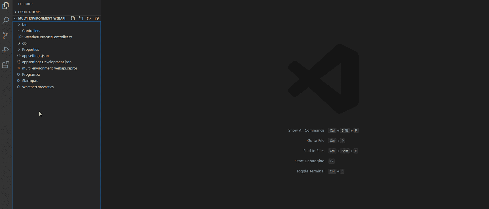
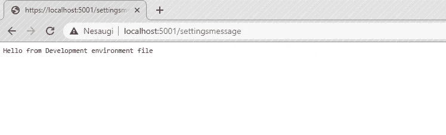
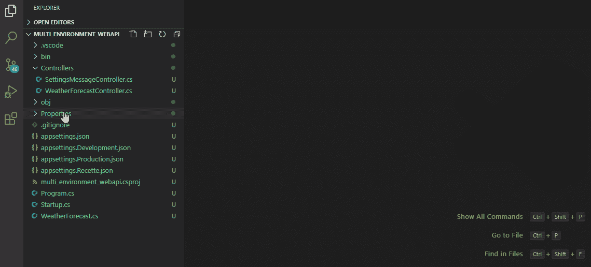

# 如何在中使用多种环境？网络核心

> 原文：<https://blog.devgenius.io/how-to-use-multiple-environments-in-net-core-b3441612e8bd?source=collection_archive---------2----------------------->

中管理多个开发环境的综合方法。网芯。


# 概观

随着……的引入。Net Core 带来了一系列的改进，包括个人和企业解决方案。开始学的时候。Net Core 没有必要了解多种开发环境和部署管道，因为在转向生产就绪型应用程序时，教程和在线课程不会涵盖这些重要信息。

在本文中，我将向您展示如何正确地设置多个。Net 核心应用程序环境，并利用不同的 appsetting.json 文件。

# 先决条件

我希望你对面向对象编程概念有基本的了解。

*   [Visual Studio 代码](https://code.visualstudio.com/)(或任何其他代码编辑器)
*   [。网芯 3.1 SDK](https://dotnet.microsoft.com/download)
*   [蔚蓝账户](https://azure.microsoft.com/en-us/free/)

# 步骤 1 —创建 API

首先，我们必须为。Net 核心 web API。幸运的是，我们已经有了用于这个目的的 SDK。选择希望应用程序驻留的文件夹，打开命令终端并键入以下命令:

```
mkdir mkdir multi_environment_webapi
cd multi_environment_webapi
dotnet new webapi
code . // If using VS Code
```



如果一切按预期进行，您应该打开代码编辑器，工作目录中的项目结构如下:



# 步骤 2-添加多个 appsetting.json 文件

现在，为了保持整洁有序，让我们创建两个特定于环境的 appsetting 文件。为了我们的发展，Recette 和生产应该是充足的。



默认情况下。Net core 已经支持多种环境，但是在这种情况下，它只加载特定环境的设置。更好的解决方案是拥有一个共享的 appsettings.json 文件，其中包含环境不变的配置和用于特定于环境的配置的单独文件。

现在我们来添加一些配置。

在“appsettings。Recette.json“我们补充一下

```
{
   "Message": "Hello from Recette environment file"
}
```

对其他环境也做同样的事情。

最后，是时候添加对加载多个配置文件的支持了。我们将对程序做一些修改

```
public static IHostBuilder CreateHostBuilder(string[] args)=>
 Host.CreateDefaultBuilder(args)
    .ConfigureWebHostDefaults(webBuilder =>
    {
       webBuilder.UseStartup<Startup>();
    })
    **.ConfigureAppConfiguration(appConfig =>
    {
       appConfig.AddJsonFile($"appsettings.json", false, true);  
       appConfig.AddJsonFile(  $"appsettings{Environment.GetEnvironmentVariable(
"ASPNETCORE_ENVIRONMENT")}.json", false, true);
    });**
```

它所做的只是加载默认的“appsettings.json”文件以及依赖于 **ASPNETCORE_ENVIRONMENT** 变量的值的设置。

# 第三步——收获成果

终于，是时候看看我们的劳动成果了。让我们创建一个简单的表示控制器，从我们的配置中返回我们的消息；

转到“控制器”文件夹，创建一个名为“SettingsMessageController.cs”的新文件

```
using Microsoft.AspNetCore.Mvc;
using Microsoft.Extensions.Configuration;namespace multi_environment_webapi.Controllers
{
   [ApiController]
   [Route("[controller]")]
   public class SettingsMessageController : ControllerBase
   {
      private string settingMessage;
      public SettingsMessageController(IConfiguration configuration)
      {
         settingMessage = configuration.GetValue<string>("Message");
      }

     [HttpGet]
      public string Get()
      {
         return settingMessage;
      }
   }
}
```

现在打开一个命令终端(在 visual studio 代码中是“CTRL +`”)并键入:

```
dotnet run
```

然后打开浏览器，导航到[localhost:5001/settings message](https://localhost:5001/settingsmessage)看看吧。



如果您想在其他环境中查看其他结果，只需导航到 launchSettings.json 并更改 ASPNETCOR_ENVIRONMENT 变量值:



就是这样！恭喜你！

现在，您已经有了一个基于应用程序环境的整洁且准备就绪的 appsetting 配置。我希望你学到了一些新的有用的东西来帮助你未来的项目。

你可以在我的 Github 库上查看整个项目:

## [https://github . com/EButa/multi _ environment _ webapi/commit/CCF 5d 40 decc 45 FD 403 b 18 bb 14 e 0376402 f 47 D2 E4](https://github.com/EButa/multi_environment_webapi/commit/ccf5d40decc45fd403b18bb14e0376402f47d2e4)

我希望你喜欢这篇文章，也希望它对你有用。感谢您的反馈，让我了解如何改进这一点。

# 进一步学习的免费参考资料:

[。NET 核心教程](https://bit.ly/medium_article_link) —微软文档

[ASP.NET 核心文档](https://bit.ly/medium_article_link2) —微软文档

# 如果你觉得有用，可以考虑投资我的咖啡瘾。

[](https://www.buymeacoffee.com/ernebuta) [## mounted.dev 为我晚上困扰的问题提供了解决方案

### 嘿👋只是来帮忙的。作为一名软件开发人员，我真的希望能多喝点咖啡！！

www.buymeacoffee.com](https://www.buymeacoffee.com/ernebuta)