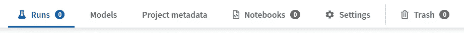
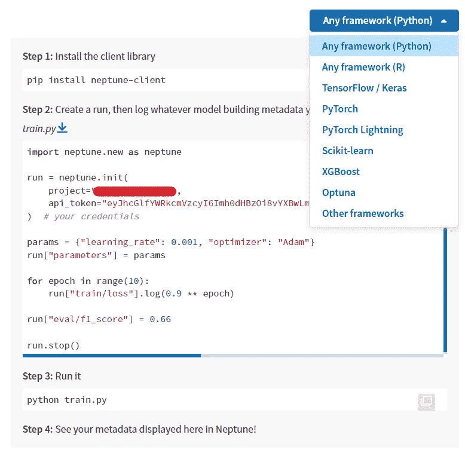
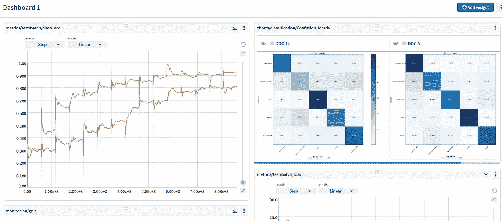

# 如何使用 Neptune.ai

> 原文：<https://blog.devgenius.io/how-to-use-neptune-ai-f87605e18ad3?source=collection_archive---------6----------------------->

你，小鹿机器学习工程师，大概已经知道，创建一个模型需要一些经验知识。尝试不同的模型和更改参数是您可以执行的许多操作中的一部分，但是您如何跟踪您所做的所有更改呢？

如果这是一个简单的任务，你可能只需要记住一会儿。尽管如此，有时在团队中工作，面对复杂的问题，仅仅记住是不可能的。经常使用电子表格，但更智能、更实用的工具是实验跟踪工具，比如 Neptune！

以这种方式不缺乏工具。尽管如此，Neptune 仍然是一个主要玩家，您会喜欢它主要是因为它有清晰、精确的文档和一些带有波兰口音的解释视频。这并不是说它很难使用，但是丰富的文档总是有助于学习新的特性，相信我，有很多这样的特性。

这也是我们决定在 Voxar 使用它的原因之一。另一个原因是因为我们专注于该工具的学术用途，Neptune 提供了一个[学术计划](https://neptune.ai/researchers#:~:text=Neptune%20is%20an%20experiment%20management,reinforcement%20learning%20or%20optimization%20research.)就是为了这个，我们可以免费获得无限的监控时间！

首先，和大多数互联网产品一样，你需要一个[账户](https://ui.neptune.ai/auth/realms/neptune/protocol/openid-connect/registrations?client_id=neptune-frontend&redirect_uri=https%3A%2F%2Fapp.neptune.ai%2F-%2Fonboarding&state=97bc0a71-407f-4c9f-89eb-fe0a84d85359&response_mode=fragment&response_type=code&scope=openid&nonce=fe887c12-4285-4b7c-b7e6-d322662acb97)。海王星对个人是免费的。

现在登录你的 Neptune 账户，创建一个新项目。第一次登录时，您可能会看到一些 Neptune 教程的弹出窗口，但在这种情况下，只需关闭它们，打开新的项目指南，并为您的项目命名。海王星会为你创造一把钥匙。

因此，在您的机器或环境中安装 Neptune:

```
pip install neptune-client
```

不要忘记导入:

```
**import** neptune.new **as** neptune
```

在我们继续之前，让我解释一下海王星是如何工作的。您将实例化一个对象，在那里您可以保存“您所关心的任何模型构建元数据”。在你的项目菜单上有三个选项卡，用来组织你的项目:



要填充它们，您将为它们创建一个对象，并使用 Neptune 方法之一将您想要的数据记录到它们中:
创建:

```
run = neptune.init(...)
model = neptune.init_model(...)
project = neptune.init_project(...)
```

让我们创建一个运行:



这是创建管路的标准方式:

```
run = neptune.init(
    project="your_project",
    api_token="your_api_token",
)*# your credentials*
```

创建后，有多种[方法可以记录数据](https://docs.neptune.ai/you-should-know/logging-metadata):

*   " = ":唯一变量和字典。
*   ".log()":一系列值，通常在循环中
*   ".track_files()":文件中的任何信息。
*   ".upload()":带有数据样本或混淆矩阵的文件或图形。
*   ".log() + File”:连续的文件或对象，如图像。

请记住在结尾使用 run.stop()，尤其是如果您使用的是笔记本，因为它们不会自动结束。

项目选项卡用于存储项目级元数据。它可以用来将数据集存储为工件，使得每次新运行时都可以轻松地访问它们。

```
project = neptune.init_project(
  name = "your_project",
  api_token = "your_api_token"
)
```

您可以存储数据集或链接到数据集。这里，我们创建了一个文件夹 general 并保存了一个字典。

```
project['general'] = {
        'data_link':'link_to_data', 
    }
```

最后，您可以保存您想要的模型，您创建的每个模型都可以有多个版本。所以首先:

```
model = neptune.init_model(
    name="Prediction model",
    key="MOD", 
    project="your_project", 
    api_token="your_api_token", *# your credentials*
)
```

在这个模型被创建之后，不要再次初始化它，除非你想改变这个模型。
创建它的一个版本:

```
model_version = neptune.init_model_version(
        model = 'NEP-MOD',
        project = 'your_project',
        name = 'first',
        api_token="your_api_token",
)
```

模型字段需要特殊的格式化:(名称)+ "-" +(关键)
这样您就可以上传模型或混淆矩阵:

```
model_version['model'].upload('model.pth')
```

让我们尝试记录一些东西，用字典记录我们模型的参数怎么样？
例如:

```
params = {
    'learning_rate': 0.008,
    'batch_size': 128,
    'epochs': 5,
    'optmizer':'Adam',
}
```

要记录它:

`run['parameters'] = params`

这里我们使用“=”操作符将字典保存在名为 parameters 的文件夹中。运行之后，进入 Neptune 项目菜单，选择可视化运行。您将看到在“所有元数据”中创建的文件夹。

但是对 Neptune 用户来说，T4 的精华就在你使用“的时候。log”运算符来保存，例如，精度。

```
run['test_acc_epoch'].log(acc_test)
```

运行结束后，Neptune 会自动为您创建图表，此外，您还可以用您所做的一切制作一些个性化的仪表盘。



只要把这个给你的老板看，就能得到免费的晋升。

我相信有了它，你可以很容易地将海王星添加到你的项目中。它使用起来非常简单，您将会学到更多的特性，比如如何使用调试模式、使用正则表达式、改变模型的状态、改变运行的同步模式等等。