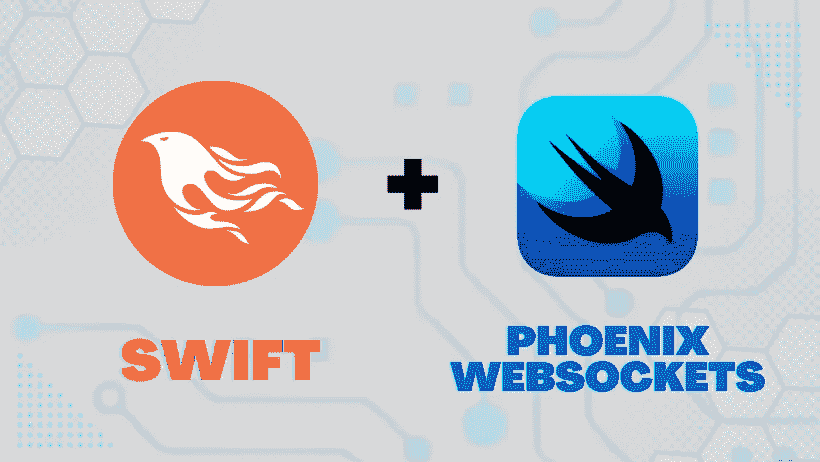

# 如何在 iOS 上配合 Swift 使用 Phoenix Websockets

> 原文：<https://blog.devgenius.io/how-to-use-phoenix-websockets-with-swift-on-ios-de8c70043e09?source=collection_archive---------4----------------------->

## 如何使用 Websockets 来驱动 iOS 应用程序和运行 Phoenix Framework 的服务器之间的交互式双向实时通信。



如果你正在开发一个与服务器通信的 iOS 应用程序，你可能会使用一个基于 HTTP 的 API，这是一个支持网络的协议。在基于 HTTP 的 API 中，当客户机需要显示数据时，它会向服务器发出特定的请求。

虽然 HTTP 非常适合应用程序发起的请求，如获取新闻订阅源或产品列表，但它不太适合实时*来回*通信，如聊天、游戏和其他交互式应用程序。如果你正在构建一个具有这些特性的应用程序，你可能会考虑使用 [Websockets](https://developer.mozilla.org/en-US/docs/Web/API/WebSockets_API) :客户端和服务器之间持久的双向连接。

[Phoenix](https://phoenixframework.org/) 是一个用于 [Elixir](http://elixir-lang.org/) 语言的 web 框架，它使 Websocket 通信变得超级简单，并提供了真正令人难以置信的性能和可伸缩性。在这篇文章中，我们将学习如何使用 Websockets 来驱动 iOS 应用程序和运行 Phoenix Framework 的服务器之间的交互式双向实时通信。

# 什么是 Websockets？

*Websockets* 是客户端和服务器之间的**持久双向连接**。

使用传统的 HTTP API，客户端通过向服务器发送请求来发起通信。当数据在服务器上变得可用时，它对客户机是不可见的，直到客户机发出新的请求。如果数据频繁变化，客户端需要执行*轮询*来定期检查新数据。

另一方面，Websockets 在客户机和服务器之间使用一个持久的连接。当新数据对服务器可用时，它可以立即*推*到客户端。一些要求实时交互的应用程序是游戏、聊天客户端和协作编辑器，但实际上，几乎任何类型的应用程序都可以通过实时通信提供更好的用户体验。甚至上面描述的新闻提要和产品列表也可以通过 Websockets 的实时更新得到增强。

# 基本概念:套接字、Phoenix 通道和消息

在 Phoenix 上使用 Websockets 时，通信被组织成不同的一个通道代表一个单独的数据流，由一个不同的字符串标识，客户端可以订阅。通道可能用于为聊天室、游戏中的特定比赛或当前用户的通知传递数据。

单个客户端同时连接到多个通道并不罕见。例如，一个客户端可能订阅了几个不同的聊天室，以及一个接收当前用户通知的频道。

信道通常被命名为`topic:subtopic`——其中`topic`是信道的类型，`subtopic`是特定的标识符。这通常对应于您系统中的型号和标识符，如`chat:lobby`、`match:114`或`user:10049`、*。*

一旦订阅了一个通道，我们就可以开始接收*消息，*消息由一个事件名和一个有效载荷组成。事件名称用于标识事件的类型。在一个聊天室的例子中，我们可能有像“聊天消息”，或“用户加入”和“用户离开”这样的事件。有效载荷用于提供附加数据。例如，对于“聊天消息”事件，我们的有效负载可能是:

```
{ 
  sender: {id: 129, name: "Bob"},
  message: "Good morning, everybody!" 
}
```

有了这样的背景，让我们开始在 iOS 应用程序中使用 Phoenix 频道。

# 凤凰后端:设置一个频道

在本节中，我们将假设您已经有了一个 Phoenix 服务器并正在运行。如果没有，可以从[凤凰文档](https://hexdocs.pm/phoenix/up_and_running.html)入手。

首先，我们将在 Phoenix 应用程序中创建一个频道。我们可以用下面的`mix`命令创建基本的模板:

```
mix phx.gen.channel Room
```

这将创建几个文件，并给出一些关于配置新通道的说明。我们最感兴趣的文件是我们的通道模块:`lib/myapp_web/channels/room_channel.ex`。该文件包含在通道生命周期的不同阶段调用的回调的占位符代码。

## 连接并验证

我们要看的第一个回调是针对`join`事件的，当用户试图加入一个频道时会调用这个回调。在默认实现中，我们简单地检查客户端是否被授权，并通过返回适当的元组来接受或拒绝连接:

```
def join("room:lobby", payload, socket) do 
  if authorized?(payload) do 
    {:ok, socket} 
  else 
    {:error, %{reason: "unauthorized"}} 
  end 
end
```

在这个例子中，我们有处理到我们的`room:lobby`通道的用户连接的逻辑——为了支持不止一个通道，我们可以根据需要在第一个参数上进行模式匹配来处理连接逻辑。例如:

```
def join("room:" <> room_id, payload, socket) do ... end
```

在文件的更深处，我们将找到包含实际授权逻辑的`authorized?`函数。在这个占位符代码中，它只返回 true，这意味着任何客户端都可以加入通道。这对于开发目的来说很好，但是对于真实世界的用例来说可能合适也可能不合适。

出于安全目的，Websocket 连接不能访问客户端 cookies。如果您的应用程序需要执行授权来加入通道，典型的方法是传递从以前的身份验证请求发出的令牌。

## 在信道上发送和接收消息

接下来，让我们看看如何处理通道中的消息。我们用`handle_in`函数来实现。使用事件名称、数据有效负载和当前套接字调用该函数。在生成的文件中，我们将看到`handle_in`的两个实现，它们展示了消息处理的两种不同的常见模式。

在第一个实现中，我们接收一条消息，并通过返回一个以`:reply`开头的元组将回复发送回同一个客户端。这种模式有点像一个简单的 HTTP API 调用，因为它是由客户端发起并发送响应的:

```
def handle_in("ping", payload, socket) do 
  {:reply, {:ok, payload}, socket} 
end
```

然而，第二个实现展示了另一个常见的模式:它不直接向客户端发回响应，而是使用[Phoenix.Channel.broadcast/3](https://hexdocs.pm/phoenix/Phoenix.Channel.html#broadcast/3)函数向通道上所有*连接的客户端广播一条消息:*

```
def handle_in("shout", payload, socket) do 
  broadcast(socket, "shout", payload) 
  {:noreply, socket} 
end
```

这是我们对于聊天或游戏客户端应该遵循的模式类型:由一个客户端发起的事件被广播到频道上的每个人(包括发起事件的客户端)。这样，我们可以跨所有客户端同步状态。

上面的例子在通道内从*发送一个广播，使用套接字作为上下文。然而，通过[经由端点本身](https://hexdocs.pm/phoenix/Phoenix.Channel.html#module-broadcasting-to-an-external-topic)广播消息，也可以将消息从应用程序中的其他地方广播到通道:*

```
MyApp.Endpoint.broadcast("room:topic", "event", message)
```

这对于将来自应用程序中某个不相关进程的消息发送到通道非常有用。

# iOS 客户端:与 SwiftPhoenixClient 连接

现在我们有了一个基本的服务器通道设置，我们可以集成我们的 iOS 应用程序。为了在 Swift 上使用 Phoenix channels，我们需要一个 Websocket 客户端。尽管 Swift Foundation 的 [URLSession](https://developer.apple.com/documentation/foundation/urlsession) 确实包含基本的 Websocket 功能，但 Phoenix channels 确实在原始 socket 之上包含了一些逻辑(用于通道、在线状态等)，因此我们将使用第三方库: [SwiftPhoenixClient](https://github.com/davidstump/SwiftPhoenixClient) 。

如果您使用 Xcode 和 Swift 包管理器作为您的依赖项，您可以进入*项目设置- > Swift 包*，然后添加包:`[https://github.com/davidstump/SwiftPhoenixClient.git](https://github.com/davidstump/SwiftPhoenixClient.git)`

如果您使用的是 Cocoapods，那么将需求添加到您的 Podfile 并运行`pod install`:

```
pod "SwiftPhoenixClient", '~> 5.1'
```

## 连接到服务器并订阅频道

在你成功地将`SwiftPhoenixClient`添加到你的项目之后，你可以用它来创建一个到你的后端的连接。我们将使用上一步中在端点中指定的相同套接字路径。下面是我们如何连接套接字并安装一些基本的回调来处理生命周期事件:

```
socket = Socket("http://localhost:4000/socket/websocket", params: ["param": "value"]) socket.delegateOnOpen(to: self) { (self) in } socket.delegateOnClose(to: self) { (self) in }
socket.delegateOnError(to: self) { (self, error) in } socket.connect()
```

一旦我们的套接字被连接，我们就可以开始加入通道。这里，我们用一些连接参数加入`room:lobby`通道，并为通道的一些生命周期事件安装处理程序:

```
let topic = "room:lobby" channel = socket.channel(topic, params: ["param": "value"]) channel 
  .join() 
  .delegateReceive("ok", to: self, callback: { (self, _) in })      
  .delegateReceive("error", to: self, callback: { (self, msg) in })
```

## 在信道上发送和接收消息

一旦我们的通道被连接，我们就可以开始监听通过通道广播的消息，每种消息类型都有一个单独的处理程序。例如，如果我们正在构建一个聊天客户端，我们可能会期望几种不同的消息类型来构建聊天室体验:

```
channel.on("chat_message", callback: { [self] (message) in ... }) channel.on("sound_played", callback: { [self] (message) in ... }) channel.on("user_join", callback: { [self] (message) in ... })
```

在这些处理程序中，我们可以使用提供的消息数据来采取行动或更新本地客户端状态。例如，当收到一个`chat_message`事件时，我们可以从有效负载中提取消息，并将其放入一个本地消息数组中，通过 SwiftUI 显示这些消息。

最后，拼图的最后一块是使用`channel.push`向我们的频道发送消息:

```
channel.push("chat_message", payload: ["message": "Hello!"]) 
```

# 接下来的步骤—将所有这些放在一起

综上所述，以下是我们在 iOS 应用中实现 Websocket 通信的步骤:

*   在后端创建一个凤凰频道
*   处理来自客户端的连接和传入事件
*   使用 [SwiftPhoenixClient](https://github.com/davidstump/SwiftPhoenixClient) 从 Swift 连接到频道
*   处理从服务器推出的事件并更新客户端状态
*   推送来自我们客户的事件，这些事件可以在频道上向其他人广播

有了这些东西，你就可以开始在你的 iOS 应用中构建实时、多客户端、交互式的体验了。

*原载于*[*https://blixtdev.com*](https://blixtdev.com/how-to-use-phoenix-websockets-with-swift-on-ios/)*。*

乔纳森写了一些关于创业、软件工程和健康科学的文章。如果你喜欢这篇文章，请考虑加入 Medium 来支持 [*Jonathan 和其他数千位作者*](https://medium.com/@jonnystartup/membership) *。*