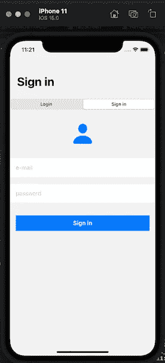
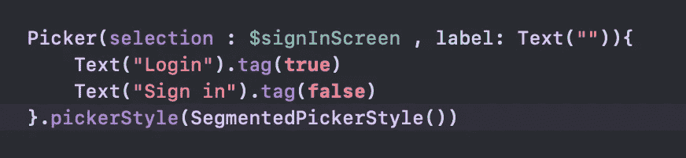
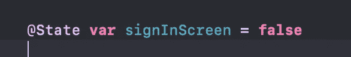
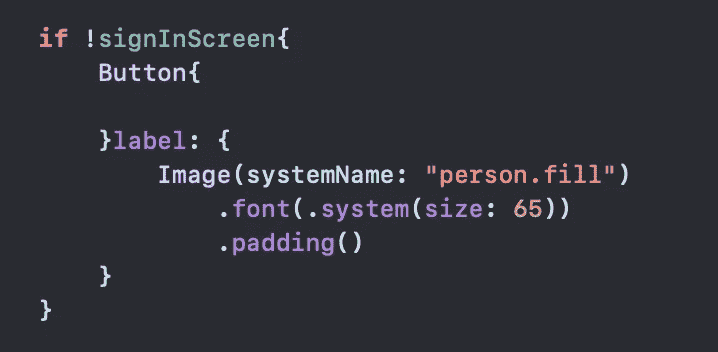
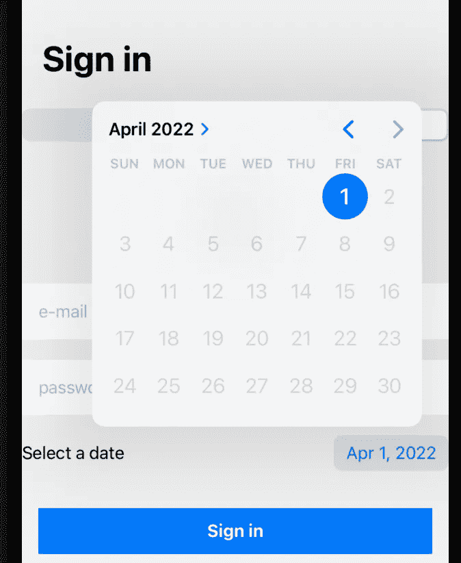
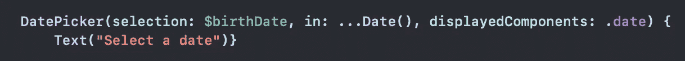

# 如何在 SwiftUI 中使用 Picker

> 原文：<https://blog.devgenius.io/how-to-use-picker-in-swiftui-e28b485f89ed?source=collection_archive---------7----------------------->

*首先，让我们从* ***picker*** *元素的定义开始。*

*我们用****picker****元素呈现给用户。用户选择我们提供的数据中的一个，并沿着这个方向继续操作。*

*使用* ***选择器*** *的目的有时是让用户选择日期，有时是选择出生年份等。*

照片 _1

*例如，在 photo_1 的顶部，我们看到两个选项，“登录”和“登录”。我们向用户提供这两个选项，屏幕上的组件根据用户的选择而变化。*

*现在让我们看看我们是如何做到这一点的，并尝试理解 swiftUI 的* ***选取器*** *逻辑。*

照片 _2

*我们在 phote_2 中编写了****picker****并在 photo_1 中给出了它的外观。我们赋予选择参数的值是一个上面定义的布尔变量。我们可以用这个变量控制用户点击哪个选项。*

*同样，通过“pickerStyle”中的参数，我给出了那个二元视图。*

照片 _3

*正如你在 photo_3 中看到的，我们将变量“signInScreen”的初始值设置为 false。因此，当视图位于“登录”部分时，变量的值将为 false。*

照片 _4

*在 photo_4 中，我写了当“signInScreen”为真，也就是选择了“签到”时，我要做的额外事件。在这个例子中，我想做的是在屏幕上添加一个按钮，我们可以选择一个额外的个人资料照片。*

让我们试着在应用程序中添加一个可以选择日期的字段。

照片 _5

在照片 _5 中，我们看到了我们想要达到的效果。

*让我们一起来看看我是如何编码这个视图的。*

照片 _6

*在 photo_6 中可以看到，这次我使用了“****date picker****”元素。我利用 SwiftUI 的便利来选择日期。*

*“生日”变量也是我们上面定义的变量。这次我们将类型设置为“Date()”。*

*通过“displayedComponents ”,我们已经确定了视图的外观。*

在这篇文章中，我试图向你传达我们如何在 swiftUI 中使用 picker 元素。

我希望，我能对你有用。

***感谢您抽出时间阅读。***

***下期见。***