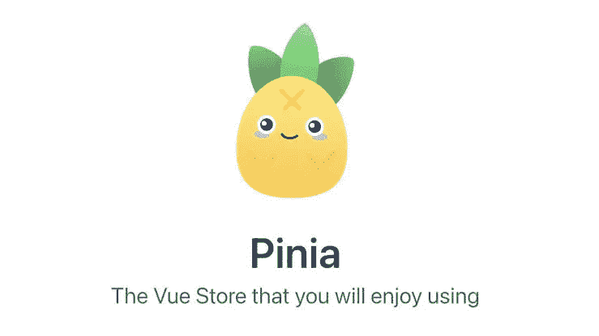
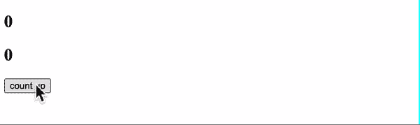
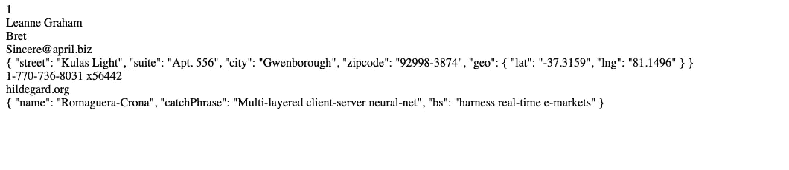

# 如何将 pinia 与合成脚本设置一起使用

> 原文：<https://blog.devgenius.io/how-to-use-pinia-with-composition-script-setup-2352558fb06c?source=collection_archive---------0----------------------->



图片来自[https://dev . to/aaronksaunders/intro-to-using-pinia-for-state-management-in-vuejs-1n 39](https://dev.to/aaronksaunders/intro-to-using-pinia-for-state-management-in-vuejs-1n39)

# 目的

最近，我被分配了一个 vue 项目，使用的是 pinia。这是第一次使用这个状态管理库，所以我想告诉你这个库的优点和缺点以及如何使用它。

# 皮尼亚是什么？

正如我已经提到的，pinia 是 vue 的一个状态管理库。如果你熟悉 vue，你应该听说过 vuex。是的，vuex 也是一个状态管理库，它是全球状态管理库事实上的标准。不过从 vue3 来看，pinia 是官方推荐使用的。

# 皮尼亚和 vuex 有什么区别？

1.  省略突变。

这是一个有争议的话题，但是我同意这个改变。基本上，vuex 来源于 flux 思想，它禁止直接改变状态，以保护状态不受意外变化的影响。因此，vuex 有“突变”方法，这是改变状态的唯一方法，我们需要提交内部操作来改变。当然，这种方式对于保护状态是必不可少的，但是这种特性使得 vuex 很难管理状态，也很复杂。Pinia 省略了这个突变特性，我们可以通过动作改变我们的状态并直接访问状态，因此我们可以更简单地管理状态。

2.完全支持 typescript

在 vuex 中，不完全支持 typescript，因此如果您想在 vuex 中使用 typescript，您需要创建自定义包装器来使用它。然而，pinia 默认支持 typescript，因此您可以轻松地将 vue3 与 typescript 一起使用。最近有很多项目使用了 typescript，所以添加它很重要。

3.分开的商店。

在 vuex 中，有几个嵌套存储的全局存储用于整个存储。这对于小型项目也很有用，但是对于大型项目来说，管理嵌套存储有点困难。相反，在皮尼亚，有几个商店可以分开使用。这对于使用和管理状态更加灵活，尤其是对于大型项目。

好了，让我们深入一些例子。

# 示例 1 基本用法

## 步伐

1.  创建 vue 项目并安装 pinia。在本例中，我使用 vite 创建了这个示例项目，但是您可以使用任何想要的东西

```
# npm 6.x
npm create vite@latest my-vue-app --template vue # npm 7+, extra double-dash is needed:
npm create vite@latest my-vue-app -- --template vue #  Then, install pinia
npm install pini
```

2.创建一个 vue 文件并使用 pinia 作为插件

```
// main.js
import { createApp } from 'vue'
import { createPinia } from 'pinia'
import App from './App.vue' const pinia = createPinia()
const app = createApp(App) app.use(pinia)
app.mount('#a
```

3.创建您的商店。你可以使用选项存储和组合一。在这种情况下，我将重点讨论使用组合 Api 的选项存储方式。您需要设置 defineStore 并将第一个参数作为 id 传递。然后，可以设置三个对象“状态”、“getters”、“actions”。State 是使用 state 和 getters 添加一些计算属性来改变或处理状态。动作是设置业务逻辑，如获取信息。

```
import { defineStore } from 'pinia' export const useCounterStore = defineStore('counter', {
  state: () => ({ count: 0 }),
  getters: {
    doubleCount: (state) => state.count * 2,
  },
  actions: {
    increment() {
      this.count++
    },
  },
});
```

4.用你的店。如果你想使用析构，你需要有“stateToRefs”来保持你的状态和 getters 是可反应的。另一方面，你可以只提取动作。

```
<script setup>
import { useCounterStore } from "./store";
import { storeToRefs } from "pinia"; const store = useCounterStore();
const { doubleCount } = storeToRefs(store);
const { increment } = store;
</script> <template>
  <h1>{{ store }}</h1>
  <h2>{{ doubleCount }}</h2>
  <button @click="increment">count up</button>
</template
```

下面是我的屏幕。上述代码工作正常。



# 示例 2 获取数据

## 步伐

*1 和 2 与示例 1 相同。您需要创建您的项目，安装 pinia 并在 main.js 中准备 pinia

3.创建你的商店。在这个例子中，我将关注一个数据获取的例子。我想使用 axios 来获取数据，所以您需要通过“npm i axios”添加 axios(您也可以使用 fetch API，所以这取决于您)。我从 jsonplaceholder 获取用户，并通过“this.users = res.data”注入状态

```
import { defineStore } from "pinia";
import axios from "axios"; export const useFetchStore = defineStore("fetch", {
  state: () => ({ users: [] }),
  actions: {
    async fetchUsers() {
      try {
        const res = await axios.get(
          "https://jsonplaceholder.typicode.com/users"
        );
        this.users = res.data;
        console.log("users", this.users);
      } catch (err) {
        console.error(err);
      }
    },
  },
});
```

4.像下面这样使用你的商店。我想在挂载 DOM 时获取数据，所以我使用 onMounted 钩子来获取数据。然后我提取用户名，用 v-for 表示。

```
<script setup>
import { onMounted } from "vue";
import { useFetchStore } from "./store";
import { storeToRefs } from "pinia"; const store = useFetchStore();
const { users } = storeToRefs(store);
const { fetchUsers } = store; onMounted(() => {
  fetchUsers();
});
</script> <template>
  <div v-for="user in users" key="user.id">
    {{ user.name }}
  </div>
</templat
```

下面是我的截屏和成功加载的用户名。


注意，如果你想过滤第一个用户，你不能使用如下方式。这是因为获取用户数据的时间。

```
<script setup>
import { onMounted, computed } from "vue";
import { useFetchStore } from "./store";
import { storeToRefs } from "pinia"; const store = useFetchStore();
const { users } = storeToRefs(store);
const { fetchUsers } = store; <------------------wrong code-------------------
//This code is undefined because of the timing of fetching
console.log("firstUser", users && users[0]); // So, this code also has an error because users are not saving correctly in this time even if you add computed const filterUser = computed(() => {
  const result = users.filter((user) => user.id === 1);
  console.log("result", result);
  return result;
}); // an error occured
filterUser();
-------------------------------------> onMounted(() => {
  fetchUsers();
});
</script> <template>
  <div v-for="user in users" key="user.id">
    {{ user.name }}
  </div>
</tem
```

所以，如果你想过滤第一个用户，你需要在 useFetchStore 中添加 getters，如下所示。

```
import { defineStore } from "pinia";
import axios from "axios"; export const useFetchStore = defineStore("fetch", {
  state: () => ({ users: [] }),
 // Need to add filter here
  getters: {
    filteredFirstUser() {
      return this.users[0];
    },
  },
  actions: {
    async fetchUsers() {
      try {
        const res = await axios.get(
          "https://jsonplaceholder.typicode.com/users"
        );
        this.users = res.data;
        console.log("users", this.users);
      } catch (err) {
        console.error(err);
      }
    },
  },
});
```

并使用如下数据

```
<script setup>
import { onMounted } from "vue";
import { useFetchStore } from "./store";
import { storeToRefs } from "pinia"; const store = useFetchStore();
// destructuring as refs same as state
const { filteredFirstUser } = storeToRefs(store);
const { fetchUsers } = store; onMounted(() => {
  fetchUsers();
});
</script> <template>
// Use same as state
  <div v-for="firstUserData in filteredFirstUser" key="userData.id">
    {{ firstUserData }}
  </div>
</templat
```

下面是我的屏幕，你可以看到上面的代码工作正常。



获取数据的时间对我来说是最奇怪的部分之一，因为我已经习惯了使用 React 方式。在 react 中，您可以在同一个 JS 脚本中获取数据和过滤数据。但是，vue.js 和 pinia 不允许。

我团队中的一位高级开发人员说 React 专注于‘脚本’。相反，vue 侧重于‘模板’。所以你需要知道 react 和 vue way 之间的区别，我认为这个想法是正确的，因为很难用像' users[0]这样的点来访问获取的数据。name '，或者在脚本文件中的 vue 中过滤和映射(我经常用 React 这种方式)。

我知道我们可以在 vue 中使用 filter 和 map 以及 computed，但与 react 相比不太常用。

# 结论

Pinia 是一个很棒的全球管理商店库，了解如何使用 pinia 很重要。

我觉得这篇文章对 react 开发者特别有用(但是需要像我一样使用)。

# 参考

皮尼亚官方网站:[https://pinia.vuejs.org/](https://pinia.vuejs.org/)

vite 官方网站:【https://vitejs.dev/ 

感谢您的阅读！！！