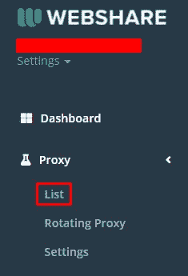
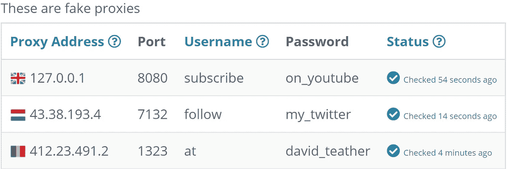
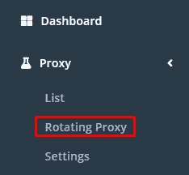
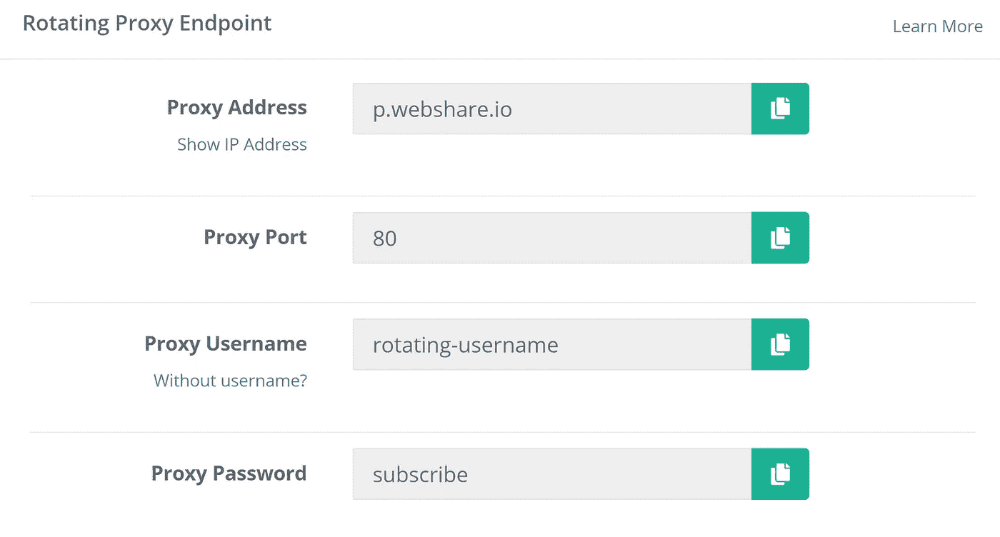

# 如何在 Python 中使用代理——一切网络搜集 002

> 原文：<https://blog.devgenius.io/how-to-use-proxies-in-python-everything-web-scraping-002-1c28acc092cf?source=collection_archive---------6----------------------->


由[克里斯多佛·高尔](https://unsplash.com/@cgower?utm_source=medium&utm_medium=referral)在 [Unsplash](https://unsplash.com?utm_source=medium&utm_medium=referral) 拍摄的照片

快速学习如何使用 python 中的代理进行 web 抓取！

> *注:这是我的* [*万物网刮*](https://github.com/davidteather/everything-web-scraping/tree/main/002-proxies) *开源课程的一个中等版本！去参观一下吧！*

# Python 中如何使用代理？

我将在这里使用 [webshare.io](https://www.webshare.io/) ,但是其他代理提供者也有非常相似的接口



访问代理->列表



你应该看一些证书

然后我们可以将这些凭证移动到一个 python 文件中

```
PROXY_ADDRESS = "127.0.0.1"
PROXY_PORT = 8080
PROXY_USERNAME = "subscribe"
PROXY_PASS = "on_youtube"
```

我们将使用 requests 包，您可以用`pip install requests`安装它，我们想创建一个字典来保存我们的代理凭证。

```
PROXY_ADDRESS = "127.0.0.1"
PROXY_PORT = 8080
PROXY_USERNAME = "subscribe"
PROXY_PASS = "on_youtube"

import requests # run "pip install requests" to install this package

proxy_credential = {
    "http": f"http://{PROXY_USERNAME}:{PROXY_PASSWORD}@{PROXY_ADDRESS}:{PROXY_PORT}"
    "https": f"http://{PROXY_USERNAME}:{PROXY_PASSWORD}@{PROXY_ADDRESS}:{PROXY_PORT}"
}
```

现在我们只需要在用请求包发出请求时传递我们的`proxy_credential`,就像这样

```
PROXY_ADDRESS = "127.0.0.1"
PROXY_PORT = 8080
PROXY_USERNAME = "subscribe"
PROXY_PASS = "on_youtube"

import requests # run "pip install requests" to install this package

proxy_credential = {
    "http": f"http://{PROXY_USERNAME}:{PROXY_PASSWORD}@{PROXY_ADDRESS}:{PROXY_PORT}"
    "https": f"http://{PROXY_USERNAME}:{PROXY_PASSWORD}@{PROXY_ADDRESS}:{PROXY_PORT}"
}

requests.get("https://github.com/davidteather/everything-web-scraping/stargazers", proxies=proxy)
# You could also be on the stargazers list if you star this repo 😎
```

# 旋转代理

旋转代理分发请求，以便您的目标网站看到多个 IP，您可以在我的免费开源课程中了解更多关于有效使用代理的信息

您可以定义多个代理，并根据某种逻辑选择您想要使用的代理。也许你想随机选择一个代理来发送请求，你可以定义一大堆代理字典，做一些类似下面的事情

假设您已经定义了`proxy_credential_1`和`proxy_credential_2`指向不同的代理。您可以定义一个简单的旋转代理来完成如下任务。

```
import random

requests.get("https://github.com/davidteather/everything-web-scraping/stargazers", 
    proxies=random.choice([proxy_credential_1, proxy_credential_2])
)
```

代理服务通常提供旋转代理



您的轮换代理的凭据

如果我们将这些凭证插入代理字典，它会自动将我们的请求分发到我们控制的所有代理上。

```
PROXY_ADDRESS = "p.webshare.io"
PROXY_PORT = 80
PROXY_USERNAME = "rotating-username"
PROXY_PASS = "subscribe"

import requests # run "pip install requests" to install this package

proxy = {
    "http": f"http://{PROXY_USERNAME}:{PROXY_PASSWORD}@{PROXY_ADDRESS}:{PROXY_PORT}"
    "https": f"http://{PROXY_USERNAME}:{PROXY_PASSWORD}@{PROXY_ADDRESS}:{PROXY_PORT}"
}

requests.get("https://github.com/davidteather/everything-web-scraping/stargazers", proxies=proxy)
# You could also be on the stargazers list if you star this repo 😎
```

如果你喜欢这个，你会喜欢在 [Everything Web Scraping](https://github.com/davidteather/everything-web-scraping) 和我的 [YouTube 频道](https://www.youtube.com/@DavidTeatherCodes)上的其余内容