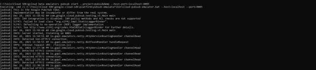
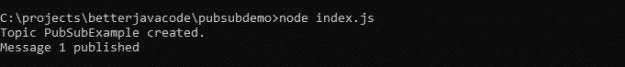
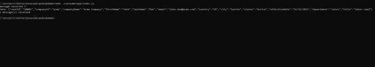

# 如何对 NodeJS 使用发布/订阅

> 原文：<https://blog.devgenius.io/how-to-use-pub-sub-with-nodejs-b63a9119bf6d?source=collection_archive---------10----------------------->

在本文中，我将展示如何在 NodeJS 应用程序中使用发布/订阅模式。我们将使用 Google Cloud 发布/订阅模块来构建这个示例应用程序。

# 什么是 Pub/Sub？

以前大多数架构都是同步的。但是随着微服务的出现，异步通信是设计中平等的一部分。发布/订阅就是这样一种允许异步通信的模型。通常，在[事件驱动架构](https://betterjavacode.com/programming/microservices-event-driven-architecture)中，一个服务发布一个事件，另一个服务消费该事件。

在发布和使用消息时，消息代理扮演了一个中继角色。谷歌云(Pub-Sub)和 AWS 都提供一种服务(SNS & SQS ),允许应用程序使用 Pub-Sub 模式。发布/订阅的另一个优点是它允许建立一个重试策略，包括等幂。你可以在这里了解更多关于事件驱动架构[的信息。](https://www.educative.io/path/scalability-system-design?aff=VRQq)

# 推挽式

在任何发布-订阅模型中，都有两种实现模式。一个是推，一个是拉。

在拉动模式中

*   消费者发送一个请求来提取任何消息。
*   如果有任何可用的且先前未被使用的消息，则发布/订阅服务器用消息来响应。
*   消费者发送确认。

在推送模式中

*   发布者向发布/订阅服务器发布消息
*   发布/订阅服务器将消息发送到消费者端的指定端点。
*   消费者收到消息后，会发送一条确认消息。

# NodeJS 应用

作为文章的一部分，我们将创建一个使用发布订阅模型的 nodejs 应用程序。这个应用程序将发送简单的消息到谷歌云发布/订阅。我们将有另一个消费应用程序来消费这个消息。

因此，在我们编写应用程序之前，让我们确保您已经在您的环境中安装了 gcloud emulator。首先，根据你的操作系统安装 [gcloud sdk](https://cloud.google.com/sdk/docs/install) 。

现在，在您的环境中初始化 gcloud，您需要登录

`gcloud init`

Gcloud 会问一堆问题来选择项目，配置云环境。

现在，我们将在本地环境中为 gcloud 安装一个`pub-sub`组件模拟器。

`gcloud components install pubsub-emulator`

现在，要开始使用发布-订阅服务，请使用以下命令

`gcloud beta emulators pubsub start --project=pubsubdemo --host-port=localhost:8085`

该命令将在本地主机 8085 上启动 pubsub 服务。因为我们将不得不在我们的应用程序中使用这个服务，所以我们需要知道服务位于哪里。因此，设置两个环境变量

`PUBSUB_EMULATOR_HOST=localhost:8085` `PUBSUB_PROJECT_ID=pubsubdemo`

# Publisher 应用程序

一般来说，我们有一个 Publisher 应用程序。这个应用程序检查主题是否存在于发布-订阅服务中，如果不存在，则创建该主题。一旦创建了主题，它就通过消息将数据发送到发布-订阅服务主题。

该应用程序的代码如下所示:

```
const { PubSub } = require('@google-cloud/pubsub');
require('dotenv').config();

const pubsubClient = new PubSub();

const data = JSON.stringify({
  "userId": "50001",
  "companyId": "acme",
  "companyName": "Acme Company",
  "firstName": "John",
  "lastName": "Doe",
  "email": "john.doe@acme.com",
  "country": "US",
  "city": "Austin",
  "status": "Active",
  "effectiveDate": "11/11/2021",
  "department": "sales",
  "title": "Sales Lead"
});
const topicName = "PubSubExample";

async function createTopic() {
  // Creates a new topic
  await pubsubClient.createTopic(topicName);
  console.log(`Topic ${topicName} created.`);
}

async function doesTopicExist() {
  const topics = await pubsubClient.getTopics();
  const topicExists = topics.find((topic) => topic.name === topicName);
  return (topics && topicExists);
}

if(!doesTopicExist()) {
  createTopic();
}

async function publishMessage() {
    const dataBuffer = Buffer.from(data);

    try {
      const messageId = await pubsubClient.topic(topicName).publish(dataBuffer);
      console.log(`Message ${messageId} published`);
    } catch(error) {
      console.error(`Received error while publishing: ${error.message}`);
      process.exitCode = 1;
    }
}

publishMessage();
```

反过来，让我们看看消费者应用程序。

```
require('dotenv').config();

const { PubSub } = require(`@google-cloud/pubsub`);

const pubsubClient = new PubSub();
const subscriptionName = 'consumeUserData';
const timeout = 60;
const topicName = 'PubSubExample';

async function createSubscription() {
  // Creates a new subscription
  await pubsubClient.topic(topicName).createSubscription(subscriptionName);
  console.log(`Subscription ${subscriptionName} created.`);
}

async function doesSubscriptionExist() {
  const subscriptions = await pubsubClient.getSubscriptions();
  const subscriptionExist = subscriptions.find((sub) => sub.name === subscriptionName);
  return (subscriptions && subscriptionExist);
}

if(!doesSubscriptionExist()) {
    createSubscription().catch(console.error);
}

const subscription = pubsubClient.subscription(subscriptionName);

let messageCount = 0;

const messageHandler = message => {
  console.log(`message received ${message.id}`);
  console.log(`Data: ${message.data}`);
  messageCount += 1;

  message.ack();
};

subscription.on(`message`, messageHandler);
setTimeout(() => {
  subscription.removeListener('message', messageHandler);
  console.log(`${messageCount} message(s) received`);
}, timeout * 1000);
```

基本上，这个消费者应用程序验证订阅是否存在，如果不存在，它将根据发布者应用程序发送消息的主题创建一个订阅。一旦消息到达发布-订阅主题，消费者应用程序就会提取该消息。这个应用程序实现了发布-订阅的拉模型。

# 演示

在启动 pubsub 服务模拟器时，我们将看到如下所示的日志:



现在，让我们执行 publisher 应用程序，我们将看到消息发布的控制台日志



如果您执行相同的应用程序，您将不会看到消息`Topic PubSubExample created`。

现在，如果执行消费者应用程序，我们将把发布者发送的消息拉至主题。



同样的演示与一个简单的织机视频[在这里](https://www.loom.com/share/9ef8d58e418f46c0911ed612c21437d2)。

# 结论

在这篇文章中，我展示了如何在 NodeJS 应用程序中使用 Pub Sub。发布-订阅是在企业应用程序中使用的强大模型。它允许我们构建可以异步通信的服务。如果你有更多关于这个话题的问题，请随时联系 [me](https://betterjavacode.com/contact-us) 。

*原载于 2021 年 12 月 27 日 https://betterjavacode.com**[*。*](https://betterjavacode.com/programming/how-to-use-pub-sub-with-nodejs)*