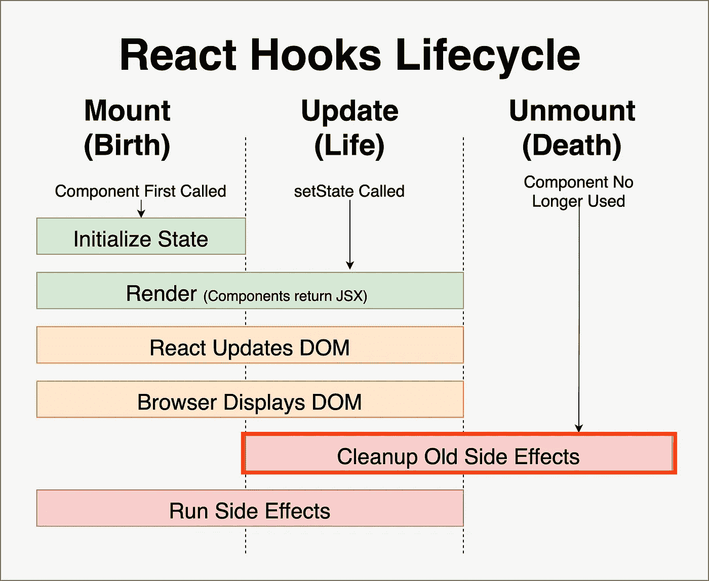
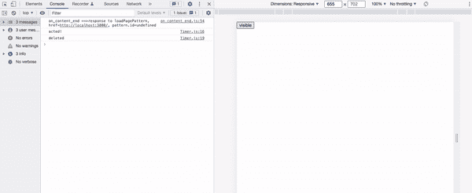
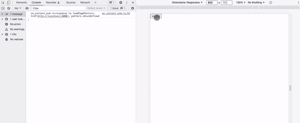
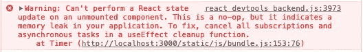

# 举例说明如何使用 react 清理功能

> 原文：<https://blog.devgenius.io/how-to-use-react-clean-up-function-with-example-7a073392e479?source=collection_archive---------0----------------------->


图片来自[https://binar apps . com/clean-up-request-in-use effect-react-hook/](https://binarapps.com/clean-up-request-in-useeffect-react-hook/)

**目的**

虽然我最近觉得在 react 中使用“生命周期方法”更舒服，这是从 React 组件的诞生到死亡发生的一系列事件。虽然在本文中我不会关注生命周期方法本身，因为有许多资料和文章解释这些方法，但我会关注 react 生命周期中使用的清理功能。

**什么是清理功能？**

该清除功能用于清除旧副作用的影响。就功能组件而言，在 useEffect 中调用回调函数之前，必须调用该函数。说到类组件，“componentWillUnmount”相当于一个清理函数。

请看下图。这是生命周期方法的整个流程。我没有解释整个流程，这是“浏览器显示 DOM”和“运行副作用”之间的过程。



图片来自[https://github . com/learn-co-course/react-hooks-use-effect-clean up](https://github.com/learn-co-curriculum/react-hooks-use-effect-cleanup)

**为什么我们需要清理功能？**

基本上，防止内存泄漏，这是使用一些不必要的空间，因为忘记清理功能或运行。它仍然在工作，所以有人(尤其是初学者)认为我们不需要关心内存泄漏，但它是必不可少的，以提高网站速度和计算机的性能进行优化。

**这种情况需要一个清除功能**

数据获取(如果在组件消失后收到响应)

事件监听器(定时器、订阅)

您需要将此功能用于如上所述的“连续”或“异步”任务。

**清理函数的语法。**

基本语法如下。返回之后，在回调函数内部，你需要放一个清理函数。

```
useEffect(() => {
 // some functions
  return () => {
    // cleanup function
  }
}, [])
```

**一个清理功能的例子。**

我刚刚使用“创建反应应用程序”创建了一个简单的反应计时器应用程序。“App.js”是通过点击按钮来显示一个可见或隐藏的计时器。

“Timer.js”是当一个定时器改变为显示可视时启动一个定时器。我创建了一个 countIncrement 函数来改变状态，并在 setinterval 中使用。

下图是实际应用。

当我点击左上方的“visible”按钮时，计时器可见并开始计时(控制台“动作”)。当我点击重置按钮时，计时器会立即停止并重新启动。然后，当我单击左上角的隐藏按钮(它取代了可见按钮)时，计时器将被隐藏，计时器也将被停止(并且控制台“删除”)。



清理成功

如果我在代码中删除了一个清理函数，当我单击“隐藏”按钮时，将会出现如下错误。



清除错误



上面的错误警告为防止内存泄漏添加了一个清理功能。

如果我去掉注释，添加一个清理函数，这个错误就会消失。

**结论**

当你一步一步熟悉 react 的时候，你应该更多地关注如何避免浪费计算机资源。这个清理功能是用于改进的，所以这是一个非常重要的实现良好实践的方法。

**参考**

了解 React 的 useEffect 清理功能:[https://blog . log rocket . com/understanding-React-use effect-clean up-function/#:~:text = The % 20 clean up % 20 function % 20 prevents % 20 memory，clean up % 20% 7D % 20% 7D % 2C % 20% 5b input % 5D)](https://blog.logrocket.com/understanding-react-useeffect-cleanup-function/#:~:text=The%20cleanup%20function%20prevents%20memory,cleanup%20%7D%20%7D%2C%20%5Binput%5D))

React useEffect cleanup:如何以及何时使用:[https://dev . to/otamnitram/react-use effect-clean up-How-and-when-to-use-it-2hbm](https://dev.to/otamnitram/react-useeffect-cleanup-how-and-when-to-use-it-2hbm)

使用效果挂钩:[https://reactjs.org/docs/hooks-effect.html](https://reactjs.org/docs/hooks-effect.html)

【React】useEffectの基本的な使い方・活用術・注意点: [https://qiita.com/cheez921/items/f3ff76865f943345107c](https://qiita.com/cheez921/items/f3ff76865f943345107c)

[React：非同期の副作用フック(useEffect)で正しくクリーンアップする](https://takamints.hatenablog.jp/entry/cleanup-an-async-use-effect-hook-of-react-function-componet): [https://takamints.hatenablog.jp/entry/cleanup-an-async-use-effect-hook-of-react-function-componet](https://takamints.hatenablog.jp/entry/cleanup-an-async-use-effect-hook-of-react-function-componet)

感谢您的阅读！！