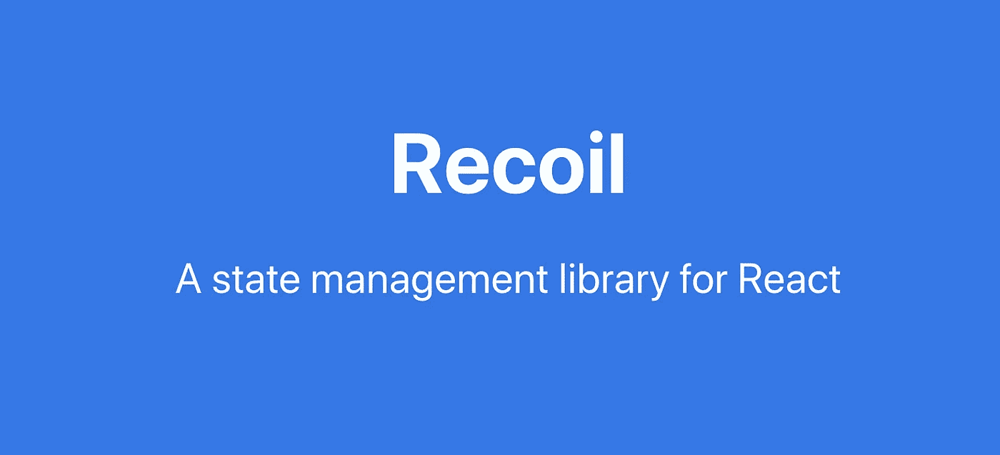

# 如何使用 react 的状态管理库反冲

> 原文：<https://blog.devgenius.io/how-to-use-recoil-which-is-a-state-management-library-in-react-736b3df65edf?source=collection_archive---------4----------------------->



图片来自[https://recoiljs.org/](https://recoiljs.org/)

**目的**

虽然我探索了一些状态管理库，如 React.context(如 useContext hook)、Redux，但我仍在努力开发一个更好的状态管理系统，因为 Redux 有时对于中小型应用程序来说太多了，useContext hook 对于中型或大型应用程序来说不太好，因为它可能会因为创建多个上下文而变得混乱。所以，我探索了一个相对较新的状态管理库，叫做“反冲”,我将与你分享一些关于这个库的知识。

**什么是后坐力？**

反冲是一个开源的反应状态管理库，由脸书于 2020 年 5 月 14 日创建。尽管这不是一个正式的库，仍然是一个实验性的库，但这个库在 Github 上获得了 16.6k 星。所以，这个图书馆现在显然越来越受欢迎了。

**反冲为什么有用？**

因为与 Redux 相比，反冲为我们提供了一种代码更少的状态管理。正如我已经提到的，redux 有时太复杂，无法用于中小型应用程序。即使我们想创建一个按钮来切换基本状态(如开和关)，也需要创建“减速器”和“动作”。这个例子并不意味着 Redux 不适合中小型应用。然而，至少 Redux 并不是中小型电脑的最佳选择。

【Redux 和反冲有什么区别？

基本上是设计理念不同。简而言之，Redux 专注于集中管理，它有一个管理状态的全局存储，并且通过组织 combineReducers 创建几个定义的 reducers 来使用这个存储的数据和改变状态。当我们想要使用商店中的数据时，我们需要使用“useSelector”来检索所需的信息部分。另一方面，反冲专注于扩散管理，它有几个称为“原子”的存储，每个组件直接共享，而不通过一个全局状态。说实话，反冲在向后可以有一个全局存储，但至少这个功能是隐藏的，我们无法识别。这是 Redux 和反冲之间的一个非常大的区别，因为反冲防止重新渲染，以避免集中的方法。此外，由于反冲没有任何动作和减速器，我们可以管理我们的状态少得多的代码。而且反冲内置了异步功能，不需要准备 Redux thunk 等第三方库。

此外，即使反冲没有一个全局存储，我们也不需要有几个提供者，如 React.context API(useContext)。正如我已经提到的，使用 React.context API 的状态管理可能会很混乱，因为我们需要创建几个不同的上下文提供者作为包装器。不是不能用，只是有时候给我们高效管理状态带来一些困难。尤其是当我们使用 React 时。上下文 API，我们需要注意避免重新渲染，因为只重新渲染一个子组件就会重新渲染整个组件。我们可以用 React.memo，useMemo，useCallback 来处理这个问题但是还是需要注意。这就是为什么，反冲可能是一个很好的选择，从小型到中型的应用程序。

**后坐力的弊端是什么？**

虽然我解释了后坐力的优点，但后坐力的缺点是什么？这些和其他新图书馆一样。由于这个库仍然是实验性的库，这个工具可能会阻止任何增强和开发(即使这个库是由脸书创建的)。而且没有太多的资源来解决问题或错误，也没有太大的社区。尽管有可能成为事实上的标准，但这还没有决定。

正如我解释了一些基本的后坐力特征和设计概念，让我们深入一些例子。

**使用后坐力的步骤**

**创建基础柜台 app**

1.  安装软件包。

```
npm install recoil
```

2.从“反冲”中导入“反冲根”,并像下面这样包装使用组件。在这种情况下，我将在 Counter app 中使用，所以我用反冲根包装了这个计数器组件。你真的不需要在 App.js 中包装组件，但是你应该包装你想要使用反冲的组件(这与 useContext 的用法相同)。

3.创建一个基本组件，并导入 atom 和 useRecoilState。首先，您需要创建一个状态来使用 atom。您还需要添加唯一键和默认值。一旦创建了这个状态，就可以使用它，比如“useState”。您需要使用“useRecoilState”而不是 useState，并添加您创建的状态作为默认值。就是这样！很好用吧？

这是这个应用程序屏幕，您可以使用全局状态创建一个基本的计数器应用程序，而不使用任何缩减器或操作。厉害！！


**创建第二个计数器来显示“全局”状态。**

正如我提到的，这是一个全局状态，而不是本地状态，所以您可以通过将这个计数器状态导出到其他组件来共享这个状态。

如果您创建“第二个计数器”组件并导入您创建的计数器状态，您也可以共享该计数器的计数器状态。

这是我的屏幕。你会注意到这些计数器的运动和你预期的一样，因为这是一个全局状态。


此外，您可以通过使用不同的方法而不是 useRecoilState 来使用“只读”状态或“只写”状态，如下所示。

如果要使用只读状态，可以使用“useRecoilValue”。

这两种方法都可以，但是当您想将 state 值用作只读状态时，官方文档建议您使用“useRecoilValue”。

这是可以理解的，所以我也建议你如果想用做只读状态的话就用“useRecoilValue”。

```
//Read only
const [count] = useRecoilState(counterValue);
const count = useRecoilValue(counterValue);
```

这是只写状态语法。您可以使用 useSetRecoilState 将值设置为 State。正如你可能知道的，这个函数非常有用，因为如果你可以通过使用这个 useRecoilState 来防止重新渲染，因为它们不能读取值。这就是为什么这是宝贵的 API，它防止在没有额外的钩子或方法如“React.memo，useCallback”的情况下重新渲染。

```
//Write only
const [, setCount] = useRecoilState(counterValue);
const setCount = useSetRecoilState(counterValue);
```

“原子”是你使用后坐力时最重要的特性之一。然而，你可以使用另一个特性来使用这个值，那就是“选择器”。这个选择器类似于 useSelector，但是在反冲方面，你可以使用只有 Atom 的状态，就像我已经解释过的那样。那么，如何区分原子和选择器呢？

从根本上说，选择器是一个基于原子的“计算态”，换句话说，这些值是不同的。为了使用选择器，我将创建另一个计数器，它具有从 Atom 派生的“计算状态”。简而言之，这将是“double counter ”,它与 counterState 相比具有 double。就像下面，你可以用选择器代替 atom，你也可以用属性代替默认值。您可以使用选择器创建新的状态。

这个选择器也很有用，因为如果这个状态不改变它们值，它就不会被重新呈现。这个选择器可以防止不必要的重新渲染，就像使用带有 Redux 的选择器一样。

结果如下。您可以在计数下方看到双计数值。


您也可以如下设置值。在这种情况下，您可以编写和更改计数器状态(在计算状态之前)。这是可选的。

```
export const changeCounterState = selector({
  key: "changeCounterState",
  get: ({ get }) => get(counterState) * 2,
  set: ({ set }, newValue) => set(counterState, newValue * 2),
});
```

**结论**

尽管反冲是一个实验库，但它可能是有用的。尤其是那些想要使用全局状态的小型或中型应用程序。

**参考**

官方文件:[https://recoiljs.org/](https://recoiljs.org/)

React 应用程序中使用反冲而不是 Redux 进行状态管理。:[https://blog . open replay . com/using-kiri-inst-redux-for-state-management-in-react-applications](https://blog.openreplay.com/using-recoil-instead-of-redux-for-state-management-in-react-applications)

如何在 React 项目中使用反冲进行状态管理

[https://www . freecodecamp . org/news/how-to-use-反冲-for-state-management-in-your-react-projects/](https://www.freecodecamp.org/news/how-to-use-recoil-for-state-management-in-your-react-projects/)

了解反应中的后座力:[https://www.telerik.com/blogs/recoil-in-react](https://www.telerik.com/blogs/recoil-in-react)

Reactの実験的ステート管理ライブラリRecoilの基本的な使い方: [https://sbfl.net/blog/2020/05/17/react-experimental-recoil-usage/](https://sbfl.net/blog/2020/05/17/react-experimental-recoil-usage/)

Facebook 製の新しいステート管理ライブラリ「Recoil」を最速で理解する: [https://blog.uhy.ooo/entry/2020-05-16/recoil-first-impression/](https://blog.uhy.ooo/entry/2020-05-16/recoil-first-impression/)

感谢您的阅读！！