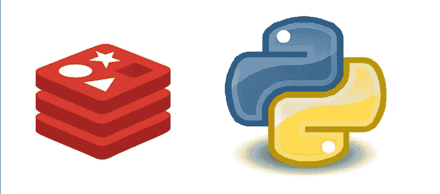

# 如何在 Python 应用程序中使用 Redis 发布/订阅

> 原文：<https://blog.devgenius.io/how-to-use-redis-pub-sub-in-your-python-application-b6d5e11fc8de?source=collection_archive---------0----------------------->



Redis 因其在主数据库前充当缓存层的能力而广为人知。然而，Redis 提供的远不止这些。在我看来，Redis 最好的特性之一是它的发布/订阅功能。在这篇文章中，我将解释:

*   **什么是**
*   **什么时候使用它是个好主意**
*   **如何用 Redis 和 Python 实现发布/订阅**

# 什么是 Pub/Sub？

发布/订阅是发布者/订阅者的简称。它是软件开发中的一种模式，用于通过消息传递在服务之间进行异步通信。一个或多个服务充当*发布者*，一个或多个服务是*订阅者*。发布者向中介发送消息，在 Redis 的情况下，中介被称为*通道*。订阅特定频道的订户将实时接收这些消息，而无需轮询这些频道。

如果你有使用消息队列的经验，如 *RabbitMQ* 或 *AWS SQS* ，这可能听起来有点熟悉，除了消息队列和发布/订阅系统之间有一些基本的区别。

首先，消息队列是基于拉的，而发布/订阅是基于推的。这意味着当使用消息队列时，订户(或消费者)需要轮询消息队列，而在发布/订阅中，订户获得推送通知，这意味着不需要轮询。

另一个显著的区别是，消息队列通常意味着只有一个消费者将接收和处理消息，而在发布/订阅中，成千上万的订阅者可以同时接收相同的消息。

根据您的用例，您将使用消息队列或发布/订阅，甚至有这样的情况，您可能有一个发布/订阅系统，其中订阅者是消息队列(也称为[扇出](https://www.pubnub.com/learn/glossary/what-is-fan-out-software/))。

除了 Redis，一些流行的 pub/sub 工具还有 **AWS SNS** 、 **GCP Pub/Sub** 和**阿帕奇卡夫卡**。

# 什么时候使用发布/订阅是个好主意

一个很好的使用案例是处理来自数据流的数据，比如股票市场数据或体育比赛实况。假设您有一项服务，可以从成千上万只股票的数据流中实时接收股票价格更新，您需要分析科技股、媒体公司股和金融机构股的变化。让一个服务过滤并发布这些股票数据到不同的渠道(科技、媒体和金融)是有意义的，作为订阅者，每个渠道有 3 个不同的服务来做进一步的计算。这将是*松散耦合*和*单一责任*原则的一个很好的例子。

另一个用例是向成百上千的用户发送通知。假设您有两个叫做电子邮件和短信的渠道，并且每个渠道都有两项服务。每当邮件发布到电子邮件通道时，订阅该邮件的电子邮件服务就会向该电子邮件列表中的所有成员发送一封电子邮件。

最后，分布式日志记录也是另一个非常流行的用例。如果您想将应用程序中发生的不同事件发送到不同的服务进行进一步分析，pub/sub 无疑是一种方法。 [*点击流分析*](https://www.gartner.com/en/information-technology/glossary/clickstream-analysis) 无疑是一个很好的例子。

# 如何用 Redis 和 Python 实现 Pub/Sub

现在，让我们最后看看一些代码。在这个相对基本的例子中，我将展示一个服务如何将它从推特流中收集的数据发布到两个不同的渠道，分别叫做*用户名*和*标签。*进入频道的数据是从从流中收集的每条推文中提取的，代表推文作者的用户名和标签(如果他们在推文中使用标签的话)。

在用户端，有两个服务订阅其中一个频道，提取数据，然后使用这些数据生成一个记分牌，显示哪些用户最活跃，哪些用户最受欢迎。美丽的部分是这些记分板也保存在 Redis 中，通过使用 [**排序集**](https://www.tutorialspoint.com/redis/redis_sorted_sets.htm) ，这是实时记分板的理想选择。这样，我们将 Redis 用作数据存储和发布/子系统，从而减少了架构中的组件数量。

请注意，我在代码示例中提供的 url 只是一个占位符，但是您实际上可以通过连接到 [Twitter API](https://developer.twitter.com/en/docs/tutorials/consuming-streaming-data) 来完全实现它。你所需要的只是一个 API 密匙，他们通常会在相当短的时间内提供。如果你的机器上还没有安装 Redis，你可以在这里免费下载，但是我建议你在 [Docker](https://hub.docker.com/_/redis) 上运行它，如果你的系统上有 Docker 的话。如果没有，也可以在这里免费下载[。](https://docs.docker.com/get-docker/)

以下是发布者服务的代码:

```
import json
import requests
import redisURL = 'http://thestream.com' # not a real url obviouslyred = redis.StrictRedis('localhost', 6379, charset="utf-8", decode_responses=True) def stream(): s = requests.Session() r = s.get(URL, stream=True) for line in r.iter_lines(): if line: tweet_content = json.loads(line) username = tweet_content.get('username') hashtags = tweet_content.get('hashtags') red.publish('usernames', username) red.publish('hashtags', hashtags)if __name__ == "__main__": while True: stream()
```

如您所见，我们使用 [**请求**](https://docs.python-requests.org/en/latest/) 库连接到 HTTP 流，并使用[**redis**](https://github.com/redis/redis-py)**-py**库作为 Redis 的驱动程序。值得注意的一点是，您不需要在发布到它之前创建一个通道，因为如果它还不存在，Redis 会创建它。

现在让我们看看订阅者的代码:

```
import redisred = redis.StrictRedis('localhost', 6379, charset="utf-8", decode_responses=True)def user_counter(): sub = red.pubsub() sub.subscribe('usernames') for message in sub.listen(): if message is not None and isinstance(message, dict): username = message.get('data') red.zincrby('username_scoreboard', 1, username)while True: user_counter()
```

这里我们使用同一个 redis-py 库，并调用 *pubsub()* 和 *subscribe()* 方法来通知 redis 这是一个订阅者。 *listen()* 方法使订户能够实时接收消息。

同样，不需要创建之前的 *username_scoreboard* 排序集，因为如果它不存在，Redis 会自动创建它。

最后，为了使最终用户能够通过一些 HTTP 端点接收这些结果，我们可以添加一个 Flask API 服务器，它将发送前十个最流行的标签和最活跃的用户:

```
from flask import Flask, jsonify, make_response, render_templateapp = Flask(__name__)redis = redis.StrictRedis('localhost', 6379, charset="utf-8", decode_responses=True) @api.app.route("/usernames", methods=['GET'])def get_usernames(): results = redis.zrevrange('username_scoreboard', 0, 10,   withscores=True) results_json = [{x[0]: x[1] for x in results}] return make_response(jsonify({'results': results_json}), 200)@app.route("/hashtags", methods=['GET'])def get_hashtags(): results = redis.zrevrange('hashtags_scoreboard', 0, 10, withscores=True) results_json = [{x[0]: x[1] for x in results}] return make_response(jsonify({'results': results_json}), 200) if __name__ == '__main__': app.run(host='0.0.0.0')
```

如果您过去曾经使用过 Flask，这可能看起来非常熟悉。如果没有，我建议熟悉它，因为它绝对是有史以来最简单的 web 框架之一。一个好的起点是它的官方文档。

*redis.zrevrange()* 方法用于以相反的顺序获取排序集的结果，因为默认情况下它以升序排序。 *0* 和 *10* 参数指定我们只想要前 10 名的结果，而 *withscores=True* 参数指定我们还想要将实际分数与领先者一起发送。在下一行中，我们只是将它转换成 JSON 序列化可以接受的格式，因为这是一个 REST API。

所以我们有它。一种简单的方法来创建一组微服务，这些微服务从 Twitter 接收实时数据，将数据异步交付给分析数据的服务，并将其存储在实时记分牌中，最终用户可以通过 Flask API 服务器访问该记分牌。为了使这成为生产就绪，我们需要为每个服务添加其他功能，如日志记录、异常处理、测试、环境变量和 docker 文件。但是，这可能会将这篇文章引向十个不同的方向，所以我将省略这些细节。

本文到此为止。如果你喜欢，请尽情鼓掌:)

如果我错过了什么，或者有什么不清楚的地方，请留下评论。

感谢阅读！